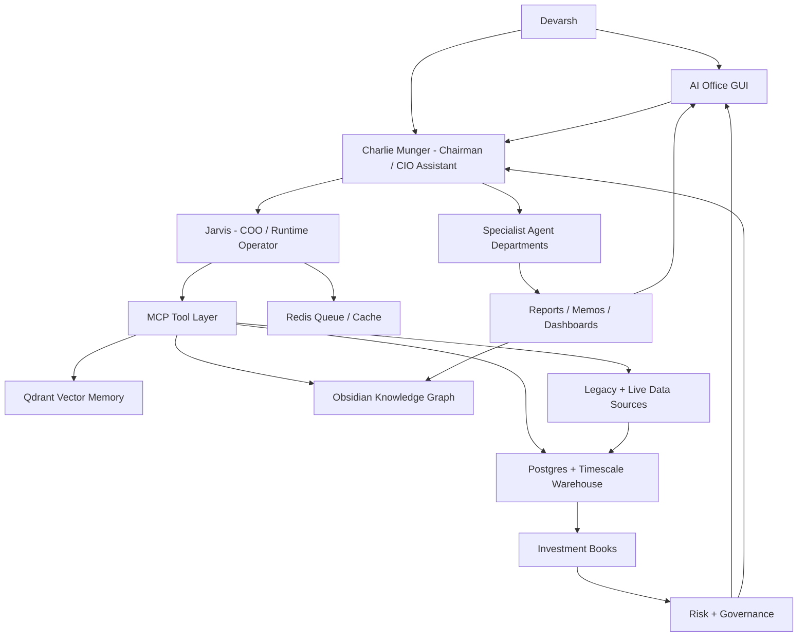
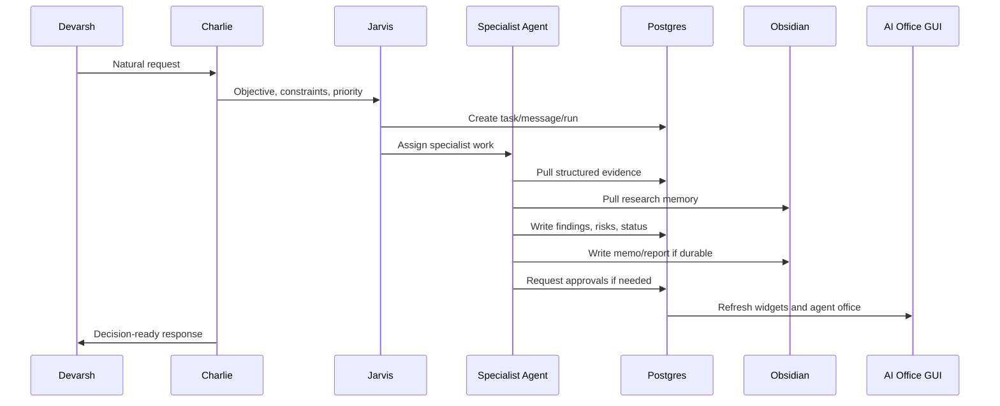
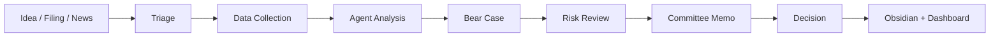

# AI Investment OS - Final Master Blueprint v3.0

Date: 2026-07-06
Status: Canonical target architecture before next implementation phase
Owner: Devarsh
Chairman and main assistant: Charlie Munger
Runtime operator: Jarvis
Memory surface: Obsidian
Operating surface: AI Office GUI
Runtime workspace: `_ai_os_runtime`

## 1. Executive Vision

Build a complete AI Investment Operating System: a smarter Bloomberg, a multi-strategy hedge fund control room, a research factory, a portfolio manager, a trading desk, a risk office, and a live animated AI office in one platform.

This system is not only a chatbot, a dashboard, a trading bot, a portfolio tracker, or a document vault. It is the operating system for an investment organization.

The final system must let Devarsh:

- speak to Charlie Munger as the primary assistant, challenger, and investment chair,
- let Jarvis execute tool calls, data pulls, workflow dispatch, dashboard updates, and writebacks,
- manage long-term client folios, tactical ideas, quant strategies, active trading, cash, hedges, crypto, commodities, and options without mixing their purposes,
- keep every client, holding, trade, strategy, filing, research note, decision, alert, and agent output traceable,
- run strategy research, backtests, walk-forward tests, Monte Carlo diagnostics, paper monitoring, and limited-live approval gates,
- see a live AI office where each employee has a character, role, mailbox, current work, model route, tools, and output history,
- use Obsidian as the permanent research and memory graph,
- use Postgres, Qdrant, Redis, MCP tools, and dashboards as the live operating backbone,
- use local/open-source models for routine work and frontier/cloud models only on escalation,
- keep live broker execution blocked unless human approval, risk approval, order approval, kill-switch, and audit gates pass.

The product should scale from one person's investment workflow to a family office and then to a multi-strategy investment firm without redesigning the core architecture.

## 2. Core Principle: One Firm, Multiple Books

The system must not ask only, "Are we long or short Reliance?"

It must ask:

- Why does this exposure exist?
- Which book owns it?
- What objective does it serve?
- What time horizon does it belong to?
- Which agent, committee, model, or human decision created it?
- What would invalidate it?
- Does it conflict with another book, or is it intentionally hedging it?

Example:

| Symbol | Book | Direction | Exposure | Purpose | Horizon | Owner |
| --- | --- | ---: | ---: | --- | --- | --- |
| Reliance | Long-Term | Long | INR 20L | Core compounder | 5-10 years | Long-Term Office |
| Reliance | Tactical | Flat | INR 0 | No current tactical view | Days-months | Tactical Office |
| Reliance | Quant | Short | INR 3L | Mean reversion signal | 5 days | Quant Lab |
| Reliance | Active Trading | Short | INR 2L | Pre-earnings trade | Intraday-days | Trading Desk |

Portfolio Intelligence must summarize:

- gross long,
- gross short,
- net exposure,
- exposure by book,
- exposure by strategy,
- exposure by client,
- hedge ratio,
- conflict or coordination flag,
- whether the short exposure is a hedge or independent alpha,
- risk budget consumed,
- current research status,
- current committee status.

## 3. Non-Negotiable Rules

1. No fake live data. Test data must be marked and kept out of production views.
2. Every position belongs to a book.
3. Every position has purpose, owner, horizon, thesis or setup, source, and exit logic.
4. Long-term holdings are not invalidated by short-term quant/trading signals.
5. Quant strategies do not inherit discretionary conviction unless explicitly designed to.
6. Tactical trades must say whether they are hedges, alpha trades, or position-management actions.
7. Active trading is evaluated separately from long-term investment performance.
8. Risk Office can challenge every office.
9. Capital Allocation Office sits above all investment books.
10. Charlie can recommend and challenge; Jarvis can operate tools; broker writes remain gated.
11. Agents communicate through durable mailboxes, tasks, approvals, runs, and notes.
12. Obsidian is permanent memory; the dashboard is the live workbench.
13. Qdrant retrieves relevant knowledge; it is not the source of truth.
14. Postgres is the canonical structured source of truth.
15. All data sources need freshness, lineage, and reconciliation.
16. Local models handle daily work; expensive models require route policy and cost justification.
17. Live execution starts as disabled, then paper, then limited-live, then full-live only after evidence.
18. Repeated errors must be researched before more trial-and-error.

## 4. High-Level Architecture

## 5. Shared Platform Layers

### 5.1 Data Sources

Legacy/internal:

- p2cursor client database and client histories.
- Existing algo trading software databases.
- Existing equity curves, price data, strategy records, and reports.
- Attached broker Excel/PDF reports.
- Old trade journals from 2018-19 onward.
- Old Codex, Claude, Cowork, and other AI research outputs.
- Manually entered holdings, trades, strategy notes, and decisions.

Broker/market:

- Zerodha/Kite read-only imports first, execution later only after gates.
- Dhan read-only imports first, execution later only after gates.
- TradingView browser controller and webhook ingestion.
- OpenAlgo read-only bridge.
- OHLCV for equities, futures, options, crypto, and commodities.
- Options chain, OI, IV, Greeks, futures basis, volatility indexes.
- Crypto/commodity exchange connectors for BTC, ETH, gold, silver, and selected instruments.

Research/news:

- NSE announcements.
- BSE announcements.
- annual reports,
- quarterly results,
- investor presentations,
- concall transcripts,
- credit rating notes,
- corporate actions,
- merger, demerger, reverse merger, buyback, delisting, preferential issue, and rights issue filings,
- global news,
- local business news,
- Twitter/X and other social signal sources,
- Fincept components,
- Vibe-Trading and other research workflow references.

### 5.2 Structured Warehouse

Postgres is the canonical structured database. Timescale-style hypertables can be used for time series where needed.

Required schemas:

- `core`: clients, accounts, instruments, source registry, connector registry.
- `portfolio`: holdings, transactions, prices, snapshots, mark-to-market, reconciliation.
- `books`: investment books, book positions, purposes, theses, exit criteria, cross-book conflicts.
- `strategy`: strategy ideas, candidates, rules, backtests, optimizations, validation, paper/live states.
- `research`: ideas, filings, transcripts, news, reports, valuations, catalysts, special situations.
- `trading`: manual trades, paper trades, alerts, execution tickets, order intents, post-trade reviews.
- `risk`: limits, breaches, approvals, stress tests, kill switches, exposure checks.
- `agent`: employees, departments, skills, model routes, messages, tasks, runs, approvals.
- `ops`: dashboard widgets, health checks, freshness checks, imports, costs, system status.

### 5.3 Vector Memory

Qdrant stores embeddings for semantic search over:

- Obsidian notes,
- imported PDFs,
- filings,
- transcripts,
- research reports,
- trade journals,
- strategy memos,
- agent outputs.

Qdrant is used for retrieval, not accounting. If Qdrant and Postgres disagree, Postgres wins for structured facts.

### 5.4 Obsidian Knowledge Graph

Obsidian remains the canonical human-readable memory layer.

Required note classes:

- company research note,
- thesis card,
- valuation memo,
- filing analysis,
- special situation memo,
- strategy memo,
- backtest report,
- model validation report,
- risk memo,
- committee minutes,
- daily brief,
- weekly brief,
- client report,
- decision log,
- postmortem,
- architecture note.

Graph design:

- Company notes link to filings, valuations, strategies, holdings, tasks, and committee decisions.
- Strategy notes link to candidates, backtests, validation, paper-monitor runs, and kill switches.
- Client notes link to accounts, holdings, book exposure, and review tasks.
- Agent output notes link back to agent run IDs and source evidence.

### 5.5 MCP And Tool Layer

The tool layer exposes safe capabilities to Jarvis and agents:

- Postgres read/write tools.
- Obsidian read/write tools.
- Qdrant search tools.
- browser controller.
- TradingView controller.
- NSE/BSE scraper.
- news scraper.
- Twitter/X reader or browser workflow.
- PDF/document parser.
- Excel/CSV importer.
- broker read-only importers.
- OpenAlgo read-only adapter.
- Fincept component bridge.
- Vibe-Trading read-only reference adapter.
- report generator.
- dashboard widget updater.
- model endpoint checker.
- data-source health checker.

No tool should silently place orders. Execution tools require a separate execution policy and approval chain.

## 6. Interaction Model

### 6.1 How Devarsh Interacts

Primary mode: talk to Charlie.

Examples:

- "Charlie, what should I do with Reliance today?"
- "Charlie, add this manual buy for Tushit under Tactical with a two-week horizon."
- "Charlie, scan Sanjana's portfolio for missing thesis and exit criteria."
- "Charlie, open NIFTY, BANKNIFTY, VIX, and a straddle chart in TradingView."
- "Charlie, send this demerger filing to Special Situations and Risk."
- "Charlie, generate intraday strategies from my old trade journal, but keep them paper only."
- "Charlie, why is this stock long in Long-Term but short in Quant?"

Charlie decides the workflow. Jarvis executes the workflow.

### 6.2 Agent Communication Model

Agents communicate through durable internal channels:

- `agent.messages`: internal email/inbox.
- `agent.tasks`: assigned work.
- `agent.runs`: execution logs.
- `agent.approvals`: required sign-offs.
- `agent.skills`: allowed capability list.
- `agent.model_routes`: model policy per agent.
- Obsidian notes: final research and committee outputs.
- dashboard widgets: live status.

No major decision can exist only inside a chat transcript.

## 7. Organization Hierarchy

### 7.1 Executive Office

- Charlie Munger: chairman, CIO assistant, final challenger.
- Jarvis: COO/runtime operator, tool dispatcher, dashboard updater.
- Chief of Staff: turns goals into tasks, follows up on stale work.
- Investment Committee Secretary: records decisions and evidence.
- Communications Agent: produces clear briefs and client-ready notes.

### 7.2 Investment Engines

Four primary investment engines share the same data platform:

1. Long-Term Investing.
2. Tactical Investing.
3. Quantitative Strategies.
4. Active Trading.

Two supporting books:

5. Cash/Treasury.
6. Hedges.

### 7.3 Control Offices

- Capital Allocation Office.
- Portfolio Office.
- Risk Office.
- Compliance/Audit Office.
- Data Engineering Office.
- Research Factory.
- AI Engineering Office.
- Software Engineering Office.
- Client Office.
- Finance/Admin Office.

## 8. Investment Book Architecture

Every exposure belongs to one of these books.

### 8.1 Long-Term Investing Book

Purpose: own exceptional businesses for years and compound capital through ownership.

Horizon: 3-15 years.

Core outputs:

- thesis,
- valuation,
- quality score,
- management score,
- moat assessment,
- bear case,
- exit criteria,
- review schedule,
- committee decision.

### 8.2 Tactical Investing Book

Purpose: capture days-to-months opportunities from catalysts, sector rotation, earnings, valuation gaps, macro shifts, and temporary hedges.

Horizon: days to months.

Core outputs:

- catalyst setup,
- tactical thesis,
- risk/reward,
- stop/target/time exit,
- event calendar,
- overlap check with long-term book,
- committee or risk approval if size/risk is material.

### 8.3 Quantitative Strategies Book

Purpose: run systematic, rules-based strategies with reproducible evidence.

Horizon: days to weeks by default, but strategy-specific.

Core outputs:

- strategy specification,
- data lineage,
- deterministic rule definition,
- backtest,
- cost/slippage model,
- train/test split,
- walk-forward results,
- parameter sensitivity,
- Monte Carlo/bootstrap diagnostics,
- model validation,
- paper monitor,
- live/backtest drift,
- committee decision.

### 8.4 Active Trading Book

Purpose: capture short-term opportunities from intraday, options, futures, volatility, event risk, discretionary setups, and live market structure.

Horizon: intraday to days.

Core outputs:

- trade setup,
- TradingView chart state,
- options/IV/OI view,
- stop/target/time exit,
- journal entry,
- post-trade review,
- behavioral feedback.

### 8.5 Cash/Treasury Book

Purpose: manage liquidity, cash deployment, collateral, margin, short-term parking, and dry powder.

Core outputs:

- cash balance,
- margin used,
- collateral,
- yield instruments,
- cash deployment recommendation,
- liquidity risk.

### 8.6 Hedges Book

Purpose: record explicit hedges separately from alpha trades.

Core outputs:

- hedge intent,
- hedge ratio,
- hedge instrument,
- protected exposure,
- cost/carry,
- expiry/unwind plan,
- risk-office review.

## 9. Portfolio Intelligence Engine

The Portfolio Intelligence Engine is the system's central brain for exposure, purpose, and risk.

For each client, account, book, strategy, and symbol it must show:

- holdings,
- transactions,
- manual trades,
- paper trades,
- open orders,
- average cost,
- market value,
- realized and unrealized P&L,
- gross exposure,
- net exposure,
- book exposure,
- purpose exposure,
- strategy exposure,
- sector exposure,
- factor exposure,
- beta,
- concentration,
- liquidity,
- VaR,
- expected shortfall,
- drawdown,
- risk budget used,
- capital budget used,
- thesis status,
- exit criteria status,
- latest filing/news,
- latest strategy signal,
- related active tasks,
- committee status.

Symbol page example:

- Long-Term: Reliance +INR 20L, core compounder, quarterly review.
- Tactical: flat, no current event view.
- Quant: -INR 3L, five-day mean reversion, paper/live status.
- Active: -INR 2L, pre-earnings discretionary trade.
- Gross long: INR 20L.
- Gross short: INR 5L.
- Net exposure: INR 15L.
- Overall bias: net long.
- Risk flag: short exposure offsets 25 percent of core holding; confirm intentional hedge/alpha.

## 10. Long-Term Investing Office

### 10.1 Required Checks

Business and industry:

- business model clarity,
- segment economics,
- revenue drivers,
- unit economics,
- industry structure,
- market size,
- growth runway,
- competitive intensity,
- customer power,
- supplier power,
- substitutes,
- regulatory structure,
- disruption risk.

Moat and quality:

- brand,
- switching costs,
- network effects,
- cost advantage,
- distribution advantage,
- scale economics,
- asset advantage,
- ROIC durability,
- reinvestment runway,
- margin durability,
- free cash flow quality,
- cash conversion,
- cyclicality.

Management and governance:

- promoter quality,
- capital allocation record,
- related-party transactions,
- remuneration,
- pledging,
- acquisitions,
- buybacks/dividends,
- minority shareholder treatment,
- accounting aggressiveness,
- board quality,
- auditor quality.

Financial statement analysis:

- revenue quality,
- margin bridge,
- working capital,
- inventory quality,
- receivables quality,
- debt maturity,
- liquidity stress,
- contingent liabilities,
- auditor notes,
- profit vs cash flow,
- balance sheet stress,
- operating leverage,
- cyclicality.

Valuation:

- owner earnings,
- DCF,
- reverse DCF,
- peer comparison,
- historical valuation,
- PE, EV/EBITDA, EV/Sales, FCF yield,
- sum-of-parts if relevant,
- bull/base/bear scenarios,
- expected CAGR,
- downside case,
- margin of safety.

Risk and exit:

- thesis killers,
- management deterioration,
- accounting concern,
- capital allocation deterioration,
- valuation extreme,
- better opportunity,
- permanent impairment risk,
- concentration risk,
- client suitability,
- review frequency.

Long-term Monte Carlo:

- revenue growth distribution,
- margin distribution,
- reinvestment rate,
- valuation multiple distribution,
- terminal value range,
- drawdown path,
- probability of negative CAGR,
- probability of permanent capital loss,
- expected CAGR distribution.

### 10.2 Long-Term Agents

- Long-Term Portfolio Manager.
- Company Analyst.
- Industry Analyst.
- Management Analyst.
- Financial Statement Analyst.
- Valuation Agent.
- Forensic Accounting Agent.
- Filings and Transcript Analyst.
- Bear Case Agent.
- Quality Score Agent.
- Capital Allocation Agent.
- Portfolio Fit Agent.
- Risk Reviewer.

### 10.3 Long-Term Investment Committee

Members:

- Charlie Munger, chair.
- Long-Term Portfolio Manager.
- Company Analyst.
- Industry Analyst.
- Financial Statement Analyst.
- Management Analyst.
- Valuation Agent.
- Bear Case Agent.
- Risk Agent.
- Capital Allocation Officer.

Decision states:

- reject,
- research more,
- watchlist,
- starter position,
- buy,
- add,
- hold,
- trim,
- sell.

Required outputs:

- thesis card,
- full research note,
- valuation memo,
- bear case memo,
- risk memo,
- committee memo,
- decision record,
- review task.

## 11. Tactical Investing Office

Required checks:

- catalyst definition,
- event window,
- expected move,
- support/resistance,
- trend and relative strength,
- volume/liquidity,
- volatility regime,
- options IV/OI if relevant,
- macro backdrop,
- sector backdrop,
- long-term overlap,
- hedge vs independent alpha,
- expected value,
- stop,
- target,
- time exit,
- cost/tax impact,
- sizing,
- risk budget.

Agents:

- Tactical Portfolio Manager.
- Catalyst Analyst.
- Event Analyst.
- Technical Analyst.
- Macro Analyst.
- Sentiment Analyst.
- Options Overlay Agent.
- Sector Rotation Agent.
- Risk Reviewer.

Committee outputs:

- tactical idea memo,
- catalyst calendar,
- setup score,
- risk/reward sheet,
- decision record,
- review/exit task.

## 12. Quantitative Strategies Office

### 12.1 Strategy Lifecycle

Required checks:

- deterministic rule definition,
- input data lineage,
- missing data diagnostics,
- survivorship bias review,
- corporate action handling,
- train/test split,
- walk-forward performance,
- regime split performance,
- bull/bear/sideways market results,
- transaction costs,
- slippage,
- liquidity/capacity,
- turnover,
- drawdown,
- hit rate,
- payoff ratio,
- skew/kurtosis,
- factor attribution,
- strategy correlation,
- parameter sensitivity,
- Monte Carlo/bootstrap,
- live/backtest drift,
- kill switch.

Agents:

- Quant Portfolio Manager.
- Strategy Generator.
- Research Scientist.
- Data Scientist.
- Backtest Engineer.
- Feature Engineer.
- Optimizer Agent.
- Model Validation Agent.
- Regime Analyst.
- Capacity/Liquidity Analyst.
- Strategy Committee Secretary.
- Risk Reviewer.

Committee outputs:

- strategy specification,
- backtest report,
- optimizer report,
- robustness memo,
- model validation review,
- strategy committee memo,
- approval state,
- paper monitor task,
- kill-switch state.

## 13. Active Trading Desk

Required checks:

- setup type,
- timeframe,
- instrument,
- direction,
- quantity/notional,
- entry logic,
- stop,
- target,
- time exit,
- overnight risk,
- news/event risk,
- liquidity,
- options IV/OI,
- payoff profile,
- margin,
- book and purpose,
- journal note,
- screenshot/chart evidence,
- post-trade review.

TradingView workflows:

- open symbol chart,
- open NIFTY/BANKNIFTY/VIX/options layout,
- create straddle/strangle view,
- capture chart screenshot,
- save chart evidence to trade journal,
- compare technical setup with book exposure,
- create alert/watch item.

Agents:

- Trading Desk Agent.
- Technical Analyst.
- Options Analyst.
- Futures Analyst.
- Volatility Agent.
- Market Microstructure Agent.
- Trade Journal Coach.
- Execution Safety Agent.

## 14. Research Factory

Purpose: convert raw information into investment decisions.

Pipeline:

Required modules:

- idea intake,
- source capture,
- filing parser,
- annual report parser,
- transcript parser,
- news collector,
- social triage,
- corporate action classifier,
- special situation detector,
- valuation builder,
- note generator,
- committee memo generator,
- decision logger.

Special situations to detect:

- merger,
- demerger,
- reverse merger,
- buyback,
- delisting,
- rights issue,
- preferential allotment,
- promoter stake changes,
- pledge changes,
- asset sale,
- spin-off,
- holding company discount,
- regulatory order,
- insolvency/resolution,
- arbitrage spread.

Agents:

- Research Director.
- Company Analyst.
- Industry Analyst.
- Filings Analyst.
- Transcript Analyst.
- News Analyst.
- Social/Sentiment Analyst.
- Special Situations Analyst.
- Corporate Actions Analyst.
- Arbitrage Analyst.
- Valuation Agent.
- Bear Case Agent.
- Research Librarian.

## 15. Capital Allocation Office

Purpose: decide how much capital each book gets and whether exposure is aligned with the firm's risk appetite.

Responsibilities:

- target capital by book,
- actual capital by book,
- capital drift,
- risk budget by book,
- drawdown by book,
- leverage by book,
- cash buffer,
- allocation changes,
- client-level suitability,
- cross-book coordination.

Agents:

- Capital Allocation Officer.
- Portfolio Manager.
- Performance Attribution Agent.
- Book Controller.
- Client Suitability Agent.

Committee questions:

- Is the book over its risk budget?
- Is the same symbol held for conflicting reasons?
- Are we paying unnecessary costs by offsetting ourselves?
- Is an offset a hedge or independent alpha?
- Should a strategy exclude core holdings?
- Should cash be deployed or preserved?

## 16. Risk Office

Risk is allowed to block action.

Required analytics:

- gross/net exposure,
- concentration,
- sector exposure,
- factor exposure,
- beta,
- correlation,
- VaR,
- expected shortfall,
- stress tests,
- scenario analysis,
- portfolio Monte Carlo,
- liquidity risk,
- gap risk,
- options Greeks,
- margin risk,
- leverage,
- strategy correlation,
- book drawdown,
- client suitability,
- execution risk,
- data quality risk,
- model risk.

Required controls:

- global kill switch,
- strategy kill switch,
- execution safety gate,
- human approval,
- risk approval,
- per-order approval,
- max notional,
- max daily loss,
- max leverage,
- limited-live approval,
- audit log,
- override log.

Agents:

- Chief Risk Officer.
- Quant Risk Analyst.
- Stress Testing Agent.
- Compliance Agent.
- Audit Agent.
- Kill Switch Agent.
- Model Risk Agent.
- Data Quality Risk Agent.

## 17. Live AI Office GUI

The GUI is the live operating surface.

Required views:

- Command Center.
- Portfolio Intelligence.
- Client Folios.
- Symbol Intelligence.
- Long-Term Office.
- Tactical Office.
- Quant Lab.
- Trading Desk.
- Risk Center.
- Research Factory.
- Reports.
- Agent Office.
- Approval Board.
- System Health.
- Data Sources.
- Model Runtime.

Animated AI Office:

- department rooms,
- employee avatars,
- hover cards,
- current task per employee,
- mailbox unread badges,
- active run badges,
- model route badges,
- tool-use badges,
- message arrows,
- committee room,
- approval board,
- live activity feed,
- clickable output history.

The animation is not decoration. It must reflect real `agent.tasks`, `agent.messages`, `agent.runs`, `agent.approvals`, and dashboard state.

## 18. Model Strategy

Default route: cheap local first.

Model routes:

| Route | Normal Model | Escalation | Use |
| --- | --- | --- | --- |
| `jarvis_runtime` | small local model | stronger local/cloud | tool routing, widgets, summaries |
| `charlie_munger_orchestration` | local 4B-14B | frontier model | synthesis, challenge, decision framing |
| `research_company_analysis` | local 7B-14B | frontier model | company notes and filings |
| `filing_analysis` | local long-context if possible | frontier model | annual reports, complex filings |
| `strategy_generation` | local 7B-14B | coding/frontier model | strategy ideas and specs |
| `strategy_backtest` | deterministic Python first | coding model | debugging and implementation |
| `risk_review` | local 7B-14B | frontier model | high-stakes risk memo |
| `daily_brief` | small local model | cloud only if needed | routine brief |
| `trade_journal_learning` | local 7B-14B | frontier model | behavioral review |

Governance:

- log model, provider, route, prompt class, cost, and duration,
- retrieval first, long context second,
- local batch jobs for routine work,
- cloud approval for expensive deep work,
- fallback model if local endpoint fails,
- no secrets in prompts.

## 19. External Repo Usage Policy

External repositories are components and references, not the product.

Use:

- Fincept for terminal-style research, analytics, report, data, and financial component ideas.
- OpenAlgo for read-only algo/trading integration and broker/data patterns.
- Vibe-Trading for multi-agent trading workflow patterns.
- Dexter/OpenAlice-style ideas for orchestration, inbox, approval, and agent workspace patterns.
- cinar/indicator or equivalent technical indicator libraries for deterministic signal calculations.

Do not:

- blindly fork and make an external repo the core product,
- mix licenses or code without review,
- import a black-box execution system before risk gates,
- rely on GitHub stars as proof of quality.

## 20. Production Safety Path

Execution maturity:

1. Research only.
2. Manual logging only.
3. Paper alerts.
4. Paper trades.
5. Limited-live request.
6. Human approval.
7. Risk approval.
8. Per-order approval.
9. Broker dry-run.
10. Live execution with kill switches and audit.

Default state: no live broker writes.

## 21. Build Roadmap

Phase 1: foundation and memory.

- Postgres, Redis, Qdrant, API, dashboard, Obsidian indexing, source registry.

Phase 2: portfolio brain.

- clients, holdings, transactions, books, purposes, symbol intelligence, reconciliation.

Phase 3: strategy lab.

- strategy intake, backtests, optimizer, walk-forward, Monte Carlo, paper monitor, committee.

Phase 4: research factory.

- filings, news, transcripts, special situations, long-term thesis engine, committee memos.

Phase 5: trading desk.

- TradingView controller, options dashboards, journal learning, paper trading, alerts.

Phase 6: risk and capital allocation.

- risk limits, VaR, stress tests, Monte Carlo portfolio paths, book allocation, performance attribution.

Phase 7: live AI office.

- animated office, agent hover cards, task/mailbox/run visuals, approval room.

Phase 8: controlled live trading.

- broker dry-run, limited-live, per-order approvals, live monitoring, kill switches.

## 22. Definition Of Done For The Whole System

The Investment OS is complete only when:

- Devarsh can talk to Charlie and trigger auditable workflows.
- Jarvis can call approved tools, write outputs, and update dashboards.
- All clients, holdings, transactions, trades, strategies, research, and alerts live in the data spine.
- Every position has book, purpose, owner, horizon, thesis/setup, and exit logic.
- Portfolio Intelligence shows gross/net/book/strategy/client/risk exposure.
- Research Factory ingests filings/news and produces committee-ready research.
- Long-Term Office can create full thesis, valuation, bear case, and review notes.
- Quant Lab can intake, backtest, optimize, validate, paper-monitor, and committee-review strategies.
- Trading Desk can log manual/paper trades and control TradingView workflows.
- Risk Office can block unsafe actions.
- Capital Allocation can assign budget and detect cross-book conflicts.
- AI Office GUI shows live employees, tasks, messages, approvals, outputs, and dashboard widgets.
- Obsidian and Qdrant provide durable memory and retrieval.
- Local model runtime is reliable and cost-controlled.
- Broker execution remains blocked unless all required gates pass.

