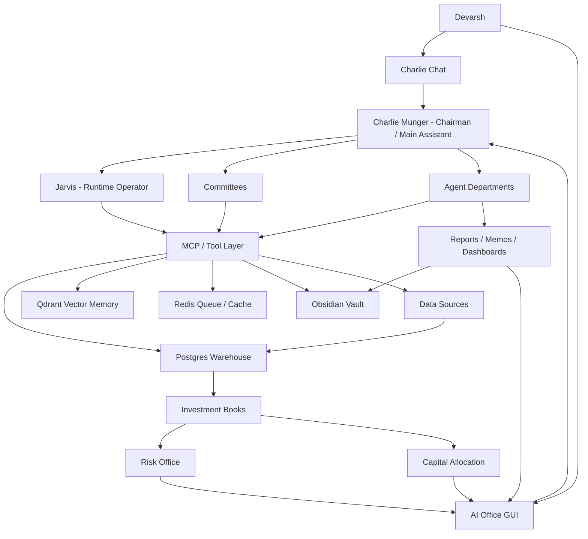
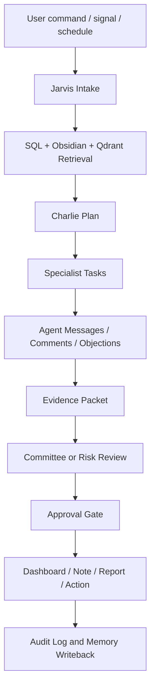

# AI Investment OS - Institutional Master Blueprint v10.0

Date: 2026-07-07
Owner: Devarsh
Canonical checklist: [[AI Investment OS - Execution Checklist v10.0]]
Canonical frontend specification: [[AI OS Command Center and 3D Office Frontend Plan]]
Supersedes: [[AI Investment OS - Institutional Master Blueprint v9.0]]
Main assistant: Charlie Munger
Runtime operator: Jarvis
Permanent memory: Obsidian vault
Structured source of truth: Postgres / Timescale-style warehouse
Semantic retrieval: Qdrant
Queue/cache: Redis
Runtime location: external SSD
Primary operating surface: AI Office GUI plus Charlie chat
End goal: complete AI hedge fund and investment office OS
Status: canonical active-build specification; verified checkpoints are appended with evidence and open gates remain explicit

## 1. Vision

Build a complete AI Investment Operating System: a smarter Bloomberg, a personal hedge fund command center, a client folio manager, a research factory, a quant lab, an active trading desk, a risk office, a capital allocation office, and a live AI office with agents who actually work through tasks, inboxes, committees, reports, dashboards, and tools.

This system is not a chatbot and not only a trading terminal. It is an institutional operating platform for:

- long-term investing,
- tactical investing,
- quantitative strategies,
- active intraday/options trading,
- treasury and cash management,
- hedging,
- crypto/commodity macro,
- client portfolio monitoring,
- research and filings intelligence,
- strategy generation and testing,
- risk and capital allocation,
- agent-based work execution,
- durable memory and evidence.

## 2. Non-Negotiable Principles

1. Human remains in control.
2. No autonomous live broker execution until explicit safety constitution is complete.
3. No fake/seed data mixed into production ledgers.
4. Every position has book, purpose, owner, horizon, thesis/setup, source, review cadence, exit logic, and approval state.
5. Different books can hold opposing positions in the same instrument if each exposure has a clear purpose.
6. Risk and Capital Allocation sit above all books.
7. Every market, portfolio, code, or operational claim must have evidence.
8. Every agent action creates durable records: task, inbox item, message, comment, approval, artifact, run log, or note.
9. Obsidian is the human-readable memory graph.
10. Postgres is the structured system of record.
11. Qdrant is semantic retrieval, not accounting.
12. Runtime data, Docker volumes, logs, screenshots, artifacts, and heavy caches stay on the external SSD.
13. External repos are components/pattern libraries, not the source of truth.
14. Local/open-source models handle routine work; paid/cloud models are escalation routes.
15. Repeated implementation errors trigger research before more trial-and-error.

## 3. System Map



## 4. How Devarsh Interacts With The System

Devarsh should mainly interact with Charlie.

Example commands:

- "Add this Reliance buy to Long-Term as Core Compounder."
- "Review all client folios and tell me what changed."
- "Open NIFTY, BANKNIFTY, VIX, and option straddle charts in TradingView."
- "Scan NSE/BSE filings for demergers, buybacks, open offers, reverse mergers, and arbitrage spreads."
- "Generate strategy ideas from my old trade journals."
- "Backtest this intraday options strategy, optimize it, and send it to Strategy Committee."
- "Prepare a client-ready portfolio report, but do not send it."
- "Run Monte Carlo on this long-term thesis and show downside probability."
- "Tell me if any quant or active trade is unintentionally offsetting my long-term book."

Charlie must respond with:

- what was understood,
- book/context affected,
- agents assigned,
- tools and data sources used,
- source freshness,
- missing data,
- conclusion,
- bear case,
- risk flags,
- approvals needed,
- dashboard widgets updated,
- notes/reports written,
- next recommended action.

Jarvis then converts Charlie's decision into actual runtime actions: database reads/writes, MCP calls, browser actions, TradingView actions, agent tasks, dashboard updates, Obsidian writebacks, and audit logs.

## 5. Operating Surfaces

Required human-facing surfaces:

- Charlie Chat
- Executive Command Center
- Portfolio Intelligence
- Client Folios
- Symbol Intelligence
- Long-Term Office
- Tactical Office
- Quant Lab
- Active Trading Desk
- Research Factory
- News and Filings
- Special Situations
- Treasury, Hedges, Crypto, Commodities
- Risk Center
- Capital Allocation
- Agent Office
- Agent Inbox
- Committee Room
- Approval Board
- Reports Library
- Model Runtime
- Provider Readiness
- System Health
- Live AI Office

## 6. Live AI Office

The live AI office is an operating interface, not decoration.

It must show:

- departments as rooms,
- agents as employees,
- live task state,
- task arrows between agents,
- active model route,
- active tools,
- inbox count,
- last output,
- cost status,
- risk status,
- committee rooms,
- approval desk,
- risk wall,
- alert wall,
- live activity feed,
- click-through agent profile pages.

Final visual target:

- 2D office grid first,
- then animated office floor,
- later optional 3D office view.

The rule: visuals come after real data-backed tasks, messages, approvals, and outputs exist.

The Command Center and Live AI Office are now one linked frontend delivery stream. The Command Center is the data-dense working surface; the 3D office visualizes the same entities and uses the same audited action routes. Architecture, live-data mapping, delivery gates, responsive requirements, and acceptance criteria are canonical in [[AI OS Command Center and 3D Office Frontend Plan]].

### 6.1 Frontend Operating Contract

The frontend is delivered as two interlinked worlds that preserve the selected entity, workspace, filters, evidence context, and conversation state when the operator switches between them:

1. **Command Center**: Mission Control, Portfolio Office, Quant Lab, Trading Desk, Risk Center, Research Hub, and System Health. This is the primary data-dense analyst workspace and remains fully usable without WebGL.
2. **Live AI Office**: a React Three Fiber office with Executive, Research, Quant, Trading, Portfolio, Data Center, and Committee rooms. Avatars, task handoffs, committee activity, room KPIs, status pulses, and employee panels must come from live API/Postgres rows.

Charlie chat is the common work-entry surface. A command must show its interpreted objective, delegation, source/tool use, blockers, approvals, evidence, durable task/message records, and resulting widgets. Clicking an office employee uses the same audited agent-message route; the 3D scene has no separate action authority and cannot bypass risk, provider, committee, or execution gates.

The delivery architecture keeps React, TypeScript, Vite, and the existing API contract; uses React Router for addressable workspaces, Zustand only for client selection/view state, React Three Fiber/Three.js/Drei for the office, and standard DOM charts for decision-critical analytics. The implementation order is shell and scoped live reads, Mission Control and core workspaces, 3D interaction completion, then production/accessibility/performance hardening. The current 36-agent live registry is authoritative; older frontend proposals that mention 16 agents are historical snapshots, not the runtime target.

## 7. Storage And Memory Contract

Internal Mac storage holds only the lightweight, recoverable runtime source and installed service payload:

- canonical Git worktree,
- API/UI/agent source,
- small LaunchAgent service copies,
- build metadata required to run the code.
- a small Git-tracked evidence snapshot and import manifests required for repository-level recovery.

External SSD stores all persistent and heavy state:

- Obsidian vault and canonical knowledge notes,
- the stable `_ai_os_runtime` access path, which may symlink to the internal Git worktree,
- Docker Desktop disk image and Docker-managed volumes,
- Postgres data,
- Redis data,
- Qdrant data,
- imported artifacts,
- generated/runtime logs,
- screenshots,
- browser profiles,
- generated reports,
- backtest artifacts,
- model caches where practical.

Verified recovery layout (2026-07-11): the canonical worktree is `/Users/devarshthakkar/AI_OS_ACTIVE_RECOVERY_20260710/ai-investment-os`; `/Volumes/Devarsh SSD/Obsidian memory /_ai_os_runtime` is a stable symlink to that source; Docker uses `/Volumes/Devarsh SSD/Docker/DockerDesktop/Docker.raw`; and Ollama uses `/Volumes/Devarsh SSD/OllamaModels`. Startup must fail if the SSD, vault, model directory, or external Docker disk image is unavailable. The code location itself is not a heavy-data gate.

macOS service exception: `launchd` must pre-open its standard output/error paths and cannot use the removable SSD for those files under the current privacy grant. The four small supervisor logs therefore remain under `~/Library/Logs/AIOS`, are trimmed from 8 MB to the latest 1 MB on service restart, and must never hold investment artifacts or source data. Runtime logs and all other growing artifacts remain external. The scheduled critical backup also requires explicit removable-volume access before unattended vault rsync can be considered production-ready.

Obsidian stores:

- architecture,
- decisions,
- runbooks,
- research notes,
- company memos,
- committee minutes,
- agent outputs,
- daily/weekly/monthly reports,
- links to heavy artifacts.

Postgres stores:

- clients,
- accounts,
- holdings,
- transactions,
- positions,
- books,
- strategies,
- backtests,
- indicators,
- OHLCV,
- options/OI/IV,
- filings/news metadata,
- risk limits,
- capital allocation,
- agent tasks,
- inbox,
- messages,
- approvals,
- comments,
- tool runs,
- provider gates,
- source lineage.

Qdrant stores embeddings for:

- Obsidian notes,
- reports,
- filings,
- transcripts,
- PDFs,
- strategy dossiers,
- trade journals,
- Codex outputs,
- Claude/Cowork outputs,
- agent outputs.

## 8. Data Spine

### 8.1 Internal Data Sources

- p2cursor client data,
- old algo trading system data,
- current broker holdings,
- transaction reports,
- old 2018-19 trade data,
- manual trades,
- paper trades,
- old trade journals,
- research reports,
- Codex outputs,
- Claude/Cowork outputs,
- Obsidian notes,
- Excel/CSV files,
- PDFs,
- screenshots,
- TradingView chart artifacts.

### 8.2 Market And External Sources

- Zerodha read-only,
- Dhan read-only,
- TradingView controller,
- NSE announcements,
- BSE announcements,
- corporate actions,
- annual reports,
- concall transcripts,
- investor presentations,
- credit rating notes,
- daily OHLCV,
- intraday OHLCV,
- options chain,
- OI,
- IV,
- Greeks,
- futures basis,
- VIX/volatility,
- gold/silver/commodity data,
- crypto exchange read-only data,
- macro data,
- global news,
- Twitter/X/social triage where access and policy allow.

### 8.3 Source Rules

Every imported row must carry:

- source system,
- source artifact,
- ingestion run,
- source timestamp,
- ingestion timestamp,
- confidence,
- lineage,
- reconciliation status.

No source can silently overwrite another source. Broker/account data can override manual estimates only through a reconciliation workflow.

## 9. External Component Strategy

### 9.1 Fincept

Use Fincept for:

- terminal UX patterns,
- financial data hub patterns,
- research and analytics wrappers,
- report builder ideas,
- options/IV/OI patterns,
- news/RSS patterns,
- quant lab workflows,
- MCP/tool catalog references.

Fincept is a component library/reference layer. It must feed our warehouse/API/MCP stack, not replace it.

### 9.2 OpenAlgo

Use OpenAlgo for:

- broker/orderflow reference,
- indicator/scanner patterns,
- strategy execution architecture,
- future read-only and human-approved adapter patterns.

Live execution stays disabled until our safety gates are complete.

### 9.3 Vibe-Trading

Use Vibe-Trading for:

- agentic strategy research loops,
- idea generation patterns,
- trading reasoning workflows,
- shadow-account learning,
- committee/swarm review patterns.

It must not control capital directly.

### 9.4 TradingView

Use TradingView for:

- chart opening,
- watchlists,
- layouts,
- screenshots,
- chart evidence,
- straddle/strangle views,
- visual technical checks,
- fundamental ratio charts where available,
- alert preparation.

Changing alerts, accounts, brokers, or order-affecting settings requires human approval.

## 10. Investment Book Architecture

Books:

- Long-Term Investing
- Tactical Investing
- Quantitative Strategies
- Active Trading
- Cash/Treasury
- Hedges
- Crypto/Commodity Macro

### 10.1 Long-Term Book

Purpose: 3-15 year compounding and wealth building.

Position types:

- core compounder,
- quality compounder,
- cyclical compounder,
- special long-term opportunity,
- client long-term holding,
- watchlist/starter position.

Primary owner: Long-Term Office.

### 10.2 Tactical Book

Purpose: days-to-months catalyst/event/macro/sector opportunities.

Position types:

- earnings setup,
- event trade,
- sector rotation,
- macro trade,
- valuation dislocation,
- tactical hedge.

Primary owner: Tactical Office.

### 10.3 Quant Book

Purpose: systematic alpha from tested rules.

Position types:

- mean reversion,
- momentum,
- factor,
- intraday,
- options,
- volatility,
- stat arb,
- portfolio strategy sleeve.

Primary owner: Quant Lab.

### 10.4 Active Trading Book

Purpose: discretionary intraday/days trading and options setups.

Position types:

- intraday equity,
- index options,
- straddle/strangle,
- breakout,
- reversal,
- support/resistance,
- event setup.

Primary owner: Trading Desk and Devarsh.

### 10.5 Treasury, Hedges, Crypto/Commodity

Treasury manages cash, liquid funds, collateral, and deployment queues.

Hedges manage beta, downside, event, currency, volatility, and book-level protection.

Crypto/Commodity Macro covers BTC, ETH, gold, silver, and other approved macro instruments.

## 11. Position Object

Every position must support:

- client/account,
- instrument,
- asset class,
- exchange,
- direction,
- quantity,
- average price,
- market value,
- mark-to-market,
- book,
- sub-book,
- purpose,
- owner,
- time horizon,
- thesis/setup,
- entry rationale,
- source artifact,
- source freshness,
- entry date,
- review frequency,
- exit criteria,
- stop/target/time exit where relevant,
- risk budget,
- capital budget,
- linked research note,
- linked committee review,
- linked strategy,
- linked trade journal,
- linked hedge/offset,
- approval state.

Opposing positions in the same instrument are allowed only if the system can explain:

- which book owns each exposure,
- why each exposure exists,
- whether a short is hedge or independent alpha,
- gross long,
- gross short,
- net exposure,
- costs/taxes,
- risk impact,
- capital impact,
- whether a coordination question is needed.

Example:

| Book | Direction | Amount | Purpose | Horizon |
| --- | --- | ---: | --- | --- |
| Long-Term | Long | INR 20L | Core Compounder | 5-10 years |
| Quant | Short | INR 3L | 5-day mean reversion | 5 days |
| Active Trading | Short | INR 2L | Pre-earnings resistance trade | intraday-days |

Portfolio Intelligence should show net long INR 15L, not confuse the long-term thesis with short-term signals.

## 12. Portfolio Intelligence Engine

Required calculations:

- NAV by client/account/book,
- gross exposure,
- net exposure,
- long exposure,
- short exposure,
- cash,
- cash drag,
- book exposure,
- sector exposure,
- factor exposure,
- strategy exposure,
- symbol rollup,
- client rollup,
- realized P&L,
- unrealized P&L,
- dividends/corporate actions,
- risk budget used,
- capital budget used,
- liquidity profile,
- concentration profile,
- cross-book conflicts,
- latest filing/news/research/task/committee note per symbol.

Symbol Intelligence must answer:

- Why do we own/short this?
- Which books own it?
- Which clients hold it?
- What is the long-term thesis?
- What tactical/quant/active setups exist?
- What changed recently?
- What filings/news matter?
- What would make us add, hold, trim, sell, hedge, or ignore?

Symbol Intelligence must also be actionable, not only descriptive. Each symbol row must be able to route work into the agent office:

- refresh thesis,
- review exit criteria,
- route risk review,
- route research update,
- route quant review,
- route trading review,
- request committee review,
- prepare TradingView work.

The production implementation uses `portfolio.symbol_intelligence_actions`, `portfolio.route_symbol_intelligence_action(...)`, API route `POST /api/symbol-intelligence/actions`, MCP tools `ai_os_route_symbol_intelligence_action` and `ai_os_symbol_intelligence_actions`, and AI Office action buttons. Each action creates an auditable action row plus the related agent task and inbox item. Risk and committee work may be blocked by provider/risk gates until approval conditions are met.

## 13. Long-Term Investing Office

### 13.1 Required Long-Term Checks

Business quality:

- business model clarity,
- revenue drivers,
- profit pool,
- pricing power,
- customer concentration,
- supplier dependence,
- cyclicality,
- operating leverage,
- unit economics,
- reinvestment runway,
- regulatory dependence,
- disruption risk.

Industry structure:

- market size,
- growth rate,
- fragmentation,
- competitor map,
- entry barriers,
- substitutes,
- bargaining power,
- capacity cycle,
- regulatory tailwinds/headwinds,
- global/local economics.

Moat:

- brand,
- switching costs,
- network effects,
- scale advantage,
- cost advantage,
- distribution advantage,
- data advantage,
- license/regulatory advantage,
- evidence in margins and ROIC.

Management:

- track record,
- capital allocation,
- promoter/shareholder alignment,
- skin in the game,
- pledge,
- related-party transactions,
- governance behavior,
- candor,
- execution record,
- incentives,
- succession,
- minority-shareholder treatment.

Financial quality:

- revenue quality,
- receivables,
- inventory,
- working capital,
- free cash flow conversion,
- margin sustainability,
- debt maturity,
- contingent liabilities,
- auditor notes,
- tax consistency,
- related parties,
- off-balance-sheet risks.

Valuation:

- DCF,
- reverse DCF,
- sum-of-parts,
- peer comparison,
- historical valuation,
- owner earnings,
- earnings power value,
- bull/base/bear,
- expected CAGR,
- margin of safety,
- valuation vs quality,
- valuation vs opportunity cost.

Risk and sell discipline:

- thesis killers,
- monitoring variables,
- exit criteria,
- sizing logic,
- liquidity,
- fraud/accounting risk,
- disruption risk,
- commodity/currency risk,
- governance risk,
- regulatory risk,
- opportunity cost,
- review cadence.

### 13.2 Long-Term Monte Carlo

Monte Carlo must model:

- revenue growth distribution,
- margin distribution,
- reinvestment,
- ROIC path,
- terminal multiple,
- dilution,
- debt/cash path,
- downside cases,
- valuation range,
- expected CAGR distribution,
- permanent impairment probability,
- sensitivity to assumptions.

Outputs:

- bull/base/bear path,
- probability of acceptable return,
- probability of capital loss,
- key assumption sensitivity,
- position size recommendation,
- committee memo section.

Verified engine/UI foundation (2026-07-13): `portfolio.long_term_monte_carlo_runs`, the deterministic runner, API, MCP tool, Obsidian memo, artifact lineage, and the Holdings Research Decision Lab are live. The operator supplies explicit thesis, horizon, simulations, seed, valuation assumptions, source evidence, and volatility. The UI exposes return/loss distributions and blocks an unsourced explicit starting multiple before submission. Live run `#5` completed without warnings, wrote directly to the external Obsidian vault, and retained no capital or broker authority. Remaining blueprint work is position-size recommendation, richer driver distributions, direct committee packet fields/challenge actions, and complete source-backed coverage. Evidence: [[2026-07-13-long-term-decision-lab-v1]].

### 13.3 Long-Term Agents

- Long-Term Portfolio Manager
- Company Analyst
- Industry Analyst
- Management Analyst
- Financial Statement Analyst
- Forensic Accounting Agent
- Valuation Agent
- Filings and Transcript Analyst
- Bear Case Agent
- Quality Score Agent
- Portfolio Fit Agent
- Thesis Librarian

### 13.4 Long-Term Committee

Members:

- Charlie as chair,
- CIO Agent,
- Long-Term Portfolio Manager,
- Company Analyst,
- Valuation Agent,
- Risk Agent,
- Bear Case Agent,
- Portfolio Fit Agent,
- Devarsh final approver.

Allowed decisions:

- reject,
- watchlist,
- more research,
- starter position,
- add,
- hold,
- trim,
- sell,
- hedge.

## 14. Tactical Investing Office

Required checks:

- catalyst type,
- event date,
- expected impact,
- market expectation,
- horizon,
- stop,
- target,
- time exit,
- liquidity,
- option overlay,
- overlap with long-term book,
- hedge vs independent alpha,
- news/filing evidence,
- crowding/sentiment,
- macro/sector context.

Agents:

- Tactical Portfolio Manager
- Catalyst Analyst
- Event Analyst
- Technical Analyst
- Macro Analyst
- Sentiment Analyst
- Options Overlay Agent
- Sector Rotation Agent

Committee: Tactical Committee with Charlie, CIO, Tactical PM, Risk, Technical, Macro, Options, and Devarsh final approver.

## 15. Quantitative Strategies Office

Strategy lifecycle:

1. Idea intake.
2. Hypothesis.
3. Data availability check.
4. Rule/DSL definition.
5. Data-quality gate.
6. Baseline backtest.
7. Cost/slippage model.
8. Train/test split.
9. Walk-forward analysis.
10. Regime split.
11. Sensitivity analysis.
12. Monte Carlo/bootstrap.
13. Capacity/liquidity model.
14. Factor attribution.
15. Correlation to existing strategies/books.
16. Probability of ruin.
17. Strategy Committee review.
18. Paper monitor.
19. Limited-live approval.
20. Kill-switch and retirement rules.

Required checks:

- statistical significance,
- sample size,
- lookahead bias,
- survivorship bias,
- transaction cost sensitivity,
- slippage,
- liquidity,
- regime robustness,
- overfitting risk,
- parameter stability,
- decay risk,
- turnover,
- drawdown shape,
- tail risk,
- capital required,
- operational complexity.

Agents:

- Head of Quant
- Strategy Generator
- Strategy Research Agent
- Strategy Intake Agent
- Data Scientist
- Feature Engineer
- Backtesting Engineer
- Optimizer Agent
- Regime Analyst
- Capacity/Liquidity Analyst
- Model Validation Agent
- Strategy Portfolio Optimizer
- Strategy Retirement Agent

Committee: Strategy Committee with Charlie, Head of Quant, Model Validation, Risk, Data Quality, Backtesting, Capacity, Portfolio Optimizer, and Devarsh final approver.

## 16. Active Trading Desk

Required workflows:

- manual trade entry,
- paper trade entry,
- setup classification,
- TradingView chart open,
- TradingView screenshot evidence,
- straddle/strangle chart workflow,
- options payoff,
- IV/OI analysis,
- futures basis,
- intraday alerts,
- trade journal,
- post-trade review,
- overnight risk check,
- execution safety gate.

Required checks:

- setup type,
- timeframe,
- entry,
- stop,
- target,
- time stop,
- position size,
- max loss,
- event risk,
- liquidity,
- Greeks,
- volatility regime,
- correlation with existing exposure,
- whether the trade offsets another book intentionally.

Agents:

- Trading Desk Agent
- Technical Analyst
- Options Analyst
- Futures Analyst
- Volatility Agent
- Market Microstructure Agent
- Execution Safety Agent
- Trade Journal Coach

## 17. Research Factory And Special Situations

Sources:

- NSE announcements,
- BSE announcements,
- annual reports,
- concall transcripts,
- investor presentations,
- credit rating notes,
- exchange circulars,
- regulatory/court notices,
- global news,
- social watchlists where allowed.

Special situation detectors:

- buyback,
- demerger,
- reverse merger,
- merger,
- spin-off,
- delisting,
- rights issue,
- preferential issue,
- open offer,
- tender offer,
- arbitrage spread,
- restructuring,
- pledge release/build-up,
- promoter transaction,
- auditor resignation,
- rating change,
- unusual corporate action.

Agents:

- Research Director
- Filings Analyst
- Corporate Actions Analyst
- Special Situations Agent
- Arbitrage Analyst
- News Analyst
- Social/Twitter Triage Agent
- Document Extraction Agent
- Research Librarian

Outputs:

- source-backed note,
- extracted terms,
- timeline,
- spread/valuation math,
- risk checklist,
- committee recommendation,
- dashboard alert,
- Obsidian writeback.

Operating implementation checkpoint:

- The hourly source-intelligence loop runs curated news ingestion, NSE/BSE announcement collection, material-first filing PDF extraction, strategy discovery, and role-scoped agent routing as one auditable scheduler workflow.
- Ten RSS sources currently pass live health checks, including official RBI, Federal Reserve, and ECB feeds; each check records HTTP state, latency, rows seen, sample titles, and error evidence.
- NSE and BSE collectors use current exchange endpoints, bounded pagination, per-day BSE requests, India-time normalization, idempotent upserts, and a two-day operating lookback.
- Filing extraction prioritizes special situations, held companies, and watched symbols; stores PDFs and extracted text under the external artifact root; limits failed retries; and requires human review before promotion.
- Holdings Research exposes feed registry, source health, collector history, filing extraction, filings, news, special situations, generated ideas, and outputs through a bounded scoped API and terminal workspace.
- Twitter/X remains explicitly blocked until authenticated credentials and an approved collection policy are supplied.
- No source pipeline can allocate capital, enable a strategy, or place an order. Execution remains locked and committee approval remains mandatory.
- Evidence: [[2026-07-15-research-intelligence-v1]].

## 18. Treasury, Hedges, Crypto, Commodities

Treasury checks:

- cash level,
- cash drag,
- liquidity needs,
- margin/collateral,
- near-term commitments,
- deployment queue,
- idle cash alternatives,
- client-level restrictions.

Hedge checks:

- exposure being hedged,
- hedge instrument,
- hedge ratio,
- hedge cost,
- expected protection,
- basis risk,
- time horizon,
- unwind rule,
- unintended offset.

Crypto/commodity checks:

- instrument registry,
- exchange source,
- custody/operational risk,
- volatility,
- liquidity,
- macro driver,
- correlation,
- position limits,
- stop/exit logic.

Agents:

- Treasury Analyst
- Hedge Analyst
- Commodity Macro Analyst
- Crypto Analyst
- Collateral/Risk Agent

## 19. Capital Allocation Office

Responsibilities:

- allocate capital across books,
- monitor book budgets,
- monitor client budgets,
- rebalance suggestions,
- drawdown-aware sizing,
- liquidity-aware sizing,
- cash deployment queue,
- strategy allocation,
- opportunity-cost ranking,
- capital conflict resolution.

Agents:

- Capital Allocation Officer
- Portfolio Optimizer
- Performance Attribution Analyst
- Client Suitability Analyst
- Cash/Treasury Analyst

Capital Allocation Committee includes Charlie, CIO, Capital Allocation Officer, Portfolio Manager, Risk, book representatives, and Devarsh final approver.

## 20. Risk Office

Risk engines:

- concentration,
- liquidity,
- VaR,
- expected shortfall,
- stress tests,
- portfolio Monte Carlo,
- options tail risk,
- factor risk,
- cross-book conflict,
- client suitability,
- strategy kill switch,
- provider/model/data-source gates,
- execution gate ledger.

Risk agents:

- Chief Risk Officer
- Quant Risk Analyst
- Stress Testing Agent
- Model Risk Agent
- Data Quality Risk Agent
- Compliance/Audit Agent
- Kill Switch Agent

Risk can:

- warn,
- request evidence,
- reduce size,
- block action,
- require committee,
- require human approval,
- trigger kill switch.

## 21. Client Office

Responsibilities:

- client onboarding,
- current holdings,
- transaction history,
- buy/sell dates,
- realized/unrealized P&L,
- NAV,
- book exposure,
- risk profile,
- restrictions,
- monthly reports,
- action log,
- suitability checks.

Agents:

- Client Manager
- Reporting Analyst
- Performance Reporter
- Client Suitability Analyst
- Communication Agent
- Onboarding Agent

Client-facing outputs require approval before sending.

## 22. Agent Office And Communication

Each agent must have:

- name,
- character/personality,
- department,
- manager,
- role,
- responsibilities,
- skills,
- model route,
- tool permissions,
- data permissions,
- cost cap,
- inbox,
- task history,
- output artifact history,
- reliability score,
- escalation policy.

Agents communicate through:

- tasks,
- inbox items,
- messages,
- comments,
- handoff threads,
- approvals,
- committee reviews,
- output artifacts,
- run logs,
- Obsidian notes.

Agent discussion flow:



## 23. Agent Hierarchy

Executive Office:

- Charlie Munger, Chairman/Main Assistant
- Jarvis, COO/Runtime Operator
- CIO Agent
- Chief of Staff
- CTO/Coding Lead

Departments:

- Portfolio Office
- Long-Term Office
- Tactical Office
- Quant Lab
- Active Trading Desk
- Research Factory
- News and Filings
- Special Situations
- Treasury/Hedges/Crypto/Commodities
- Risk Office
- Capital Allocation Office
- Client Office
- Data Engineering
- AI Engineering
- Software Engineering
- Automation and Integrations
- Knowledge Division
- Finance/Admin

## 24. Committees

Committees are structured workflows, not informal chat.

Every committee requires:

- chair,
- members,
- agenda,
- evidence packet,
- dissent section,
- decision options,
- conditions,
- follow-up tasks,
- approval state,
- final human decision where money/client/external action is involved.

Required committees:

- Executive Committee
- Long-Term Investment Committee
- Tactical Committee
- Strategy Committee
- Special Situations Committee
- Risk Committee
- Capital Allocation Committee
- Data and Tool Committee
- Client Review Committee
- Model Review Committee
- Execution Approval Committee

## 25. MCP And Tool Layer

Required MCP/tool categories:

- Postgres read/write with permission gates,
- Obsidian read/write,
- Qdrant search,
- file/artifact registry,
- Excel/CSV importer,
- PDF/document extractor,
- browser research runner,
- TradingView controller,
- NSE/BSE filing scraper,
- news scraper,
- Fincept bridge,
- OpenAlgo bridge,
- Vibe workflow reference bridge,
- broker read-only connectors,
- crypto/commodity read-only connector,
- report/PDF builder,
- chart/screenshot artifact tool,
- model route/cost ledger,
- approval tool,
- task/inbox/message tool.

## 26. Model Strategy

Local daily-driver models handle:

- routine triage,
- note summaries,
- metadata extraction,
- inbox summaries,
- simple research drafting,
- retrieval synthesis,
- cheap agent chatter.

Cloud/frontier escalation handles:

- Charlie final synthesis,
- high-value investment judgement,
- large filings/transcripts,
- hard coding/debugging,
- client-ready reports,
- committee memos,
- legal/compliance-style review.

Each model route must define:

- allowed agents,
- allowed tools,
- max cost,
- privacy level,
- fallback,
- escalation rule,
- logging.

Current runtime decision (2026-07-11): `llama3.2:3b` is the always-on local daily driver for Charlie/Jarvis intake, chat, summaries, news triage, research intake, strategy intake, and trade-journal learning. `mxbai-embed-large` owns local retrieval embeddings. Deterministic Python owns backtests, optimization, execution gates, and other reproducible calculations. Qwen 8B/14B routes remain optional escalation slots and must be treated as unavailable until their exact Ollama model names are installed. A running Ollama server is insufficient evidence: readiness must query `/api/tags`, persist the exact model check, and block assignment when the configured model is absent. Frontier/Codex use remains explicit-approval escalation only.

## 27. Reports And Briefs

Required recurring outputs:

- daily market brief,
- daily portfolio brief,
- daily agent activity brief,
- weekly risk report,
- weekly research digest,
- monthly client report,
- data-source freshness report,
- provider readiness report,
- cost report,
- system status report.

Verified recurring-report foundation (2026-07-13): all ten outputs above are configured in `ops.report_schedules`, generated from bounded live Command Center APIs, and recorded through `ops.report_runs`. Canonical daily, weekly, and monthly periods completed with atomic task, inbox, worker, source-snapshot, note-hash, and artifact lineage. The immediate second run was idempotent. Monthly client output is draft-only and created a pending human approval; no external-send, capital, or broker authority is granted. Reports exposes schedule and run status from the same warehouse records. Evidence: [[2026-07-13-backup-restore-and-scheduled-reports-v1]].

Required investment outputs:

- company research report,
- long-term thesis memo,
- valuation memo,
- Monte Carlo memo,
- special situation memo,
- strategy report,
- backtest report,
- optimization report,
- model validation report,
- committee minutes.

## 28. Safety Constitution

Read-only first:

- broker connectors start read-only,
- crypto exchange connectors start read-only,
- TradingView alert/order-affecting changes require approval,
- no autonomous broker orders,
- no client-facing sends without approval,
- no destructive data action without approval.

Execution prerequisites:

- verified account data,
- order preview,
- risk check,
- capital check,
- client suitability check,
- kill switch,
- audit log,
- human approval,
- post-trade journal,
- reconciliation.

## 29. Build Phases

Phase 1: Canonical specification and tracking.

- v10 blueprint,
- v10 checklist,
- top-level index,
- machine-readable registry,
- change-control discipline.

Phase 2: Data spine.

- p2cursor extraction,
- old algo DB import,
- broker reports,
- trade journals,
- Codex/Claude outputs,
- OHLCV/options/filings/news,
- source lineage,
- data quality.

Phase 3: Portfolio brain.

- position object,
- multi-book exposure,
- client folios,
- symbol intelligence,
- cross-book coordination,
- remediation queues.

Phase 4: Research and long-term office.

- long-term checklists,
- research packet generation,
- valuation,
- Monte Carlo,
- committee workflow.

Phase 5: Quant and trading.

- strategy intake,
- backtests,
- optimizer,
- strategy discovery,
- paper monitor,
- TradingView workflows,
- active trade journal.

Phase 6: Risk and capital allocation.

- stress tests,
- portfolio Monte Carlo,
- factor risk,
- capital budgets,
- risk budgets,
- committee gates.

Phase 7: Full agent office.

- agent discussion pages,
- task arrows,
- reliability scoring,
- model/cost controls,
- department dashboards.

Phase 8: Command Center and Live AI Office.

Verified foundation (updated 2026-07-13): Live Office and every Command Center workspace use production-data scoped reads without seed fallback, broad polling, or stale right rail. The production root mounts a compact scoped-only shell. A bounded six-kind evidence API and reusable drawer connect visible work to durable tasks, inboxes, messages, approvals, workers, committee packets, artifacts, and source lineage; pending approval decisions remain separate from capital and broker authority. Every workspace now exposes its actual snapshot age and stale/offline state, render failures are contained, evidence dialogs trap/restore focus, and overflowing lists are keyboard-labelled. Live Office room focus now moves the 3D camera, separates room inspection from workspace navigation, exposes employee workload/inbox/message/risk counts, and renders execution, risk, data-freshness, and priority-task walls from a 14-query bounded warehouse read model. The permanent 23-case WCAG A/AA gate, 22-case responsive/request matrix, and four-case Live Office interaction/WebGL gate pass across desktop/mobile and static/animated states. Phase 8 remains partial until the legacy source is physically removed, portfolio/trading/risk-specific evidence paths are complete, richer committee/employee actions are delivered, and remaining production operations gates pass. Evidence: [[2026-07-13-live-office-operations-v3]].

- modular Command Center shell and addressable workspaces,
- snapshot state and evidence drawer,
- Charlie delegation/chat and widget materialization surface,
- data-backed Mission Control, Portfolio, Quant, Trading, Risk, Research, and System Health modules,
- procedural React Three Fiber office with keyboard/reduced-motion/WebGL fallback,
- animated room/agent/committee activity only when backed by live records,
- hover cards, task arrows, risk wall, alert wall, and employee profile/message actions.

Phase 9: Production hardening.

Verified recovery foundation (2026-07-13): format-v2 backup created current/previous generations with a checksum manifest, Git bundle, Timescale/Postgres custom archive, full Qdrant snapshot, and vault copy. An isolated restore reconciled the vault byte-for-byte, 21 database schemas and 457 tables, and six Qdrant collections without modifying live services. System Health exposes this file-backed chain. The signed 03:20 backup and 08:35 report LaunchAgents are installed; final unattended status remains partial until the unlocked Mac records the narrow external-vault security-scoped bookmark and both launchd modes exit zero. Evidence: [[2026-07-13-backup-restore-and-scheduled-reports-v1]].

- backups,
- restore test,
- remote access,
- security,
- secrets,
- audit immutability,
- execution safety.

## 30. Acceptance Criteria

The system is not "complete" until:

- real client/holding/transaction data is reconciled,
- every active position has a book and purpose,
- long-term holdings have thesis and exit criteria,
- strategies have evidence, backtests, risk review, and promotion state,
- agents communicate through durable records,
- committees produce evidence-backed decisions,
- dashboards use warehouse data,
- reports write to Obsidian,
- Qdrant retrieval works over notes/reports/documents,
- model routing and cost controls are enforced,
- safety gates prevent unauthorized external actions,
- backups and restore are tested,
- the Live AI Office reflects real work rather than static visuals,
- Command Center and Live Office share live entity state, evidence links, and approval-aware action routes,
- the 3D view is verified nonblank, interactive, responsive, accessible, and safely degradable when WebGL is unavailable.

## 31. Immediate Next Implementation Order

1. Make v10 canonical in the top-level AI OS index.
2. Convert v10 domains and requirements into machine-readable registry rows.
3. Finish position remediation queue and agent task routing for thesis/exit gaps.
4. Build Symbol Intelligence v2 around multi-book exposure.
5. Add Symbol Intelligence action router into agent tasks/inbox.
6. Harden p2cursor and old algo extraction.
7. Implement Long-Term checklist tables and UI.
8. Implement Long-Term Monte Carlo and committee integration.
9. Expand research/news/filing collectors.
10. Harden TradingView controller and straddle workflow. Foundation verified 2026-07-10: local-only Desktop CDP is live through the guarded Launch Services relaunch script, browser profile evidence, provider gate, and a daemon heartbeat that maintains browser-session/connector readiness. Chart action quality/retry and strategy templates remain next.
11. Build Client Folio dashboard.
12. Build Risk Office v2 with stress tests and portfolio Monte Carlo.
13. Build Command Center foundation by extracting the monolithic AI Office UI into live-data modules without behavior loss.
14. Build Animated AI Office v1 only after real task arrows and agent work states are data-backed.
15. Complete the Command Center and 3D Office gates in [[AI OS Command Center and 3D Office Frontend Plan]] before calling the operating interface complete.

## 32. Verified Terminal, Agent, And Research Foundation - 2026-07-15

The operating interface now includes scoped Approval Board, Agent Office, Committee Rooms, Capital Allocation, Treasury and Macro, and Model Runtime terminals. The operator can persist theme, density, columns, module order, hidden modules, and dashboard widget layout through audited API and MCP actions. Charlie may propose and apply workspace changes, but a layout change cannot alter evidence, approval, capital, or execution records.

The live organization contains 49 active role-scoped agents across automation, data, executive, knowledge, news, portfolio, quant, research, risk, runtime, and trading. The hierarchy follows this control path:

```text
Devarsh
  -> Charlie Munger, chief orchestrator and decision partner
      -> Jarvis, runtime operator and dispatcher
      -> Portfolio Manager / Capital Allocation Agent
      -> Research Analyst / Strategy Generator / Risk Agent / Trading Desk Agent
          -> role-scoped specialists with durable mailboxes, tasks, evidence, and escalation
```

Agents may prepare evidence, recommend actions, create tasks, and communicate through durable warehouse records. Human approval remains mandatory for capital actions, live execution, external communication, and policy exceptions. Agent personalities are operating constraints, not fictional authority.

The Research Factory now accepts source-backed paper metadata and public or approved-local PDFs, retains PDF/text on the external SSD, hashes and registers the artifact, extracts full text, creates an idempotent review task, and stores falsifiable paper-linked strategy hypotheses. A hypothesis cannot promote itself into a strategy or broker action.

The Trading Desk contains six advanced TradingView template contracts for indicator stacks, ratio charts, spread formulas, four-pane straddles, fundamental ratios, and market-regime analysis. Template requests remain approval-gated; full deterministic multi-pane UI execution is still an open production gate.

Verification: 14 functional browser cases, 23 WCAG A/AA cases, production build, Python compile, MCP smoke with 138 tools, source-backed PDF extraction, idempotency proof, and desktop/mobile screenshots passed. Evidence: [[2026-07-15-terminal-agent-research-foundation-v1]].

## 33. Strategy Arsenal Operating Contract - 2026-07-15

The Quantitative Strategies Office now has a unified operating surface rather than disconnected intake, discovery, optimizer, validation, and committee panels. Every strategy candidate enters the Strategy Arsenal with explicit provenance: operator submitted, system discovery, template library, research sourced, or imported/other. A source may propose a candidate but cannot bypass the canonical lifecycle.

The lifecycle is:

```text
Operator idea / source-backed discovery / approved template
  -> structured intake and falsifiable hypothesis
  -> machine-testable DSL parse
  -> point-in-time data-quality gate
  -> deterministic baseline backtest with cost and slippage evidence
  -> bounded optimization and diagnostics
  -> independent model-validation review
  -> Strategy Committee decision
  -> paper monitor
  -> separately approved limited-live request
  -> broker adapter only after future production authorization
```

The terminal exposes eight independent gate states, the next required safe action, responsible agent, source lineage, and linked evidence. The evidence chain resolves intake, generated idea, backtest runs, optimization runs, model validation, committee records, paper and limited-live gates, and open work. Discovery triage supports Quant Lab routing, more-evidence requests, and rejection. Validation and discovery controls do not receive execution authority.

The canonical database contract is `strategy.v_strategy_arsenal_control_board` plus `strategy.v_strategy_arsenal_control_summary`. The scoped API is `GET /api/strategy-arsenal/snapshot`; the MCP contract is `ai_os_strategy_arsenal_control_board`. Workspace layout is operator configurable, while evidence, approval, capital, risk, and execution records are not layout configuration.

Verified live state at the checkpoint contained 47 candidates: 3 operator submissions, 34 system discoveries, and 10 imported/other records. All 47 had baseline backtests; 38 passed DSL and data-quality gates and had optimization evidence; 1 passed independent validation and awaited committee review; none had a paper monitor; none had limited-live approval; broker orders allowed remained 0. These counts are dynamic because the discovery scheduler remains active.

This is not production execution readiness. Remaining gates include richer historical and intraday/options datasets, optimizer configuration and portfolio analytics, paper-monitor operations, drift/capacity/correlation controls, committee decisions, limited-live policy, broker adapters, and security/compliance authorization. Evidence: [[2026-07-15-strategy-arsenal-v1]].

## 34. Data And Model Plug-In Gateway Operating Contract - 2026-07-15

Every model provider and data source must enter through one canonical plug-in contract before an agent may use it. The contract separates identity, capabilities, credential references, warehouse mapping, bounded ingestion or health jobs, provider readiness, model routing, source freshness, and evidence. Registering a connector does not make it trusted, assignable, or executable.

```text
Data source / model provider
  -> canonical plug-in manifest
  -> secret-reference and access-mode validation
  -> connector or endpoint health check
  -> warehouse schema mapping for data sources
  -> allowlisted bounded job for recurring sources
  -> model route and provider-readiness gate for models
  -> evidence ledger
  -> specialist-agent assignment only when ready
```

The database contract is `core.integration_plugins`, `core.integration_schema_mappings`, `core.integration_jobs`, and `core.integration_job_runs`, with `core.v_integration_plugin_gateway` as the operating read model. Source-connector and model-endpoint triggers synchronize the canonical manifest, so the Gateway does not become a second registry. Schema mappings require an existing target relation and retain field, key, timestamp, transformation, validation, and owner evidence.

Execution is deliberately narrow. Jobs may invoke only seven code-owned executor keys: market-news ingestion, filing collection, tick-to-OHLCV aggregation, TradingView quote refresh, public-source checks, provider-readiness checks, and the fixed checksum-preserved legacy market-data importer. The API and Postgres both reject unknown executors. The legacy importer accepts no arbitrary path, command, network, or broker parameter. Recursive payload checks reject raw API keys, tokens, passwords, client secrets, and private keys; configuration may retain only approved `env:`, `keychain:`, `vault:`, `1password:`, or `op:` references. The global broker lock remains independent and closed.

The Data & Model Gateway terminal is the operator surface for source registration, model registration, readiness filtering, mapping creation/validation, bounded job configuration/runs, model-route inspection, and linked integration evidence. It is a scoped live workspace, not a seed-backed catalog. Charlie and Jarvis may prepare or run these bounded controls, but cannot turn a connector into broker authority or bypass approval policy.

Verified live state after the legacy market-data checkpoint: 39 synchronized plug-ins, 18 data sources, 21 model endpoints, 12 validated mappings, six enabled bounded jobs, 21 model routes, one stale global-news freshness SLA, four missing credential references, zero unmapped legacy/import sources, and five unavailable model endpoints. A real TradingView portfolio refresh persisted 44 quotes through the job ledger. The full MCP surface exposes 146 tools, including dedicated market-data readiness and bounded import controls.

The UI production build, Python parsing, idempotent migration application, database and API executor-rejection probes, real TradingView run, MCP smoke, external-storage verification, 37-case WCAG A/AA gate, and focused Gateway regression passed. Browser binaries and dependency caches remain on the external SSD. Real daily history is now research-ready only with explicit bias audits; intraday/options depth, corporate-action verification, live-tail refresh, broker and crypto connectors, cloud credentials, and missing local models remain open. Evidence: [[2026-07-15-data-model-integration-gateway-v1]], [[2026-07-15-legacy-market-data-spine-v1]].

## 35. Legacy Market Data Spine Operating Contract - 2026-07-15

The old algo terminal and P2Cursor archive are source systems behind an immutable import boundary, not application databases that agents query directly. Checksummed SQLite/archive/statement evidence remains on the external SSD. Canonical warehouse tables, batch lineage, quality checks, source contracts, and execution locks are the only supported downstream interface.

Daily OHLCV contains 1,038,214 warehouse rows across 516 symbol records from 2016-01-01 through 2026-06-12. The immutable legacy source contributes 1,038,186 rows across 502 symbols. All source rows passed required-field, positive-price, OHLC-bound, nonnegative-volume, and no-future-row checks; four floating-point boundary deviations were normalized within a fixed epsilon. This dataset is permitted for research with caveats and prohibited for capital execution until corporate-action adjustment provenance, point-in-time universe membership, survivorship, and current-tail refresh are verified.

Intraday evidence contains 318,066 valid source ticks collapsing to 197,595 canonical timestamp-symbol keys, plus real 5m, 15m, and 1h bars. Options evidence contains 4,367 NIFTY straddle snapshots with strike, call, put, premium, spot, and average IV. Both remain insufficient-depth datasets. Duplicate tick keys are measured explicitly and are not reported as inserted observations.

The operating interface is `market.dataset_contracts`, `market.market_data_import_runs`, `market.market_data_quality_checks`, `market.v_strategy_market_data_readiness`, and `trading.option_strategy_snapshots`; the API exposes these through the Data & Model Gateway. MCP tools `ai_os_market_data_readiness` and `ai_os_run_legacy_market_data_ingestion` provide bounded agent access. The Gateway's fixed import action invokes only the checksum-preserved SSD paths and does not grant broker, network, or arbitrary-command authority.

P2Cursor's six available files are fully resolved: canonical Tushit and Naval CSVs are promoted, the duplicate export and frontend sample are excluded, the archived SQLite database is retained as an empty profiled source, and the benchmark JSON remains reference evidence. Full historical buy/sell reconciliation and new-client feeds remain separate ongoing portfolio workflows. Evidence: [[2026-07-15-legacy-market-data-spine-v1]].

## 36. Runtime, Source Intelligence, And Market Bias Controls - 2026-07-15

The application code root is the internal Git-backed checkout. The vault, generated research and strategy artifacts, Playwright browser payload, model files, Docker state, logs, and heavy datasets remain on the external SSD. LaunchAgents no longer treat the partial SSD runtime mirror as executable source. This keeps code recoverable through Git while preventing generated state from consuming MacBook storage.

The 24/7 agent daemon has a warehouse heartbeat rather than a process-name assumption. `core.runtime_daemon_heartbeats` records the active instance, host, PID, loop cadence, enabled workloads, last-pass summary, last error, start time, and heartbeat. `core.v_runtime_daemon_health` derives healthy, degraded, stale, or stopped state. Scoped System Health and MCP tool `ai_os_runtime_daemon_health` expose the same contract. A real LaunchAgent pass completed mailbox workers, OHLCV aggregation, TradingView quote/CDP checks, source freshness, market news, filings/PDF extraction, and strategy discovery before reporting healthy.

Source intelligence uses two cadences:

```text
Every 15 minutes
  -> ten-source RSS/news basket
  -> aggregate global_news health check
  -> market.news_items and source-backed catalyst routing

Every hour
  -> NSE and BSE filing collection
  -> material-first filing PDF extraction
  -> special-situation term classification
  -> strategy discovery and one bounded optimizer route
```

The verified source loop returned 56 news items, 200 NSE/BSE filings, two extracted filing PDFs, two structured special-situation records, 12 strategy candidates, and one optimizer route. Generated PDFs and discovery artifacts were written under `/Volumes/Devarsh SSD/AI OS Data/artifacts`. X/Twitter remains blocked on an authenticated source and is not represented as live.

Market-bias controls are explicit. `market.corporate_actions` stores filing-derived action evidence; `market.corporate_action_adjustment_factors` stores separately reviewed factors; `market.v_ohlcv_adjusted` applies only verified/applied factors without mutating raw OHLCV. `market.universe_memberships` stores dated membership evidence and never infers historical membership from the present. The current checkpoint has 127 detected corporate actions, 17 canonical symbol mappings, zero verified/applied factors, and 530 current-snapshot universe rows. Therefore corporate-action readiness is `needs_verification` and point-in-time readiness is `current_snapshot_only`; neither permits strategy promotion or execution.

The Data and Model Gateway shows these controls beside raw market-data readiness. The full MCP surface is 147 tools. Focused Gateway browser regression passed 5/5, System Health/report regression passed 4/4, System Health desktop/mobile WCAG automation passed 2/2, and loaded full-page screenshots showed no overlap or horizontal overflow. Evidence: [[2026-07-15-runtime-source-intelligence-and-bias-controls-v1]].

## 37. Governance And Production Safety Control Plane - 2026-07-15

Governance is a live operating surface, not a folder of aspirational documents. `core.governance_documents` retains active policies and templates; `core.architecture_change_requests` requires objective, proposed change, alternatives, consequences, blast radius, rollback plan, evidence, task, inbox item, and human approval; `core.architecture_decisions` is the accepted decision log. Approved changes synchronize into a decision but never gain trading or capital authority.

The operator terminal is `Governance & Safety`. Its scoped six-query read model exposes policy, architecture change, and production-safety rows without seed data or a broad application snapshot. Every Command Center route also displays the permanent operating boundary:

```text
Research and decision support
Devarsh retains final investment authority
Broker execution locked by default
```

Production-safety readiness is derived from current warehouse objects rather than hard-coded green labels. The matrix checks global broker lock, order-intent and risk-preview contracts, per-order human approval, kill-switch enforcement, append-only audit, and production/test separation. Secrets policy remains `policy_active` rather than fully enforced until automated secret scanning is installed.

Operational audit is database-enforced append-only. Trigger `trg_mcp_audit_append_only` rejects UPDATE and DELETE on `agent.mcp_audit_log`; API and MCP writes continue to append. A live mutation probe was rejected by PostgreSQL. The same control board is exposed through MCP tools `ai_os_governance_control_board`, `ai_os_request_architecture_change`, and `ai_os_sync_architecture_change`, bringing the full MCP surface to 150 tools.

The first real architecture workflow is pending human ratification: change `#1`, task `#391`, inbox `#894`, approval `#18`. It proposes formal adoption of this control plane and cannot self-approve. Live state at verification contained 11 active policies/templates, 209 append-only audit events, one pending architecture change, seven safety checks, and zero failed safety checks. The UI production build, migration replay, API/MCP checks, 13-case department-terminal regression, 39-case desktop/mobile WCAG gate, and dark/mobile visual review passed. Evidence: [[2026-07-15-governance-and-production-safety-v1]].
