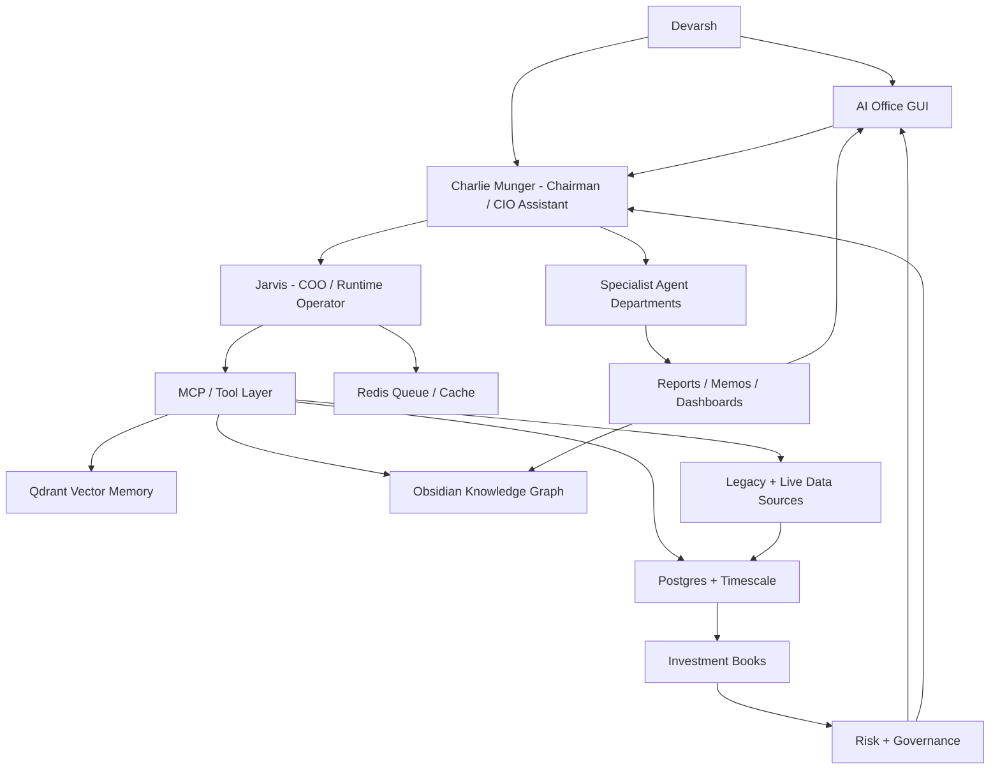
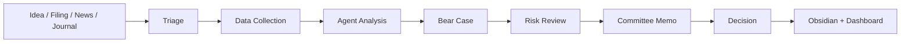
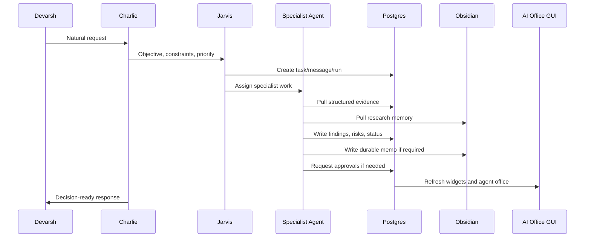

# AI Investment OS - Institutional Master Blueprint v4.0

Date: 2026-07-06
Owner: Devarsh
Primary user interface: AI Office GUI plus Charlie conversation
Main orchestrator: Charlie Munger
Runtime operator: Jarvis
Permanent memory: Obsidian vault
Structured source of truth: Postgres/Timescale
Semantic memory: Qdrant
Queue/cache: Redis
Runtime workspace: `_ai_os_runtime`
Status: Canonical master specification before next implementation phase

## 1. Executive Vision

Build a complete AI Investment Operating System: a smarter Bloomberg, a multi-strategy hedge fund control room, a research factory, a portfolio manager, a trading desk, a risk office, and a live animated AI office in one platform.

This is not only a chatbot, dashboard, broker terminal, backtester, or Obsidian vault. It is the operating system for an investment organization.

The final product must let Devarsh:

- talk to Charlie Munger as the main assistant, chairman, and investment challenger,
- let Jarvis execute tools, retrieve context, write records, update dashboards, and dispatch agents,
- manage long-term client folios, tactical positions, quant strategies, active trading, cash, hedges, crypto, commodities, futures, and options without mixing their objectives,
- store every client, holding, trade, strategy, filing, note, alert, agent output, approval, and decision with evidence,
- run research, backtests, optimizers, walk-forward diagnostics, Monte Carlo diagnostics, paper monitors, and risk gates,
- use a live AI office GUI where every employee has a role, personality, mailbox, current task, model route, tools, and output history,
- keep Obsidian as the human-readable research memory graph,
- keep Postgres as the canonical structured data spine,
- use Qdrant for retrieval, not accounting,
- use local/open-source models for routine work and cloud/frontier models only on escalation,
- keep broker execution disabled by default until all approval, risk, order, and kill-switch gates pass.

The product should scale from a personal investment workstation to a family office and then to a multi-strategy investment firm.

## 2. Founding Principles

1. No fake live data in production views.
2. Every position belongs to a book.
3. Every position has purpose, owner, horizon, thesis or setup, source, and exit logic.
4. Long-term holdings are not invalidated by short-term trading or quant signals.
5. Quant strategies are judged by tested rules, not discretionary conviction.
6. Active trades are judged separately from long-term investment decisions.
7. Tactical trades must say whether they are hedges, independent alpha, or position-management actions.
8. Risk Office can block any action.
9. Capital Allocation Office sits above all books.
10. Charlie recommends, challenges, and chairs decisions; Jarvis operates tools.
11. Agents communicate through durable messages, tasks, approvals, runs, and notes.
12. No major decision can live only inside a chat transcript.
13. Obsidian is durable memory; the dashboard is the live workbench.
14. Postgres wins for structured facts if Postgres and Qdrant disagree.
15. All source data requires lineage, freshness, and reconciliation.
16. Repeated errors must be researched before more trial-and-error.
17. External repos are components and references, not the product core.
18. Live broker writes are disabled until a staged evidence path proves they are safe.

## 3. System Shape

## 4. Core Product Surfaces

### 4.1 Charlie Conversation

This is the primary natural-language operating layer.

Examples:

- "Charlie, review Sanjana's current holdings and show missing thesis gaps."
- "Charlie, add this buy to Tushit's long-term book with a quarterly review."
- "Charlie, generate intraday NIFTY strategies from my old journals, paper only."
- "Charlie, open NIFTY, BANKNIFTY, VIX, and an options straddle layout in TradingView."
- "Charlie, why are we long Reliance in Long-Term but short in Quant?"
- "Charlie, scan NSE/BSE for demerger and reverse merger ideas."
- "Charlie, build a client-ready monthly review."

Charlie should respond with:

- direct answer,
- evidence used,
- agents consulted,
- risks and missing data,
- next action options,
- dashboard/widget changes made,
- whether human approval is required.

### 4.2 Live AI Office GUI

The GUI is the live operating surface. It should feel like an institutional workstation, not a marketing page.

Required views:

- Command Center.
- Portfolio Intelligence.
- Client Folios.
- Symbol Intelligence.
- Long-Term Office.
- Tactical Office.
- Quant Lab.
- Trading Desk.
- Risk Center.
- Research Factory.
- Capital Allocation.
- Reports.
- Agent Office.
- Approval Board.
- System Health.
- Data Sources.
- Model Runtime.

Animated office requirements:

- department rooms,
- employee avatars,
- hover cards,
- current task per employee,
- mailbox unread badges,
- active run badges,
- model route badges,
- tool-use badges,
- message arrows between agents,
- committee room,
- approval board,
- live activity feed,
- clickable output history.

The animation must be backed by real tables such as `agent.tasks`, `agent.messages`, `agent.runs`, `agent.approvals`, `agent.profiles`, and dashboard widget state. It is not decorative.

### 4.3 Obsidian Memory

Obsidian is the permanent research and decision memory.

Required note classes:

- company research note,
- thesis card,
- valuation memo,
- filing analysis,
- transcript analysis,
- special situation memo,
- strategy memo,
- backtest report,
- optimization report,
- model validation report,
- risk memo,
- committee minutes,
- daily brief,
- weekly brief,
- client report,
- decision log,
- postmortem,
- architecture note.

Graph rules:

- Company notes link to filings, valuations, holdings, strategies, tasks, and committee decisions.
- Strategy notes link to candidates, rules, backtests, optimizers, validation, paper monitors, and kill switches.
- Client notes link to accounts, holdings, book exposure, review tasks, and reports.
- Agent output notes link to task IDs, run IDs, source evidence, and decision state.

## 5. Data Spine

### 5.1 Source Categories

Legacy/internal:

- p2cursor client data,
- old client buy/sell histories,
- existing algo trading databases,
- historical equity curves,
- price data,
- strategy records,
- attached broker Excel/PDF reports,
- old trade journals from 2018-19 onward,
- Codex, Claude, Cowork, and other AI research outputs,
- manually entered holdings, trades, notes, strategies, and decisions.

Broker/market:

- Zerodha/Kite read-only first,
- Dhan read-only first,
- TradingView browser controller,
- TradingView webhooks,
- OpenAlgo read-only bridge,
- OHLCV for equities, futures, options, crypto, and commodities,
- options chain, OI, IV, Greeks, futures basis, volatility indexes,
- crypto/commodity exchange connectors for BTC, ETH, gold, silver, and selected instruments.

Research/news:

- NSE announcements,
- BSE announcements,
- annual reports,
- quarterly results,
- investor presentations,
- concall transcripts,
- credit rating notes,
- corporate actions,
- global news,
- local business news,
- Twitter/X and social signals,
- Fincept components,
- Vibe-Trading workflow references,
- selected open-source indicator and backtesting libraries.

### 5.2 Warehouse Schemas

Postgres/Timescale is the canonical structured warehouse.

Required schemas:

- `core`: clients, accounts, instruments, source registry, connector registry.
- `portfolio`: holdings, transactions, prices, snapshots, mark-to-market, reconciliation.
- `books`: books, book positions, purposes, theses, exit criteria, cross-book conflicts.
- `strategy`: ideas, candidates, rules, backtests, optimizations, validation, paper/live states.
- `research`: ideas, filings, transcripts, news, reports, valuations, catalysts, special situations.
- `trading`: manual trades, paper trades, alerts, order intents, execution tickets, post-trade reviews.
- `risk`: limits, breaches, approvals, stress tests, kill switches, exposure checks.
- `agent`: employees, departments, skills, model routes, messages, tasks, runs, approvals.
- `ops`: dashboard widgets, health checks, freshness checks, imports, costs, system status.

### 5.3 Data Quality Rules

Every imported or live record needs:

- source system,
- source URL/path/API,
- import run ID,
- ingest timestamp,
- freshness timestamp,
- raw artifact reference where possible,
- normalized table row,
- reconciliation status,
- confidence score if parsed by AI,
- human override log if corrected.

## 6. Investment Book Architecture

Every exposure must be modeled as:

- asset/instrument,
- client/account,
- book,
- direction,
- quantity/notional,
- cost,
- current value,
- purpose,
- owner,
- horizon,
- thesis/setup,
- exit criteria,
- source,
- approval state,
- risk budget consumed,
- linked tasks and memos.

### 6.1 Books

Primary books:

1. Long-Term Investing.
2. Tactical Investing.
3. Quantitative Strategies.
4. Active Trading.

Supporting books:

5. Cash/Treasury.
6. Hedges.

### 6.2 Multi-Book Position Example

| Book | Direction | Exposure | Purpose | Horizon | Owner |
| --- | ---: | ---: | --- | --- | --- |
| Long-Term | Long | INR 20L | Core compounder | 5-10 years | Long-Term Office |
| Tactical | Flat | INR 0 | No current event view | Days-months | Tactical Office |
| Quant | Short | INR 3L | Mean reversion signal | 5 days | Quant Lab |
| Active Trading | Short | INR 2L | Pre-earnings trade | Intraday-days | Trading Desk |

Portfolio Intelligence must show:

- gross long,
- gross short,
- net exposure,
- book exposure,
- strategy exposure,
- client exposure,
- hedge ratio,
- whether offsetting exposure is intentional,
- cost of offsetting exposure,
- risk and capital budget used,
- latest research status,
- latest committee status.

## 7. Portfolio Intelligence Engine

The Portfolio Intelligence Engine is the central brain for exposure, purpose, and risk.

For every client, account, book, strategy, and symbol it must show:

- holdings,
- transactions,
- manual trades,
- paper trades,
- open orders,
- average cost,
- market value,
- realized and unrealized P&L,
- gross exposure,
- net exposure,
- book exposure,
- purpose exposure,
- strategy exposure,
- sector exposure,
- factor exposure,
- beta,
- concentration,
- liquidity,
- VaR,
- expected shortfall,
- drawdown,
- risk budget used,
- capital budget used,
- thesis status,
- exit criteria status,
- latest filing/news,
- latest strategy signal,
- related active tasks,
- committee status.

Required pages:

- Executive portfolio page.
- Client folio page.
- Symbol intelligence page.
- Book exposure page.
- Position drilldown.
- Cross-book conflict page.
- Reconciliation page.
- Client report builder.

## 8. Long-Term Investing Office

Purpose: own exceptional businesses for years and compound capital through ownership.

Horizon: 3-15 years.

### 8.1 Required Checks

Business and industry:

- business model clarity,
- segment economics,
- revenue drivers,
- unit economics,
- industry structure,
- market size,
- growth runway,
- competitive intensity,
- customer power,
- supplier power,
- substitutes,
- regulation,
- disruption risk.

Moat and quality:

- brand,
- switching costs,
- network effects,
- cost advantage,
- distribution advantage,
- scale economics,
- asset advantage,
- ROIC durability,
- reinvestment runway,
- margin durability,
- free cash flow quality,
- cash conversion,
- cyclicality.

Management and governance:

- promoter quality,
- capital allocation record,
- related-party transactions,
- remuneration,
- pledging,
- acquisitions,
- buybacks/dividends,
- minority shareholder treatment,
- accounting aggressiveness,
- board quality,
- auditor quality.

Financial statements:

- revenue quality,
- margin bridge,
- working capital,
- inventory quality,
- receivables quality,
- debt maturity,
- liquidity stress,
- contingent liabilities,
- auditor notes,
- profit vs cash flow,
- balance sheet stress,
- operating leverage,
- cyclicality.

Valuation:

- owner earnings,
- DCF,
- reverse DCF,
- peer comparison,
- historical valuation,
- PE, EV/EBITDA, EV/Sales, FCF yield,
- sum-of-parts if relevant,
- bull/base/bear scenarios,
- expected CAGR,
- downside case,
- margin of safety.

Risk and exit:

- thesis killers,
- management deterioration,
- accounting concern,
- capital allocation deterioration,
- valuation extreme,
- better opportunity,
- permanent impairment risk,
- concentration risk,
- client suitability,
- review frequency.

Long-term Monte Carlo:

- revenue growth distribution,
- margin distribution,
- reinvestment rate,
- valuation multiple distribution,
- terminal value range,
- drawdown path,
- probability of negative CAGR,
- probability of permanent capital loss,
- expected CAGR distribution.

### 8.2 Long-Term Agents

- Long-Term Portfolio Manager.
- Company Analyst.
- Industry Analyst.
- Management Analyst.
- Financial Statement Analyst.
- Valuation Agent.
- Forensic Accounting Agent.
- Filings and Transcript Analyst.
- Bear Case Agent.
- Quality Score Agent.
- Capital Allocation Agent.
- Portfolio Fit Agent.
- Risk Reviewer.

### 8.3 Long-Term Investment Committee

Members:

- Charlie Munger, chair.
- Long-Term Portfolio Manager.
- Company Analyst.
- Industry Analyst.
- Financial Statement Analyst.
- Management Analyst.
- Valuation Agent.
- Bear Case Agent.
- Risk Agent.
- Capital Allocation Officer.

Decision states:

- reject,
- research more,
- watchlist,
- starter position,
- buy,
- add,
- hold,
- trim,
- sell.

Required outputs:

- thesis card,
- full research note,
- valuation memo,
- bear case memo,
- risk memo,
- committee memo,
- decision record,
- review task.

## 9. Tactical Investing Office

Purpose: capture days-to-months opportunities from catalysts, sector rotation, earnings, valuation gaps, macro shifts, and temporary hedges.

Required checks:

- catalyst definition,
- event window,
- expected move,
- support/resistance,
- trend and relative strength,
- volume/liquidity,
- volatility regime,
- options IV/OI if relevant,
- macro backdrop,
- sector backdrop,
- long-term overlap,
- hedge vs independent alpha,
- expected value,
- stop,
- target,
- time exit,
- costs and tax,
- sizing,
- risk budget.

Agents:

- Tactical Portfolio Manager.
- Catalyst Analyst.
- Event Analyst.
- Technical Analyst.
- Macro Analyst.
- Sentiment Analyst.
- Options Overlay Agent.
- Sector Rotation Agent.
- Risk Reviewer.

Committee outputs:

- tactical idea memo,
- catalyst calendar,
- setup score,
- risk/reward sheet,
- decision record,
- review/exit task.

## 10. Quantitative Strategies Office

Purpose: run systematic, rules-based strategies with reproducible evidence.

### 10.1 Strategy Lifecycle

```mermaid
flowchart LR
    A["Idea Intake"] --> B["Rule Specification"]
    B --> C["Data Lineage Check"]
    C --> D["Baseline Backtest"]
    D --> E["Cost / Slippage Model"]
    E --> F["Train/Test Split"]
    F --> G["Walk-Forward"]
    G --> H["Parameter Sensitivity"]
    H --> I["Monte Carlo / Bootstrap"]
    I --> J["Model Validation"]
    J --> K["Strategy Committee"]
    K --> L["Paper Monitor"]
    L --> M["Limited-Live Request"]
    M --> N["Human + Risk + Order Gates"]
```

Required checks:

- deterministic rule definition,
- input data lineage,
- missing data diagnostics,
- survivorship bias review,
- corporate action handling,
- train/test split,
- walk-forward performance,
- regime split performance,
- bull/bear/sideways market results,
- transaction costs,
- slippage,
- liquidity/capacity,
- turnover,
- drawdown,
- hit rate,
- payoff ratio,
- skew/kurtosis,
- factor attribution,
- strategy correlation,
- parameter sensitivity,
- Monte Carlo/bootstrap,
- live/backtest drift,
- kill switch.

Agents:

- Quant Portfolio Manager.
- Strategy Generator.
- Research Scientist.
- Data Scientist.
- Backtest Engineer.
- Feature Engineer.
- Optimizer Agent.
- Model Validation Agent.
- Regime Analyst.
- Capacity/Liquidity Analyst.
- Strategy Committee Secretary.
- Risk Reviewer.

Strategy Committee members:

- Charlie Munger.
- Quant Portfolio Manager.
- Backtest Engineer.
- Model Validation Agent.
- Data Steward.
- Risk Agent.
- Execution Safety Agent.
- Strategy Committee Secretary.

Committee outputs:

- strategy specification,
- backtest report,
- optimizer report,
- robustness memo,
- model validation review,
- strategy committee memo,
- approval state,
- paper monitor task,
- kill-switch state.

## 11. Active Trading Desk

Purpose: capture short-term opportunities from intraday, options, futures, volatility, event risk, discretionary setups, and live market structure.

Required checks:

- setup type,
- timeframe,
- instrument,
- direction,
- quantity/notional,
- entry logic,
- stop,
- target,
- time exit,
- overnight risk,
- news/event risk,
- liquidity,
- options IV/OI,
- payoff profile,
- margin,
- book and purpose,
- journal note,
- screenshot/chart evidence,
- post-trade review.

TradingView workflows:

- open symbol chart,
- open NIFTY/BANKNIFTY/VIX/options layout,
- create straddle/strangle view,
- capture chart screenshot,
- save chart evidence to trade journal,
- compare technical setup with book exposure,
- create alert/watch item.

Agents:

- Trading Desk Agent.
- Technical Analyst.
- Options Analyst.
- Futures Analyst.
- Volatility Agent.
- Market Microstructure Agent.
- Trade Journal Coach.
- Execution Safety Agent.

## 12. Cash, Treasury, And Hedges

Cash/Treasury responsibilities:

- cash balance,
- margin used,
- collateral,
- yield options,
- cash deployment recommendation,
- liquidity risk,
- dry powder,
- client-level cash suitability.

Hedge responsibilities:

- hedge intent,
- protected exposure,
- hedge ratio,
- hedge instrument,
- cost/carry,
- expiry,
- unwind plan,
- basis risk,
- Risk Office review.

Agents:

- Cash/Treasury Agent.
- Hedge Manager Agent.
- Margin Analyst.
- Liquidity Analyst.

## 13. Research Factory

Purpose: convert raw information into decision-ready research.

Required modules:

- idea intake,
- source capture,
- filing parser,
- annual report parser,
- transcript parser,
- news collector,
- social triage,
- corporate action classifier,
- special situation detector,
- valuation builder,
- note generator,
- committee memo generator,
- decision logger.

Special situations to detect:

- merger,
- demerger,
- reverse merger,
- buyback,
- delisting,
- rights issue,
- preferential allotment,
- promoter stake change,
- pledge change,
- asset sale,
- spin-off,
- holding company discount,
- regulatory order,
- insolvency/resolution,
- arbitrage spread.

Agents:

- Research Director.
- Company Analyst.
- Industry Analyst.
- Filings Analyst.
- Transcript Analyst.
- News Analyst.
- Social/Sentiment Analyst.
- Special Situations Analyst.
- Corporate Actions Analyst.
- Arbitrage Analyst.
- Valuation Agent.
- Bear Case Agent.
- Research Librarian.

## 14. Capital Allocation Office

Purpose: decide how much capital each book gets and whether exposures align with the firm's risk appetite.

Responsibilities:

- target capital by book,
- actual capital by book,
- capital drift,
- risk budget by book,
- drawdown by book,
- leverage by book,
- cash buffer,
- allocation changes,
- client-level suitability,
- cross-book coordination.

Agents:

- Capital Allocation Officer.
- Portfolio Manager.
- Performance Attribution Agent.
- Book Controller.
- Client Suitability Agent.

Committee questions:

- Is the book over its risk budget?
- Is the same symbol held for conflicting reasons?
- Are we paying unnecessary costs by offsetting ourselves?
- Is an offset a hedge or independent alpha?
- Should a strategy exclude core holdings?
- Should cash be deployed or preserved?

## 15. Risk Office

Risk is allowed to block action.

Required analytics:

- gross/net exposure,
- concentration,
- sector exposure,
- factor exposure,
- beta,
- correlation,
- VaR,
- expected shortfall,
- stress tests,
- scenario analysis,
- portfolio Monte Carlo,
- liquidity risk,
- gap risk,
- options Greeks,
- margin risk,
- leverage,
- strategy correlation,
- book drawdown,
- client suitability,
- execution risk,
- data quality risk,
- model risk.

Required controls:

- global kill switch,
- strategy kill switch,
- execution safety gate,
- human approval,
- risk approval,
- per-order approval,
- max notional,
- max daily loss,
- max leverage,
- limited-live approval,
- audit log,
- override log.

Agents:

- Chief Risk Officer.
- Quant Risk Analyst.
- Stress Testing Agent.
- Compliance Agent.
- Audit Agent.
- Kill Switch Agent.
- Model Risk Agent.
- Data Quality Risk Agent.

## 16. Agent Organization

### 16.1 Executive Office

- Charlie Munger: chairman, CIO assistant, final challenger.
- Jarvis: COO/runtime operator, tool dispatcher, dashboard updater.
- Chief of Staff: converts goals into tasks and follows up.
- Investment Committee Secretary: records decisions and evidence.
- Communications Agent: produces briefs and client-ready notes.

### 16.2 Departments

- Portfolio Office.
- Long-Term Office.
- Tactical Office.
- Quant Lab.
- Trading Desk.
- Research Factory.
- Risk Office.
- Capital Allocation Office.
- Data Engineering.
- AI Engineering.
- Software Engineering.
- Automation/Integrations.
- Knowledge Division.
- Client Office.
- Finance/Admin.

### 16.3 Agent Communication

Agents communicate through:

- internal inbox/messages,
- task assignment,
- run logs,
- approval requests,
- committee records,
- Obsidian notes,
- dashboard widgets.

## 17. Committees

Committees are structured workflows with evidence, votes, dissent, approval states, and durable minutes.

### 17.1 Investment Committee

Scope:

- long-term buy/add/trim/sell,
- high-conviction watchlist,
- client portfolio construction,
- major thesis changes.

Required sections:

- company thesis,
- valuation,
- bear case,
- risk review,
- portfolio fit,
- client suitability,
- dissent,
- Charlie final decision.

### 17.2 Strategy Committee

Scope:

- quant strategy approval,
- paper monitor promotion,
- limited-live request,
- kill-switch review.

Required sections:

- rule spec,
- data lineage,
- backtest,
- cost/slippage,
- walk-forward,
- Monte Carlo/bootstrap,
- model validation,
- risk review,
- decision.

### 17.3 Risk Committee

Scope:

- limit breaches,
- large exposure,
- cross-book conflict,
- strategy drawdown,
- execution exception,
- data/model risk.

### 17.4 Trade Review Committee

Scope:

- discretionary trading performance,
- journal review,
- setup discipline,
- options risk,
- behavioral errors,
- postmortems.

### 17.5 Data Quality Committee

Scope:

- stale sources,
- broken connectors,
- broker reconciliation,
- missing prices,
- parser errors,
- imported data anomalies.

## 18. MCP And Tool Layer

Required tools:

- Postgres read/write tools.
- Obsidian read/write tools.
- Qdrant search tools.
- browser controller.
- TradingView controller.
- NSE/BSE filing collector.
- news scraper.
- Twitter/X reader or browser workflow.
- PDF/document parser.
- Excel/CSV importer.
- broker read-only importers.
- crypto/commodity read-only importers.
- OpenAlgo read-only adapter.
- Fincept component bridge.
- Vibe-Trading read-only reference adapter.
- report generator.
- dashboard widget updater.
- model endpoint checker.
- data-source health checker.

Execution tools are separate from research/read tools and must stay blocked until risk and approval gates exist.

## 19. External Component Policy

External repositories are used as components, references, or isolated bridges.

### 19.1 Fincept

Use Fincept for:

- terminal-style UI ideas,
- equity research panels,
- financial analytics,
- macro/economic panels,
- relationship maps,
- data source connector patterns,
- options/market analytics references,
- report-building and valuation utilities where useful.

Do not let Fincept replace:

- Postgres source of truth,
- Charlie/Jarvis operating layer,
- Obsidian memory,
- internal book architecture,
- risk gates,
- agent inbox/committee workflow.

### 19.2 OpenAlgo

Use OpenAlgo for:

- read-only broker/data patterns,
- strategy/execution architecture references,
- possible internal adapter design.

No live execution should be enabled through OpenAlgo until full risk controls pass.

### 19.3 Vibe-Trading

Use Vibe-Trading for:

- multi-agent trading workflow references,
- research conversation patterns,
- strategy review patterns.

Do not use it as the core operating system.

### 19.4 Indicator Libraries

Use deterministic indicator libraries for:

- technical indicators,
- feature generation,
- strategy rules,
- reproducible signal calculation.

The LLM should not be the source of numerical truth when a deterministic calculation is available.

## 20. Model Strategy

Default policy: local first, cloud only on escalation.

| Route | Normal Model | Escalation | Use |
| --- | --- | --- | --- |
| `jarvis_runtime` | small local model | stronger local/cloud | tool routing, widgets, summaries |
| `charlie_munger_orchestration` | local 4B-14B | frontier model | synthesis, challenge, decision framing |
| `research_company_analysis` | local 7B-14B | frontier model | company notes and filings |
| `filing_analysis` | local long-context if possible | frontier model | annual reports, complex filings |
| `strategy_generation` | local 7B-14B | coding/frontier model | strategy ideas and specs |
| `strategy_backtest` | deterministic Python first | coding model | debugging and implementation |
| `risk_review` | local 7B-14B | frontier model | high-stakes risk memo |
| `daily_brief` | small local model | cloud only if needed | routine brief |
| `trade_journal_learning` | local 7B-14B | frontier model | behavioral review |

Governance:

- log model, provider, route, prompt class, cost, and duration,
- retrieval first, long context second,
- batch local jobs for routine work,
- cloud approval for expensive deep work,
- fallback model if local endpoint fails,
- no secrets in prompts.

## 21. Production Safety Path

Execution maturity:

1. Research only.
2. Manual logging only.
3. Paper alerts.
4. Paper trades.
5. Limited-live request.
6. Human approval.
7. Risk approval.
8. Per-order approval.
9. Broker dry-run.
10. Live execution with kill switches and audit.

Default state: no live broker writes.

## 22. Build Roadmap

Phase 1: foundation and memory.

- Postgres, Redis, Qdrant, API, dashboard, Obsidian indexing, source registry.

Phase 2: portfolio brain.

- clients, holdings, transactions, books, purposes, symbol intelligence, reconciliation.

Phase 3: strategy lab.

- strategy intake, backtests, optimizer, walk-forward, Monte Carlo, paper monitor, committee.

Phase 4: research factory.

- filings, news, transcripts, special situations, long-term thesis engine, committee memos.

Phase 5: trading desk.

- TradingView controller, options dashboards, journal learning, paper trading, alerts.

Phase 6: risk and capital allocation.

- risk limits, VaR, stress tests, portfolio Monte Carlo, book allocation, performance attribution.

Phase 7: live AI office.

- animated office, agent hover cards, task/mailbox/run visuals, approval room.

Phase 8: controlled live trading.

- broker dry-run, limited-live, per-order approvals, live monitoring, kill switches.

## 23. Whole-System Definition Of Done

The Investment OS is complete only when:

- Devarsh can talk to Charlie and trigger auditable workflows.
- Jarvis can retrieve memory, call approved tools, write outputs, and update dashboards.
- All clients, holdings, transactions, trades, strategies, research, and alerts live in the data spine.
- Every position has book, purpose, owner, horizon, thesis/setup, and exit logic.
- Portfolio Intelligence shows gross/net/book/strategy/client/risk exposure.
- Research Factory ingests filings/news and produces committee-ready research.
- Long-Term Office can create full thesis, valuation, bear case, and review notes.
- Quant Lab can intake, backtest, optimize, validate, paper-monitor, and committee-review strategies.
- Trading Desk can log manual/paper trades and control TradingView workflows.
- Risk Office can block unsafe actions.
- Capital Allocation can assign budgets and detect cross-book conflicts.
- AI Office GUI shows live employees, tasks, messages, approvals, outputs, and widgets.
- Obsidian and Qdrant provide durable memory and retrieval.
- Local model runtime is reliable and cloud spend is controlled.
- Broker execution remains blocked unless all required gates pass.
