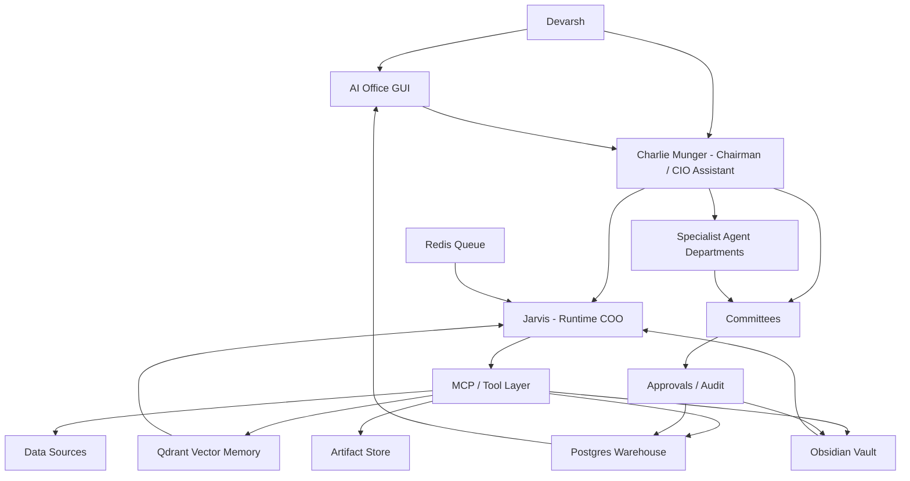

# AI Investment OS - Institutional Master Blueprint v7.0

Date: 2026-07-06
Owner: Devarsh
Primary assistant: Charlie Munger
Runtime operator: Jarvis
Canonical checklist: [[AI Investment OS - Execution Checklist v7.0]]
Supersedes: [[AI Investment OS - Master Blueprint v6.0]]
Permanent memory: Obsidian
Structured source of truth: Postgres / Timescale-style warehouse
Semantic memory: Qdrant
Queue/cache: Redis
Runtime workspace: `_ai_os_runtime`

## 1. North Star

Build a private AI-native investment operating system: a hedge fund office, portfolio manager, Bloomberg-style terminal, research factory, strategy lab, trading desk, risk office, client reporting engine, and live AI office GUI in one local-first platform.

This is not a chatbot and not only a trading dashboard. It is an operating system for investment work.

The system must help Devarsh answer, every day:

- What do we own?
- Why do we own it?
- Which book owns each exposure?
- What changed today?
- What is stale, missing, or wrong?
- Which filings, news, prices, signals, and client positions need attention?
- Which ideas deserve research?
- Which strategies deserve testing, paper monitoring, scaling, or retirement?
- Which risks are building?
- Which actions require human approval?
- What should Charlie challenge before any decision is made?

## 2. Non-Negotiable Principles

1. No fake live data in production dashboards.
2. Seed/demo data must be isolated and labeled.
3. Obsidian is the durable human-readable memory.
4. Postgres is the structured operating source of truth.
5. Qdrant is retrieval memory, not accounting truth.
6. Every position has a book.
7. Every position has a purpose.
8. Every position has an owner, horizon, thesis/setup, source, and exit logic.
9. Long-Term, Tactical, Quant, and Active Trading books are independent decision engines.
10. Opposing exposures are allowed only when purpose and risk are explicit.
11. Portfolio Intelligence must aggregate gross, net, book, client, strategy, symbol, sector, factor, and risk exposure.
12. Risk Office can challenge or block every action.
13. Capital Allocation Office sits above all books.
14. Charlie is the chairman, challenger, and main user-facing assistant.
15. Jarvis is the runtime COO that executes approved tool calls and writes approved outputs.
16. Specialist agents own specialist work.
17. Agents communicate through durable inbox, task, run, message, approval, comment, and artifact objects.
18. Any material claim must cite a source, command, dataset, note, or live check.
19. Broker execution remains gated until read-only data, risk, approval, kill switch, and audit flows are proven.
20. Human remains in control.

## 3. System Shape

## 4. Interaction Model

### 4.1 Main Interaction

Devarsh talks to Charlie.

Charlie must:

- understand intent,
- retrieve memory,
- decide which specialists are needed,
- ask Jarvis to execute controlled tool calls,
- challenge assumptions,
- surface missing data,
- request approval when needed,
- write the final output to Obsidian when appropriate.

Jarvis must:

- query Postgres,
- retrieve Qdrant context,
- read and write Obsidian notes through approved paths,
- call MCP tools,
- create agent tasks and inbox items,
- update dashboard widgets,
- log tool runs and evidence,
- never silently execute money-moving actions.

### 4.2 Ways To Give Work

Supported work entry points:

- natural language command to Charlie,
- task card in AI Office GUI,
- Obsidian request note,
- scheduled workflow,
- TradingView or strategy signal trigger,
- broker/data import trigger,
- Codex engineering escalation.

Every task should resolve into:

- owner agent,
- objective,
- inputs,
- tools,
- evidence,
- output artifact,
- approval level,
- status,
- next action.

## 5. Operating Surfaces

### 5.1 Required Main GUI Views

- Command Center
- Charlie Chat
- Agent Inbox
- Approval Center
- Portfolio Intelligence
- Client Folios
- Symbol Intelligence
- Long-Term Office
- Tactical Office
- Quant Lab
- Active Trading Desk
- Strategy Monitor
- Research Factory
- News and Filings
- Special Situations
- Risk Center
- Capital Allocation
- Reports
- Model Runtime
- Data Sources
- System Health
- Live AI Office

### 5.2 Live AI Office

The live AI office is not decoration. It must mirror real database state.

It must show:

- rooms for departments,
- employee avatars,
- active task per employee,
- agent status,
- unread inbox count,
- running model route,
- tool permission badge,
- active run badge,
- evidence/source badge,
- handoff arrows between agents,
- committee room,
- approval board,
- live activity feed,
- risk alerts,
- click-through to task, run, note, source, and output.

Departments:

- Executive Office
- Portfolio Office
- Long-Term Research
- Tactical Desk
- Quant Lab
- Active Trading Desk
- Research Factory
- News and Filings Desk
- Special Situations Desk
- Risk Office
- Capital Allocation Office
- Client Office
- Data Engineering
- AI Engineering
- Software Engineering
- Automation and Integrations
- Knowledge Division
- Finance and Administration

## 6. Data Spine

### 6.1 Internal Sources

- p2cursor client databases,
- p2cursor buy/sell dates,
- p2cursor current holdings,
- old algo trading databases,
- historical equity curves,
- historical price data,
- strategy records,
- broker Excel/PDF exports,
- old 2018-19 trade journals,
- current transaction reports,
- client holding statements,
- old Codex outputs,
- old Claude/Cowork outputs,
- manual holdings,
- manual trades,
- manual research notes.

### 6.2 Market And Broker Sources

- Zerodha/Kite read-only connector,
- Dhan read-only connector,
- TradingView browser controller,
- TradingView scanner/quotes,
- TradingView webhooks,
- OpenAlgo read-only bridge,
- daily OHLCV,
- intraday OHLCV,
- futures data,
- options chain,
- open interest,
- implied volatility,
- Greeks,
- futures basis,
- volatility indexes,
- crypto exchange connector,
- gold, silver, Bitcoin, Ethereum, and selected commodities.

### 6.3 Research Sources

- NSE announcements,
- BSE announcements,
- annual reports,
- quarterly results,
- investor presentations,
- concall transcripts,
- credit rating notes,
- corporate actions,
- buybacks,
- demergers,
- reverse mergers,
- mergers,
- delistings,
- rights issues,
- preferential issues,
- global news,
- India business news,
- Twitter/X/social signals,
- broker reports where legally available,
- Fincept components,
- Vibe-Trading workflow references,
- OpenAlgo workflow references.

### 6.4 Required Schemas

- `core`: clients, accounts, instruments, source registry, connector registry, import runs.
- `portfolio`: holdings, transactions, prices, snapshots, mark-to-market, reconciliation.
- `books`: investment books, book positions, purposes, theses, exit criteria, conflicts.
- `strategy`: ideas, candidates, rules, datasets, backtests, optimization, validation, paper/live state.
- `research`: ideas, filings, transcripts, news, reports, valuations, catalysts, special situations.
- `trading`: manual trades, paper trades, alerts, order intents, execution tickets, post-trade reviews.
- `risk`: limits, breaches, approvals, stress tests, kill switches, exposure checks.
- `agent`: employees, departments, skills, messages, tasks, runs, approvals, model routes.
- `ops`: widgets, health checks, freshness checks, imports, costs, system status.
- `audit`: immutable logs for imports, edits, decisions, model calls, approvals, and tool calls.

### 6.5 Row-Level Data Contract

Every important row must carry:

- source system,
- source path/URL/API,
- import run ID,
- ingest timestamp,
- source freshness timestamp,
- raw artifact reference,
- normalized row reference,
- parser version,
- AI confidence score if AI parsed,
- reconciliation state,
- human override state,
- last verified timestamp.

## 7. Portfolio Book Architecture

### 7.1 Books

Core books:

1. Long-Term Investing
2. Tactical Investing
3. Quantitative Strategies
4. Active Trading
5. Cash/Treasury
6. Hedges

Optional future books:

- Special Situations
- Options Income
- Crypto/Commodity Macro
- Client-Specific Mandates
- Experimental Research

### 7.2 Position Object

Every position must store:

- client,
- account,
- instrument,
- symbol,
- book,
- sub-book,
- direction,
- quantity,
- notional,
- cost basis,
- current value,
- realized P&L,
- unrealized P&L,
- purpose,
- owner,
- time horizon,
- thesis/setup,
- entry reason,
- exit criteria,
- stop/target/time exit where relevant,
- review frequency,
- source,
- approval state,
- risk budget consumed,
- capital budget consumed,
- linked research notes,
- linked strategy,
- linked committee decision,
- linked tasks.

### 7.3 Opposing Exposures

The system must allow the same symbol to appear in multiple books with different purposes.

Example:

| Book | Direction | Exposure | Purpose | Horizon | Owner |
| --- | ---: | ---: | --- | --- | --- |
| Long-Term | Long | INR 20L | Core compounder | 5-10 years | Long-Term Office |
| Tactical | Flat | INR 0 | No event view | Days-months | Tactical Office |
| Quant | Short | INR 3L | Mean reversion | 5 days | Quant Lab |
| Active Trading | Short | INR 2L | Pre-earnings trade | Intraday-days | Trading Desk |

Portfolio Intelligence must summarize:

- gross long,
- gross short,
- net exposure,
- book exposure,
- strategy exposure,
- client exposure,
- hedge ratio,
- offset cost,
- whether offsetting is intentional,
- risk budget used,
- capital budget used,
- thesis state,
- committee state.

Risk Office must flag:

- accidental offsetting,
- near-total offset of a core holding,
- hidden leverage,
- excessive churn,
- concentration breaches,
- client suitability conflicts,
- liquidity or margin concerns.

## 8. Portfolio Intelligence Engine

Required calculations:

- holdings,
- transactions,
- manual trades,
- paper trades,
- average cost,
- market value,
- realized P&L,
- unrealized P&L,
- gross exposure,
- net exposure,
- book exposure,
- strategy exposure,
- purpose exposure,
- client/account exposure,
- sector exposure,
- factor exposure,
- beta,
- volatility,
- drawdown,
- VaR,
- expected shortfall,
- stress loss,
- liquidity risk,
- concentration,
- hedge ratio,
- risk budget used,
- capital budget used,
- performance attribution,
- book attribution,
- strategy attribution,
- decision attribution.

Required drilldowns:

- executive portfolio,
- client folio,
- account,
- symbol,
- book,
- strategy,
- sector,
- factor,
- position history,
- thesis history,
- trade history,
- committee history.

## 9. Long-Term Investing Office

Purpose: own exceptional businesses for years and compound capital through ownership.

Horizon: 3-15 years.

### 9.1 Long-Term Checklist

Business model:

- business model clarity,
- segment economics,
- revenue drivers,
- pricing power,
- unit economics,
- operating leverage,
- customer concentration,
- cyclicality,
- scalability,
- reinvestment runway,
- commodity exposure,
- export/domestic mix,
- margin drivers,
- key operating KPIs.

Industry:

- market size,
- growth runway,
- industry structure,
- competitive intensity,
- customer power,
- supplier power,
- substitutes,
- regulation,
- disruption risk,
- profit pool share,
- consolidation,
- import/export dynamics,
- global supply risk,
- cycle position.

Moat:

- brand,
- switching costs,
- network effects,
- cost advantage,
- distribution advantage,
- scale economics,
- asset advantage,
- license/regulatory advantage,
- technology/process advantage,
- ROIC durability,
- margin durability,
- evidence moat is widening or narrowing.

Management and governance:

- promoter quality,
- capital allocation record,
- related-party transactions,
- remuneration,
- pledging,
- acquisitions,
- buybacks/dividends,
- minority shareholder treatment,
- board quality,
- auditor quality,
- incentives,
- insider buying/selling,
- communication quality,
- succession risk,
- governance controversy history.

Financial quality:

- revenue quality,
- margin bridge,
- cash conversion,
- operating cash flow vs PAT,
- free cash flow,
- working capital,
- inventory quality,
- receivables quality,
- debt maturity,
- liquidity stress,
- contingent liabilities,
- auditor notes,
- tax rate quality,
- capex quality,
- accounting changes.

Forensic accounting:

- cash flow mismatch,
- receivables spike,
- inventory build,
- hidden debt through subsidiaries,
- aggressive revenue recognition,
- unusual other income,
- related-party leakage,
- auditor churn,
- promoter pledge changes,
- repeated one-offs,
- capital work-in-progress issues,
- contingent liabilities,
- subsidiary complexity.

Valuation:

- owner earnings,
- DCF,
- reverse DCF,
- peer comparison,
- historical valuation,
- PE,
- EV/EBITDA,
- EV/Sales,
- FCF yield,
- sum-of-parts,
- replacement value where relevant,
- bull/base/bear scenarios,
- expected CAGR,
- downside case,
- margin of safety,
- valuation sensitivity,
- key assumption table,
- current price context,
- no fabricated fair value without sufficient source data.

Risk and exit:

- thesis killers,
- management deterioration,
- moat deterioration,
- accounting concern,
- capital allocation deterioration,
- valuation extreme,
- better opportunity,
- permanent impairment risk,
- concentration risk,
- client suitability,
- review frequency,
- sell discipline,
- liquidity risk,
- event risk,
- cross-book conflict risk.

### 9.2 Long-Term Monte Carlo

The Monte Carlo engine must simulate:

- revenue growth distribution,
- margin distribution,
- reinvestment rate distribution,
- terminal multiple distribution,
- drawdown path,
- dilution/buyback assumptions,
- debt/capital structure scenarios,
- probability of negative CAGR,
- probability of permanent capital loss,
- expected CAGR distribution,
- downside percentile outcomes,
- base/bull/bear probability weights,
- sensitivity to starting valuation,
- sensitivity to margin compression,
- sensitivity to revenue slowdown.

Outputs:

- assumptions table,
- path distribution,
- expected CAGR range,
- probability of loss,
- worst percentile cases,
- sensitivity table,
- committee-ready memo,
- confidence and missing-data flags.

### 9.3 Long-Term Agents

- Long-Term Portfolio Manager: owns long-term book and review cadence.
- Company Analyst: owns company memo and business quality.
- Industry Analyst: owns industry structure and competitive forces.
- Management Analyst: owns promoter, governance, and incentives.
- Financial Statement Analyst: owns accounts, cash flow, debt, and quality.
- Forensic Accounting Agent: finds accounting red flags.
- Valuation Agent: builds valuation ranges and expected CAGR.
- Filings and Transcript Analyst: extracts evidence from filings and calls.
- Bear Case Agent: argues against the investment.
- Quality Score Agent: scores moat, management, reinvestment, and durability.
- Portfolio Fit Agent: checks client/book/sector/concentration fit.
- Risk Reviewer: checks downside, liquidity, concentration, and suitability.

### 9.4 Long-Term Committee

Members:

- Charlie Munger, chair.
- Long-Term Portfolio Manager.
- Company Analyst.
- Industry Analyst.
- Management Analyst.
- Financial Statement Analyst.
- Forensic Accounting Agent.
- Valuation Agent.
- Bear Case Agent.
- Portfolio Fit Agent.
- Risk Agent.
- Capital Allocation Officer.
- Devarsh for final human decision.

Committee flow:

1. Research packet created.
2. Official sources registered.
3. Source text extracted.
4. Checklist modules completed.
5. Analyst memos attached.
6. Valuation memo attached.
7. Monte Carlo memo attached.
8. Bear case attached.
9. Risk review attached.
10. Portfolio fit attached.
11. Charlie asks unresolved questions.
12. Committee decision recorded.
13. Human approval required before buy/sell action.

Decision states:

- needs_data,
- under_research,
- watchlist,
- approved_buy,
- approved_hold,
- approved_add,
- approved_trim,
- approved_sell,
- rejected,
- monitor_only.

Required outputs:

- thesis memo,
- source register,
- source extraction note,
- checklist scorecard,
- valuation memo,
- Monte Carlo memo,
- bear case,
- risk memo,
- portfolio fit memo,
- committee minutes,
- decision log,
- next review task.

## 10. Tactical Investing Office

Purpose: capture medium-term opportunities from catalysts, events, sector moves, valuation gaps, macro shifts, hedges, and portfolio overlays.

Horizon: days to months.

Required checks:

- catalyst identification,
- event date,
- expected path,
- risk/reward,
- stop/target/time exit,
- position sizing,
- Long-Term overlap,
- hedge vs independent alpha flag,
- liquidity,
- options overlay,
- news sensitivity,
- expected holding period,
- invalidation trigger,
- portfolio conflict,
- client suitability.

Agents:

- Tactical Portfolio Manager.
- Catalyst Analyst.
- Event Analyst.
- Technical Analyst.
- Macro Analyst.
- Sentiment Analyst.
- Options Overlay Agent.
- Sector Rotation Agent.
- Risk Reviewer.

Committee:

- Tactical Committee decides whether the idea is a hedge, independent alpha trade, or portfolio-management action.

## 11. Quantitative Strategies Office

Purpose: create, test, validate, allocate, monitor, and retire systematic strategies.

Lifecycle:

1. Idea intake.
2. Hypothesis statement.
3. Dataset definition.
4. Data-quality check.
5. Rule definition / DSL.
6. Backtest.
7. Cost/slippage model.
8. Train/test split.
9. Walk-forward diagnostics.
10. Parameter sensitivity.
11. Optimizer.
12. Monte Carlo/bootstrap.
13. Regime split.
14. Factor attribution.
15. Correlation to existing strategies.
16. Capacity/liquidity estimate.
17. Model validation.
18. Strategy committee.
19. Paper monitor.
20. Drift monitor.
21. Limited-live approval.
22. Kill-switch monitor.
23. Postmortem and retirement.

Diagnostics:

- CAGR,
- Sharpe,
- Sortino,
- Calmar,
- max drawdown,
- win rate,
- payoff ratio,
- average trade,
- trade count,
- exposure time,
- turnover,
- slippage sensitivity,
- fee sensitivity,
- parameter stability,
- walk-forward stability,
- drawdown clustering,
- tail loss,
- Monte Carlo path distribution,
- probability of ruin,
- capacity estimate,
- regime robustness.

Agents:

- Strategy Research Agent.
- Strategy Generator.
- Strategy Intake Agent.
- Data Scientist.
- Feature Engineer.
- Backtesting Engineer.
- Optimizer Agent.
- Model Validation Agent.
- Regime Analyst.
- Capacity/Liquidity Analyst.
- Strategy Committee Secretary.
- Risk Reviewer.

## 12. Active Trading Desk

Purpose: intraday/swing execution, discretionary setups, options/futures trades, and live market response.

Required workflows:

- manual trade entry,
- paper trade entry,
- setup classification,
- stop/target/time exit,
- options payoff,
- IV/OI dashboard,
- straddle/strangle analysis,
- TradingView chart control,
- TradingView screenshot artifact capture,
- TradingView alert requests,
- trade journal,
- post-trade review,
- overnight risk check,
- execution safety gate,
- no live order without approval.

Agents:

- Trading Desk Agent.
- Technical Analyst.
- Options Analyst.
- Futures Analyst.
- Volatility Agent.
- Market Microstructure Agent.
- Trade Journal Coach.
- Execution Safety Agent.

## 13. Research Factory And Special Situations

Purpose: continuously collect, classify, analyze, and route market and corporate information.

Pipelines:

- NSE filing collector,
- BSE filing collector,
- filing PDF parser,
- annual report parser,
- transcript ingestion,
- news collector,
- Twitter/X/social triage,
- corporate action classifier,
- buyback detector,
- delisting detector,
- demerger detector,
- reverse merger detector,
- merger detector,
- preferential issue detector,
- rights issue detector,
- arbitrage spread tracker,
- special situation memo generator,
- idea intake,
- research queue,
- committee routing.

Agents:

- Research Director.
- News Analyst.
- Filings Analyst.
- Special Situations Analyst.
- Corporate Actions Analyst.
- Arbitrage Analyst.
- Industry Researcher.
- Research Librarian.

Special-situation checks:

- event type,
- record date,
- entitlement,
- consideration,
- spread,
- liquidity,
- regulatory approval,
- promoter intent,
- timeline,
- downside if event fails,
- capital lockup,
- tax/friction,
- committee decision.

## 14. Capital Allocation Office

Purpose: decide how much capital each book, client, strategy, and opportunity can use.

Required outputs:

- target capital by book,
- actual capital by book,
- drift from target,
- risk budget by book,
- drawdown by book,
- leverage by book,
- liquidity by book,
- client concentration,
- strategy concentration,
- rebalance suggestions,
- capital approval memo.

Agents:

- Capital Allocation Officer.
- Portfolio Optimizer.
- Performance Attribution Analyst.
- Client Suitability Analyst.

## 15. Risk Office

Purpose: protect capital, prevent unforced errors, and enforce limits.

Risk checks:

- position concentration,
- client concentration,
- sector concentration,
- factor exposure,
- liquidity risk,
- drawdown risk,
- VaR,
- expected shortfall,
- stress tests,
- portfolio Monte Carlo,
- strategy correlation,
- book conflicts,
- leverage,
- margin,
- overnight risk,
- options tail risk,
- data-quality risk,
- model risk,
- operational risk.

Risk authority:

- can block limited-live strategy activation,
- can block broker execution,
- can require more data,
- can escalate to Charlie,
- can require human approval,
- must log every override.

Agents:

- Chief Risk Officer.
- Quant Risk Analyst.
- Stress Testing Agent.
- Model Risk Agent.
- Data Quality Risk Agent.
- Compliance/Audit Agent.

## 16. Client Office

Purpose: make the system useful for real client folios, reports, and decisions.

Required capabilities:

- client onboarding,
- account mapping,
- holdings import,
- transaction import,
- current holdings update by Devarsh,
- client-level book exposure,
- client-level thesis gaps,
- suitability checks,
- monthly report,
- performance report,
- portfolio change report,
- missing-data report,
- client-ready explanation of decisions.

Agents:

- Client Manager.
- Reporting Analyst.
- Performance Reporter.
- Onboarding Agent.
- Communication Agent.

## 17. Committees

### 17.1 Executive Committee

Chair: Charlie Munger.

Scope:

- system direction,
- roadmap priorities,
- unresolved conflicts,
- capital allocation conflicts,
- high-impact decisions.

### 17.2 Long-Term Investment Committee

Scope:

- long-term buy/hold/add/trim/sell decisions,
- thesis quality,
- valuation,
- Monte Carlo,
- bear case,
- portfolio fit,
- client suitability.

### 17.3 Tactical Committee

Scope:

- catalyst trades,
- event-driven trades,
- portfolio overlays,
- hedges,
- time-boxed discretionary ideas.

### 17.4 Strategy Committee

Scope:

- strategy candidates,
- backtests,
- optimizers,
- paper monitoring,
- limited-live requests,
- retirement.

### 17.5 Risk Committee

Scope:

- risk limits,
- breaches,
- kill switches,
- model risk,
- data quality risk,
- overrides.

### 17.6 Capital Allocation Committee

Scope:

- capital by book,
- risk budget by book,
- strategy allocation,
- client allocation,
- concentration and drift.

### 17.7 Data And Tool Committee

Scope:

- data source freshness,
- MCP/tool permissions,
- connector safety,
- scraping quality,
- model endpoint quality,
- system reliability.

## 18. Agent Communication Architecture

Agents communicate through:

- `agent.messages`
- `agent.inbox_items`
- `agent.tasks`
- `agent.runs`
- `agent.approvals`
- `agent.comments`
- `agent.output_artifacts`
- Obsidian output notes

Required message types:

- request,
- handoff,
- question,
- evidence,
- finding,
- risk,
- approval_request,
- decision,
- blocked,
- completed.

Required task states:

- drafted,
- queued,
- in_progress,
- waiting_for_data,
- waiting_for_human,
- review_required,
- approved,
- rejected,
- completed,
- blocked,
- archived.

Every agent output must include:

- task ID,
- run ID,
- owner,
- tools used,
- sources used,
- assumptions,
- freshness,
- result,
- confidence,
- next action.

## 19. MCP And Tool Layer

Required MCP/tool categories:

- Obsidian read/write,
- Postgres query/write through approved APIs,
- Qdrant retrieval,
- browser controller,
- TradingView controller,
- TradingView screenshot/artifact capture,
- TradingView alert request workflow,
- NSE/BSE filing scraper,
- news scraper,
- Twitter/X collector or browser workflow,
- document/PDF parser,
- Excel/CSV importer,
- p2cursor extractor,
- old algo DB extractor,
- broker read-only connectors,
- crypto/commodity read-only connectors,
- report generator,
- dashboard/widget updater,
- Fincept bridge,
- OpenAlgo read-only bridge,
- Vibe workflow reference adapter.

Tool safety levels:

- read_only,
- write_note,
- write_db,
- external_browser_action,
- client_record_change,
- strategy_state_change,
- order_preview,
- broker_execution.

Only the first four can be broadly available. The last four require explicit approval and audit.

## 20. External Component Strategy

Fincept:

- use as a local component library for terminal-style screens, financial analytics, report patterns, news/RSS patterns, portfolio monitor patterns, options/IV/OI ideas, and dashboard concepts,
- bridge useful functions into our stack,
- do not make Fincept the source of truth.

Vibe-Trading:

- use for agentic trading workflow ideas,
- adapt only after enforcing paper-first, risk-gated, auditable workflows.

OpenAlgo:

- use as a reference for broker integration and strategy control,
- start read-only,
- never enable live broker execution without order preview, approval, kill switch, and audit.

TradingView:

- use for charts, layouts, screenshots, visual verification, alert requests, and user-directed browser tasks,
- store every chart action and screenshot as an artifact.

p2cursor and old algo systems:

- use as legacy data and component sources,
- extract client buy/sell dates, strategy history, charts, and performance records,
- reconcile into warehouse before dashboards trust them.

## 21. Model Strategy

### 21.1 Local First

Local/open-source models handle cheap daily work:

- Jarvis intake,
- task routing,
- dashboard summaries,
- source retrieval summaries,
- daily briefs,
- trade journal tagging,
- first-pass news triage,
- first-pass filing extraction,
- agent status updates.

### 21.2 Stronger Local Models

Use stronger local/MLX/Ollama routes for:

- research draft synthesis,
- strategy idea drafting,
- source summarization,
- checklist scoring,
- local coding assistance where feasible.

### 21.3 Cloud Escalation

Cloud/frontier models are used selectively:

- complex investment memos,
- long-document reasoning,
- hard code changes,
- deep strategy generation,
- final committee synthesis,
- high-stakes client reports.

Controls:

- per-agent model route,
- per-workflow cost cap,
- cloud escalation approval,
- model-call ledger,
- caching,
- quality evaluation set.

## 22. Production Safety

Live execution can only happen after:

1. read-only broker connector verified,
2. symbol/account mapping verified,
3. risk limits verified,
4. position sizing verified,
5. approval workflow verified,
6. order preview verified,
7. kill switch verified,
8. audit log verified,
9. paper/live drift monitor verified,
10. Devarsh explicitly approves.

Before that point, the system may:

- recommend,
- monitor,
- paper trade,
- prepare order tickets,
- create alerts,
- produce reports.

It may not silently place live orders.

## 23. Build Phases

Phase 1: Foundation Runtime

- external SSD runtime,
- Docker services,
- Postgres,
- Redis,
- Qdrant,
- API,
- UI shell,
- vault writeback,
- MCP foundation,
- health checks.

Phase 2: Data Spine

- clients,
- accounts,
- holdings,
- transactions,
- p2cursor extraction,
- old algo DB import,
- source registry,
- artifact store,
- reconciliation.

Phase 3: Portfolio Brain

- books,
- purposes,
- position theses,
- exit criteria,
- gross/net exposure,
- client folio view,
- symbol intelligence,
- cross-book conflicts.

Phase 4: Long-Term Office

- source acquisition,
- source extraction,
- checklist scoring,
- valuation,
- bear case,
- portfolio fit,
- risk review,
- Monte Carlo,
- committee decision.

Phase 5: Research Factory

- filings,
- transcripts,
- news,
- corporate actions,
- special situations,
- arbitrage spreads,
- idea queue.

Phase 6: Quant Lab

- strategy intake,
- DSL/rule parser,
- backtest,
- optimizer,
- walk-forward,
- Monte Carlo,
- validation,
- paper monitor,
- kill switch.

Phase 7: Trading Desk

- manual/paper trade logging,
- TradingView controller,
- options/futures analytics,
- trade journal,
- post-trade review,
- alerts.

Phase 8: Risk And Capital Allocation

- limits,
- VaR/ES,
- stress tests,
- portfolio Monte Carlo,
- risk budget,
- capital budget,
- approval board.

Phase 9: Full AI Office Product

- live animated office,
- agent profiles,
- mailboxes,
- committee rooms,
- report center,
- client-ready exports,
- model/cost operations,
- backup/restore,
- production hardening.

## 24. Whole-System Definition Of Done

The system is done when:

- Devarsh can talk to Charlie and trigger auditable workflows.
- Jarvis can call approved tools, write outputs, and update dashboards.
- Every client, holding, transaction, trade, strategy, source, and report is traceable.
- Every position has book, purpose, owner, horizon, thesis/setup, and exit logic.
- Portfolio Intelligence shows gross/net/book/strategy/client/risk exposure.
- Symbol Intelligence explains why each exposure exists.
- Long-Term Office can produce complete thesis, valuation, bear case, Monte Carlo, and review memos.
- Research Factory can ingest filings/news and create special-situation ideas.
- Quant Lab can intake, backtest, optimize, validate, paper-monitor, and committee-review strategies.
- Trading Desk can log manual/paper trades and control TradingView tasks.
- Risk Office can block unsafe actions.
- Capital Allocation can allocate capital across books and detect conflicts.
- Agent Office shows real tasks, inbox, runs, messages, model routes, outputs, and approvals.
- Reports can be generated from source-backed data.
- Live execution remains human-approved and audit-logged.

