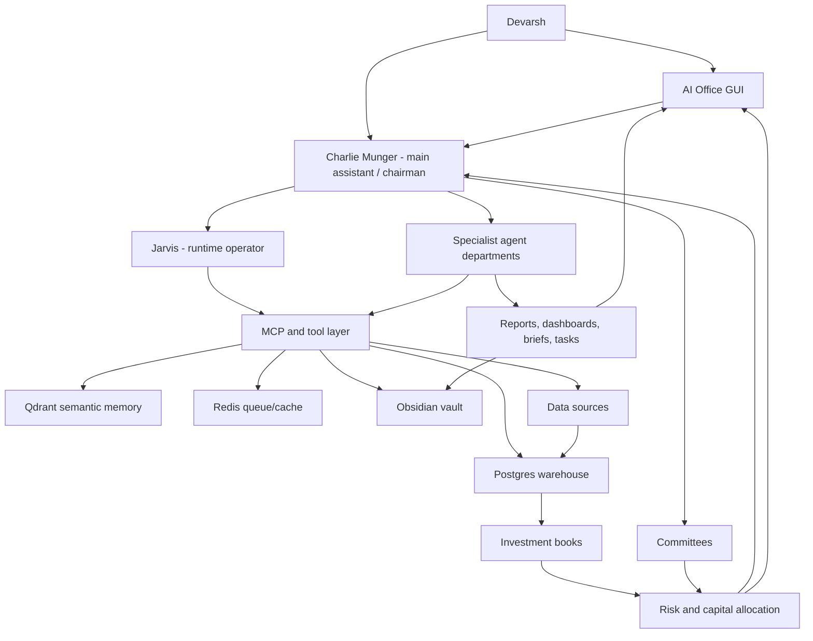

# AI Investment OS - Institutional Master Blueprint v8.0

Date: 2026-07-06
Owner: Devarsh
Canonical checklist: [[AI Investment OS - Execution Checklist v8.0]]
Primary user interface: AI Office GUI plus Charlie conversation
Main assistant: Charlie Munger
Runtime operator: Jarvis
Permanent memory: Obsidian vault
Structured source of truth: Postgres / Timescale-style warehouse
Semantic memory: Qdrant
Queue/cache: Redis
Runtime workspace: `_ai_os_runtime`
Status: canonical master specification before next implementation phase

## 1. North Star

Build a complete AI Investment Operating System: a smarter Bloomberg, an AI hedge fund office, a portfolio manager, a research factory, a quant lab, a trading desk, a client folio system, a risk office, and an animated live AI workplace in one system.

The platform must not be only a chatbot, note vault, backtester, broker terminal, dashboard, or set of agents. It must be the operating system for managing capital, research, evidence, positions, strategies, risks, approvals, reports, and institutional memory.

The end state:

- Devarsh talks to Charlie Munger for work intake, judgement, challenge, and final synthesis.
- Jarvis executes tool calls, data retrieval, writeback, dashboard refreshes, agent routing, and audit logging.
- Specialist agents act like an investment firm staff with departments, roles, inboxes, outputs, model routes, permissions, and task state.
- Every investment exposure is stored by book, purpose, owner, horizon, thesis or setup, exit logic, source, and approval status.
- Long-Term, Tactical, Quant, and Active Trading books can hold opposite views on the same symbol without corrupting each other's logic.
- Capital Allocation and Risk sit above all books and can challenge, reduce, block, or escalate actions.
- Research, filings, news, social data, broker exports, p2cursor, legacy algo systems, TradingView, Fincept, OpenAlgo, Vibe-Trading, Codex outputs, Claude/Cowork outputs, and manual trade notes all feed the same warehouse and memory layer.
- The AI Office GUI shows live portfolio intelligence, client folios, symbol intelligence, research queues, strategy state, risk limits, agent activity, committee rooms, approvals, and eventually a graphical office view with employees working live.
- Local/open-source models handle cheap daily work; cloud/frontier models are reserved for hard reasoning, large documents, committees, and approved escalation.
- No live broker execution is allowed until read-only data, risk checks, order preview, human approval, audit trail, and kill switches are proven.

## 2. Non-Negotiable Principles

1. Human remains in control.
2. No fake production data.
3. Seed/demo data must be isolated and labeled.
4. Every position belongs to an explicit book.
5. Every position has a purpose.
6. Every position has owner, horizon, thesis/setup, exit criteria, evidence, and review cadence.
7. Long-term ownership is not invalidated by short-term bearish signals.
8. Quant trades are judged by tested rules, not discretionary conviction.
9. Active trades are judged independently from long-term investments.
10. Tactical trades must say whether they are hedges, independent alpha, or position-management actions.
11. Portfolio Intelligence must aggregate gross, net, book, strategy, client, sector, factor, liquidity, and risk exposure.
12. Capital Allocation Office sits above all books.
13. Risk Office can challenge or block every action.
14. No major decision can live only in chat.
15. Agents communicate through durable inbox, task, message, run, comment, approval, committee, and artifact records.
16. Obsidian is durable memory.
17. Postgres is the structured source of truth.
18. Qdrant is semantic retrieval memory, not accounting.
19. Every important claim needs source, freshness, lineage, and confidence.
20. External repos are components or references, not the core source of truth.
21. Repeated technical errors must be researched before further trial-and-error.
22. Local-first and cost-aware by default.
23. Cloud models require routing policy, cost ledger, and approval for expensive work.
24. Live execution remains blocked until safety gates are complete.

## 3. High-Level Architecture

## 4. Operating Surfaces

### 4.1 Charlie Conversation

Charlie is the main interaction layer. Devarsh should be able to say:

- "Review Tushit's folio and tell me what changed."
- "Add this Reliance buy to the Long-Term book with purpose Core Compounder."
- "Create a tactical hedge against this long-term position."
- "Run Monte Carlo on this thesis and send it to committee."
- "Open NIFTY, BANKNIFTY, VIX, and option straddle charts in TradingView."
- "Scan NSE/BSE filings for buybacks, demergers, reverse mergers, delistings, and preferential issues."
- "Generate strategy ideas from my old journals."
- "Backtest this intraday strategy, optimize it, and put it through the Strategy Committee."
- "Make a client-ready monthly portfolio report."

Charlie must respond with:

- conclusion,
- evidence used,
- source freshness,
- agents consulted,
- missing data,
- risks,
- dashboard/widgets updated,
- notes or reports written,
- approvals required,
- next recommended action.

### 4.2 Jarvis Runtime

Jarvis translates Charlie's intent into controlled runtime actions:

- query Postgres,
- retrieve Qdrant context,
- read/write Obsidian,
- call MCP tools,
- run ingestion/backtest/report scripts,
- control browser and TradingView where allowed,
- create agent tasks,
- refresh dashboard widgets,
- write audit logs,
- request approval for sensitive actions.

Jarvis is the operator. Charlie is the judgement layer.

### 4.3 AI Office GUI

Required views:

- Command Center
- Charlie Chat
- Portfolio Intelligence
- Client Folios
- Symbol Intelligence
- Long-Term Office
- Tactical Office
- Quant Lab
- Active Trading Desk
- Research Factory
- News and Filings
- Special Situations
- Risk Center
- Capital Allocation
- Model Runtime
- Agent Inbox
- Committee Room
- Approval Board
- Reports Library
- Live AI Office

### 4.4 Live AI Office

The live AI office is not decoration. It is a visual operating surface.

Required features:

- departments shown as rooms,
- agents shown as employees,
- hover cards with role, current work, model route, inbox, active task, last output, risk status, and cost status,
- task arrows between agents,
- committee rooms,
- approval desk,
- alert wall,
- live activity feed,
- click-through profile pages,
- graphical/animated version after data-backed room grid is stable.

## 5. Data Spine

### 5.1 Internal Sources

- p2cursor databases and files,
- old algo trading system databases,
- broker exports,
- trade history spreadsheets,
- old trade journals,
- manually entered trades,
- paper trades,
- client holdings,
- client transactions,
- Codex outputs,
- Claude/Cowork outputs,
- Obsidian research notes,
- PDF reports,
- Excel/CSV files,
- screenshots and chart artifacts.

### 5.2 Live And Market Sources

- Zerodha read-only connector,
- Dhan read-only connector,
- TradingView browser/CDP controller,
- NSE/BSE filings and announcements,
- corporate actions,
- daily OHLCV,
- intraday OHLCV,
- options chain, OI, IV, Greeks,
- futures basis and rollover,
- VIX and volatility data,
- crypto exchange read-only data,
- gold/silver/commodity data,
- macro data,
- sector/index constituents,
- news,
- Twitter/X and social triage where policy and access allow.

### 5.3 External Component Strategy

Fincept:

- Use as a component library and reference for terminal flows, datahub ideas, analytics wrappers, agentic research, news/RSS, options/IV/OI, report builder, and market data connectors.
- Do not make it the source of truth.
- Bridge selected useful flows into our Postgres/API/MCP stack.

OpenAlgo:

- Use as read-only bridge and design reference for broker/orderflow/OKF-style strategy workflows.
- Live execution remains disabled until our safety constitution is complete.

Vibe-Trading:

- Use as a workflow reference for idea generation, agentic research loops, strategy reasoning, and human-in-the-loop trading workflows.
- Extract useful patterns; do not hand over authority.

TradingView MCP/controller:

- Use for opening charts, layouts, watchlists, screenshots, visual checks, action templates, straddle/strangle workflows, and alert request preparation.
- Any alert/order-affecting change must be human-gated.

## 6. Storage Contract

All heavy runtime state stays on external SSD under `_ai_os_runtime`:

- Docker volumes,
- Postgres data,
- Redis data,
- Qdrant data,
- imported artifacts,
- generated reports,
- screenshots,
- browser profiles,
- logs,
- backtest artifacts,
- model caches where practical.

Obsidian stores durable memory and human-readable outputs, not raw high-volume data dumps.

## 7. Portfolio Book Architecture

### 7.1 Core Books

1. Long-Term Investing
   - Horizon: 3-15 years
   - Objective: quality compounding, wealth building, client long-term holdings
   - Owner: Long-Term Office

2. Tactical Investing
   - Horizon: days to months
   - Objective: events, catalysts, sector rotation, macro, earnings, temporary opportunities
   - Owner: Tactical Office

3. Quantitative Strategies
   - Horizon: intraday to weeks
   - Objective: tested systematic alpha with repeatable rules
   - Owner: Quant Lab

4. Active Trading
   - Horizon: intraday to days
   - Objective: discretionary trading, chart setups, options trades, fast opportunities
   - Owner: Trading Desk / Devarsh

5. Cash/Treasury
   - Horizon: immediate to months
   - Objective: cash, liquid funds, idle capital, collateral, deployment readiness
   - Owner: Treasury

6. Hedges
   - Horizon: linked to exposure
   - Objective: downside protection, beta hedge, volatility hedge, event hedge
   - Owner: Risk/Capital Allocation

7. Crypto/Commodity Macro
   - Horizon: intraday to long-term
   - Objective: BTC, ETH, gold, silver, commodities, macro trades
   - Owner: Macro/Trading Desk

### 7.2 Position Object

Every position row must support:

- account/client,
- symbol/instrument,
- asset class,
- direction,
- quantity,
- average price,
- market value,
- mark-to-market,
- book,
- sub-book,
- purpose,
- owner,
- time horizon,
- thesis/setup,
- entry rationale,
- source artifact,
- source freshness,
- entry date,
- review frequency,
- exit criteria,
- stop/target/time exit where applicable,
- risk budget,
- capital budget,
- linked research,
- linked committee decision,
- linked strategy,
- linked trade journal,
- linked hedge or offset.

### 7.3 Opposing Exposures

The same symbol can exist in multiple books with different purposes.

Example:

| Book | Direction | Amount | Purpose | Horizon |
| --- | --- | ---: | --- | --- |
| Long-Term | Long | INR 20L | Core compounder | 5-10 years |
| Tactical | Flat | INR 0 | No tactical view | Days-months |
| Quant | Short | INR 3L | 5-day mean reversion | 5 days |
| Active Trading | Short | INR 2L | Pre-earnings resistance trade | Intraday-days |

Portfolio Intelligence must show:

- gross long,
- gross short,
- net exposure,
- book exposure,
- symbol exposure,
- purpose-level explanation,
- whether the offset is intended hedge or independent alpha,
- trading cost and tax impact,
- concentration impact,
- risk budget impact,
- recommended coordination question.

Risk Office flags:

- quant strategy offsetting most of a core long,
- active trade unintentionally increasing concentration,
- hedge ratio too high or too low,
- book exposure above limit,
- liquidity too thin,
- client suitability issue,
- unexplained opposite trades.

## 8. Portfolio Intelligence Engine

Required outputs:

- portfolio NAV by client/account/book,
- gross exposure,
- net exposure,
- cash and cash drag,
- long/short exposure,
- book exposure,
- sector exposure,
- factor exposure,
- symbol rollup,
- cross-book conflicts,
- strategy attribution,
- book attribution,
- client attribution,
- realized/unrealized P&L,
- dividend/corporate action tracking,
- risk budget used,
- capital budget used,
- liquidity profile,
- concentration profile,
- latest filing/news/research/tasks/committee notes per symbol.

Symbol Intelligence must answer:

- Why do we own or short this?
- Which books own it?
- Which clients hold it?
- What is the long-term thesis?
- What tactical/quant/active setups exist?
- What changed recently?
- What filings/news matter?
- What are the next review tasks?
- What would make us sell, add, hedge, or reduce?

## 9. Long-Term Investing Office

### 9.1 Long-Term Research Checklist

Business quality:

- business model clarity,
- revenue drivers,
- profit pool,
- customer concentration,
- supplier dependence,
- pricing power,
- repeat purchase behavior,
- cyclicality,
- operating leverage,
- unit economics,
- reinvestment runway,
- regulatory dependence,
- disruption risk.

Industry structure:

- market size,
- growth rate,
- industry fragmentation,
- competitor map,
- entry barriers,
- substitutes,
- bargaining power,
- capacity cycles,
- regulatory tailwinds/headwinds,
- global vs local economics.

Moat:

- brand,
- switching cost,
- network effect,
- cost advantage,
- scale advantage,
- distribution advantage,
- data advantage,
- ecosystem lock-in,
- license/regulatory advantage,
- evidence of moat in margins and returns.

Management:

- track record,
- capital allocation,
- skin in the game,
- promoter pledge,
- related party transactions,
- governance behavior,
- candor,
- execution record,
- incentive alignment,
- succession,
- treatment of minority shareholders.

Financial statement quality:

- revenue quality,
- receivable build-up,
- inventory build-up,
- working-capital behavior,
- free cash flow conversion,
- margin sustainability,
- debt maturity,
- off-balance-sheet obligations,
- contingent liabilities,
- auditor notes,
- tax rate consistency,
- related-party transactions.

Valuation:

- DCF,
- reverse DCF,
- sum-of-parts,
- peer comparison,
- historical valuation,
- owner earnings,
- earnings power value,
- bull/base/bear scenarios,
- expected CAGR,
- margin of safety,
- valuation vs quality score,
- valuation vs opportunity cost.

Risks and sell discipline:

- thesis killers,
- key monitoring variables,
- exit criteria,
- position sizing logic,
- liquidity,
- fraud/accounting risk,
- disruption risk,
- commodity/currency risk,
- governance risk,
- valuation risk,
- client suitability,
- cross-book conflict risk.

### 9.2 Long-Term Monte Carlo

The Monte Carlo engine must simulate:

- revenue growth paths,
- margin paths,
- reinvestment,
- working capital,
- terminal multiple,
- discount rate,
- dilution,
- debt/cash outcomes,
- commodity/macro sensitivities,
- bull/base/bear distributions,
- expected CAGR,
- downside probability,
- probability of permanent capital loss,
- probability of underperforming benchmark/opportunity cost,
- portfolio-level impact.

Outputs:

- percentile valuation range,
- expected return distribution,
- downside cases,
- key sensitivity drivers,
- committee-ready memo,
- chart artifacts,
- source and assumption lineage.

### 9.3 Long-Term Agents

- Long-Term Portfolio Manager: owns long-term book and review cadence.
- Company Analyst: builds company-level thesis.
- Industry Analyst: maps industry structure and competitive dynamics.
- Management Analyst: studies promoter, governance, capital allocation, and incentives.
- Financial Statement Analyst: studies accounting quality and cash conversion.
- Forensic Accounting Agent: searches for fraud/accounting red flags.
- Valuation Agent: builds DCF, reverse DCF, SOTP, peer, historical, and CAGR models.
- Bear Case Agent: argues against the investment.
- Quality Score Agent: scores moat, management, reinvestment, durability, and risk.
- Portfolio Fit Agent: checks concentration, suitability, book fit, and client fit.
- Filings and Transcript Analyst: reads annual reports, concalls, exchange filings, and announcements.
- Risk Reviewer: checks downside, liquidity, governance, and limit breaches.

### 9.4 Long-Term Investment Committee

Participants:

- Charlie, chair,
- Jarvis, secretary/operator,
- Long-Term Portfolio Manager,
- Company Analyst,
- Industry Analyst,
- Management Analyst,
- Financial Statement Analyst,
- Forensic Accounting Agent,
- Valuation Agent,
- Bear Case Agent,
- Portfolio Fit Agent,
- Risk Reviewer,
- Capital Allocation Officer,
- Devarsh, final human decision.

Required flow:

1. Idea intake.
2. Source checklist.
3. Research packet.
4. Specialist dispatch.
5. Thesis draft.
6. Valuation model.
7. Monte Carlo memo.
8. Bear case.
9. Risk review.
10. Portfolio fit.
11. Committee discussion.
12. Charlie synthesis.
13. Human decision: buy, add, hold, trim, sell, watch, reject.
14. Dashboard and Obsidian writeback.

No long-term decision is final without source-backed evidence, bear case, valuation, risk review, and human approval.

## 10. Tactical Investing Office

Purpose: medium-term opportunities that are not permanent ownership decisions.

Required capabilities:

- catalyst registry,
- event calendar,
- tactical thesis,
- setup template,
- risk/reward calculator,
- stop/target/time exit,
- hedge vs alpha flag,
- Long-Term overlap check,
- options overlay support,
- sector rotation model,
- sentiment/news flow,
- tactical dashboard,
- committee memo.

Agents:

- Tactical Portfolio Manager,
- Catalyst Analyst,
- Event Analyst,
- Technical Analyst,
- Macro Analyst,
- Sentiment Analyst,
- Options Overlay Agent,
- Sector Rotation Agent,
- Risk Reviewer.

## 11. Quantitative Strategies Office

Purpose: systematic strategies that pass evidence gates before paper or live use.

Required lifecycle:

1. Strategy idea intake.
2. Natural-language strategy definition.
3. Deterministic strategy DSL parse.
4. Data-quality gate.
5. Backtest.
6. Cost/slippage model.
7. Train/test split.
8. Walk-forward test.
9. Parameter sensitivity.
10. Monte Carlo/bootstrap.
11. Regime split.
12. Factor attribution.
13. Capacity/liquidity check.
14. Correlation against other strategies.
15. Portfolio allocation.
16. Probability of ruin.
17. Model validation.
18. Paper-monitor approval.
19. Paper trading.
20. Drift monitoring.
21. Limited-live approval.
22. Kill switch.
23. Retirement workflow.

Agents:

- Quant PM,
- Strategy Generator,
- Strategy Research Agent,
- Strategy Intake Agent,
- Backtesting Engineer,
- Data Scientist,
- Feature Engineer,
- Optimizer Agent,
- Regime Analyst,
- Capacity/Liquidity Analyst,
- Model Validation Agent,
- Risk Reviewer,
- Strategy Committee Secretary.

Strategy Committee must approve paper and live progression. Risk Office can block.

## 12. Active Trading Desk

Purpose: discretionary intraday and short-term trading with proper logging, review, and risk controls.

Required capabilities:

- manual trade entry,
- paper trade entry,
- book/purpose tagging,
- setup taxonomy,
- TradingView chart control,
- TradingView screenshot capture,
- straddle/strangle chart workflow,
- options payoff dashboard,
- IV/OI dashboard,
- overnight risk check,
- trade journal v2,
- post-trade review scoring,
- pattern extraction from old journals,
- alert inbox,
- human-gated TradingView alert request,
- active trading dashboard.

Agents:

- Trading Desk Agent,
- Technical Analyst,
- Options Analyst,
- Futures Analyst,
- Volatility Agent,
- Market Microstructure Agent,
- Execution Safety Agent,
- Trade Journal Coach.

## 13. Research Factory And Special Situations

Purpose: turn filings, news, corporate actions, and market information into investable ideas.

Required pipelines:

- NSE/BSE filing collector,
- filing PDF extraction,
- annual report pipeline,
- concall transcript pipeline,
- credit rating note pipeline,
- news collector,
- Twitter/X triage where available,
- corporate action classifier,
- buyback detector,
- demerger detector,
- reverse merger detector,
- delisting detector,
- preferential issue detector,
- rights issue detector,
- merger/spin-off detector,
- arbitrage spread monitor,
- event-symbol quote refresh,
- special situation memo,
- committee routing.

Agents:

- Research Director,
- Filings Analyst,
- Corporate Actions Analyst,
- Special Situations Analyst,
- Arbitrage Analyst,
- News Analyst,
- Social/Twitter Triage Agent,
- Research Librarian,
- Document Extraction Agent.

## 14. Capital Allocation Office

Purpose: decide how much capital each book, client, strategy, and opportunity can use.

Required capabilities:

- target capital by book,
- actual capital by book,
- capital drift,
- risk budget by book,
- strategy allocation,
- client-level suitability,
- book rebalance suggestions,
- cash deployment queue,
- drawdown-aware sizing,
- liquidity-aware sizing,
- cross-book conflict review,
- capital allocation committee.

Agents:

- Capital Allocation Officer,
- Portfolio Optimizer,
- Performance Attribution Analyst,
- Client Suitability Analyst,
- Cash/Treasury Analyst.

## 15. Risk Office

Risk Office checks:

- concentration,
- liquidity,
- leverage,
- drawdown,
- VaR,
- expected shortfall,
- stress tests,
- portfolio Monte Carlo,
- options tail risk,
- factor risk,
- sector risk,
- symbol risk,
- client suitability,
- book conflicts,
- strategy correlation,
- data quality,
- model risk,
- execution risk,
- compliance/audit.

Risk authority:

- warn,
- require review,
- reduce size,
- block paper activation,
- block limited live,
- block order preview,
- require committee,
- require human override log.

Agents:

- Chief Risk Officer,
- Quant Risk Analyst,
- Stress Testing Agent,
- Model Risk Agent,
- Data Quality Risk Agent,
- Compliance/Audit Agent,
- Kill Switch Agent.

## 16. Client Office

Purpose: manage client folios, reporting, suitability, and communication.

Required capabilities:

- client onboarding,
- client holdings,
- client transactions,
- client-level NAV,
- client-level book exposure,
- client-level concentration,
- client-level tax/realized P&L,
- client risk profile,
- client restrictions,
- report generation,
- monthly client report,
- portfolio change summary,
- action log.

Agents:

- Client Manager,
- Reporting Analyst,
- Performance Reporter,
- Client Suitability Analyst,
- Communication Agent,
- Onboarding Agent.

## 17. Agent Communication Architecture

Every agent needs:

- profile,
- department,
- hierarchy level,
- office location,
- character/personality,
- model route,
- tool permissions,
- skills,
- inbox,
- task queue,
- messages,
- comments,
- output artifacts,
- approvals,
- run logs,
- reliability metrics,
- productivity metrics,
- cost usage.

Required communication objects:

- message,
- thread,
- task,
- handoff,
- comment,
- approval,
- committee item,
- decision,
- artifact,
- run,
- alert.

Required message states:

- drafted,
- sent,
- acknowledged,
- in_progress,
- waiting_for_data,
- waiting_for_human,
- blocked,
- review_required,
- approved,
- rejected,
- archived.

## 18. Committees

Required committees:

- Executive Committee,
- Long-Term Investment Committee,
- Tactical Committee,
- Strategy Committee,
- Risk Committee,
- Capital Allocation Committee,
- Data and Tool Committee,
- Client Review Committee.

Committee records must include:

- agenda,
- participants,
- source artifacts,
- agent memos,
- dissenting opinions,
- risks,
- decision,
- follow-up tasks,
- approval state,
- human sign-off.

## 19. MCP And Tool Layer

Required MCP/tool capabilities:

- Obsidian read/write,
- Postgres query/write through approved APIs,
- Qdrant search/upsert,
- file import,
- Excel/CSV import,
- PDF/document extraction,
- browser control,
- TradingView controller,
- screenshot capture,
- web/document scraper,
- NSE/BSE filing collector,
- broker read-only connectors,
- crypto/commodity read-only connectors,
- Fincept bridge,
- OpenAlgo read-only bridge,
- Vibe workflow adapter,
- report builder,
- model router,
- cost ledger,
- approval gate,
- audit logger.

## 20. Model Strategy

Local daily driver:

- handles dashboard summaries, routing, classification, short notes, lightweight extraction, checklist updates, simple agent tasks, and routine Q&A.
- must be cheap enough to run frequently.

Stronger local models:

- handle longer research notes, coding help, structured extraction, and multi-step analysis where local hardware allows.

Cloud/frontier models:

- used for hard reasoning, large filings, final committee synthesis, complex code, deep research, and high-value reports.
- routed through explicit escalation policy and cost ledger.

Every agent must have:

- default local route,
- escalation route,
- fallback route,
- cost cap,
- privacy restrictions,
- allowed tools.

## 21. Production Safety

Before any live broker execution:

- read-only broker connectors verified,
- account mapping verified,
- instrument mapping verified,
- order preview object built,
- risk checks complete,
- capital allocation approval complete,
- human approval required,
- live execution audit trail,
- kill switch UI,
- secrets audit,
- backup/restore test,
- client privacy policy,
- PII redaction policy for cloud calls.

Until then, the system may:

- read data,
- generate ideas,
- backtest,
- paper trade,
- request alerts,
- prepare order previews,
- request human approval.

It must not place live orders autonomously.

## 22. Build Phases

Phase 1: Foundation and canonical docs

- v8 blueprint and checklist,
- runtime health,
- backup/restore,
- source lineage,
- artifact registry,
- MCP foundation.

Phase 2: Data spine

- p2cursor full extraction,
- algo DB extraction,
- broker exports,
- trade journals,
- Codex/Claude/Cowork reports,
- OHLCV/options/futures/crypto/commodity data.

Phase 3: Portfolio Intelligence

- book schema,
- purpose tagging,
- cross-book rollups,
- symbol intelligence,
- client folios,
- risk and capital views.

Phase 4: Long-Term Office

- full checklist scoring,
- valuation modules,
- Monte Carlo,
- specialist agents,
- committee room,
- human decision UI.

Phase 5: Research Factory

- filings/news/social collectors,
- corporate-action detectors,
- special situations,
- arbitrage monitor,
- research dashboards.

Phase 6: Quant Lab

- strategy DSL,
- backtests,
- optimizers,
- walk-forward,
- Monte Carlo,
- factor/regime/capacity,
- portfolio allocation,
- probability of ruin,
- retirement workflow,
- Quant Lab v2.

Phase 7: Trading Desk

- manual/paper journals,
- TradingView controller,
- options/IV/OI dashboards,
- trade review,
- alert inbox,
- execution safety.

Phase 8: Risk and Capital Allocation

- liquidity,
- VaR,
- expected shortfall,
- stress tests,
- portfolio Monte Carlo,
- allocation engine,
- conflict escalation.

Phase 9: Full AI Office Product

- live graphical office,
- agent hover/click pages,
- task arrows,
- committee rooms,
- reports,
- mobile/remote access,
- production hardening.

## 23. Whole-System Definition Of Done

The system is complete when:

- Devarsh can talk to Charlie and trigger auditable workflows.
- Jarvis can call approved tools, write outputs, and update dashboards.
- Every client, holding, transaction, trade, strategy, source, and report is traceable.
- Every position has book, purpose, owner, horizon, thesis/setup, and exit logic.
- Portfolio Intelligence shows gross/net/book/strategy/client/risk exposure.
- Symbol Intelligence explains why each exposure exists.
- Long-Term Office can produce complete thesis, valuation, bear case, Monte Carlo, and review memos.
- Tactical Office can manage event/catalyst setups and hedges.
- Research Factory can ingest filings/news and create special-situation ideas.
- Quant Lab can intake, backtest, optimize, validate, paper-monitor, and committee-review strategies.
- Trading Desk can log manual/paper trades and control TradingView tasks.
- Risk Office can block unsafe actions.
- Capital Allocation can allocate capital across books and detect conflicts.
- Agent Office shows real tasks, inbox, runs, messages, model routes, outputs, approvals, and live activity.
- Reports can be generated from source-backed data.
- Live execution remains human-approved and audit-logged.
