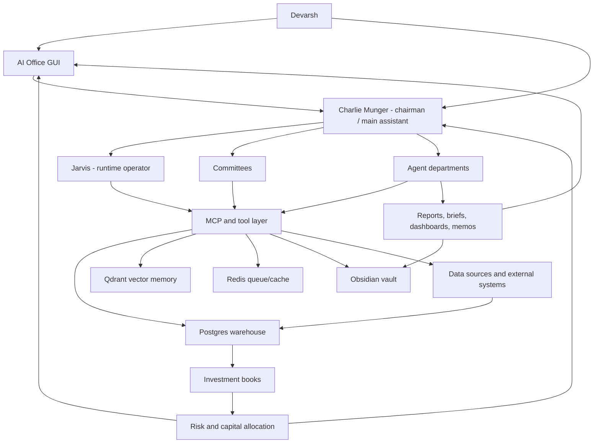
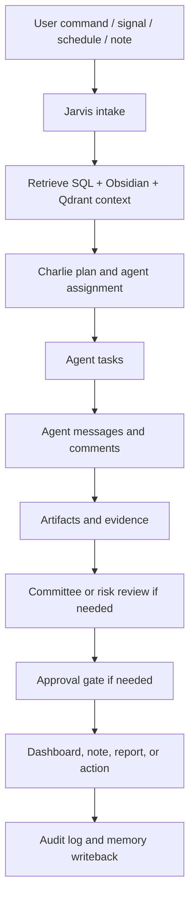

# AI Investment OS - Institutional Master Blueprint v9.0

Date: 2026-07-07
Owner: Devarsh
Canonical checklist: [[AI Investment OS - Execution Checklist v9.0]]
Supersedes: [[AI Investment OS - Institutional Master Blueprint v8.0]]
Main assistant: Charlie Munger
Runtime operator: Jarvis
Permanent memory: Obsidian vault
Structured source of truth: Postgres / Timescale-style warehouse
Semantic retrieval: Qdrant
Queue/cache: Redis
Primary operating surface: AI Office GUI plus Charlie chat
Status: canonical target architecture before next implementation phase

## 1. North Star

Build a full AI Investment Operating System: a smarter Bloomberg, a hedge fund operating platform, a client folio manager, a research factory, a quant lab, a trading desk, a risk office, and a live AI office in one system.

This is not one chatbot. It is an institutional operating system for managing capital, ideas, positions, evidence, research, strategies, approvals, reports, clients, and memory.

The end state:

- Devarsh talks mainly to Charlie Munger.
- Charlie challenges assumptions, applies mental models, routes work, and gives final synthesis.
- Jarvis executes runtime actions: tool calls, MCP calls, database reads/writes, browser automation, dashboard updates, and audit logs.
- Specialist agents operate as a hedge fund staff with departments, roles, inboxes, tasks, model routes, permissions, skills, artifacts, and cost limits.
- Every position belongs to a book, purpose, owner, horizon, thesis/setup, evidence, exit logic, and review cadence.
- Long-Term, Tactical, Quant, Active Trading, Treasury, Hedges, and Crypto/Commodity books can hold different views on the same instrument without corrupting each other's logic.
- Capital Allocation and Risk sit above all books.
- Research, filings, news, social data, p2cursor, old algo systems, broker exports, TradingView, Fincept, OpenAlgo, Vibe-Trading, Codex outputs, Claude/Cowork outputs, journals, PDFs, spreadsheets, and manual notes all feed one data and memory spine.
- The GUI shows live portfolio intelligence, client folios, symbol intelligence, research queues, strategy state, risk limits, model/runtime health, approvals, agent work, committee decisions, and eventually an animated office floor.
- Local/open-source models handle cheap daily work. Cloud/frontier models are used selectively for high-value reasoning, large documents, hard code, and final committee synthesis.
- Broker execution stays disabled until read-only data, risk checks, order preview, human approval, audit trail, and kill switches are mature.

## 2. System Principles

1. Human in control.
2. No hidden production actions.
3. No fake data mixed into real ledgers.
4. Every claim has evidence, source freshness, and confidence.
5. Every position has a book and purpose.
6. Every strategy has a hypothesis, data source, backtest, risk review, promotion state, and kill switch.
7. Every agent action creates a durable task, message, run, approval, comment, artifact, or note.
8. Obsidian is the human memory graph.
9. Postgres is the structured source of truth.
10. Qdrant is semantic retrieval, not accounting.
11. Runtime state and heavy data stay on the external SSD.
12. External repos are components and references, not the core system of record.
13. Repeated errors trigger research before more trial-and-error.
14. Local-first and cost-aware by default.
15. Cloud escalation requires routing policy, cost ledger, and approval for expensive work.
16. Live execution is blocked until safety gates are complete.

## 3. High-Level Architecture

## 4. Operating Surfaces

### 4.1 Charlie Chat

Charlie is the main natural-language interface. Devarsh should be able to say:

- "Add this Reliance buy to the Long-Term book as Core Compounder."
- "Review all client folios and tell me what changed."
- "Create a tactical hedge against this long-term position."
- "Run Monte Carlo on the thesis and send it to committee."
- "Open NIFTY, BANKNIFTY, VIX, and option straddle charts in TradingView."
- "Scan NSE/BSE filings for buybacks, demergers, reverse mergers, delistings, preferential issues, and arbitrage spreads."
- "Generate strategy ideas from my trade journals."
- "Backtest this intraday strategy, optimize it, and send it to Strategy Committee."
- "Prepare a client-ready report, but do not send it."

Charlie responses must include:

- what was understood,
- agents assigned,
- tools/data used,
- source freshness,
- missing data,
- conclusion,
- risks and opposing arguments,
- dashboard/widgets updated,
- notes/reports written,
- approvals needed,
- next recommended action.

### 4.2 Jarvis Runtime

Jarvis is not the personality. Jarvis is the operator.

Jarvis responsibilities:

- normalize Charlie's intent into tasks,
- retrieve SQL/Qdrant/Obsidian context,
- call MCP tools,
- run ingestion/backtest/report scripts,
- control browser and TradingView where allowed,
- create and update agent tasks,
- refresh dashboard widgets,
- write audit logs,
- enforce provider/model/data-source gates,
- request approval for sensitive actions.

### 4.3 AI Office GUI

Required workspaces:

- Command Center
- Charlie Chat
- Portfolio Intelligence
- Client Folios
- Symbol Intelligence
- Long-Term Office
- Tactical Office
- Quant Lab
- Active Trading Desk
- Research Factory
- News and Filings
- Special Situations
- Treasury, Hedges, Crypto, Commodities
- Risk Center
- Capital Allocation
- Model Runtime
- Agent Inbox
- Committee Room
- Approval Board
- Reports Library
- System Health
- Live AI Office

### 4.4 Live AI Office

The live AI office is an operating surface, not decoration.

Required features:

- departments shown as rooms,
- agents shown as employees,
- hover cards with role, current task, active model route, inbox, last output, cost status, risk status, and tool permissions,
- task arrows between agents,
- committee rooms,
- approval desk,
- risk wall,
- alert wall,
- live activity feed,
- click-through agent profiles,
- graphical/animated view after the data-backed room grid is stable.

## 5. Storage And Memory Contract

External SSD runtime location:

- `_ai_os_runtime`
- Docker volumes
- Postgres data
- Redis data
- Qdrant data
- imported artifacts
- generated reports
- screenshots
- browser profiles
- logs
- backtest artifacts
- model caches where practical

Obsidian stores:

- blueprints,
- decisions,
- research memos,
- committee minutes,
- agent reports,
- runbooks,
- dashboards/reports intended for human review,
- links to heavy artifacts, not raw high-volume dumps.

Postgres stores:

- clients,
- accounts,
- holdings,
- transactions,
- positions,
- books,
- strategies,
- backtests,
- risk limits,
- agent tasks,
- inbox,
- messages,
- approvals,
- tool runs,
- provider gates,
- source lineage.

Qdrant stores embeddings for:

- Obsidian notes,
- research reports,
- filings and transcripts,
- strategy dossiers,
- trade journals,
- agent outputs,
- imported documents.

## 6. Data Spine

### 6.1 Internal Sources

- p2cursor databases/files,
- old algo trading system databases,
- broker exports,
- current holdings reports,
- old transaction reports,
- manual trades,
- paper trades,
- old trade journals,
- Codex outputs,
- Claude/Cowork outputs,
- Obsidian notes,
- PDFs,
- Excel/CSV files,
- screenshots,
- chart artifacts.

### 6.2 Market And Live Sources

- Zerodha read-only connector,
- Dhan read-only connector,
- TradingView browser/CDP controller,
- NSE announcements,
- BSE announcements,
- corporate actions,
- daily OHLCV,
- intraday OHLCV,
- options chain, OI, IV, Greeks,
- futures basis and rollover,
- VIX and volatility,
- crypto exchange read-only data,
- gold/silver/commodity data,
- macro data,
- sector/index constituents,
- global news,
- Twitter/X and social triage where policy/access allow.

### 6.3 Source Rules

- Every imported row must carry source system, source artifact, ingestion run, timestamp, and confidence.
- Derived rows must preserve lineage to source rows.
- Manual entries must be auditable.
- Broker/account data overrides manual estimates where verified.
- No source can silently overwrite another source without reconciliation.

## 7. External Component Strategy

### 7.1 Fincept

Use Fincept as a component/reference library for:

- terminal UX patterns,
- datahub ideas,
- analytics wrappers,
- agentic research patterns,
- news/RSS ingestion,
- options/IV/OI modules,
- report-builder concepts,
- market data connector patterns,
- quant lab workflows,
- portfolio screen ideas.

Do not make Fincept the source of truth. Bridge selected flows into our Postgres/API/MCP stack.

### 7.2 OpenAlgo

Use OpenAlgo as:

- read-only broker/orderflow reference,
- strategy workflow reference,
- OKF/orderflow pattern source,
- future human-approved execution adapter reference.

Live execution remains blocked until our safety constitution is complete.

### 7.3 Vibe-Trading

Use Vibe-Trading as:

- agentic strategy research reference,
- idea generation loop reference,
- trading reasoning workflow reference,
- human-in-the-loop research pattern source.

It must not control money or become the core system.

### 7.4 TradingView MCP/Controller

TradingView is used for:

- opening charts/layouts,
- watchlists,
- screenshots,
- chart evidence capture,
- straddle/strangle workflows,
- alert request preparation,
- visual technical checks,
- fundamental ratio chart workflows where supported.

Alert changes, account changes, broker actions, or order-affecting changes require human approval.

## 8. Investment Book Architecture

### 8.1 Books

Long-Term Investing:

- horizon: 3-15 years,
- objective: compounding and wealth building,
- owner: Long-Term Office,
- examples: core holdings, quality compounders, client long-term portfolios.

Tactical Investing:

- horizon: days to months,
- objective: catalyst/event/macro/sector rotation opportunities,
- owner: Tactical Office,
- examples: earnings trades, event trades, temporary mispricing, hedges around long-term positions.

Quantitative Strategies:

- horizon: intraday to weeks,
- objective: systematic alpha from tested rules,
- owner: Quant Lab,
- examples: mean reversion, momentum, factor, options, volatility, intraday patterns.

Active Trading:

- horizon: intraday to days,
- objective: discretionary chart/setup/options trades,
- owner: Trading Desk and Devarsh,
- examples: intraday options, breakouts, support/resistance, event trades.

Cash/Treasury:

- horizon: immediate to months,
- objective: cash management, deployment readiness, collateral, liquid funds,
- owner: Treasury.

Hedges:

- horizon: linked to exposure,
- objective: downside protection, beta hedge, volatility hedge, event hedge,
- owner: Risk and Capital Allocation.

Crypto/Commodity Macro:

- horizon: intraday to long-term,
- objective: BTC, ETH, gold, silver, commodity and macro trades,
- owner: Macro/Trading Desk.

### 8.2 Position Object

Every position must support:

- client/account,
- symbol/instrument,
- asset class,
- direction,
- quantity,
- average price,
- market value,
- mark-to-market,
- book,
- sub-book,
- purpose,
- owner,
- time horizon,
- thesis or setup,
- entry rationale,
- source artifact,
- source freshness,
- entry date,
- review frequency,
- exit criteria,
- stop/target/time exit where applicable,
- risk budget,
- capital budget,
- linked research,
- linked committee decision,
- linked strategy,
- linked trade journal,
- linked hedge or offset,
- approval state.

### 8.3 Opposing Exposures

The same instrument can appear in multiple books with different purposes.

Example:

| Book | Direction | Amount | Purpose | Horizon |
| --- | --- | ---: | --- | --- |
| Long-Term | Long | INR 20L | Core compounder | 5-10 years |
| Tactical | Flat | INR 0 | No tactical view | Days-months |
| Quant | Short | INR 3L | 5-day mean reversion | 5 days |
| Active Trading | Short | INR 2L | Pre-earnings resistance trade | Intraday-days |

Portfolio Intelligence must show:

- gross long,
- gross short,
- net exposure,
- book exposure,
- client exposure,
- purpose-level explanation,
- whether an offset is hedge or independent alpha,
- cost/tax impact,
- concentration impact,
- risk-budget impact,
- recommended coordination question.

Risk Office must flag:

- quant strategy offsetting most of a core long,
- active trade unintentionally increasing concentration,
- hedge ratio too high/low,
- book exposure above limit,
- liquidity too thin,
- client suitability issue,
- unexplained opposite trades.

## 9. Portfolio Intelligence Engine

Required outputs:

- NAV by client/account/book,
- gross exposure,
- net exposure,
- cash and cash drag,
- long/short exposure,
- sector exposure,
- factor exposure,
- strategy exposure,
- symbol rollup,
- cross-book conflicts,
- realized/unrealized P&L,
- dividends/corporate actions,
- risk budget used,
- capital budget used,
- liquidity profile,
- concentration profile,
- latest filing/news/research/task/committee note per symbol.

Symbol Intelligence must answer:

- Why do we own/short this?
- Which books own it?
- Which clients hold it?
- What is the long-term thesis?
- What tactical/quant/active setups exist?
- What changed recently?
- What filings/news matter?
- What is the latest dashboard state?
- What would make us sell, add, hedge, reduce, or ignore?

## 10. Long-Term Investing Office

### 10.1 Long-Term Checks

Business quality:

- business model clarity,
- revenue drivers,
- profit pool,
- customer concentration,
- supplier dependence,
- pricing power,
- repeat purchase behavior,
- cyclicality,
- operating leverage,
- unit economics,
- reinvestment runway,
- regulatory dependence,
- disruption risk.

Industry structure:

- market size,
- growth rate,
- fragmentation,
- competitor map,
- entry barriers,
- substitutes,
- bargaining power,
- capacity cycles,
- regulatory tailwinds/headwinds,
- global/local economics.

Moat:

- brand,
- switching cost,
- network effect,
- cost advantage,
- scale advantage,
- distribution advantage,
- data advantage,
- ecosystem lock-in,
- license/regulatory advantage,
- evidence in margins and returns.

Management:

- track record,
- capital allocation,
- skin in the game,
- promoter pledge,
- related-party transactions,
- governance behavior,
- candor,
- execution record,
- incentive alignment,
- succession,
- treatment of minority shareholders.

Financial statement quality:

- revenue quality,
- receivable build-up,
- inventory build-up,
- working-capital behavior,
- free cash flow conversion,
- margin sustainability,
- debt maturity,
- off-balance-sheet obligations,
- contingent liabilities,
- auditor notes,
- tax consistency,
- related-party transactions.

Valuation:

- DCF,
- reverse DCF,
- sum-of-parts,
- peer comparison,
- historical valuation,
- owner earnings,
- earnings power value,
- bull/base/bear scenarios,
- expected CAGR,
- margin of safety,
- valuation vs quality,
- valuation vs opportunity cost.

Risks and sell discipline:

- thesis killers,
- key monitoring variables,
- exit criteria,
- position sizing logic,
- liquidity,
- fraud/accounting risk,
- disruption risk,
- commodity/currency risk,
- governance risk,
- regulatory risk,
- opportunity cost,
- review cadence.

### 10.2 Long-Term Monte Carlo

Monte Carlo should model:

- revenue growth distribution,
- margin distribution,
- reinvestment rate,
- ROIC path,
- terminal multiple,
- dilution,
- debt/cash path,
- downside scenarios,
- valuation range,
- expected CAGR distribution,
- probability of permanent impairment,
- sensitivity to top assumptions.

Outputs:

- bull/base/bear path,
- probability of acceptable return,
- probability of capital loss,
- key assumption sensitivity,
- recommended position size range,
- committee memo section.

### 10.3 Long-Term Agents

- Long-Term Portfolio Manager
- Company Analyst
- Industry Analyst
- Management Analyst
- Financial Statement Analyst
- Forensic Accounting Agent
- Valuation Agent
- Filings and Transcript Analyst
- Bear Case Agent
- Quality Score Agent
- Portfolio Fit Agent
- Thesis Librarian

### 10.4 Long-Term Committee

Members:

- Charlie as chair,
- CIO Agent,
- Long-Term Portfolio Manager,
- Company Analyst,
- Valuation Agent,
- Risk Agent,
- Bear Case Agent,
- Portfolio Fit Agent,
- Devarsh final approver.

Required decisions:

- reject,
- watchlist,
- starter position,
- add,
- hold,
- trim,
- sell,
- hedge,
- more research.

## 11. Tactical Investing Office

Required checks:

- catalyst type,
- event date,
- expected impact,
- market expectation,
- time horizon,
- stop/target/time exit,
- risk/reward,
- liquidity,
- option overlay,
- overlap with long-term book,
- hedge vs independent alpha,
- news/filing evidence,
- crowding/sentiment,
- macro/sector context.

Agents:

- Tactical Portfolio Manager
- Catalyst Analyst
- Event Analyst
- Technical Analyst
- Macro Analyst
- Sentiment Analyst
- Options Overlay Agent
- Sector Rotation Agent

Committee:

- Tactical Committee with CIO, Tactical PM, Risk, Technical, Macro, Options, and Charlie.

## 12. Quantitative Strategies Office

### 12.1 Strategy Lifecycle

1. Idea intake.
2. Hypothesis.
3. Data availability check.
4. Rule/DSL definition.
5. Data-quality gate.
6. Baseline backtest.
7. Cost/slippage model.
8. Train/test split.
9. Walk-forward analysis.
10. Regime split.
11. Sensitivity analysis.
12. Monte Carlo/bootstrap.
13. Capacity/liquidity model.
14. Factor attribution.
15. Correlation to existing strategies.
16. Probability of ruin.
17. Strategy Committee review.
18. Paper monitor.
19. Limited-live approval.
20. Kill-switch and retirement rules.

### 12.2 Quant Checks

- statistical significance,
- sample size,
- lookahead bias,
- survivorship bias,
- transaction cost sensitivity,
- slippage,
- liquidity,
- regime robustness,
- overfitting risk,
- parameter stability,
- decay risk,
- turnover,
- drawdown shape,
- tail risk,
- correlation with existing books,
- capital required,
- operational complexity.

### 12.3 Quant Agents

- Head of Quant
- Strategy Generator
- Strategy Research Agent
- Strategy Intake Agent
- Data Scientist
- Feature Engineer
- Backtesting Engineer
- Optimizer Agent
- Regime Analyst
- Capacity/Liquidity Analyst
- Model Validation Agent
- Strategy Portfolio Optimizer
- Strategy Retirement Agent

### 12.4 Strategy Committee

Members:

- Charlie as chair,
- Head of Quant,
- Model Validation Agent,
- Risk Agent,
- Data Quality Agent,
- Backtesting Engineer,
- Capacity/Liquidity Analyst,
- Portfolio Optimizer,
- Devarsh final approver.

Allowed states:

- rejected,
- more evidence,
- backtest required,
- validation required,
- paper monitor,
- limited live candidate,
- live disabled,
- retired.

## 13. Active Trading Desk

Required workflows:

- manual trade entry,
- paper trade entry,
- setup classification,
- TradingView chart open,
- TradingView screenshot evidence,
- straddle/strangle charts,
- options payoff,
- IV/OI analysis,
- futures basis,
- intraday alerts,
- trade journal,
- post-trade review,
- overnight risk check,
- execution safety gate.

Required checks:

- setup type,
- timeframe,
- entry/exit,
- stop/target/time stop,
- position size,
- maximum loss,
- event risk,
- liquidity,
- option Greeks,
- volatility regime,
- correlation with existing exposure,
- client suitability if client money,
- whether trade offsets another book intentionally.

Agents:

- Trading Desk Agent
- Technical Analyst
- Options Analyst
- Futures Analyst
- Volatility Agent
- Market Microstructure Agent
- Execution Safety Agent
- Trade Journal Coach

## 14. Research Factory And Special Situations

Sources:

- NSE announcements,
- BSE announcements,
- annual reports,
- concall transcripts,
- investor presentations,
- credit rating notes,
- exchange circulars,
- court/regulatory notices,
- global news,
- social watchlists where allowed.

Special situation detectors:

- buyback,
- demerger,
- reverse merger,
- merger,
- spin-off,
- delisting,
- rights issue,
- preferential issue,
- open offer,
- tender offer,
- arbitrage spread,
- restructuring,
- pledge release/build-up,
- promoter transaction,
- unusual corporate action,
- auditor resignation,
- rating change.

Agents:

- Research Director
- Filings Analyst
- Corporate Actions Analyst
- Special Situations Agent
- Arbitrage Analyst
- News Analyst
- Social/Twitter Triage Agent
- Document Extraction Agent
- Research Librarian

Required outputs:

- source-backed note,
- extracted terms,
- timeline,
- spread/valuation math,
- risk checklist,
- committee recommendation,
- dashboard alert,
- Obsidian writeback.

## 15. Treasury, Hedges, Crypto, Commodities

Treasury checks:

- cash level,
- cash drag,
- liquidity needs,
- margin/collateral,
- near-term commitments,
- deployment queue,
- idle cash alternatives,
- client-level restrictions.

Hedge checks:

- exposure being hedged,
- hedge instrument,
- hedge ratio,
- hedge cost,
- expected protection,
- basis risk,
- time horizon,
- unwind rule,
- unintended offset.

Crypto/commodity checks:

- instrument registry,
- exchange source,
- custody/operational risk,
- volatility,
- liquidity,
- macro driver,
- correlation to existing portfolio,
- position limits,
- stop/exit logic.

Agents:

- Treasury Analyst
- Hedge Analyst
- Commodity Macro Analyst
- Crypto Analyst
- Collateral/Risk Agent

## 16. Capital Allocation Office

Responsibilities:

- allocate capital across books,
- monitor book budgets,
- monitor client budgets,
- rebalance suggestions,
- drawdown-aware sizing,
- liquidity-aware sizing,
- cash deployment queue,
- strategy portfolio allocation,
- opportunity-cost ranking,
- capital conflict resolution.

Agents:

- Capital Allocation Officer
- Portfolio Optimizer
- Performance Attribution Analyst
- Client Suitability Analyst
- Cash/Treasury Analyst

Capital Allocation Committee:

- Charlie,
- CIO,
- Capital Allocation Officer,
- Portfolio Manager,
- Risk Agent,
- Quant representative,
- Long-Term representative,
- Trading representative,
- Devarsh final approver.

## 17. Risk Office

Risk engines:

- concentration,
- liquidity,
- VaR,
- expected shortfall,
- stress tests,
- portfolio Monte Carlo,
- options tail risk,
- factor risk,
- cross-book conflict,
- client suitability,
- strategy kill switch,
- provider/model/data-source gates,
- execution gate ledger.

Risk agents:

- Chief Risk Officer
- Quant Risk Analyst
- Stress Testing Agent
- Model Risk Agent
- Data Quality Risk Agent
- Compliance/Audit Agent
- Kill Switch Agent

Risk Committee:

- Charlie,
- CRO,
- CIO,
- Capital Allocation Officer,
- book owner,
- Compliance/Audit,
- Devarsh final approver.

Risk can:

- warn,
- request more evidence,
- reduce size,
- block action,
- require committee,
- require human approval,
- trigger kill switch.

## 18. Client Office

Responsibilities:

- client onboarding,
- current holdings,
- transaction history,
- buy/sell dates,
- realized/unrealized P&L,
- NAV,
- book exposure,
- risk profile,
- restrictions,
- monthly reports,
- action log,
- suitability checks.

Agents:

- Client Manager
- Reporting Analyst
- Performance Reporter
- Client Suitability Analyst
- Communication Agent
- Onboarding Agent

Client-facing outputs must be approval-gated before sending.

## 19. Agent Office And Communication

### 19.1 Agent Object

Each agent must have:

- name,
- character/personality,
- department,
- manager,
- role,
- responsibilities,
- skills,
- model route,
- tool permissions,
- data permissions,
- cost cap,
- inbox,
- task history,
- output artifact history,
- reliability score,
- escalation policy.

### 19.2 Communication Model

Agents do not only "talk in chat." They communicate through durable records:

- tasks,
- inbox items,
- messages,
- comments,
- handoff threads,
- approvals,
- committee reviews,
- output artifacts,
- run logs,
- Obsidian notes.

Required flow:

### 19.3 Hierarchy

Executive Office:

- Charlie Munger, Chairman/Main Assistant
- Jarvis, COO/Runtime Operator
- CIO Agent
- Chief of Staff
- CTO/Coding Lead

Departments:

- Portfolio Office
- Long-Term Office
- Tactical Office
- Quant Lab
- Active Trading Desk
- Research Factory
- News and Filings
- Special Situations
- Treasury/Hedges/Crypto/Commodities
- Risk Office
- Capital Allocation Office
- Client Office
- Data Engineering
- AI Engineering
- Software Engineering
- Automation and Integrations
- Knowledge Division
- Finance/Admin

## 20. Committees

Committees must have:

- chair,
- members,
- agenda,
- evidence packet,
- dissent section,
- decision,
- conditions,
- follow-up tasks,
- approval state,
- final human decision where money/client/external action is involved.

Required committees:

- Executive Committee
- Long-Term Investment Committee
- Tactical Committee
- Strategy Committee
- Special Situations Committee
- Risk Committee
- Capital Allocation Committee
- Data and Tool Committee
- Client Review Committee
- Model Review Committee
- Execution Approval Committee

## 21. MCP And Tool Layer

Required MCP/tool categories:

- Postgres read/write with permission gates,
- Obsidian read/write,
- Qdrant search,
- file artifact registry,
- Excel/CSV importer,
- PDF/document extractor,
- browser research runner,
- TradingView controller,
- NSE/BSE filing scraper,
- news scraper,
- Fincept bridge,
- OpenAlgo bridge,
- Vibe workflow reference bridge,
- broker read-only connectors,
- crypto/commodity read-only connector,
- report/PDF builder,
- chart/screenshot artifact tool,
- model route/cost ledger,
- approval tool,
- task/inbox/message tool.

Provider gates must decide whether each agent can use each model/data/tool for a specific purpose.

## 22. Model Strategy

Local daily-driver models:

- routine triage,
- note summarization,
- metadata extraction,
- agent inbox summaries,
- simple research drafting,
- low-risk SQL explanations,
- local retrieval synthesis.

Hybrid/local-plus-cloud:

- Charlie synthesis,
- complex investment judgement,
- hard strategy reasoning,
- committee memos,
- long-document filings,
- difficult code/debugging,
- client-ready reports.

Cloud/frontier escalation:

- large evidence packets,
- high-stakes investment memos,
- complex coding,
- final committee synthesis,
- legal/compliance style review,
- ambiguous high-value decisions.

Each model route must define:

- allowed agents,
- allowed tools,
- max cost,
- privacy level,
- context policy,
- fallback,
- escalation rule,
- logging.

## 23. Dashboards

Required dashboards:

- Executive Command Center
- Portfolio Intelligence
- Client Folios
- Symbol Intelligence
- Long-Term Office
- Tactical Office
- Quant Lab
- Strategy Monitor
- Trading Desk
- Risk Center
- Capital Allocation
- Research Factory
- News and Filings
- Special Situations
- Treasury/Hedges/Crypto/Commodities
- Agent Office
- Committee Room
- Approval Board
- Model Runtime
- Provider Readiness
- System Health
- Reports Library
- Live AI Office

## 24. Reports And Briefs

Required reports:

- daily market brief,
- daily portfolio brief,
- daily agent activity brief,
- weekly risk report,
- weekly research digest,
- monthly client report,
- company research report,
- long-term thesis memo,
- special situation memo,
- strategy report,
- backtest report,
- optimization report,
- model validation report,
- committee minutes,
- data-source freshness report,
- provider readiness report,
- cost report,
- system status report.

## 25. Safety Constitution

Read-only first:

- broker connectors start read-only,
- crypto exchange connectors start read-only,
- TradingView alert/order-affecting changes require approval,
- no autonomous broker orders,
- no client-facing message send without approval,
- no destructive data action without approval.

Execution prerequisites:

- verified broker/account data,
- order preview,
- risk check,
- capital check,
- client suitability check,
- kill switch,
- audit log,
- human approval,
- post-trade journal,
- reconciliation.

## 26. Build Phases

Phase 1: Canonical specification and tracking.

- v9 blueprint,
- v9 checklist,
- top-level index,
- change-control discipline.

Phase 2: Data spine and source truth.

- p2cursor extraction,
- old algo DB import,
- broker reports,
- OHLCV/options/filings/news,
- source lineage,
- data quality.

Phase 3: Portfolio brain.

- multi-book position object,
- exposures,
- Symbol Intelligence,
- client folios,
- cross-book conflict actions.

Phase 4: Agent office.

- full roster,
- departments,
- skills,
- model routes,
- inbox/messages,
- committees,
- approval center.

Phase 5: Research and strategy factories.

- long-term research,
- filings/news/special situations,
- strategy intake,
- backtests,
- optimizers,
- Monte Carlo,
- model validation,
- paper monitor.

Phase 6: Live dashboards and AI office.

- command center,
- office floor,
- hover cards,
- task arrows,
- committee rooms,
- risk wall,
- report library.

Phase 7: Safety, remote access, and production hardening.

- backups,
- restore test,
- auth,
- provider policies,
- kill switches,
- audit,
- monitoring,
- remote access.

Phase 8: Human-approved live execution.

- only after all read-only workflows, risk gates, approval gates, and reconciliation are proven.

## 27. Definition Of Done

A feature is done only when it has:

- schema or source-of-truth record where needed,
- real data path or clearly labeled test data,
- API/MCP path where needed,
- GUI visibility where needed,
- Obsidian report/runbook where needed,
- source lineage,
- approval/risk behavior where needed,
- verification evidence,
- checklist update.

