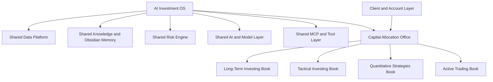
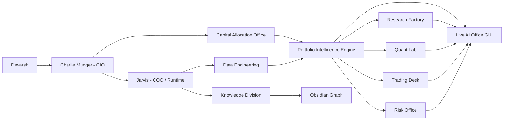
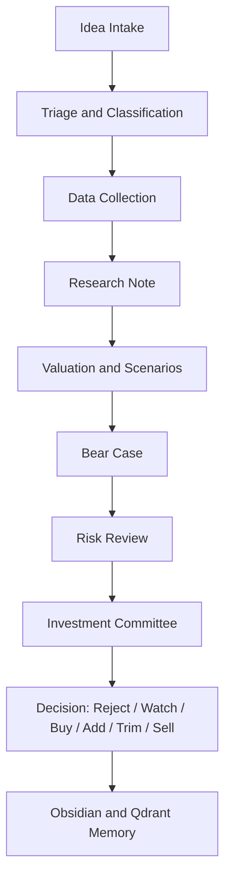

# AI Investment OS - Master Blueprint v1.0

Date: 2026-07-06
Status: Canonical product and architecture blueprint
Owner: Devarsh
Primary orchestrator: Charlie Munger
Runtime operator: Jarvis

## 1. Executive Vision

Build a complete personal-to-institutional AI Investment Operating System.

The end product is not only a trading app, portfolio tracker, or research notebook. It is a full multi-strategy investment firm operating system with:

- one shared data and knowledge backbone,
- multiple independent investment books,
- a central capital allocation layer,
- a risk office that can challenge every book,
- agent teams that research, debate, backtest, monitor, and report,
- a live graphical AI office where every employee has a role, mailbox, task state, current work, and output trail,
- dashboards that behave like a smarter Bloomberg plus internal hedge fund control room,
- Obsidian as durable memory and research graph,
- local-first model routing with controlled cloud escalation,
- human final authority for capital allocation, client-facing advice, and broker execution.

The system should eventually answer:

- What do we own?
- In which book do we own it?
- Why does each exposure exist?
- What time horizon does each exposure serve?
- What would make us exit?
- What changed today?
- What risks are building?
- Which positions conflict across books?
- Which ideas deserve research?
- Which strategies deserve backtesting?
- Which trades are live, paper, or blocked?
- What did the agents do?
- What should Devarsh review next?

## 2. Core Architecture Decision

Do not separate the platform by asset class or by "investing vs trading".

Separate by decision horizon and investment philosophy while sharing the same data platform.

The correct structure is:



This means Reliance can exist in multiple books at the same time:

| Book | Direction | Amount | Purpose | Horizon | Owner |
| --- | ---: | ---: | --- | --- | --- |
| Long-Term | Long | INR 20L | Core compounder | 5-10 years | Long-Term Office |
| Tactical | Flat | INR 0 | No current tactical view | Days-months | Tactical Office |
| Quant | Short | INR 3L | Mean reversion signal | 5 days | Quant Lab |
| Active Trading | Short | INR 2L | Pre-earnings discretionary trade | Intraday-days | Trading Desk |

The portfolio engine must show:

- gross long,
- gross short,
- net exposure,
- book exposure,
- purpose exposure,
- time-horizon exposure,
- risk flags,
- conflicts and intentional hedges.

It must never collapse all decisions into one meaningless "Reliance position".

## 3. Product Principles

1. Every exposure must have a purpose.
2. Every position belongs to exactly one book.
3. Every book has its own philosophy, rules, review cadence, and performance attribution.
4. One shared data spine prevents duplicated truth.
5. Research and trading logic must be separated from capital allocation logic.
6. Quant strategies must be judged only against their own tested rules.
7. Discretionary trades must not pollute systematic strategy performance.
8. Long-term theses are not invalidated by short-term bearish signals.
9. Short-term hedges or trades must still be visible to Risk and Capital Allocation.
10. Human final approval is required for live broker execution, client advice, and major capital movement.
11. Agents can recommend, debate, and monitor, but they cannot silently allocate capital.
12. Obsidian is permanent memory; the GUI is the live operating surface.
13. Local models handle routine work; expensive models are used only for approved deep work.
14. No seed/demo data should appear as live evidence.
15. Every output must have source, timestamp, owner, and review state.

## 4. Current Foundation Already Built

The current stack already has:

- SSD-backed runtime under `_ai_os_runtime`.
- Postgres warehouse.
- Redis.
- Qdrant vector database.
- API at `http://127.0.0.1:8765`.
- AI Office dashboard at `http://127.0.0.1:5177`.
- Agent roster, departments, skills, model routes.
- Charlie Munger as chief investment orchestrator.
- Jarvis as runtime operator.
- Agent hierarchy, mailboxes, and message daemon.
- Message to task to inbox to worker run flow.
- Worker notes written to Obsidian.
- Live AI office floor panel.
- Imported client/holding data foundation.
- Research artifact inventory.
- Fincept/OpenAlgo/Vibe skills registered as component references.
- Full stack PDF report generated and verified.

Important current gaps:

- TradingView CDP is not currently connected until TradingView is relaunched with remote debugging.
- Ollama works manually but is not yet a reliable background LaunchAgent.
- Direct Fincept/OpenAlgo/Vibe adapters are planned, not live production adapters.
- Broker execution remains disabled.
- Multi-book portfolio schema is not yet implemented.
- News/NSE/BSE/corporate filing collectors need scheduled production connectors.
- The live office floor is a first database-backed panel, not the final animated office environment.

## 5. Target Operating Model



## 6. Investment Books

### 6.1 Long-Term Investing Book

Purpose:

- Own exceptional businesses for years.
- Compound wealth through ownership.
- Build and maintain durable theses.
- Buy when price is attractive relative to long-term value.
- Sell only when thesis, quality, valuation, or opportunity cost demands it.

Horizon:

- 3 to 15 years.

Main questions:

- Is this business exceptional?
- Is the industry structurally attractive?
- Is the moat widening or narrowing?
- Is ROIC sustainable?
- Is revenue growth durable?
- Are margins structurally defendable?
- Is management trustworthy and competent?
- Is capital allocation rational?
- Does the balance sheet survive stress?
- Are accounting quality and cash conversion good?
- What is normalized owner earnings?
- What is the intrinsic value range?
- What is the expected CAGR from today's price?
- What are the thesis killers?
- What would change our mind?
- Should we add on weakness?
- Is this still within our circle of competence?
- Does this holding deserve capital compared with alternatives?

Core artifacts:

- Company research note.
- Thesis card.
- Valuation model.
- Reverse DCF.
- Bull/base/bear scenarios.
- Management scorecard.
- Capital allocation scorecard.
- Moat map.
- Industry structure map.
- Financial quality dashboard.
- Quarterly review memo.
- Sell discipline checklist.

Long-Term agents:

- Long-Term Portfolio Manager.
- Company Analyst.
- Industry Analyst.
- Management Analyst.
- Financial Statement Analyst.
- Valuation Agent.
- Forensic Accounting Agent.
- Filings and Transcript Analyst.
- Bear Case Agent.
- Quality Score Agent.
- Capital Allocation Agent.
- Portfolio Fit Agent.
- Risk Agent reviewer.
- Charlie Munger final reviewer.

Long-Term internal committee:

1. Company Analyst presents business and industry.
2. Financial Statement Analyst presents financial quality.
3. Management Analyst presents governance and capital allocation.
4. Valuation Agent presents valuation range and expected CAGR.
5. Bear Case Agent presents disconfirming evidence.
6. Risk Agent challenges concentration, liquidity, and downside.
7. Portfolio Manager decides proposed action.
8. Charlie Munger accepts, rejects, or sends back for more work.

Long-Term required checks:

- Business model clarity.
- Revenue drivers.
- Unit economics.
- Segment economics.
- Industry attractiveness.
- Competitive advantage.
- Moat durability.
- Management quality.
- Promoter/governance risk.
- Capital allocation record.
- Related-party transactions.
- Debt and liquidity.
- Cash conversion.
- Free cash flow quality.
- ROIC and reinvestment runway.
- Margin structure.
- Cyclicality.
- Regulatory exposure.
- Technology disruption risk.
- Customer/supplier concentration.
- Valuation versus history.
- Valuation versus peers.
- Reverse DCF expectations.
- Scenario analysis.
- Monte Carlo on long-term drivers where useful.
- Thesis killers.
- Exit criteria.
- Review frequency.
- Position sizing.
- Portfolio correlation.
- Opportunity cost.

Long-Term analytics:

- DCF and reverse DCF.
- Earnings power value.
- EV/EBITDA, PE, FCF yield, ROIC spread.
- Owner earnings.
- Scenario analysis.
- Monte Carlo on revenue growth, margins, reinvestment, terminal multiple.
- Drawdown history.
- Business quality scoring.
- Management/capital allocation scoring.
- Long-term expected return waterfall.
- Thesis drift detection.
- Event and filing impact analysis.

Outputs:

- Buy/Add/Hold/Trim/Sell proposal.
- Research note.
- Thesis update.
- Watchlist action.
- Risk flag.
- Portfolio committee memo.

### 6.2 Tactical Investing Book

Purpose:

- Capture medium-term moves.
- Trade around long-term holdings without confusing the core thesis.
- Use catalysts, valuation gaps, sector rotation, earnings events, macro changes, and sentiment.

Horizon:

- Days to months.

Main questions:

- What is the catalyst?
- What is the time window?
- Is this a swing trade, event trade, hedge, or tactical add/reduce?
- What is the expected upside/downside?
- What invalidates the trade?
- What is the stop, target, and time exit?
- Is the long-term book already exposed?
- Are we hedging or adding independent alpha?
- Are costs and taxes acceptable?
- What is the liquidity?
- What is the market/regime backdrop?

Tactical agents:

- Tactical Portfolio Manager.
- Catalyst Analyst.
- Event Analyst.
- Technical Analyst.
- Macro Analyst.
- Options Overlay Agent.
- Sentiment Analyst.
- Sector Rotation Agent.
- Risk Agent reviewer.
- Capital Allocation reviewer.

Tactical required checks:

- Catalyst definition.
- Event calendar.
- News and filing source.
- Technical structure.
- Support/resistance.
- Volume/liquidity.
- Volatility regime.
- Sector/macro backdrop.
- Option chain/IV if relevant.
- Position overlap with Long-Term book.
- Stop/target/time exit.
- Risk/reward.
- Trade size.
- Borrow/carry/cost.
- Execution feasibility.
- Review schedule.

Tactical analytics:

- Event study.
- Relative strength.
- Moving average/ATR structure.
- Volatility and gap risk.
- Scenario tree.
- Options payoff.
- Expected value.
- Monte Carlo using short-term return distribution where useful.
- Exposure overlap with other books.

Outputs:

- Tactical trade idea.
- Hedge proposal.
- Add/reduce recommendation.
- Event watch.
- Stop/target update.

### 6.3 Quantitative Strategies Book

Purpose:

- Run systematic, rules-based strategies.
- Generate statistically testable alpha.
- Maintain clean separation between model-owned trades and discretionary trades.

Horizon:

- Intraday to months depending on strategy.

Strategy families:

- Momentum.
- Mean reversion.
- Cross-sectional factors.
- Pairs/statistical arbitrage.
- Market-neutral strategies.
- Volatility strategies.
- Options strategies.
- Regime models.
- ML-based signals.
- Shadow-account learning from trade history.

Quant agents:

- Strategy Intake Agent.
- Strategy Research Agent.
- Data Scientist.
- Feature Engineer.
- Backtest Engineer.
- Optimizer Agent.
- Model Validation Agent.
- Regime Analyst.
- Risk Agent reviewer.
- Execution Safety Agent.
- Strategy Committee.

Quant required checks:

- Hypothesis clarity.
- Universe definition.
- Data source and lineage.
- Data availability.
- Survivorship bias.
- Lookahead bias.
- Corporate action handling.
- Transaction costs.
- Slippage.
- Liquidity/capacity.
- Signal calculation.
- Position sizing.
- Rebalancing rules.
- Stop/exit rules.
- Benchmark.
- Walk-forward design.
- In-sample/out-of-sample split.
- Sensitivity analysis.
- Parameter stability.
- Regime dependence.
- Drawdown analysis.
- Tail risk.
- Correlation with existing books.
- Live/backtest drift plan.
- Paper trading requirement.
- Kill switch.

Quant analytics:

- VectorBT/Backtrader/Qlib style backtests.
- Walk-forward analysis.
- Cross-validation where applicable.
- Bootstrap/Monte Carlo return resampling.
- Trade sequence Monte Carlo.
- Parameter heatmaps.
- Factor attribution.
- Turnover and cost analysis.
- Capacity analysis.
- Drawdown duration.
- Sharpe, Sortino, Calmar.
- Hit rate, expectancy, profit factor.
- Exposure decomposition.
- Regime split performance.
- Live drift monitoring.

Quant committee flow:

1. Strategy Intake structures the idea.
2. Strategy Research checks prior evidence and comparable setups.
3. Data Steward verifies data lineage.
4. Backtest Engineer creates baseline backtest.
5. Optimizer Agent tests robustness without overfitting.
6. Model Validation Agent challenges leakage, costs, sample, and robustness.
7. Risk Agent checks correlation, capital usage, and drawdown.
8. Execution Safety checks live mode constraints.
9. Charlie/Capital Allocation decides paper, reject, or limited deployment.

Outputs:

- Strategy specification.
- Backtest report.
- Optimization report.
- Validation memo.
- Paper-trading plan.
- Live monitoring checklist.
- Strategy kill-switch rule.

### 6.4 Active Trading Book

Purpose:

- Manage discretionary short-term trades, intraday setups, options/futures, and tactical execution.
- Keep these trades separate from long-term thesis and quant strategy performance.

Horizon:

- Intraday to days.

Main questions:

- What is the setup?
- What is the catalyst or technical trigger?
- What is the time stop?
- What is the price stop?
- What is the position size?
- What is the liquidity?
- Is IV expensive or cheap?
- Is this a hedge or independent alpha?
- Does this conflict with long-term or quant exposure?
- What is the loss limit?
- Should this be held overnight?

Trading agents:

- Trading Desk Agent.
- Market Microstructure Agent.
- Options Analyst.
- Futures Analyst.
- Intraday Technical Agent.
- Volatility Agent.
- Trade Journal Agent.
- Execution Safety Agent.
- Risk Agent reviewer.

Active Trading required checks:

- Setup classification.
- Entry trigger.
- Stop loss.
- Target.
- Time exit.
- Position size.
- Instrument selection.
- Liquidity.
- Bid/ask spread.
- Volatility.
- Overnight risk.
- Event risk.
- Margin/leverage.
- Conflict with other books.
- Journal tag.
- Post-trade review.

Active Trading analytics:

- ATR extension.
- Intraday support/resistance.
- Volume profile.
- Option Greeks.
- IV percentile.
- Max pain/OI.
- Expected move.
- Payoff chart.
- Trade expectancy from journal history.
- Time-of-day performance.
- Slippage analysis.

Outputs:

- Trade ticket draft.
- Paper trade.
- Manual trade log.
- TradingView chart task.
- Risk flag.
- Journal lesson.

## 7. Capital Allocation Office

Purpose:

- Decide how total capital is distributed across books.
- Coordinate overlapping exposure.
- Ensure that every exposure serves a purpose.
- Keep long-term, tactical, quant, and trading decisions coherent.

Core questions:

- How much capital belongs to each book?
- What is the allowed leverage per book?
- What is the max drawdown budget per book?
- What is the max single-name exposure?
- What is the max sector exposure?
- What is the max strategy exposure?
- Which book has earned more capital?
- Which book should shrink?
- Are books offsetting each other intentionally?
- Is net exposure within limits?
- Are gross exposures too high?
- Are costs rising due to self-offsetting trades?

Agents:

- CIO: Charlie Munger.
- Capital Allocation Officer.
- Portfolio Manager.
- Risk Agent.
- Performance Attribution Agent.
- Book Controller.
- Cash and Treasury Agent.

Core outputs:

- Book capital allocation.
- Exposure budget.
- Risk budget.
- Rebalance instruction.
- Capital freeze.
- Capital increase/decrease.
- Cross-book conflict memo.

Capital allocation dashboard:

- Capital by book.
- Gross/net exposure by book.
- P&L by book.
- Drawdown by book.
- Risk budget used.
- Capital efficiency.
- Hit rate/expectancy by book.
- Correlation across books.
- Open conflicts.
- Required approvals.

## 8. Portfolio Intelligence Engine

This is the next major implementation target.

### 8.1 Core Concept

The engine does not ask:

"Are we long or short Reliance?"

It asks:

"Which books have Reliance exposure, why, for how long, and under whose mandate?"

### 8.2 Position Dimensions

Every position/trade must carry:

- client.
- account.
- instrument.
- book.
- strategy.
- purpose.
- owner.
- direction.
- quantity.
- market value.
- gross exposure.
- net exposure.
- time horizon.
- thesis.
- entry reason.
- exit criteria.
- review cadence.
- risk budget.
- approval state.
- source of entry.
- evidence.

### 8.3 Required Books

- Long-Term.
- Tactical.
- Quant.
- Active Trading.
- Cash/Treasury.
- Hedges.

Hedges can be a purpose inside a book, but the engine should also support a dedicated hedge tag.

### 8.4 Purpose Taxonomy

Long-Term purposes:

- Core compounder.
- Quality at reasonable price.
- Special situation long-term.
- Dividend/income.
- Recovery thesis.
- Watchlist starter.

Tactical purposes:

- Earnings trade.
- Sector rotation.
- Valuation gap.
- Event-driven.
- Swing trade.
- Hedge around core position.
- Covered call overlay.
- Cash-secured put.

Quant purposes:

- Momentum.
- Mean reversion.
- Factor exposure.
- Pairs trade.
- Market neutral.
- Volatility signal.
- ML signal.
- Regime signal.

Active Trading purposes:

- Intraday setup.
- Breakout.
- Breakdown.
- Scalping.
- Volatility trade.
- Options directional.
- Futures hedge.
- Event risk trade.

### 8.5 Exposure Rollup

For each symbol/instrument:

- long-term exposure.
- tactical exposure.
- quant exposure.
- active trading exposure.
- hedge exposure.
- gross long.
- gross short.
- net exposure.
- book bias.
- overall bias.
- cost of offset.
- conflict score.
- risk flags.

### 8.6 Example Output

```text
Reliance

Long-Term Book
  Direction: Long
  Exposure: INR 20L
  Purpose: Core compounder
  Horizon: 5-10 years
  Owner: Long-Term Portfolio Manager
  Exit: Thesis break, valuation extreme, capital allocation deterioration

Tactical Book
  Direction: Flat
  Exposure: INR 0

Quant Book
  Direction: Short
  Exposure: INR 3L
  Purpose: 5-day mean reversion
  Owner: Quant Lab
  Exit: Signal reversal

Active Trading Book
  Direction: Short
  Exposure: INR 2L
  Purpose: Pre-earnings short
  Owner: Trading Desk
  Exit: Target, stop, or end of event window

Gross Long: INR 20L
Gross Short: INR 5L
Net Exposure: INR 15L
Overall Bias: Net Long
Risk Note: 25 percent of core long is offset by short-term books.
```

## 9. Risk Engine

Risk is independent. It can challenge every book.

### 9.1 Risk Questions

- Are we too concentrated?
- Are books offsetting each other unintentionally?
- Is a short-term trade hedging a long-term position or fighting it?
- Are costs and taxes rising due to internal offsets?
- Is leverage within limits?
- Is exposure within book mandate?
- Are correlated positions building hidden risk?
- Is a strategy live despite validation gaps?
- Are we using stale prices?
- Are we missing exit criteria?
- Are client-specific constraints being violated?

### 9.2 Risk Flags

- gross exposure too high.
- net exposure too high.
- single-name concentration.
- sector concentration.
- factor concentration.
- book capital breach.
- strategy drawdown breach.
- over-hedging.
- self-offsetting trade.
- missing thesis.
- missing exit criteria.
- stale price.
- stale research.
- missing approval.
- broker execution disabled.

### 9.3 Risk Analytics

- VaR and expected shortfall.
- Stress tests.
- Scenario analysis.
- Monte Carlo portfolio paths.
- Drawdown simulation.
- Factor exposure.
- Correlation clusters.
- Sector exposure.
- Liquidity risk.
- Gap risk.
- Options Greeks.
- Margin/leverage.
- Strategy correlation.
- Book attribution.
- Client suitability.

### 9.4 Risk Committees

Risk committee members:

- Risk Agent.
- Capital Allocation Officer.
- Portfolio Manager.
- Quant Validation Agent.
- Execution Safety Agent.
- Charlie Munger.

Risk committee triggers:

- new strategy activation.
- large position increase.
- cross-book conflict.
- client-facing recommendation.
- drawdown threshold.
- leverage increase.
- live broker execution.

## 10. Research Factory

The research factory converts ideas into investment decisions.



Research sources:

- NSE/BSE filings.
- Annual reports.
- Quarterly results.
- Investor presentations.
- Conference calls.
- Transcripts.
- News.
- Twitter/X and social watchlists.
- Broker/analyst reports where available.
- Management interviews.
- Sector reports.
- Internal notes.
- Trade journals.
- Quant screens.
- Fincept components.
- OpenAlgo data.
- Vibe research patterns.

Research output types:

- company note.
- industry note.
- filing note.
- special situation note.
- catalyst note.
- valuation memo.
- risk memo.
- committee memo.
- thesis update.
- watchlist note.

## 11. Committees

### 11.1 Investment Committee

Purpose:

- Approve long-term investments and major capital decisions.

Members:

- Charlie Munger chair.
- Long-Term Portfolio Manager.
- Company Analyst.
- Valuation Agent.
- Bear Case Agent.
- Risk Agent.
- Capital Allocation Officer.

Decision states:

- reject.
- research more.
- watchlist.
- starter position.
- add.
- hold.
- trim.
- sell.

### 11.2 Strategy Review Committee

Purpose:

- Decide if a systematic strategy moves from idea to backtest, paper, limited live, or disabled.

Members:

- Strategy Generator.
- Strategy Research Agent.
- Backtest Engineer.
- Optimizer Agent.
- Model Validation Agent.
- Risk Agent.
- Execution Safety Agent.
- Charlie Munger.

Decision states:

- reject.
- needs data.
- backtest.
- optimize.
- validate.
- paper trade.
- limited live.
- pause.
- kill.

### 11.3 Risk Committee

Purpose:

- Challenge exposure, leverage, drawdown, client suitability, and cross-book conflicts.

Members:

- Risk Agent chair.
- Portfolio Manager.
- Capital Allocation Officer.
- Quant Validation Agent.
- Trading Desk Agent.
- Execution Safety Agent.
- Charlie Munger.

### 11.4 Daily Market Committee

Purpose:

- Handle daily events, news, open risks, signals, and actions.

Members:

- Charlie Munger.
- Jarvis.
- News Analyst.
- Portfolio Manager.
- Trading Desk Agent.
- Risk Agent.

Cadence:

- pre-market.
- market-open urgent triage.
- post-market review.

### 11.5 Data Quality Committee

Purpose:

- Ensure data lineage, no seed data, import quality, connector health, stale-data flags.

Members:

- Data Steward.
- Jarvis.
- Librarian Agent.
- Automation Engineer.
- Risk Agent.

## 12. Agent Organization

### Executive Office

- Devarsh: final human authority.
- Charlie Munger: CIO and chief orchestrator.
- Jarvis: COO/runtime operator.
- Capital Allocation Officer: book capital and exposure budgets.
- Committee Secretary: minutes, decisions, approvals.

### Portfolio Office

- Portfolio Manager.
- Long-Term Portfolio Manager.
- Tactical Portfolio Manager.
- Book Controller.
- Performance Attribution Agent.
- Client Portfolio Analyst.

### Research Division

- Research Analyst.
- Company Analyst.
- Industry Analyst.
- Management Analyst.
- Financial Statement Analyst.
- Filings Analyst.
- Special Situations Agent.
- Bear Case Agent.
- News Analyst.
- Macro Analyst.

### Quant Division

- Strategy Generator.
- Strategy Intake Agent.
- Strategy Research Agent.
- Data Scientist.
- Feature Engineer.
- Backtest Engineer.
- Optimizer Agent.
- Model Validation Agent.
- Regime Analyst.

### Trading Division

- Trading Desk Agent.
- Technical Analyst.
- Options Analyst.
- Futures Analyst.
- Volatility Agent.
- Market Microstructure Agent.
- Trade Journal Learning Agent.
- Execution Safety Agent.

### Risk Division

- Risk Agent.
- Concentration Risk Agent.
- Factor Risk Agent.
- Liquidity Risk Agent.
- Stress Testing Agent.
- Compliance/Approval Agent.

### Data Engineering

- Data Steward.
- Source Connector Agent.
- Data Quality Agent.
- Pricing/OHLCV Agent.
- Corporate Actions Agent.
- Reconciliation Agent.

### Knowledge Division

- Librarian Agent.
- Obsidian Manager.
- Qdrant Index Agent.
- Research Folder Manager.
- Report Archivist.

### Automation and Integration

- Automation Engineer.
- MCP Toolsmith.
- Browser Operator.
- TradingView Controller.
- OpenAlgo Adapter Agent.
- Fincept Adapter Agent.
- Vibe MCP Adapter Agent.

### Client Office

- Client Manager.
- Client Report Writer.
- Client Suitability Agent.
- Communication Agent.

## 13. Data Architecture

### 13.1 Core Schemas

Required warehouse domains:

- core.
- portfolio.
- books.
- research.
- market.
- strategy.
- trading.
- risk.
- agent.
- knowledge.
- ops.
- client_data.

### 13.2 Multi-Book Tables

Minimum required tables:

- `books.investment_books`
- `books.book_capital_allocations`
- `books.book_mandates`
- `books.position_purposes`
- `books.book_positions`
- `books.position_theses`
- `books.exit_criteria`
- `books.exposure_snapshots`
- `books.cross_book_exposure`
- `books.book_performance`
- `books.book_risk_limits`
- `books.book_conflicts`

### 13.3 Core Position Fields

Each book position must store:

- position_id.
- client_id.
- account_id.
- instrument_id.
- book_id.
- strategy_id.
- owner_agent.
- purpose_id.
- direction.
- quantity.
- average_price.
- market_price.
- market_value.
- notional_exposure.
- gross_exposure.
- net_exposure.
- currency.
- entry_date.
- expected_exit_date.
- time_horizon.
- thesis_id.
- exit_criteria_id.
- risk_limit_id.
- source_kind.
- source_ref.
- evidence.
- status.

### 13.4 Knowledge and Retrieval

Obsidian remains canonical long-term memory.

Qdrant collections:

- Obsidian notes.
- Research reports.
- Strategy artifacts.
- Trade journals.
- Corporate filings.
- News/social items.

Every important output should write:

- markdown note.
- source refs.
- table refs.
- task id.
- owner agent.
- created/reviewed timestamps.
- decision status.

## 14. MCP and Tool Architecture

Tool groups:

- Postgres read/write MCP.
- Obsidian read/write MCP.
- Qdrant retrieval MCP.
- Browser controller MCP.
- TradingView controller MCP.
- News/filing scraper MCP.
- Document parser MCP.
- OpenAlgo adapter MCP.
- Fincept adapter MCP.
- Vibe-Trading MCP.
- Report/PDF generator.
- Notification MCP.

Execution boundaries:

- Read-only tools can run automatically if safe.
- Write tools require audit logs.
- Browser tools require source capture.
- Broker write tools require human approval, risk pass, mandate pass, kill switch, and execution safety clearance.

## 15. Model Strategy

Default policy:

- local-first.
- cloud only on explicit need.
- deterministic tools before LLM.
- retrieval before long prompts.
- no expensive model for routine polling.

Model classes:

- small local daily driver: routing, summaries, triage.
- local reasoning model: research drafting, strategy ideas.
- local embedding model: Qdrant.
- deterministic Python: backtests, metrics, data quality.
- frontier/cloud: legal filings, full client reports, complex code, high-stakes investment review.

Agent routing examples:

- Jarvis: small local + deterministic tools.
- Charlie: local reasoning + cloud approved for deep decisions.
- Long-Term Analyst: local reasoning + retrieval.
- Quant Lab: deterministic Python first, LLM for specs and interpretation.
- Risk Agent: deterministic metrics + local reasoning.
- Trading Desk: local fast model + live data tools.

## 16. GUI Product Specification

The final GUI must be a Bloomberg-style AI hedge fund office.

### 16.1 Main Workspaces

- Command Center.
- Live AI Office.
- Portfolio Intelligence.
- Book Exposures.
- Long-Term Office.
- Tactical Office.
- Quant Lab.
- Trading Desk.
- Risk Center.
- Research Factory.
- Client Office.
- Reports.
- Knowledge Graph.
- System Health.

### 16.2 Live AI Office

Required features:

- animated floor plan.
- departments as rooms.
- employee avatars.
- status lights.
- hover cards.
- current task per employee.
- mailbox unread count.
- active worker run.
- current model route.
- current tool being used.
- task arrows between agents.
- committee room when multi-agent review runs.
- live activity feed.
- alerts board.
- approvals board.

Employee states:

- active.
- researching.
- backtesting.
- monitoring.
- waiting for approval.
- blocked.
- offline.
- error.

### 16.3 Portfolio Intelligence Dashboard

Required widgets:

- total AUM.
- capital by book.
- gross/net exposure.
- book exposure by symbol.
- cross-book conflicts.
- top positions.
- top risk flags.
- factor/sector exposure.
- strategy attribution.
- client/account drilldown.
- current open decisions.
- upcoming catalysts.
- stale thesis alerts.

### 16.4 Symbol Intelligence Page

For a symbol like Reliance:

- total gross long.
- total gross short.
- net exposure.
- exposure by book.
- purpose by book.
- thesis by book.
- current signals.
- research notes.
- filings.
- news.
- catalysts.
- risk flags.
- committee decisions.
- open tasks.
- expected exits.

## 17. Workflows

### 17.1 Ask Charlie: "What should I do with Reliance today?"

Flow:

1. Jarvis retrieves Reliance exposure across all books.
2. Portfolio Intelligence Engine rolls up gross/net/book exposure.
3. Long-Term Office reviews thesis.
4. Tactical Office reviews current catalysts.
5. Quant Lab reviews signals.
6. Trading Desk reviews charts/options/intraday state.
7. Risk Office checks conflicts and exposure limits.
8. Capital Allocation Office checks capital budget.
9. Charlie produces one consolidated decision memo.
10. Human decides.

### 17.2 New Long-Term Idea

1. Idea enters pipeline.
2. Research triage.
3. Company/industry/management/financial analysis.
4. Valuation and scenarios.
5. Bear case.
6. Risk review.
7. Investment committee.
8. Watch/buy/reject.
9. Obsidian note and dashboard update.

### 17.3 New Quant Strategy

1. User describes strategy.
2. Strategy Intake structures it.
3. Data Steward checks data.
4. Backtest Engineer runs baseline.
5. Optimizer checks robustness.
6. Model Validation challenges.
7. Risk checks portfolio correlation and drawdown.
8. Paper trade.
9. Limited live only after approval.

### 17.4 Manual Trade Entry

1. User tells Charlie/Jarvis "I bought/sold..."
2. Trading Desk records trade.
3. User selects book and purpose.
4. Risk checks exposure.
5. Portfolio engine updates.
6. Journal agent tags the trade.
7. If it conflicts with long-term or quant exposure, Risk raises flag.

### 17.5 Cross-Book Conflict

1. Engine detects offset.
2. Risk determines if intentional hedge or accidental conflict.
3. Owner agents discuss.
4. Capital Allocation decides if allowed.
5. Charlie asks human for final approval when capital/risk changes.

## 18. Reports

Daily:

- market brief.
- portfolio change brief.
- risk alert brief.
- agent activity brief.

Weekly:

- book performance report.
- research pipeline report.
- strategy lab report.
- risk review.

Monthly:

- client report.
- performance attribution.
- book capital allocation.
- strategy validation.
- long-term thesis review queue.

Ad hoc:

- company report.
- symbol intelligence report.
- committee memo.
- strategy report.
- special situation memo.
- trade journal review.

## 19. Implementation Phases

### Phase 1: Multi-Book Portfolio Brain

- Create book schema.
- Migrate positions into books.
- Add position purpose and thesis.
- Add exposure rollups.
- Add cross-book conflict detection.
- Add dashboard widgets.

### Phase 2: Capital Allocation and Risk Engine

- Capital allocation tables.
- Book limits.
- Risk limits.
- VaR/stress/Monte Carlo.
- Approval gates.
- Risk committee workflows.

### Phase 3: Research Factory

- Long-term research workflows.
- Filing/news collectors.
- Company pages.
- Committee memos.
- Thesis drift alerts.

### Phase 4: Quant Lab

- Strategy specs.
- Backtest runner.
- Walk-forward/Monte Carlo.
- Optimizer.
- Model validation.
- Paper trading ledger.

### Phase 5: Trading Desk

- TradingView controller.
- OpenAlgo market data.
- Options analytics.
- Manual/paper trade capture.
- Journal learning.

### Phase 6: Live AI Office GUI

- richer graphical office.
- employee hover cards.
- live agent work streams.
- committee room.
- task arrows.
- department productivity metrics.

### Phase 7: Production Hardening

- scheduler.
- monitoring.
- backups.
- permissions.
- audit logs.
- deployment mode.
- budget controls.
- cloud escalation controls.

## 20. Acceptance Criteria

The system is ready for serious daily use when:

- every position has a book and purpose.
- symbol rollup shows gross/net/book exposure.
- risk flags cross-book conflicts.
- Charlie can answer "what should I do with X today" using multiple offices.
- agents communicate through mailboxes/tasks.
- output notes write to Obsidian.
- dashboards show live data only.
- strategy results are separated by systematic vs discretionary.
- live broker execution is blocked unless all approvals pass.
- daily brief is generated from real data.
- office GUI shows what every agent is doing.

## 21. Final Product Definition

The final system is:

An AI-native multi-strategy investment operating system that combines portfolio management, research, quant strategy development, active trading, risk management, client reporting, knowledge memory, and a live graphical AI office into one local-first platform.

It should feel like a private hedge fund office where Charlie, Jarvis, analysts, traders, quants, risk managers, data engineers, and report writers are working continuously for Devarsh, with every action visible, auditable, and tied back to evidence.
