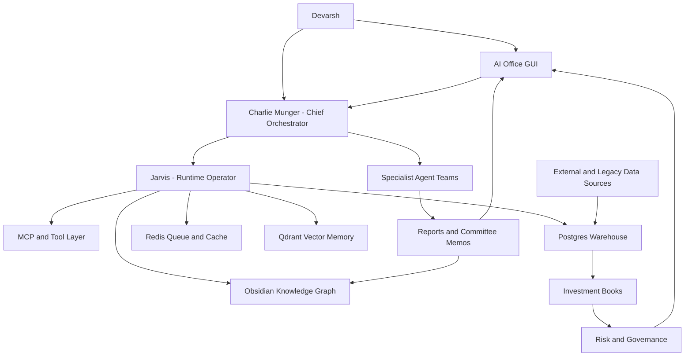
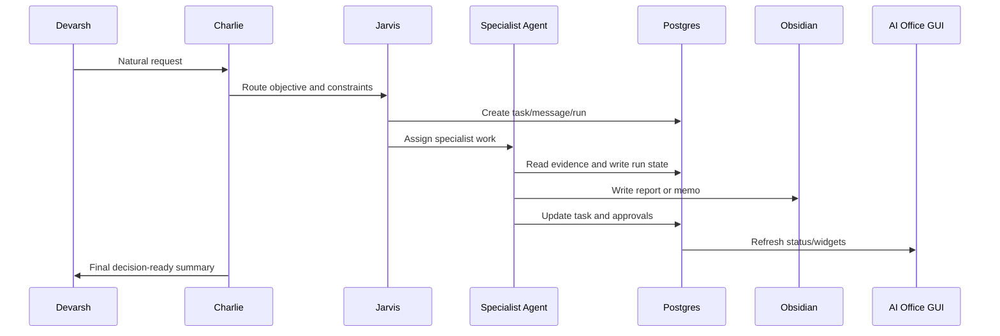
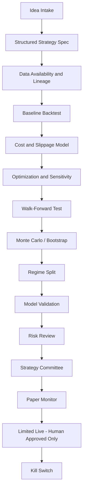
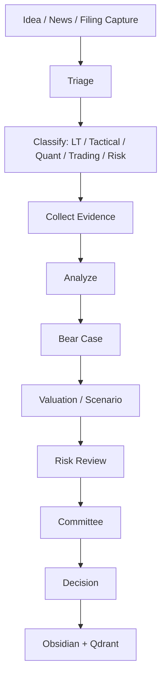

# AI Investment OS - Master Blueprint v2.0

Date: 2026-07-06
Status: Canonical build constitution
Owner: Devarsh
Chief orchestrator: Charlie Munger
Runtime operator: Jarvis
Memory surface: Obsidian
Live operating surface: AI Office GUI
Runtime workspace: `_ai_os_runtime`

## 1. Final Vision

Build a complete AI-powered investment operating system: a personal hedge fund OS that combines portfolio management, long-term research, active trading, quantitative strategy research, risk control, client folios, live market monitoring, and an animated AI office.

This is not only a chatbot, a trading terminal, a research vault, or a portfolio tracker. It is the operating system for an investment firm.

The finished platform should let Devarsh:

- talk naturally to Charlie Munger as the main assistant and CIO,
- let Jarvis execute tool calls, data pulls, database writes, and workflow dispatch,
- view all clients, holdings, books, strategies, risks, trades, alerts, and research in one GUI,
- see every AI employee, what they are working on, and what they have produced,
- keep all durable research, reports, committee memos, and decisions in Obsidian,
- use Postgres, Qdrant, Redis, and MCP tools as the live data and tool backbone,
- connect old systems such as p2cursor and algo trading databases as data sources,
- connect live sources such as Zerodha/Dhan, TradingView, NSE/BSE filings, news, and crypto/commodity exchanges,
- run long-term investing, tactical investing, quantitative strategies, and active trading as separate books,
- keep all live/paper/manual trades auditable,
- keep execution blocked until human approval, risk approval, and safety gates exist.

The end state is a smarter Bloomberg plus internal hedge fund control room plus AI employee office.

## 2. Non-Negotiable Principles

1. No fake live data. Seed/test data can exist only in clearly marked test fixtures.
2. Every position must belong to a book.
3. Every position must carry a purpose, owner, horizon, thesis, exit criteria, source, and review state.
4. Long-term holdings, quant trades, tactical trades, and active trades must not be mixed into one undifferentiated position.
5. Opposing exposures are allowed only if the system records why they exist.
6. Risk can challenge every book.
7. Capital Allocation sits above all books.
8. Charlie is the visible main orchestrator; Jarvis is the runtime/tool operator.
9. Agents can research, debate, recommend, and monitor, but cannot silently allocate capital or place broker orders.
10. Broker execution is disabled until the execution policy, approvals, kill switches, and audit trail are complete.
11. Obsidian is permanent memory; the GUI is the live workbench.
12. Local/open-source models handle routine work; cloud/frontier models are used only for escalation.
13. Every important result must end as a database record, Obsidian note, dashboard widget, report, or code artifact.
14. Every source must be timestamped and traceable.
15. Repeated errors trigger research before more trial and error.

## 3. High-Level Architecture

## 4. Core System Layers

### 4.1 Data Sources

Legacy/internal:

- p2cursor client data.
- existing algo trading databases.
- old trade journals.
- old Codex/Claude/Cowork research outputs.
- attached Excel/PDF broker reports.
- manual holdings and transaction entries.

Market and broker:

- Zerodha/Kite.
- Dhan.
- TradingView browser automation and webhooks.
- OpenAlgo read-only market data and analytics.
- OHLCV history for equity, futures, options, crypto, and commodities.
- crypto/commodity exchange connectors for BTC, ETH, gold, silver, and other target instruments.

Research:

- NSE announcements.
- BSE announcements.
- annual reports.
- quarterly results.
- investor presentations.
- concall transcripts.
- corporate actions.
- merger/demerger/reverse merger filings.
- global news.
- Twitter/X and social sources.
- Fincept components.
- Vibe-Trading research patterns.

### 4.2 Warehouse

Postgres is the canonical structured data store.

Required core domains:

- `core`: clients, accounts, instruments, sources.
- `portfolio`: holdings, transactions, prices, snapshots, mark-to-market.
- `books`: investment books, book positions, purposes, theses, exit criteria, conflicts, exposure rollups.
- `strategy`: strategy ideas, candidates, backtests, optimizations, validation, committee reviews, paper/live state.
- `research`: ideas, notes, filings, transcripts, reports, valuations, catalysts.
- `trading`: manual trades, paper trades, alerts, execution tickets, journal, post-trade reviews.
- `risk`: risk events, limits, breaches, approvals, kill switches.
- `agent`: profiles, skills, characters, mailboxes, messages, tasks, runs, approvals.
- `ops`: dashboard widgets, health checks, data freshness, import logs.

### 4.3 Memory

Obsidian stores durable human-readable memory:

- master blueprint,
- build checklist,
- agent roster,
- committee memos,
- research reports,
- strategy reports,
- trade journal analysis,
- data reconciliation reports,
- daily/weekly/monthly briefs,
- decision logs,
- architecture notes,
- postmortems.

Qdrant stores semantic retrieval vectors over:

- Obsidian notes,
- imported PDFs,
- reports,
- filings,
- transcripts,
- trade journals,
- agent outputs.

### 4.4 Tool Layer

MCP/tool adapters should expose:

- Postgres read/write tools.
- Obsidian read/write tools.
- Qdrant retrieval tools.
- browser/TradingView controller.
- web/news/filing scrapers.
- document/PDF parsers.
- Excel/CSV importers.
- broker read-only importers.
- OpenAlgo read-only analytics.
- Fincept component bridge.
- Vibe-Trading reference workflows.
- report generation.
- dashboard widget updates.

### 4.5 Model Layer

Default rule: cheap local first, cloud only when justified.

Target model routes:

| Route | Default | Escalation | Use |
| --- | --- | --- | --- |
| `jarvis_runtime` | `llama3.2:3b` local | stronger local/cloud | tool routing, summaries, widgets |
| `charlie_munger_orchestration` | `qwen3:4b` or stronger local | frontier model | decision review, challenge, synthesis |
| `research_company_analysis` | local 4B-14B | frontier model | deep company research |
| `filing_analysis` | local 4B-14B | frontier model | long filings, complex transactions |
| `strategy_generation` | local 4B-14B | frontier/coding model | strategy ideas and specs |
| `strategy_backtest` | deterministic Python first | coding model | code generation/debugging |
| `strategy_optimizer` | deterministic Python first | coding model | parameter tests and diagnostics |
| `daily_brief` | local model | cloud only if needed | routine briefs |
| `trade_journal_learning` | local model | frontier model | behavioral analysis |

Model governance:

- log provider/model/cost per run,
- use retrieval before long-context prompting,
- batch non-urgent work,
- require approval for expensive deep research,
- fall back cleanly if local model is unavailable.

## 5. Interaction Model

### 5.1 Primary Human Interface

Devarsh should mostly talk to Charlie:

- "Charlie, add this manual buy for Tushit..."
- "Charlie, review Naval's portfolio..."
- "Charlie, generate intraday strategy ideas from my trade history..."
- "Charlie, open TradingView charts for NIFTY, BANKNIFTY, VIX, and a straddle layout..."
- "Charlie, send this demerger filing to Special Situations..."
- "Charlie, why is Reliance net long but short in the quant book?"

Charlie decides what should happen. Jarvis executes it.

### 5.2 Agent Communication

Agents must communicate through durable channels:

- `agent.messages`: internal email/inbox.
- `agent.tasks`: assigned work.
- `agent.runs`: execution logs.
- `agent.approvals`: gates and sign-offs.
- Obsidian notes: final memos and reports.
- dashboard widgets: live status and outputs.

No important agent decision should exist only inside chat context.

### 5.3 Agent Message Flow

## 6. Investment Books

Each exposure belongs to one primary book. A symbol can appear in multiple books at once.

Required books:

- Long-Term Investing.
- Tactical Investing.
- Quantitative Strategies.
- Active Trading.
- Cash/Treasury.
- Hedges.

### 6.1 Multi-Book Position Model

Each position/trade must store:

- client,
- account,
- instrument,
- book,
- purpose,
- owner,
- direction,
- quantity,
- average cost,
- market value,
- gross exposure,
- net exposure,
- horizon,
- strategy if applicable,
- thesis,
- entry reason,
- exit criteria,
- review cadence,
- risk budget,
- approval state,
- source,
- evidence link,
- related Obsidian note.

Example:

| Book | Direction | Exposure | Purpose | Horizon | Owner |
| --- | ---: | ---: | --- | --- | --- |
| Long-Term | Long | INR 20L | Core compounder | 5-10 years | Long-Term Office |
| Tactical | Flat | INR 0 | No current tactical view | Days-months | Tactical Office |
| Quant | Short | INR 3L | Mean reversion | 5 days | Quant Lab |
| Active Trading | Short | INR 2L | Pre-earnings trade | Intraday-days | Trading Desk |

Portfolio Intelligence must show:

- gross long,
- gross short,
- net exposure,
- book exposure,
- strategy exposure,
- purpose exposure,
- offset ratio,
- conflict reason,
- risk flags,
- whether the offset is hedge or independent alpha.

## 7. Long-Term Investing Office

Purpose: own exceptional businesses for years and compound capital through ownership.

Horizon: 3 to 15 years.

### 7.1 Long-Term Required Checks

Business and industry:

- business model clarity,
- segment economics,
- revenue drivers,
- unit economics,
- industry structure,
- market size and growth,
- competitive intensity,
- customer power,
- supplier power,
- substitutes,
- regulatory structure,
- disruption risk.

Moat and quality:

- brand,
- switching costs,
- network effects,
- cost advantage,
- distribution advantage,
- scale economics,
- asset advantage,
- ROIC durability,
- reinvestment runway,
- margin durability,
- cash conversion,
- free cash flow quality.

Management and governance:

- promoter quality,
- capital allocation record,
- related-party transactions,
- remuneration,
- share pledges,
- acquisitions,
- buybacks/dividends,
- minority shareholder treatment,
- accounting aggressiveness.

Financial and accounting:

- revenue quality,
- margin bridge,
- working capital,
- debt maturity,
- liquidity stress,
- contingent liabilities,
- auditor notes,
- cash flow vs reported profit,
- balance sheet stress,
- cyclicality.

Valuation:

- owner earnings,
- DCF,
- reverse DCF,
- PE/EV EBITDA/FCF yield,
- peer comparison,
- historical valuation,
- bull/base/bear cases,
- expected CAGR,
- downside scenario,
- margin of safety.

Portfolio fit:

- position size,
- sector exposure,
- single-name concentration,
- correlation,
- opportunity cost,
- client suitability,
- review frequency.

Exit discipline:

- thesis killer,
- management deterioration,
- accounting concern,
- capital allocation deterioration,
- valuation extreme,
- better opportunity,
- risk budget breach.

Monte Carlo:

- revenue growth distribution,
- margin distribution,
- reinvestment rate,
- terminal multiple,
- drawdown path,
- expected return distribution,
- probability of permanent capital impairment.

### 7.2 Long-Term Agents

- Long-Term Portfolio Manager.
- Company Analyst.
- Industry Analyst.
- Management Analyst.
- Financial Statement Analyst.
- Valuation Agent.
- Forensic Accounting Agent.
- Filings and Transcript Analyst.
- Bear Case Agent.
- Quality Score Agent.
- Capital Allocation Agent.
- Portfolio Fit Agent.
- Risk Agent reviewer.
- Charlie final reviewer.

### 7.3 Long-Term Committee

Members:

- Charlie Munger, chair.
- Long-Term Portfolio Manager.
- Company Analyst.
- Financial Statement Analyst.
- Management Analyst.
- Valuation Agent.
- Bear Case Agent.
- Risk Agent.
- Capital Allocation Officer.

Decision states:

- reject,
- research more,
- watchlist,
- starter position,
- buy,
- add,
- hold,
- trim,
- sell.

Outputs:

- long-term research note,
- thesis card,
- valuation memo,
- bear case memo,
- committee memo,
- approval/rejection record,
- next review task.

## 8. Tactical Investing Office

Purpose: capture medium-term moves using catalysts, sector rotation, earnings, valuation gaps, macro changes, sentiment, and temporary hedges around core holdings.

Horizon: days to months.

Required checks:

- catalyst definition,
- event window,
- support/resistance,
- trend and relative strength,
- volume/liquidity,
- volatility regime,
- options IV/OI if relevant,
- macro/sector backdrop,
- overlap with long-term book,
- hedge vs independent alpha,
- expected value,
- stop,
- target,
- time exit,
- cost/tax impact,
- sizing,
- review schedule.

Agents:

- Tactical Portfolio Manager.
- Catalyst Analyst.
- Event Analyst.
- Technical Analyst.
- Macro Analyst.
- Sentiment Analyst.
- Options Overlay Agent.
- Sector Rotation Agent.
- Risk reviewer.

Committee:

- Tactical Portfolio Manager presents.
- Technical/Macro/Catalyst agents provide evidence.
- Risk checks overlap and sizing.
- Capital Allocation approves budget.
- Charlie decides approve/watch/reject.

## 9. Quantitative Strategies Book

Purpose: build, test, monitor, and govern systematic strategies.

Horizon: intraday to months.

Strategy families:

- momentum,
- mean reversion,
- trend following,
- pairs/statistical arbitrage,
- cross-sectional factors,
- options strategies,
- volatility strategies,
- regime models,
- ML signals,
- event-driven systematic screens,
- trade-journal-derived behavioral patterns.

### 9.1 Strategy Lifecycle

Required checks:

- hypothesis clarity,
- universe definition,
- data source and lineage,
- survivorship bias,
- lookahead bias,
- corporate actions,
- transaction costs,
- slippage,
- liquidity/capacity,
- signal formula,
- sizing,
- stops/exits,
- benchmark,
- in-sample/out-of-sample,
- walk-forward,
- bootstrap/Monte Carlo,
- parameter stability,
- sensitivity heatmap,
- factor attribution,
- regime dependence,
- drawdown/tail risk,
- strategy correlation,
- live/backtest drift,
- paper trading plan,
- kill switch.

Agents:

- Strategy Generator.
- Strategy Intake Agent.
- Strategy Research Agent.
- Data Scientist.
- Feature Engineer.
- Backtest Engineer.
- Optimizer Agent.
- Regime Analyst.
- Model Validation Agent.
- Risk Agent reviewer.
- Execution Safety Agent.
- Strategy Committee Secretary.

Strategy Committee members:

- Strategy Generator.
- Strategy Research Agent.
- Backtest Engineer.
- Optimizer Agent.
- Model Validation Agent.
- Risk Agent.
- Execution Safety Agent.
- Charlie Munger.

Decision states:

- reject,
- needs data,
- needs rewrite,
- backtest,
- optimize,
- validate,
- paper trade,
- limited live,
- disable.

## 10. Active Trading Book

Purpose: discretionary intraday, options, futures, and short-term trades. It must stay separate from quant and long-term performance.

Horizon: intraday to days.

Required checks:

- setup classification,
- entry trigger,
- stop loss,
- target,
- time exit,
- instrument selection,
- options/futures contract details,
- IV/OI and Greeks when relevant,
- spread/liquidity,
- position size,
- overnight risk,
- event risk,
- margin/leverage,
- conflict with other books,
- journal tags,
- post-trade review.

Agents:

- Trading Desk Agent.
- Market Microstructure Agent.
- Options Analyst.
- Futures Analyst.
- Intraday Technical Agent.
- Volatility Agent.
- Trade Journal Learning Agent.
- Execution Safety Agent.
- Risk reviewer.

Outputs:

- trade ticket draft,
- manual trade record,
- paper trade record,
- TradingView chart task,
- alert rule,
- risk flag,
- post-trade review,
- journal lesson.

## 11. Cash, Treasury, And Hedges

Cash/Treasury tracks:

- cash balances,
- idle cash,
- collateral,
- margin,
- sweep instruments,
- liquidity needs,
- client-level cash constraints.

Hedges track:

- portfolio hedges,
- index hedges,
- sector hedges,
- options hedges,
- currency/commodity hedges,
- hedge intent,
- hedge ratio,
- cost of carry,
- expiry,
- unwind rule.

Risk must distinguish:

- intentional hedge,
- accidental self-offset,
- independent alpha trade,
- capital inefficiency.

## 12. Capital Allocation Office

Purpose: decide how total capital is distributed across books and clients.

Core controls:

- target capital by book,
- actual capital by book,
- book risk budgets,
- max single-name exposure,
- max sector exposure,
- max factor exposure,
- max strategy exposure,
- max drawdown,
- max leverage,
- liquidity constraints,
- client suitability constraints.

Agents:

- Capital Allocation Officer.
- Portfolio Manager.
- Performance Attribution Agent.
- Book Controller.
- Cash/Treasury Agent.
- Risk Agent.
- Charlie Munger.

Outputs:

- book capital allocation,
- rebalance recommendation,
- risk budget update,
- exposure freeze,
- capital increase/decrease,
- cross-book conflict memo.

## 13. Risk Office

Risk is independent and can block.

Required risk analytics:

- gross exposure,
- net exposure,
- sector exposure,
- factor exposure,
- strategy exposure,
- single-name concentration,
- book drawdown,
- VaR,
- expected shortfall,
- stress tests,
- scenario analysis,
- Monte Carlo portfolio paths,
- drawdown simulation,
- correlation clusters,
- liquidity risk,
- gap risk,
- options Greeks,
- margin/leverage,
- book attribution,
- strategy correlation,
- client suitability.

Risk flags:

- over-hedging,
- self-offsetting trade,
- missing thesis,
- missing exit criteria,
- missing approval,
- stale price,
- stale research,
- strategy validation gap,
- broker execution attempted without approval,
- live data source stale,
- client constraint breach.

Risk Committee:

- Risk Agent chair for risk items.
- Capital Allocation Officer.
- Portfolio Manager.
- Quant Validation Agent.
- Execution Safety Agent.
- Charlie Munger.

Decision states:

- clear,
- monitor,
- reduce,
- freeze,
- block,
- escalate to human.

## 14. Research Factory

Purpose: convert ideas, filings, news, screens, and trade observations into evidence-backed decisions.

Pipeline:

Research sources:

- NSE/BSE filings,
- annual reports,
- quarterly results,
- investor presentations,
- transcripts,
- global news,
- social/Twitter/X,
- sector reports,
- internal notes,
- trade journals,
- quant screens,
- Fincept research components,
- Vibe-Trading reference workflows.

Special situations coverage:

- mergers,
- demergers,
- reverse mergers,
- buybacks,
- delisting,
- open offers,
- rights issues,
- warrants/preference shares,
- asset sales,
- promoter changes,
- holding company discounts,
- liquidation/value unlocks,
- regulatory/tribunal events,
- arbitrage spreads.

Outputs:

- company note,
- industry note,
- filing note,
- special situation memo,
- catalyst note,
- valuation memo,
- bear case,
- thesis update,
- committee memo,
- watchlist action.

## 15. Agent Organization

### 15.1 Executive Office

- Charlie Munger: chief orchestrator, final reviewer, mental models, brutal truth, opportunity cost, inversion.
- Jarvis: runtime/COO, tool calls, database writes, retrieval, workflow dispatch, dashboard updates.

### 15.2 Portfolio Office

- Portfolio Manager.
- Long-Term Portfolio Manager.
- Tactical Portfolio Manager.
- Capital Allocation Officer.
- Performance Attribution Agent.
- Book Controller.
- Cash/Treasury Agent.

### 15.3 Research Division

- Research Analyst.
- Company Analyst.
- Industry Analyst.
- Management Analyst.
- Financial Statement Analyst.
- Valuation Agent.
- Forensic Accounting Agent.
- Filings and Transcript Analyst.
- News Analyst.
- Special Situations Agent.
- Bear Case Agent.
- Quality Score Agent.

### 15.4 Quant Division

- Strategy Generator.
- Strategy Intake Agent.
- Strategy Research Agent.
- Data Scientist.
- Feature Engineer.
- Backtest Engineer.
- Optimizer Agent.
- Regime Analyst.
- Model Validation Agent.
- Strategy Committee Secretary.

### 15.5 Trading Division

- Trading Desk Agent.
- Options Analyst.
- Futures Analyst.
- Intraday Technical Agent.
- Volatility Agent.
- Market Microstructure Agent.
- Trade Journal Learning Agent.
- Execution Safety Agent.

### 15.6 Risk And Compliance

- Risk Agent.
- Compliance Agent.
- Audit Agent.
- Kill Switch Agent.
- Client Suitability Agent.

### 15.7 Data, Knowledge, And Engineering

- Data Steward.
- Data Engineer.
- Data Quality Agent.
- Knowledge Librarian.
- Obsidian Curator.
- Browser Research Runner.
- MCP Connector Engineer.
- Automation Engineer.
- UI Engineer.
- Backend Engineer.
- Model Runtime Engineer.

## 16. Committees

Committees are not chat discussions. They are structured workflows with tasks, messages, votes, evidence, memos, and approval states.

### 16.1 Investment Committee

Scope: long-term buys/adds/trims/sells and major client-facing investment decisions.

Required memo sections:

- business summary,
- thesis,
- evidence,
- valuation,
- bear case,
- risks,
- portfolio fit,
- expected return,
- exit criteria,
- vote,
- Charlie final decision.

### 16.2 Strategy Committee

Scope: quant strategy promotion from idea to backtest, paper, or limited live.

Required memo sections:

- hypothesis,
- data lineage,
- backtest metrics,
- costs/slippage,
- optimization,
- walk-forward,
- Monte Carlo/bootstrap,
- regime split,
- validation objections,
- risk review,
- execution constraints,
- recommended decision.

### 16.3 Risk Committee

Scope: blocking or approving material risk changes.

Required memo sections:

- trigger,
- exposure impact,
- drawdown/tail risk,
- client impact,
- conflict analysis,
- proposed action,
- block/clear/monitor decision.

### 16.4 Trade Review Committee

Scope: active trading and post-trade learning.

Required memo sections:

- setup,
- execution quality,
- risk discipline,
- journal lesson,
- rule violation,
- repeatable edge,
- next behavior change.

### 16.5 Data Quality Committee

Scope: source reliability, stale data, import reconciliation, and "no fake live data" enforcement.

Required memo sections:

- affected source,
- freshness,
- reconciliation issues,
- downstream impact,
- fix owner,
- verification.

## 17. External Components And How We Use Them

### 17.1 Fincept

Use as a component/reference layer for:

- research UI patterns,
- report builder concepts,
- news/RSS schema,
- options/IV/OI structures,
- alpha arena/quant lab ideas,
- tool registry and MCP patterns,
- historical data store ideas.

Fincept does not replace:

- AI OS warehouse,
- Charlie/Jarvis operating layer,
- Obsidian memory,
- risk approvals,
- custom portfolio/book engine.

### 17.2 OpenAlgo

Use for:

- read-only market data,
- historical OHLCV,
- options chain analytics,
- indicators,
- WebSocket streaming,
- backtesting components.

Execution remains blocked until governance is complete.

### 17.3 Vibe-Trading

Use for:

- research autopilot patterns,
- multi-agent investment committee patterns,
- options analysis ideas,
- trade journal/shadow account learning,
- run library/reporting patterns,
- safety runtime patterns.

### 17.4 Other Repos

Dexter, OpenAlice, indicator libraries, and similar projects are references/components, not the core product. The core product remains the AI Investment OS data spine, agent office, books, risk layer, and GUI.

## 18. MCP And Browser Automation

Required MCP/tool groups:

- Postgres query/read/write with approval policy.
- Obsidian note read/write/index.
- Qdrant semantic retrieval.
- browser control for research and TradingView.
- TradingView chart/layout/screenshot tasks.
- NSE/BSE filing collectors.
- global news collectors.
- Twitter/X capture/triage where available.
- PDF/document parsers.
- Excel/broker importers.
- OpenAlgo read-only adapter.
- Fincept component adapter.
- Vibe reference adapter.
- report generator.
- notification/alert sender.

TradingView tasks:

- open symbol chart,
- open multi-chart layout,
- open NIFTY/BANKNIFTY/VIX/options chart set,
- create straddle/strangle chart workflow where possible,
- capture screenshot,
- store artifact path,
- link task to agent/user request.

## 19. Live AI Office GUI

The GUI is the primary daily workbench.

Top-level areas:

- Command Center.
- AI Office Floor.
- Portfolio Office.
- Client Folios.
- Book Exposure.
- Symbol Intelligence.
- Long-Term Office.
- Tactical Office.
- Research Factory.
- Quant Lab.
- Strategy Monitor.
- Trading Desk.
- Risk Center.
- Reports.
- Knowledge Vault.
- System Health.

AI Office Floor requirements:

- department rooms,
- employee avatars/characters,
- hover card per agent,
- current task,
- mailbox unread count,
- model route,
- tool-use badge,
- active run state,
- arrows/messages between agents,
- committee room,
- live activity feed,
- alert board,
- approval board,
- click-through to tasks, notes, reports, and profiles.

## 20. Dashboard Requirements

Command Center:

- daily brief,
- market status,
- agent inbox,
- approvals,
- data health,
- open risks,
- strategy alerts,
- portfolio changes,
- "what changed today" button.

Portfolio Intelligence:

- AUM,
- client/account allocation,
- book exposure,
- gross/net exposure,
- sector/factor concentration,
- symbol intelligence,
- conflict flags,
- missing thesis/exit criteria,
- mark-to-market,
- performance attribution.

Long-Term Office:

- holdings by thesis state,
- stale reviews,
- quality scores,
- valuation ranges,
- thesis killers,
- committee queue.

Quant Lab:

- strategy intake,
- candidate queue,
- backtest library,
- optimization results,
- heatmaps,
- walk-forward,
- Monte Carlo/bootstrap,
- validation queue,
- committee gate.

Trading Desk:

- active signals,
- TradingView tasks,
- manual/paper trades,
- options/IV/OI,
- alerts,
- post-trade reviews,
- overnight risk.

Risk Center:

- limit breaches,
- concentration,
- self-offsets,
- drawdowns,
- stale data,
- missing approval,
- kill switches.

## 21. Reports

Required reports:

- daily market brief,
- daily portfolio brief,
- daily agent activity brief,
- weekly book performance report,
- weekly research pipeline report,
- weekly strategy lab report,
- weekly risk report,
- monthly client report,
- monthly performance attribution,
- monthly capital allocation review,
- company research report,
- special situation memo,
- strategy report,
- trade journal review,
- committee minutes.

Reports must contain:

- source links,
- generated time,
- owner,
- decision state,
- evidence,
- limitations,
- next actions.

## 22. Security, Governance, And Safety

Execution policy:

- read-only by default,
- manual/paper trade allowed only with audit trail,
- broker write disabled until approved,
- live execution requires human approval, risk approval, execution safety approval, and kill switch.

Audit:

- every data import logged,
- every agent write logged,
- every approval logged,
- every model run logged,
- every external tool action logged,
- every report linked back to sources.

Data safety:

- external SSD stores runtime data,
- backups required,
- restore test required,
- no internal disk bloat,
- credentials stored outside notes,
- client data access scoped.

## 23. Build Roadmap

### Phase 0: Constitution And Tracker

- master blueprint v2,
- implementation checklist v2,
- document versioning,
- decision log format,
- committee memo templates.

### Phase 1: Foundation Hardening

- reliable Docker/Postgres/Redis/Qdrant,
- reliable local model runtime,
- backup/restore,
- health dashboard,
- Obsidian/Qdrant indexing schedule.

### Phase 2: Portfolio Brain

- multi-book schema,
- book/purpose assignment,
- symbol intelligence,
- exposure rollups,
- conflict flags,
- manual/broker trade capture,
- mark-to-market.

### Phase 3: Research Factory

- company/filing/special situation schemas,
- NSE/BSE collectors,
- news collectors,
- research templates,
- investment committee workflow.

### Phase 4: Quant And Strategy Arsenal

- strategy intake,
- backtesting,
- optimization,
- Monte Carlo/bootstrap,
- walk-forward,
- regime split,
- validation,
- committee memos,
- paper monitor.

### Phase 5: Trading Desk

- manual/paper trade workflow,
- TradingView controller,
- options analytics,
- alert monitor,
- post-trade learning,
- execution safety gate.

### Phase 6: AI Office GUI

- office floor,
- dashboards,
- agent hover cards,
- committee room,
- approval board,
- report explorer.

### Phase 7: Production Governance

- risk limits,
- capital allocation,
- client reporting,
- broker execution policy,
- kill switches,
- monitoring,
- cost controls.

## 24. Definition Of Done For The Platform

The platform is not complete until:

- all live holdings are mapped to client, account, book, purpose, thesis, and exit criteria,
- all trades are logged as manual, paper, strategy, or broker imported,
- every strategy has backtest, validation, risk review, and committee state,
- every agent has profile, mailbox, skill map, model route, and output trail,
- every committee has structured memo, members, vote, and decision state,
- dashboard reflects database truth with no fake live data,
- Obsidian stores durable reports and decisions,
- Qdrant retrieves relevant memory reliably,
- TradingView tasks are controllable and logged,
- news/filings are collected and triaged,
- local model runtime is reliable,
- cloud escalation is cost-gated,
- broker execution is blocked unless all policy gates pass,
- backup and restore are tested,
- Devarsh can run the daily office from one GUI and one Charlie conversation.

