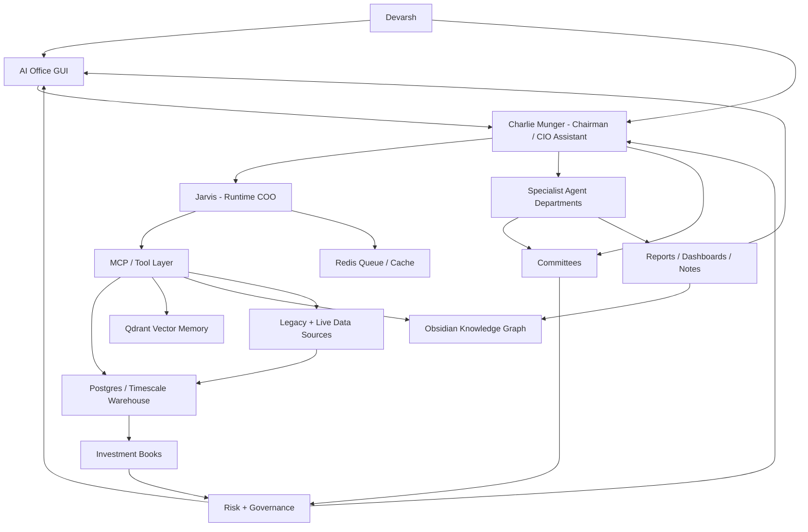

# AI Investment OS - Master Blueprint v5.0

Date: 2026-07-06
Owner: Devarsh
System goal: Complete AI hedge fund / investment operating system
Primary interaction: Charlie Munger conversation plus AI Office GUI
Runtime operator: Jarvis
Permanent memory: Obsidian vault
Structured source of truth: Postgres / Timescale-style warehouse
Semantic retrieval: Qdrant
Queue/cache: Redis
Runtime workspace: `_ai_os_runtime`
Checklist: [[AI Investment OS - Master Build Checklist v5.0]]
Status: Canonical product and architecture blueprint before next implementation phase

## 1. Executive Vision

Build a full AI Investment Operating System: a smarter Bloomberg, a hedge fund control room, a research factory, a portfolio manager, a trading desk, a risk office, a strategy lab, a client folio system, and a live animated AI office in one platform.

The system is not just:

- a chatbot,
- a dashboard,
- a broker terminal,
- a backtester,
- a portfolio tracker,
- a note-taking vault,
- or a collection of agents.

It is the operating system for an investment organization. It must manage capital, research, evidence, decisions, actions, risk, and institutional memory.

The final system must let Devarsh:

- talk to Charlie Munger as the main assistant, chairman, challenger, and final decision reviewer,
- let Jarvis run tools, route work, retrieve context, update records, write approved notes, and refresh dashboards,
- manage client folios, long-term positions, tactical trades, quant strategies, active trading, cash, hedges, crypto, commodities, futures, and options in one coherent framework,
- understand every position by book, purpose, owner, horizon, thesis/setup, exit logic, source, and approval state,
- keep Long-Term, Tactical, Quant, and Active Trading books independent while still coordinating risk and capital,
- ingest p2cursor, old algo systems, broker exports, trade journals, live market data, filings, news, reports, Codex outputs, Claude/Cowork outputs, and manual updates,
- generate ideas, research them, challenge them, test them, approve or reject them, and monitor them after action,
- run strategy backtests, optimizers, walk-forward tests, Monte Carlo diagnostics, paper monitors, limited-live gates, and kill switches,
- produce client-ready reports, research memos, committee minutes, daily briefs, weekly risk reports, and postmortems,
- view a live AI office where every employee has a role, personality, mailbox, task state, model route, tool permissions, current work, and output history,
- use local/open-source models for cheap daily work and frontier/cloud models only for escalation,
- keep all live broker execution disabled until human approval, risk approval, order approval, and kill-switch controls are proven.

The system should scale from a personal investment workstation to a family-office platform and then to a multi-strategy investment firm.

## 2. Non-Negotiable Principles

1. No fake live data in production views.
2. Seed/demo data must be labeled and isolated from production dashboards.
3. Every position belongs to one or more explicit books.
4. Every position has a purpose.
5. Every position has owner, horizon, source, thesis/setup, and exit criteria.
6. Long-term ownership is not invalidated by short-term bearish signals.
7. Quant trades are judged by tested rules, not discretionary love for a business.
8. Active trades are evaluated separately from long-term investment decisions.
9. Tactical trades must state whether they are hedges, alpha trades, or position-management actions.
10. Capital Allocation Office sits above every investment book.
11. Risk Office can challenge or block every workflow.
12. Charlie recommends, challenges, and chairs decisions.
13. Jarvis operates tools and runtime workflows.
14. Specialist agents own specialist work.
15. Agents communicate through durable messages, tasks, approvals, runs, and notes.
16. No major decision can live only in chat.
17. Obsidian is durable memory.
18. Postgres is the structured source of truth.
19. Qdrant is retrieval memory, not accounting.
20. Data freshness, lineage, and reconciliation are required for every important claim.
21. Repeated errors must be researched before more trial-and-error.
22. External repos are useful components and references, not the product core.
23. Live execution remains blocked until the evidence path proves safety.
24. Human remains in control.

## 3. Core System Shape

## 4. Main Interaction Model

### 4.1 Devarsh To Charlie

Charlie is the first operating layer. Devarsh should be able to type or speak natural requests:

- "Review Tushit's folio and tell me what changed."
- "Add this buy to the Long-Term book and create a thesis gap task."
- "Why do we own Usha Martin across clients?"
- "Can we short Reliance in the Quant book while owning it long term?"
- "Open NIFTY, BANKNIFTY, VIX, and options straddle charts in TradingView."
- "Scan NSE/BSE filings for buybacks, demergers, reverse mergers, delistings, and preferential issues."
- "Generate new intraday strategies from my old trade journals."
- "Run optimizer and Monte Carlo on this strategy, then send it to committee."
- "Create a client-ready monthly portfolio report."

Charlie must answer with:

- direct conclusion,
- evidence used,
- source freshness,
- agents consulted,
- risks and missing data,
- dashboard/widgets updated,
- notes or reports written,
- decisions required,
- next recommended action.

### 4.2 Charlie To Jarvis

Jarvis converts Charlie's intent into runtime actions:

- query Postgres,
- retrieve Qdrant context,
- read/write Obsidian notes,
- call MCP tools,
- launch browser/TradingView tasks,
- create agent tasks,
- update dashboard widgets,
- write audit logs,
- request approval where needed.

Jarvis is not the investment brain. Jarvis is the operating layer.

### 4.3 Agent Communication

Agents must not only respond in chat. They need an institutional communication fabric:

- mailbox per agent,
- task queue per agent,
- message threads,
- run logs,
- handoffs,
- approvals,
- comments on decisions,
- source/evidence attachments,
- committee minutes,
- output notes.

Required tables:

- `agent.profiles`
- `agent.departments`
- `agent.skills`
- `agent.messages`
- `agent.tasks`
- `agent.runs`
- `agent.approvals`
- `agent.comments`
- `agent.output_artifacts`
- `agent.model_routes`
- `agent.tool_permissions`

Required communication states:

- drafted,
- sent,
- acknowledged,
- in_progress,
- blocked,
- waiting_for_data,
- waiting_for_human,
- review_required,
- approved,
- rejected,
- archived.

## 5. Operating Surfaces

### 5.1 AI Office GUI

The GUI is the daily workbench. It should be dense, fast, and operational.

Required top-level views:

- Command Center
- Charlie Chat
- Portfolio Intelligence
- Client Folios
- Symbol Intelligence
- Long-Term Office
- Tactical Office
- Quant Lab
- Active Trading Desk
- Strategy Monitor
- Research Factory
- Special Situations Desk
- News and Filings
- Risk Center
- Capital Allocation
- Reports
- Agent Office
- Committee Room
- Approval Board
- Data Sources
- Model Runtime
- System Health

### 5.2 Animated AI Office

The animated office is not decoration. It is a real-time visualization of the agent organization.

Required features:

- department rooms,
- employee avatars,
- role/personality hover cards,
- current task per employee,
- unread mailbox badges,
- active run badges,
- model route badges,
- tool-use badges,
- message arrows between agents,
- committee room,
- approval board,
- live activity feed,
- risk alerts,
- click-through to task, run, output, and source evidence,
- productivity/reliability metrics per department.

Required departments:

- Executive Office
- Portfolio Office
- Long-Term Research
- Tactical Desk
- Quant Lab
- Trading Desk
- Risk Office
- Capital Allocation Office
- Research Factory
- News and Filings Desk
- Data Engineering
- AI Engineering
- Software Engineering
- Automation and Integrations
- Knowledge Division
- Client Office
- Finance and Administration

### 5.3 Obsidian Knowledge Graph

Obsidian is the permanent research and decision memory.

Required note classes:

- company research note,
- thesis card,
- valuation memo,
- filing analysis,
- transcript analysis,
- special situation memo,
- strategy memo,
- backtest report,
- optimization report,
- model validation report,
- risk memo,
- committee minutes,
- daily brief,
- weekly brief,
- client report,
- decision log,
- postmortem,
- architecture note,
- runbook.

Graph rules:

- company notes link to filings, valuations, holdings, strategies, tasks, and committee decisions,
- strategy notes link to candidates, rules, datasets, backtests, optimizers, validation, paper monitors, and kill switches,
- client notes link to accounts, holdings, transactions, book exposure, reviews, and reports,
- agent output notes link to task IDs, run IDs, sources, and decision state,
- committee notes link to memos, votes, open questions, approvals, and final decisions.

## 6. Data Spine

### 6.1 Source Categories

Legacy/internal:

- p2cursor client data,
- p2cursor buy/sell dates,
- existing algo trading system databases,
- historical equity curves,
- price data,
- strategy records,
- attached broker Excel/PDF reports,
- old 2018-19 trade journals,
- recent transaction reports,
- client holdings PDFs,
- old Codex outputs,
- old Claude/Cowork outputs,
- manually entered holdings,
- manually entered trades,
- manual strategy definitions,
- manual research notes.

Broker/market:

- Zerodha/Kite read-only first,
- Dhan read-only first,
- TradingView browser controller,
- TradingView webhooks,
- OpenAlgo read-only bridge,
- OHLCV for equities,
- intraday OHLCV,
- futures data,
- options chain,
- OI,
- IV,
- Greeks,
- futures basis,
- volatility indexes,
- crypto exchange connector,
- commodities connector for gold, silver, and selected instruments.

Research/news:

- NSE announcements,
- BSE announcements,
- annual reports,
- quarterly results,
- investor presentations,
- concall transcripts,
- credit rating notes,
- corporate actions,
- demergers,
- reverse mergers,
- mergers,
- buybacks,
- delistings,
- rights issues,
- preferential issues,
- global news,
- India business news,
- Twitter/X/social signals,
- broker reports if available,
- Fincept components,
- Vibe-Trading workflow references.

### 6.2 Warehouse Schemas

Postgres is the canonical structured source of truth.

Required schemas:

- `core`: clients, accounts, instruments, source registry, connector registry, import runs.
- `portfolio`: holdings, transactions, prices, snapshots, mark-to-market, reconciliation.
- `books`: books, book positions, purposes, theses, exit criteria, cross-book conflicts.
- `strategy`: ideas, candidates, rules, datasets, backtests, optimization, validation, paper/live state.
- `research`: ideas, filings, transcripts, news, reports, valuations, catalysts, special situations.
- `trading`: manual trades, paper trades, alerts, order intents, execution tickets, post-trade reviews.
- `risk`: limits, breaches, approvals, stress tests, kill switches, exposure checks.
- `agent`: employees, departments, skills, model routes, messages, tasks, runs, approvals.
- `ops`: widgets, health checks, freshness checks, imports, costs, system status.
- `audit`: immutable logs for imports, edits, decisions, model calls, and approvals.

### 6.3 Data Quality Rules

Every important row must carry:

- source system,
- source path/URL/API,
- import run ID,
- ingest timestamp,
- freshness timestamp,
- raw artifact reference,
- normalized table row,
- parser version,
- confidence score if AI-parsed,
- reconciliation status,
- human override log,
- last verified timestamp.

No portfolio, signal, valuation, or risk claim is final unless it can point to source data or a manual human entry.

## 7. Multi-Book Portfolio Architecture

### 7.1 Core Books

Primary investment books:

1. Long-Term Investing
2. Tactical Investing
3. Quantitative Strategies
4. Active Trading

Supporting books:

5. Cash/Treasury
6. Hedges

Future optional books:

- Special Situations
- Options Income
- Crypto/Commodity Macro
- Client-Specific Mandate Books
- Experimental Research Book

### 7.2 Position Object

Every position must store:

- client,
- account,
- instrument,
- symbol,
- book,
- sub-book,
- direction,
- quantity,
- notional,
- cost basis,
- current value,
- realized P&L,
- unrealized P&L,
- purpose,
- owner,
- time horizon,
- thesis/setup,
- entry reason,
- exit criteria,
- stop/target/time exit if trading,
- review frequency,
- source,
- approval state,
- risk budget consumed,
- capital budget consumed,
- linked research notes,
- linked strategy,
- linked committee decision,
- linked tasks.

### 7.3 Opposing Exposures

The system must support and explain opposing exposures.

Example:

| Book | Direction | Exposure | Purpose | Horizon | Owner |
| --- | ---: | ---: | --- | --- | --- |
| Long-Term | Long | INR 20L | Core compounder | 5-10 years | Long-Term Office |
| Tactical | Flat | INR 0 | No event view | Days-months | Tactical Office |
| Quant | Short | INR 3L | Mean reversion signal | 5 days | Quant Lab |
| Active Trading | Short | INR 2L | Pre-earnings trade | Intraday-days | Trading Desk |

Portfolio Intelligence must show:

- gross long,
- gross short,
- net exposure,
- exposure by book,
- exposure by strategy,
- exposure by client,
- hedge ratio,
- offset cost,
- whether offsetting is intentional,
- concentration impact,
- risk budget used,
- capital budget used,
- latest thesis status,
- latest committee status.

Risk Office must flag:

- accidental offsetting,
- near-total offset of a core holding,
- excessive churn,
- hidden leverage,
- client suitability conflicts,
- concentration breaches,
- margin or liquidity concerns.

## 8. Portfolio Intelligence Engine

Purpose: central brain for exposure, purpose, performance, and risk.

Required calculations:

- holdings,
- transactions,
- manual trades,
- paper trades,
- open orders,
- average cost,
- market value,
- realized P&L,
- unrealized P&L,
- gross exposure,
- net exposure,
- book exposure,
- strategy exposure,
- purpose exposure,
- client/account exposure,
- sector exposure,
- market-cap exposure,
- factor exposure,
- beta,
- volatility,
- drawdown,
- VaR,
- expected shortfall,
- stress loss,
- liquidity risk,
- concentration,
- hedge ratio,
- risk budget used,
- capital budget used,
- performance attribution,
- book attribution,
- strategy attribution,
- decision attribution.

Required drilldowns:

- executive portfolio,
- client folio,
- account,
- symbol,
- book,
- strategy,
- sector,
- risk factor,
- position history,
- thesis history,
- trade history,
- committee history.

## 9. Long-Term Investing Office

Purpose: own exceptional businesses for years and compound capital through ownership.

Horizon: 3-15 years.

### 9.1 Required Long-Term Checks

Business model:

- business model clarity,
- segment economics,
- revenue drivers,
- pricing power,
- unit economics,
- operating leverage,
- customer concentration,
- cyclicality,
- scalability,
- reinvestment runway.

Industry:

- market size,
- growth runway,
- industry structure,
- competitive intensity,
- customer power,
- supplier power,
- substitutes,
- regulation,
- disruption risk,
- profit pool share,
- industry consolidation.

Moat:

- brand,
- switching costs,
- network effects,
- cost advantage,
- distribution advantage,
- scale economics,
- asset advantage,
- license/regulatory advantage,
- ROIC durability,
- margin durability,
- reinvestment runway,
- evidence that moat is widening or narrowing.

Management and governance:

- promoter quality,
- capital allocation record,
- related-party transactions,
- remuneration,
- pledging,
- acquisitions,
- buybacks/dividends,
- minority shareholder treatment,
- board quality,
- auditor quality,
- incentives,
- insider buying/selling,
- communication quality.

Financial statement quality:

- revenue quality,
- margin bridge,
- cash conversion,
- operating cash flow vs PAT,
- free cash flow,
- working capital,
- inventory quality,
- receivables quality,
- debt maturity,
- liquidity stress,
- contingent liabilities,
- auditor notes,
- tax rate quality,
- capex quality,
- related-party transactions,
- accounting changes.

Forensic accounting:

- cash flow mismatch,
- receivables spike,
- inventory build,
- debt hidden through subsidiaries,
- aggressive revenue recognition,
- unusual other income,
- related-party leakage,
- auditor churn,
- promoter pledge changes,
- repeated one-offs,
- capital work-in-progress issues,
- contingent liabilities.

Valuation:

- owner earnings,
- DCF,
- reverse DCF,
- peer comparison,
- historical valuation,
- PE,
- EV/EBITDA,
- EV/Sales,
- FCF yield,
- sum-of-parts,
- replacement value where relevant,
- bull/base/bear scenarios,
- expected CAGR,
- downside case,
- margin of safety,
- valuation sensitivity.

Risk and exit:

- thesis killers,
- management deterioration,
- moat deterioration,
- accounting concern,
- capital allocation deterioration,
- valuation extreme,
- better opportunity,
- permanent impairment risk,
- concentration risk,
- client suitability,
- review frequency,
- sell discipline.

Long-term Monte Carlo:

- revenue growth distribution,
- margin distribution,
- reinvestment rate distribution,
- terminal multiple distribution,
- drawdown path,
- dilution/buyback assumptions,
- debt/capital structure scenarios,
- probability of negative CAGR,
- probability of permanent capital loss,
- expected CAGR distribution,
- downside percentile outcomes,
- base/bull/bear probability weights.

### 9.2 Long-Term Agents

- Long-Term Portfolio Manager: owns long-term book and review cadence.
- Company Analyst: owns company memo and business quality.
- Industry Analyst: owns industry structure and competitive forces.
- Management Analyst: owns promoter, governance, and incentives.
- Financial Statement Analyst: owns accounts, cash flow, debt, and quality.
- Forensic Accounting Agent: tries to find accounting red flags.
- Valuation Agent: builds valuation ranges and expected CAGR.
- Filings and Transcript Analyst: extracts evidence from filings and calls.
- Bear Case Agent: argues against the investment.
- Quality Score Agent: scores moat, management, reinvestment, and durability.
- Portfolio Fit Agent: checks client/book/sector/concentration fit.
- Risk Reviewer: checks downside, liquidity, concentration, and suitability.

### 9.3 Long-Term Committee

Members:

- Charlie Munger, chair,
- Long-Term Portfolio Manager,
- Company Analyst,
- Industry Analyst,
- Financial Statement Analyst,
- Management Analyst,
- Forensic Accounting Agent,
- Valuation Agent,
- Bear Case Agent,
- Risk Agent,
- Capital Allocation Officer,
- Devarsh for human decision.

Committee flow:

1. Research packet created.
2. Analyst memos attached.
3. Valuation range attached.
4. Bear case attached.
5. Risk review attached.
6. Portfolio fit attached.
7. Charlie asks unresolved questions.
8. Committee decision recorded.
9. Human approval required before buy/sell action.

Decision states:

- needs_data,
- under_research,
- watchlist,
- approved_buy,
- approved_hold,
- approved_add,
- approved_trim,
- approved_sell,
- rejected,
- monitor_only.

Required outputs:

- thesis memo,
- valuation memo,
- bear case,
- risk memo,
- committee minutes,
- decision log,
- next review task.

## 10. Tactical Investing Office

Purpose: capture medium-term opportunities from catalysts, events, sector moves, valuation gaps, macro shifts, and portfolio overlays.

Horizon: days to months.

Required checks:

- catalyst identification,
- event date,
- expected path,
- risk/reward,
- stop/target/time exit,
- position sizing,
- Long-Term overlap,
- hedge vs independent alpha flag,
- liquidity,
- options overlay,
- news sensitivity,
- expected holding period,
- invalidation trigger.

Agents:

- Tactical Portfolio Manager,
- Catalyst Analyst,
- Event Analyst,
- Technical Analyst,
- Macro Analyst,
- Sentiment Analyst,
- Options Overlay Agent,
- Sector Rotation Agent,
- Risk Reviewer.

Committee:

- Tactical Committee reviews medium-term ideas and must decide whether the trade is hedge, alpha, or portfolio management.

## 11. Quantitative Strategies Office

Purpose: create, test, validate, allocate, monitor, and retire systematic strategies.

Horizon: intraday to months depending on strategy.

Required strategy lifecycle:

1. Idea intake.
2. Hypothesis statement.
3. Dataset definition.
4. Data-quality check.
5. Rule definition / DSL.
6. Backtest.
7. Cost/slippage model.
8. Train/test split.
9. Walk-forward diagnostics.
10. Parameter sensitivity.
11. Optimizer.
12. Monte Carlo/bootstrap.
13. Regime split.
14. Factor attribution.
15. Correlation to existing strategies.
16. Capacity/liquidity estimate.
17. Model validation.
18. Strategy committee.
19. Paper monitor.
20. Drift monitor.
21. Limited-live approval.
22. Kill-switch monitor.
23. Postmortem and retirement.

Required diagnostics:

- CAGR,
- Sharpe,
- Sortino,
- Calmar,
- max drawdown,
- win rate,
- payoff ratio,
- average trade,
- trade count,
- exposure time,
- turnover,
- slippage sensitivity,
- fee sensitivity,
- parameter stability,
- walk-forward stability,
- drawdown clustering,
- tail loss,
- Monte Carlo path distribution,
- probability of ruin,
- capacity estimate,
- regime robustness.

Agents:

- Strategy Research Agent,
- Data Scientist,
- Feature Engineer,
- Backtesting Engineer,
- Optimizer Agent,
- Model Validation Agent,
- Regime Analyst,
- Capacity/Liquidity Analyst,
- Strategy Committee Secretary,
- Risk Reviewer.

## 12. Active Trading Desk

Purpose: intraday/swing execution, discretionary setups, options/futures trades, and live market response.

Horizon: intraday to days.

Required workflows:

- manual trade entry,
- paper trade entry,
- setup classification,
- stop/target/time exit,
- options payoff,
- IV/OI dashboard,
- straddle/strangle analysis,
- TradingView chart control,
- screenshot artifact capture,
- trade journal,
- post-trade review,
- overnight risk check,
- execution safety gate,
- no live order without approval.

Agents:

- Trading Desk Agent,
- Technical Analyst,
- Options Analyst,
- Futures Analyst,
- Volatility Agent,
- Market Microstructure Agent,
- Trade Journal Coach,
- Execution Safety Agent.

## 13. Research Factory

Purpose: continuously collect, classify, analyze, and route market and corporate information.

Required pipelines:

- NSE filing collector,
- BSE filing collector,
- filing PDF parser,
- annual report parser,
- transcript ingestion,
- news collector,
- Twitter/X/social triage,
- corporate action classifier,
- buyback detector,
- delisting detector,
- demerger detector,
- reverse merger detector,
- merger detector,
- preferential issue detector,
- rights issue detector,
- arbitrage spread tracker,
- special situation memo generator,
- idea intake,
- research queue,
- committee routing.

Agents:

- Research Director,
- News Analyst,
- Filings Analyst,
- Special Situations Analyst,
- Corporate Actions Analyst,
- Arbitrage Analyst,
- Industry Researcher,
- Research Librarian.

Special-situation checks:

- event type,
- record date,
- entitlement,
- consideration,
- spread,
- liquidity,
- regulatory approval,
- promoter intent,
- timeline,
- downside if event fails,
- capital lockup,
- tax/friction,
- committee decision.

## 14. Capital Allocation Office

Purpose: decide how capital and risk budget are distributed across books, strategies, clients, accounts, and opportunities.

Required controls:

- target capital by book,
- actual capital by book,
- risk budget by book,
- drawdown budget,
- max leverage,
- max single-name exposure,
- max sector exposure,
- max factor exposure,
- client suitability,
- opportunity ranking,
- portfolio rebalancing,
- cross-book conflict review,
- capital increase/decrease recommendations,
- performance attribution,
- capital efficiency.

Agents:

- Capital Allocation Officer,
- Performance Attribution Agent,
- Book Controller,
- Client Suitability Agent,
- Rebalancing Agent.

## 15. Risk Office

Purpose: protect capital, enforce process, and prevent sloppy actions.

Risk checks:

- position limits,
- book limits,
- client limits,
- account limits,
- concentration,
- sector exposure,
- factor exposure,
- liquidity,
- leverage,
- margin,
- VaR,
- expected shortfall,
- stress tests,
- scenario analysis,
- gap risk,
- options Greeks,
- correlation clusters,
- strategy correlation,
- model drift,
- data quality,
- operational risk,
- source freshness,
- execution risk,
- compliance/audit.

Risk authority:

- can block strategy activation,
- can block limited-live approval,
- can block broker order intent,
- can require human review,
- can require more evidence,
- can trigger kill switch,
- can demand postmortem.

Agents:

- Chief Risk Officer,
- Quant Risk Analyst,
- Stress Testing Agent,
- Model Risk Agent,
- Data Quality Risk Agent,
- Compliance Agent,
- Audit Agent,
- Kill Switch Agent.

## 16. Model Strategy

Daily low-cost model policy:

- local-first for routine retrieval, summarization, note drafting, and dashboard narration,
- cloud/frontier only for hard reasoning, major investment memos, code escalation, complex multi-document synthesis, and final committee review,
- every agent has model route, max cost, fallback, and escalation rule,
- prompts use retrieval-first context instead of long chat history,
- outputs cite source evidence and missing data.

Suggested route classes:

- `jarvis_runtime`: small local model,
- `daily_brief`: small local model,
- `news_curation`: small local or cheap cloud,
- `trade_journal_learning`: local/hybrid,
- `charlie_munger_orchestration`: strong local or cloud escalation,
- `filing_analysis`: hybrid with cloud escalation for important filings,
- `strategy_generation`: hybrid,
- `model_validation`: stronger local/cloud,
- `investment_committee`: frontier only when material capital decision requires it,
- `coding_escalation`: Codex/frontier as needed.

## 17. External Component Strategy

Fincept:

- use as component/reference for terminal flows, data-source screens, portfolio analytics, economics, backtesting, reports, and option/market-data ideas,
- do not make Fincept the source of truth,
- bridge useful flows into AI OS through controlled adapters.

TradingView:

- use as browser-controlled visual charting surface,
- open chart layouts,
- capture screenshots,
- inspect symbols,
- drive straddle/strangle views,
- receive webhooks/alerts where possible,
- no unsafe broker actions through browser automation.

OpenAlgo:

- use as read-only and strategy adapter reference first,
- execution only after broker gates and kill switches.

Vibe-Trading:

- use as strategy/research workflow reference,
- extract useful agent flow patterns,
- do not merge architecture blindly.

Indicator libraries:

- use proven indicator/backtesting packages instead of hand-rolling standard indicators.

## 18. Production Safety

Execution ladder:

1. Research only.
2. Backtest only.
3. Paper monitor.
4. Limited-live simulation.
5. Limited-live with human approval.
6. Full-live only after repeated evidence, risk approval, and kill-switch validation.

Required gates:

- human approval,
- risk approval,
- model validation,
- source freshness,
- data quality,
- order preview,
- max notional,
- max daily loss,
- max leverage,
- per-strategy kill switch,
- global kill switch,
- broker confirmation,
- audit log.

## 19. Build Phases

Phase 1: Canonical blueprint and checklist.

Phase 2: Foundation hardening:

- data source freshness,
- backup/restore,
- model runtime reliability,
- worker daemon health,
- production/test data separation.

Phase 3: Portfolio Intelligence:

- complete p2cursor extraction,
- complete algo DB import,
- book/purpose/exposure reconciliation,
- client folio pages,
- symbol intelligence.

Phase 4: Long-Term Office:

- thesis workflow,
- valuation workflow,
- committee workflow,
- Monte Carlo,
- research packet generation,
- review cadence.

Phase 5: Research Factory:

- filings/news/social ingestion,
- special situations,
- corporate actions,
- idea pipeline.

Phase 6: Quant Lab:

- strategy DSL,
- data-quality gates,
- robust backtesting,
- optimizer,
- Monte Carlo,
- paper monitors,
- model validation.

Phase 7: Trading Desk:

- TradingView actions,
- options analytics,
- journal learning,
- execution safety.

Phase 8: Risk and Capital Allocation:

- risk limits,
- stress tests,
- capital budget,
- cross-book conflict workflows.

Phase 9: Agent Office:

- agent profiles,
- mailboxes,
- committee room,
- animated office,
- run/output pages.

Phase 10: Client-ready reporting:

- monthly reports,
- investment memos,
- risk reports,
- performance attribution,
- client folio PDFs.

## 20. Whole-System Definition Of Done

The system is done when:

- Devarsh can talk to Charlie and trigger auditable workflows,
- Jarvis can retrieve memory, call tools, write approved outputs, and update dashboards,
- all clients/accounts/holdings/trades are in one reconciled warehouse,
- all positions have book, purpose, owner, thesis/setup, horizon, and exit criteria,
- Portfolio Intelligence shows gross/net/book/strategy/risk exposure,
- Research Factory can ingest filings/news and create committee-ready notes,
- Long-Term Office can produce full thesis, valuation, bear case, Monte Carlo, and review memos,
- Quant Lab can intake, backtest, optimize, validate, paper-monitor, and committee-review strategies,
- Trading Desk can log manual/paper trades and control TradingView tasks,
- Risk Office can block unsafe actions,
- Capital Allocation can allocate capital across books and detect conflicts,
- AI Office GUI shows live agent work, messages, approvals, reports, and widgets,
- Obsidian and Qdrant provide durable memory and retrieval,
- local model runtime is reliable and cloud spend is controlled,
- broker execution remains blocked unless every safety gate passes.
