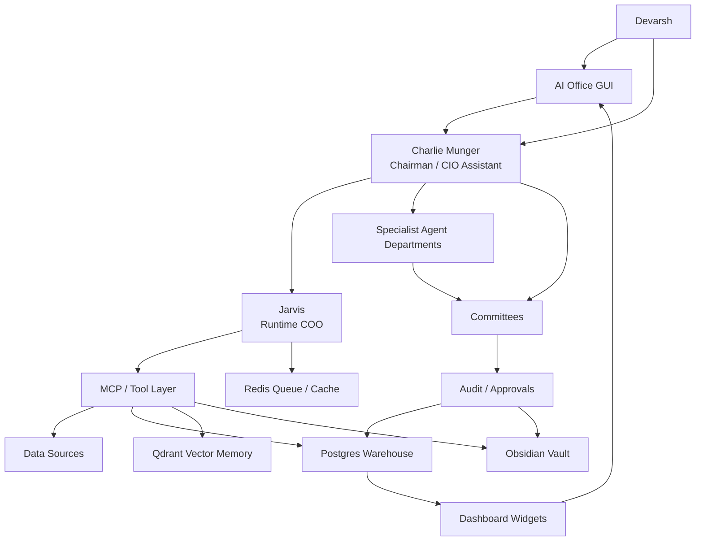

# AI Investment OS - Master Blueprint v6.0

Date: 2026-07-06
Owner: Devarsh
Canonical checklist: [[AI Investment OS - Master Build Checklist v6.0]]
Supersedes: [[AI Investment OS - Master Blueprint v5.0]]
Primary assistant: Charlie Munger
Runtime operator: Jarvis
Permanent memory: Obsidian
Structured truth: Postgres / Timescale-style warehouse
Semantic memory: Qdrant
Queue and cache: Redis
Runtime workspace: `_ai_os_runtime`

## 1. Mission

Build a complete AI-native investment operating system: a private hedge fund office, portfolio manager, Bloomberg-style terminal, research factory, strategy lab, risk office, client reporting engine, and live AI office GUI in one local-first platform.

The system must help Devarsh manage:

- long-term client holdings,
- tactical and event-driven positions,
- quantitative strategies,
- active intraday and swing trades,
- paper trades and strategy alerts,
- crypto, commodities, options, and futures research,
- filings, news, corporate actions, and special situations,
- research reports, trade journals, Codex outputs, Claude/Cowork outputs, and Obsidian notes,
- agent teams, model routes, costs, approvals, and audit trails.

This is not a chatbot. It is an investment organization operating system with human control.

## 2. Non-Negotiable Principles

1. No production dashboard can show fake live data as real.
2. Seed/demo data must be labeled and isolated.
3. Every position has a book.
4. Every position has a purpose.
5. Every position has an owner, horizon, thesis/setup, source, and exit logic.
6. Long-Term, Tactical, Quant, and Active Trading books are independent decision engines.
7. Opposing exposures are allowed only when their purpose is explicit.
8. Portfolio Intelligence must aggregate gross, net, book, client, strategy, and risk exposure.
9. Risk Office can challenge or block every action.
10. Capital Allocation Office sits above all books.
11. Charlie is the chairman, challenger, and main user-facing assistant.
12. Jarvis is the runtime operator that executes tool calls and writes approved outputs.
13. Specialist agents own specialist work.
14. Agents communicate through durable inbox, tasks, runs, approvals, comments, and output artifacts.
15. Obsidian is the durable knowledge graph.
16. Postgres is the structured accounting and operating source of truth.
17. Qdrant is retrieval memory, not accounting.
18. Every important claim must cite a source, command, dataset, note, or live check.
19. Broker execution stays gated until read-only data, risk, approval, kill switch, and audit flows are proven.
20. Human remains in control.

## 3. Core Architecture

## 4. Interaction Model

### 4.1 Devarsh Talks To Charlie

Charlie is the primary operating interface.

Examples:

- "Review Tushit's folio and tell me what changed."
- "Why do we own Usha Martin across clients?"
- "Add this manual buy under Tactical with a 2-week horizon."
- "Open NIFTY, BANKNIFTY, VIX, and a straddle chart in TradingView."
- "Scan NSE/BSE filings for demergers, buybacks, reverse mergers, delistings, and arbitrage spreads."
- "Generate strategy ideas from my old trade journals, but keep them paper only."
- "Can we be long Reliance in Long-Term and short Reliance in Quant?"
- "Build a client-ready portfolio report."

Charlie must respond with:

- conclusion,
- evidence used,
- freshness of data,
- agents consulted,
- dashboard/widgets updated,
- risks and missing data,
- notes/reports written,
- approval required,
- next best action.

### 4.2 Charlie Uses Jarvis

Jarvis translates the intent into controlled operations:

- query Postgres,
- retrieve Qdrant memory,
- read/write Obsidian notes,
- call MCP servers,
- control browser/TradingView when approved,
- create agent tasks,
- update dashboard widgets,
- create reports,
- log runs,
- request approvals.

Jarvis does not become the investment decision-maker.

### 4.3 Agents Talk Through Internal Mail

Agents need institutional communication, not only chat.

Core objects:

- `agent.profiles`
- `agent.departments`
- `agent.skills`
- `agent.messages`
- `agent.inbox_items`
- `agent.tasks`
- `agent.runs`
- `agent.approvals`
- `agent.comments`
- `agent.output_artifacts`
- `agent.model_routes`
- `agent.tool_permissions`

Required states:

- drafted,
- sent,
- acknowledged,
- queued,
- in_progress,
- blocked,
- waiting_for_data,
- waiting_for_human,
- review_required,
- approved,
- rejected,
- archived.

## 5. Operating Surfaces

### 5.1 Main GUI

Required first-class views:

- Command Center
- Charlie Chat
- Portfolio Intelligence
- Client Folios
- Symbol Intelligence
- Long-Term Office
- Tactical Office
- Quant Lab
- Active Trading Desk
- Strategy Monitor
- Research Factory
- News and Filings
- Special Situations
- Risk Center
- Capital Allocation
- Reports
- Agent Office
- Committee Room
- Approval Board
- Data Sources
- Model Runtime
- System Health

### 5.2 Live Animated AI Office

The animated office is not decorative. It must reflect real database state.

Required features:

- department rooms,
- employee avatars,
- character/personality hover cards,
- current task per employee,
- unread mailbox badges,
- active run badges,
- model route badge,
- tool permission badge,
- source/evidence badge,
- arrows for task handoffs,
- committee room,
- approval board,
- live activity feed,
- risk alerts,
- click-through into task/run/output/source.

Required departments:

- Executive Office
- Portfolio Office
- Long-Term Research
- Tactical Desk
- Quant Lab
- Active Trading Desk
- Research Factory
- News and Filings Desk
- Special Situations Desk
- Risk Office
- Capital Allocation Office
- Client Office
- Data Engineering
- AI Engineering
- Software Engineering
- Automation and Integrations
- Knowledge Division
- Finance and Administration

### 5.3 Obsidian Knowledge Graph

Obsidian stores durable memory and human-readable institutional knowledge.

Required note classes:

- company research note,
- thesis card,
- valuation memo,
- filing analysis,
- transcript analysis,
- special situation memo,
- strategy memo,
- backtest report,
- optimization report,
- model validation report,
- risk memo,
- committee minutes,
- daily brief,
- weekly brief,
- client report,
- decision log,
- postmortem,
- architecture note,
- runbook.

Graph rules:

- company notes link to filings, valuations, holdings, strategies, tasks, and committee decisions,
- strategy notes link to rules, datasets, backtests, optimizers, validation, paper monitors, and kill switches,
- client notes link to accounts, holdings, transactions, book exposure, reviews, and reports,
- agent output notes link to task IDs, run IDs, sources, and decision state,
- committee notes link to memos, votes, open questions, approvals, and final decisions.

## 6. Data Spine

### 6.1 Source Categories

Internal and legacy:

- p2cursor client databases,
- p2cursor buy/sell dates,
- old algo trading system databases,
- historical equity curves,
- historical price data,
- strategy records,
- broker Excel/PDF exports,
- old 2018-19 trade journals,
- current transaction reports,
- client holding statements,
- old Codex outputs,
- old Claude/Cowork outputs,
- manual holdings,
- manual trades,
- manual research notes.

Broker and market:

- Zerodha/Kite read-only first,
- Dhan read-only first,
- TradingView browser controller,
- TradingView webhooks,
- OpenAlgo read-only bridge,
- equity OHLCV,
- intraday OHLCV,
- futures data,
- options chain,
- open interest,
- implied volatility,
- Greeks,
- futures basis,
- volatility indexes,
- crypto exchange connector,
- gold, silver, Bitcoin, Ethereum, and selected commodity instruments.

Research and news:

- NSE announcements,
- BSE announcements,
- annual reports,
- quarterly results,
- investor presentations,
- concall transcripts,
- credit rating notes,
- corporate actions,
- buybacks,
- demergers,
- reverse mergers,
- mergers,
- delistings,
- rights issues,
- preferential issues,
- global news,
- India business news,
- Twitter/X/social signals,
- broker reports where available,
- Fincept components,
- Vibe-Trading workflow references.

### 6.2 Warehouse Schemas

Required schemas:

- `core`: clients, accounts, instruments, source registry, connector registry, import runs.
- `portfolio`: holdings, transactions, prices, snapshots, mark-to-market, reconciliation.
- `books`: investment books, book positions, purposes, theses, exit criteria, cross-book conflicts.
- `strategy`: ideas, candidates, rules, datasets, backtests, optimization, validation, paper/live state.
- `research`: ideas, filings, transcripts, news, reports, valuations, catalysts, special situations.
- `trading`: manual trades, paper trades, alerts, order intents, execution tickets, post-trade reviews.
- `risk`: limits, breaches, approvals, stress tests, kill switches, exposure checks.
- `agent`: employees, departments, skills, model routes, messages, tasks, runs, approvals.
- `ops`: widgets, health checks, freshness checks, imports, costs, system status.
- `audit`: immutable logs for imports, edits, decisions, model calls, and approvals.

### 6.3 Data Quality Contract

Every important row must carry:

- source system,
- source path/URL/API,
- import run ID,
- ingest timestamp,
- freshness timestamp,
- raw artifact reference,
- normalized table row,
- parser version,
- confidence score if AI-parsed,
- reconciliation status,
- human override log,
- last verified timestamp.

## 7. Multi-Book Portfolio Architecture

### 7.1 Books

Core books:

1. Long-Term Investing
2. Tactical Investing
3. Quantitative Strategies
4. Active Trading
5. Cash/Treasury
6. Hedges

Future optional books:

- Special Situations
- Options Income
- Crypto/Commodity Macro
- Client-Specific Mandates
- Experimental Research

### 7.2 Position Object

Every position must store:

- client,
- account,
- instrument,
- symbol,
- book,
- sub-book,
- direction,
- quantity,
- notional,
- cost basis,
- current value,
- realized P&L,
- unrealized P&L,
- purpose,
- owner,
- time horizon,
- thesis/setup,
- entry reason,
- exit criteria,
- stop/target/time exit if trading,
- review frequency,
- source,
- approval state,
- risk budget consumed,
- capital budget consumed,
- linked research notes,
- linked strategy,
- linked committee decision,
- linked tasks.

### 7.3 Opposing Exposures

The system must support a symbol being long in one book and short in another, because each exposure may serve a different purpose.

Example:

| Book | Direction | Exposure | Purpose | Horizon | Owner |
| --- | ---: | ---: | --- | --- | --- |
| Long-Term | Long | INR 20L | Core compounder | 5-10 years | Long-Term Office |
| Tactical | Flat | INR 0 | No current event view | Days-months | Tactical Office |
| Quant | Short | INR 3L | Mean reversion signal | 5 days | Quant Lab |
| Active Trading | Short | INR 2L | Pre-earnings trade | Intraday-days | Trading Desk |

Portfolio Intelligence must show:

- gross long,
- gross short,
- net exposure,
- book exposure,
- strategy exposure,
- client exposure,
- hedge ratio,
- offset cost,
- whether offsetting is intentional,
- risk budget used,
- capital budget used,
- latest thesis status,
- latest committee status.

Risk Office must flag:

- accidental offsetting,
- near-total offset of a core holding,
- hidden leverage,
- excessive churn,
- concentration breaches,
- client suitability conflicts,
- liquidity or margin concerns.

## 8. Portfolio Intelligence Engine

Required calculations:

- holdings,
- transactions,
- manual trades,
- paper trades,
- average cost,
- market value,
- realized P&L,
- unrealized P&L,
- gross exposure,
- net exposure,
- book exposure,
- strategy exposure,
- purpose exposure,
- client/account exposure,
- sector exposure,
- factor exposure,
- beta,
- volatility,
- drawdown,
- VaR,
- expected shortfall,
- stress loss,
- liquidity risk,
- concentration,
- hedge ratio,
- risk budget used,
- capital budget used,
- performance attribution,
- book attribution,
- strategy attribution,
- decision attribution.

Required drilldowns:

- executive portfolio,
- client folio,
- account,
- symbol,
- book,
- strategy,
- sector,
- risk factor,
- position history,
- thesis history,
- trade history,
- committee history.

## 9. Long-Term Investing Office

Purpose: own exceptional businesses for years and compound capital through ownership.

Horizon: 3-15 years.

### 9.1 Long-Term Research Checklist

Business model:

- business model clarity,
- segment economics,
- revenue drivers,
- pricing power,
- unit economics,
- operating leverage,
- customer concentration,
- cyclicality,
- scalability,
- reinvestment runway,
- dependence on commodity cycles,
- export/domestic mix,
- margin drivers,
- key operating KPIs.

Industry:

- market size,
- growth runway,
- industry structure,
- competitive intensity,
- customer power,
- supplier power,
- substitutes,
- regulation,
- disruption risk,
- profit pool share,
- industry consolidation,
- import/export dynamics,
- China/global supply risk,
- cycle position.

Moat:

- brand,
- switching costs,
- network effects,
- cost advantage,
- distribution advantage,
- scale economics,
- asset advantage,
- license/regulatory advantage,
- technology/process advantage,
- ROIC durability,
- margin durability,
- evidence moat is widening or narrowing.

Management and governance:

- promoter quality,
- capital allocation record,
- related-party transactions,
- remuneration,
- pledging,
- acquisitions,
- buybacks/dividends,
- minority shareholder treatment,
- board quality,
- auditor quality,
- incentives,
- insider buying/selling,
- communication quality,
- succession risk,
- governance controversy history.

Financial statement quality:

- revenue quality,
- margin bridge,
- cash conversion,
- operating cash flow vs PAT,
- free cash flow,
- working capital,
- inventory quality,
- receivables quality,
- debt maturity,
- liquidity stress,
- contingent liabilities,
- auditor notes,
- tax rate quality,
- capex quality,
- accounting changes.

Forensic accounting:

- cash flow mismatch,
- receivables spike,
- inventory build,
- debt hidden through subsidiaries,
- aggressive revenue recognition,
- unusual other income,
- related-party leakage,
- auditor churn,
- promoter pledge changes,
- repeated one-offs,
- capital work-in-progress issues,
- contingent liabilities,
- subsidiary complexity.

Valuation:

- owner earnings,
- DCF,
- reverse DCF,
- peer comparison,
- historical valuation,
- PE,
- EV/EBITDA,
- EV/Sales,
- FCF yield,
- sum-of-parts,
- replacement value where relevant,
- bull/base/bear scenarios,
- expected CAGR,
- downside case,
- margin of safety,
- valuation sensitivity,
- key assumption table,
- current price context,
- no fabricated fair value without sufficient source data.

Risk and exit:

- thesis killers,
- management deterioration,
- moat deterioration,
- accounting concern,
- capital allocation deterioration,
- valuation extreme,
- better opportunity,
- permanent impairment risk,
- concentration risk,
- client suitability,
- review frequency,
- sell discipline,
- liquidity risk,
- event risk,
- cross-book conflict risk.

Long-Term Monte Carlo:

- revenue growth distribution,
- margin distribution,
- reinvestment rate distribution,
- terminal multiple distribution,
- drawdown path,
- dilution/buyback assumptions,
- debt/capital structure scenarios,
- probability of negative CAGR,
- probability of permanent capital loss,
- expected CAGR distribution,
- downside percentile outcomes,
- base/bull/bear probability weights,
- sensitivity to starting valuation,
- sensitivity to margin compression,
- sensitivity to revenue slowdown.

### 9.2 Long-Term Agents

- Long-Term Portfolio Manager: owns long-term book and review cadence.
- Company Analyst: owns company memo and business quality.
- Industry Analyst: owns industry structure and competitive forces.
- Management Analyst: owns promoter, governance, and incentives.
- Financial Statement Analyst: owns accounts, cash flow, debt, and quality.
- Forensic Accounting Agent: tries to find accounting red flags.
- Valuation Agent: builds valuation ranges and expected CAGR.
- Filings and Transcript Analyst: extracts evidence from filings and calls.
- Bear Case Agent: argues against the investment.
- Quality Score Agent: scores moat, management, reinvestment, and durability.
- Portfolio Fit Agent: checks client/book/sector/concentration fit.
- Risk Reviewer: checks downside, liquidity, concentration, and suitability.

### 9.3 Long-Term Committee

Members:

- Charlie Munger, chair.
- Long-Term Portfolio Manager.
- Company Analyst.
- Industry Analyst.
- Management Analyst.
- Financial Statement Analyst.
- Forensic Accounting Agent.
- Valuation Agent.
- Bear Case Agent.
- Portfolio Fit Agent.
- Risk Agent.
- Capital Allocation Officer.
- Devarsh for human decision.

Committee flow:

1. Research packet created.
2. Official sources registered.
3. Source text extracted.
4. Checklist modules completed.
5. Analyst memos attached.
6. Valuation memo attached.
7. Bear case attached.
8. Risk review attached.
9. Portfolio fit attached.
10. Charlie asks unresolved questions.
11. Committee decision recorded.
12. Human approval required before buy/sell action.

Decision states:

- needs_data,
- under_research,
- watchlist,
- approved_buy,
- approved_hold,
- approved_add,
- approved_trim,
- approved_sell,
- rejected,
- monitor_only.

Required outputs:

- thesis memo,
- source register,
- source extraction note,
- checklist scorecard,
- valuation memo,
- Monte Carlo memo,
- bear case,
- risk memo,
- portfolio fit memo,
- committee minutes,
- decision log,
- next review task.

## 10. Tactical Investing Office

Purpose: capture medium-term opportunities from catalysts, events, sector moves, valuation gaps, macro shifts, and portfolio overlays.

Horizon: days to months.

Required checks:

- catalyst identification,
- event date,
- expected path,
- risk/reward,
- stop/target/time exit,
- position sizing,
- Long-Term overlap,
- hedge vs independent alpha flag,
- liquidity,
- options overlay,
- news sensitivity,
- expected holding period,
- invalidation trigger,
- portfolio conflict,
- client suitability.

Agents:

- Tactical Portfolio Manager.
- Catalyst Analyst.
- Event Analyst.
- Technical Analyst.
- Macro Analyst.
- Sentiment Analyst.
- Options Overlay Agent.
- Sector Rotation Agent.
- Risk Reviewer.

Committee:

- Tactical Committee decides whether the idea is a hedge, independent alpha trade, or portfolio-management action.

## 11. Quantitative Strategies Office

Purpose: create, test, validate, allocate, monitor, and retire systematic strategies.

Required lifecycle:

1. Idea intake.
2. Hypothesis statement.
3. Dataset definition.
4. Data-quality check.
5. Rule definition / DSL.
6. Backtest.
7. Cost/slippage model.
8. Train/test split.
9. Walk-forward diagnostics.
10. Parameter sensitivity.
11. Optimizer.
12. Monte Carlo/bootstrap.
13. Regime split.
14. Factor attribution.
15. Correlation to existing strategies.
16. Capacity/liquidity estimate.
17. Model validation.
18. Strategy committee.
19. Paper monitor.
20. Drift monitor.
21. Limited-live approval.
22. Kill-switch monitor.
23. Postmortem and retirement.

Required diagnostics:

- CAGR,
- Sharpe,
- Sortino,
- Calmar,
- max drawdown,
- win rate,
- payoff ratio,
- average trade,
- trade count,
- exposure time,
- turnover,
- slippage sensitivity,
- fee sensitivity,
- parameter stability,
- walk-forward stability,
- drawdown clustering,
- tail loss,
- Monte Carlo path distribution,
- probability of ruin,
- capacity estimate,
- regime robustness.

Agents:

- Strategy Research Agent.
- Strategy Generator.
- Data Scientist.
- Feature Engineer.
- Backtesting Engineer.
- Optimizer Agent.
- Model Validation Agent.
- Regime Analyst.
- Capacity/Liquidity Analyst.
- Strategy Committee Secretary.
- Risk Reviewer.

## 12. Active Trading Desk

Purpose: intraday/swing execution, discretionary setups, options/futures trades, and live market response.

Required workflows:

- manual trade entry,
- paper trade entry,
- setup classification,
- stop/target/time exit,
- options payoff,
- IV/OI dashboard,
- straddle/strangle analysis,
- TradingView chart control,
- screenshot artifact capture,
- trade journal,
- post-trade review,
- overnight risk check,
- execution safety gate,
- no live order without approval.

Agents:

- Trading Desk Agent.
- Technical Analyst.
- Options Analyst.
- Futures Analyst.
- Volatility Agent.
- Market Microstructure Agent.
- Trade Journal Coach.
- Execution Safety Agent.

## 13. Research Factory

Purpose: continuously collect, classify, analyze, and route market and corporate information.

Required pipelines:

- NSE filing collector,
- BSE filing collector,
- filing PDF parser,
- annual report parser,
- transcript ingestion,
- news collector,
- Twitter/X/social triage,
- corporate action classifier,
- buyback detector,
- delisting detector,
- demerger detector,
- reverse merger detector,
- merger detector,
- preferential issue detector,
- rights issue detector,
- arbitrage spread tracker,
- special situation memo generator,
- idea intake,
- research queue,
- committee routing.

Agents:

- Research Director.
- News Analyst.
- Filings Analyst.
- Special Situations Analyst.
- Corporate Actions Analyst.
- Arbitrage Analyst.
- Industry Researcher.
- Research Librarian.

Special-situation checks:

- event type,
- record date,
- entitlement,
- consideration,
- spread,
- liquidity,
- regulatory approval,
- promoter intent,
- timeline,
- downside if event fails,
- capital lockup,
- tax/friction,
- committee decision.

## 14. Capital Allocation Office

Purpose: decide how much capital each book, client, strategy, and opportunity can use.

Required outputs:

- target capital by book,
- actual capital by book,
- drift from target,
- risk budget by book,
- drawdown by book,
- leverage by book,
- liquidity by book,
- client concentration,
- strategy concentration,
- rebalance suggestions,
- capital approval memo.

Agents:

- Capital Allocation Officer.
- Portfolio Optimizer.
- Performance Attribution Analyst.
- Client Suitability Analyst.

## 15. Risk Office

Purpose: protect capital, prevent unforced errors, and enforce limits.

Risk checks:

- position concentration,
- client concentration,
- sector concentration,
- factor exposure,
- liquidity risk,
- drawdown risk,
- VaR,
- expected shortfall,
- stress tests,
- portfolio Monte Carlo,
- strategy correlation,
- book conflicts,
- leverage,
- margin,
- overnight risk,
- options tail risk,
- data-quality risk,
- model risk,
- operational risk.

Risk authority:

- can block limited-live strategy activation,
- can block broker execution,
- can require more data,
- can escalate to Charlie,
- can require human approval,
- must log every override.

Agents:

- Chief Risk Officer.
- Quant Risk Analyst.
- Stress Testing Agent.
- Model Risk Agent.
- Data Quality Risk Agent.
- Compliance/Audit Agent.

## 16. Client Office

Purpose: make the system useful for real client folios, not only strategies.

Required capabilities:

- client onboarding,
- account mapping,
- holdings import,
- transaction import,
- current holdings update by Devarsh,
- client-level book exposure,
- client-level thesis gaps,
- suitability checks,
- monthly report,
- performance report,
- portfolio change report,
- missing-data report,
- client-ready explanation of decisions.

Agents:

- Client Manager.
- Reporting Analyst.
- Performance Reporter.
- Onboarding Agent.
- Communication Agent.

## 17. Model Strategy

### 17.1 Local First

Local/open-source models handle cheap daily work:

- Jarvis intake,
- dashboard summaries,
- source retrieval summaries,
- task routing,
- daily briefs,
- trade journal tagging,
- news triage,
- first-pass filing extraction,
- agent status updates.

Candidate local routes:

- small daily driver model for always-on work,
- stronger local model for research drafts,
- embedding model for Qdrant,
- optional MLX-optimized models on Apple Silicon.

### 17.2 Cloud Escalation

Cloud/frontier models are used only when value justifies cost:

- complex investment memos,
- long-document reasoning,
- difficult code changes,
- deep strategy generation,
- final committee synthesis,
- ambiguous legal/regulatory interpretation,
- high-stakes client reports.

Required controls:

- per-agent model route,
- per-workflow cost limit,
- escalation approval for expensive tasks,
- model-call ledger,
- caching and reuse.

## 18. External Component Strategy

External repositories are components and references, not the product core.

Fincept:

- use for terminal-style research, analytics, reporting, data widgets, and financial component patterns,
- do not make it the source of truth,
- bridge useful components through adapters.

Vibe-Trading:

- use for agentic trading workflow patterns,
- adapt ideas into our paper-first, risk-gated system,
- do not copy uncontrolled execution behavior.

OpenAlgo:

- use as reference for broker and strategy integration,
- keep read-only first,
- live order path remains gated.

TradingView:

- use browser controller for charts, screenshots, layouts, and user-directed visual work,
- use scanner/quote ingestion where reliable,
- store chart actions and screenshots as artifacts.

p2cursor and old algo systems:

- use as legacy data and component sources,
- extract client buy/sell dates, history, charts, and strategy artifacts,
- reconcile into the warehouse before dashboards trust them.

## 19. Production Safety

Live execution can only happen after:

1. read-only data connector verified,
2. symbol/account mapping verified,
3. risk limits verified,
4. position sizing verified,
5. approval workflow verified,
6. order preview verified,
7. kill switch verified,
8. audit log verified,
9. paper/live drift monitor verified,
10. human explicitly approves.

Until then, the system can recommend, monitor, paper trade, and prepare order tickets, but not place live orders automatically.

## 20. Build Phases

Phase 1: Foundation Runtime

- external SSD runtime,
- Docker services,
- Postgres,
- Redis,
- Qdrant,
- API,
- UI shell,
- vault writeback,
- MCP foundation,
- health checks.

Phase 2: Data Spine

- clients,
- accounts,
- holdings,
- transactions,
- p2cursor extraction,
- old algo DB import,
- source registry,
- artifact store,
- reconciliation.

Phase 3: Portfolio Brain

- books,
- purposes,
- position theses,
- exit criteria,
- gross/net exposure,
- client folio view,
- symbol intelligence,
- cross-book conflicts.

Phase 4: Long-Term Office

- source acquisition,
- source extraction,
- checklist scoring,
- valuation,
- bear case,
- portfolio fit,
- risk review,
- Monte Carlo,
- committee decision.

Phase 5: Research Factory

- filings,
- transcripts,
- news,
- corporate actions,
- special situations,
- arbitrage spreads,
- idea queue.

Phase 6: Quant Lab

- strategy intake,
- DSL/rule parser,
- backtest,
- optimizer,
- walk-forward,
- Monte Carlo,
- validation,
- paper monitor,
- kill switch.

Phase 7: Trading Desk

- manual/paper trade logging,
- TradingView controller,
- options/futures analytics,
- trade journal,
- post-trade review,
- alerts.

Phase 8: Risk and Capital Allocation

- limits,
- VaR/ES,
- stress tests,
- portfolio Monte Carlo,
- risk budget,
- capital budget,
- approval board.

Phase 9: Live AI Office

- animated office,
- agent hover cards,
- task/inbox/run visuals,
- committee room,
- live feed.

Phase 10: Reports and Client Outputs

- daily brief,
- weekly brief,
- client report,
- committee packet,
- source/freshness report,
- system health report.

## 21. Whole-System Definition Of Done

The Investment OS is complete only when:

- Devarsh can talk to Charlie and trigger auditable workflows.
- Jarvis can call approved tools, write outputs, and update dashboards.
- Every client, account, holding, transaction, trade, strategy, source, and report is traceable.
- Every position has book, purpose, owner, horizon, thesis/setup, and exit logic.
- Portfolio Intelligence shows gross/net/book/strategy/client/risk exposure.
- Symbol Intelligence explains why each exposure exists.
- Long-Term Office can produce thesis, source extraction, checklist, valuation, bear case, Monte Carlo, portfolio fit, and committee memo.
- Research Factory can ingest filings/news and produce special-situation ideas.
- Quant Lab can intake, backtest, optimize, validate, paper-monitor, and committee-review strategies.
- Active Trading Desk can log manual/paper trades and control TradingView tasks.
- Risk Office can block unsafe actions.
- Capital Allocation can allocate capital across books and detect conflicts.
- Agent Office shows real tasks, inbox, runs, model routes, and outputs.
- Reports can be generated from source-backed data.
- Live execution remains human-approved and audit-logged.

