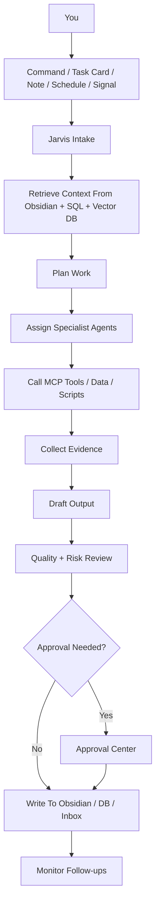
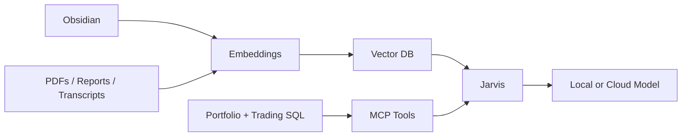

# Agent Interaction Model

## Decision

You should interact with the AI office through one main surface: the AI Office GUI.

Charlie Munger is the main orchestrator persona inside that GUI. Jarvis is the runtime/tool layer behind him. Hermes, OpenAlice-style workspaces, LangGraph, local models, Codex, or future runtimes are implementation parts behind the surface. They should be replaceable.

Do not make Hermes chat history the center of the system. The durable center is:

- Obsidian for memory, research, decisions, and notes.
- SQL for structured portfolio, client, trading, and agent state.
- Vector search for retrieval over notes, documents, reports, and transcripts.
- MCP tools for controlled access to data and actions.

## Daily Working Surface

The GUI should have four always-available interaction areas:

1. Command Bar
2. Agent Inbox
3. Workspaces
4. Approval Center

### Command Bar

This is where you give direct work to Charlie Munger. Charlie decides the route; Jarvis executes the runtime/tool calls.

Example commands:

- `Review all client portfolios and tell me what changed today.`
- `Research HDFC Bank as a long-term holding and update the thesis.`
- `Run ATR extension scan on Nifty 50 daily charts and flag stretched names.`
- `Check active TradingView signals and explain which ones deserve attention.`
- `Prepare a client-ready report for Client A, but do not send it.`
- `Open a research task on Tata Motors with valuation, risks, and catalysts.`
- `Ask the Quant Agent to compare this strategy across 2019-2026 and save results.`
- `Summarize what the agents did today and update Obsidian.`

Command bar output should always show:

- What Charlie Munger understood.
- Which agents are assigned.
- Which data/tools will be used.
- Whether approval is needed.
- Where the final output will be saved.

### Agent Inbox

This is the main feed of completed and pending agent work.

Inbox items:

- Daily briefs
- Portfolio alerts
- Holding thesis updates
- Research memos
- Backtest reports
- Trading signal explanations
- Risk warnings
- Client report drafts
- Failed job alerts
- Data quality issues
- Approval requests

Each inbox item should have:

- Title
- Agent owner
- Status
- Evidence links
- Recommended action
- Approve / reject / revise controls
- Link to Obsidian note or DB record

### Workspaces

Workspaces are focused rooms for real work.

Core workspaces:

- Command Center
- Portfolio Office
- Client Folios
- Holdings Research
- Idea Pipeline
- Trading Desk
- Quant Lab
- Strategy Monitor
- Risk Center
- Reports
- Knowledge Vault
- System Health

Each workspace should combine dashboards, agent chat, task lists, and source evidence.

### Approval Center

Anything with money, clients, broker actions, external messages, or destructive system changes goes through approval.

Approval required for:

- Live trade execution
- Portfolio rebalance orders
- Client-facing reports
- Sending emails/messages
- Updating client records
- Deleting/importing large datasets
- Changing risk limits
- Enabling a new live strategy
- Writing credentials or changing broker/API settings

Agents can recommend actions, but the system should default to read-only until approval gates are mature.

## Ways To Give Work

### 1. Natural Language Command

Best for fast work.

Pattern:

`Jarvis, [objective], using [data/scope], output [format], save to [place].`

Example:

`Jarvis, review all long-term holdings using latest portfolio data and recent notes. Output action candidates and save a portfolio review note.`

### 2. Task Card

Best for repeatable work.

Fields:

- Task title
- Objective
- Agent owner
- Scope
- Inputs
- Output format
- Deadline
- Approval level
- Status
- Evidence links
- Final artifact

### 3. Obsidian Request Note

Best when you are already working in the vault.

Example frontmatter:

```yaml
type: agent_request
status: requested
agent: equity_research
priority: high
approval_required: false
output: investment_memo
save_to: ai memory/00 AI OS/Research
```

The body should contain the request, context, links, and constraints.

### 4. Scheduled Workflow

Best for routines.

Examples:

- Daily market brief
- Weekly client folio review
- Monthly portfolio risk review
- End-of-day trade journal processor
- Strategy health check
- Data quality scan
- New research idea scan

### 5. Signal Trigger

Best for live monitoring.

Triggers:

- TradingView webhook
- Strategy signal
- Price/volume event
- Portfolio drift
- Risk threshold
- News/catalyst event
- Data import completed
- Broker/account update

Signal-triggered agents should summarize, classify, and recommend. They should not execute trades without approval.

### 6. Engineering Escalation

Best for building and fixing the system.

Codex should be used for:

- Repo changes
- Debugging
- Tests
- Refactors
- MCP server work
- Data pipeline implementation
- GUI implementation

Daily agent work should run on cheaper local models when possible. Codex is the engineering escalation layer.

## Task Lifecycle



## Agent Output Standard

Every important agent output should include:

- Answer or recommendation
- Evidence used
- Assumptions
- Confidence level
- Risks or objections
- Next actions
- Storage location

For investment work, separate:

- Facts
- Assumptions
- Opinions
- Action candidates

## Human Control Rules

You remain the final decision-maker.

Agents can:

- Read data
- Search notes
- Analyze portfolios
- Draft reports
- Generate ideas
- Run backtests
- Monitor signals
- Prepare recommendations
- Create tasks
- Save notes

Agents cannot, without approval:

- Place trades
- Send client communication
- Modify client records
- Delete source data
- Change credentials
- Enable live automation
- Make final investment decisions

## Hermes And MLX Position

Hermes can be used as an agent shell or orchestration experiment, but it should not own memory or become the only place work happens.

MLX model compression is useful for running stronger local models on Apple Silicon, but it is only a model-runtime optimization. It does not replace the memory system.

The long-term memory strategy should be retrieval:



## First Interaction MVP

Build the first usable version in this order:

1. Agent Inbox
2. Command Bar
3. Task Card schema
4. Read-only portfolio and trading MCP tools
5. Daily Brief workflow
6. Portfolio Review workflow
7. Trading Signal Review workflow
8. Obsidian write-back
9. Approval Center

This gives one place to work before building the full Bloomberg-style surface.
