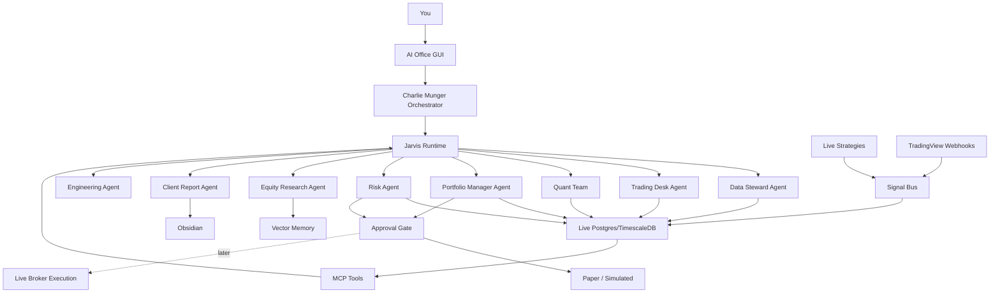

# Final Agent Office Plan

## Decision

Build a local-first AI investment office with an OpenAlice-style GUI, live database, MCP tool layer, local models for daily operation, and cloud/Codex escalation only for hard work.

This is wider than a trading desk. It must cover client folios, long-term holdings, research, ideas, monitoring, risk, trade journals, strategy monitoring, and reports in one place.

The operating principle is:

- Data and strategy engines run continuously.
- Agents read, reason, challenge, and report.
- Trading execution stays behind risk checks and human approval.
- Long-term client positions are first-class objects with thesis, valuation, risk, and review state.
- Obsidian stores memory, decisions, research, and post-trade learning.
- Local models handle routine work to keep cost low.

## Main Surfaces

### 1. AI Office GUI

Purpose:

- Main place to interact with Jarvis and specialist agents.
- Agent workspaces.
- Inbox for completed reports and alerts.
- Trading signal dashboard.
- Client folio dashboard.
- Long-term holding research dashboard.
- Idea pipeline.
- Portfolio dashboard.
- Strategy health dashboard.
- Scheduled agent runs.

Best base:

- OpenAlice-style architecture.

Reason:

- It already has the right concepts: workspace, Inbox, MCP server, Trading-as-Git, UTA separation, guard pipeline, and headless scheduled runs.

### 2. Obsidian

Purpose:

- Knowledge graph.
- Research notes.
- Decision logs.
- Agent run summaries.
- Investment memos.
- System architecture.

Obsidian should not be the live dashboard. It is the memory and graph layer.

### 3. Codex

Purpose:

- High-quality coding work.
- Refactors.
- Debugging.
- Reviews.
- System changes.

Codex should not be the always-on daily agent because cost can become high.

### 4. Local Model Runtime

Purpose:

- Cheap daily work driver.
- Summaries.
- Classifications.
- Routing.
- Note cleanup.
- Basic research drafting.
- Monitoring and brief generation.

Recommended runtimes:

- Ollama for simple, stable local model serving.
- LM Studio for manual model testing and local OpenAI-compatible API.

Default:

- Ollama should be the daily driver runtime.
- LM Studio should be the model test bench.
- Codex should be used for implementation, review, and difficult debugging only.

## Model Routing

### Cheap Daily Driver

Use local models through Ollama/LM Studio.

Jobs:

- Daily brief drafts
- Alert summarization
- Signal labeling
- Note linking
- Watchlist summaries
- Basic research extraction
- Agent status messages

Candidate models:

- Qwen small/medium instruct models
- DeepSeek distill models
- Coding-tuned local model for code summaries

### Strong Local/Hybrid Reasoning

Use for:

- Multi-step trading analysis
- Portfolio diagnostics
- Strategy comparison
- Client-data reasoning over prepared summaries

Candidate models:

- Larger Qwen/DeepSeek-class local models if hardware supports them.
- Hosted cheap API models only when local quality is insufficient.

### Codex / Cloud Escalation

Use for:

- Hard coding
- Architecture changes
- Security-sensitive review
- Production debugging
- Complex repo edits
- Final validation before live trading changes

## Agent Teams and Flow

## Agent Office Departments

### Executive Office

- Charlie Munger: routes tasks, challenges assumptions, selects agents/tools, and owns final judgment.
- Jarvis: runtime/tool layer for retrieval, MCP calls, run logging, and approved write-back.
- Chief of Staff: daily plan, weekly plan, open loops, project tracking.
- Librarian: vault structure, tags, links, maps of content, note hygiene.

### Data Office

- Data Steward: owns imports, schemas, lineage, client-data safety.
- Market Data Agent: OHLCV, ticks, corporate actions, symbols, TradingView alerts.
- MCP Toolsmith: exposes controlled read-only tools for all agents.

### Trading Desk

- Signal Monitor: watches live strategy and TradingView signals.
- Setup Classifier: labels setup type, timeframe, regime, extension, trend, volatility.
- Trade Journal Agent: creates open/closed trade notes and links DB rows to Obsidian.
- Execution Safety Agent: prevents live order actions unless all gates pass.

### Quant Research Team

- Technical Indicator Agent: computes and validates indicators.
- Regime Agent: Markov chains, HMMs, volatility regimes, trend/bear/sideways states.
- Backtest Agent: walk-forward tests, no lookahead checks, parameter sweeps.
- Strategy Researcher: compares setup variants, tracks expectancy by condition.
- Model Validation Agent: checks overfitting, sample size, stability, and failure modes.

### Portfolio Office

- Client Portfolio Manager: per-client folios, suitability, reporting, actions.
- Long-Term Portfolio Manager: holdings, thesis status, valuation, add/reduce/hold ideas.
- Allocation Agent: allocation drift, concentration, cash, rebalance suggestions.
- Risk Agent: sizing, max loss, drawdown, liquidity, concentration, event risk.
- Performance Analyst: win rate, average R, expectancy, setup/day/time/emotion splits.

### Research Office

- Equity Research Agent: fundamentals, filings, transcripts, industry context.
- Holding Thesis Agent: keeps every long-term holding thesis current.
- Idea Pipeline Agent: captures, scores, researches, and promotes/rejects ideas.
- News/Sentiment Agent: news, social, macro, catalysts.
- Report Writer: client-ready and vault-ready reports.

## Trading Signal Flow

1. Existing strategies keep running.
2. TradingView webhooks and strategy signals enter a signal bus.
3. Signals are written to Postgres/TimescaleDB.
4. Trading Desk Agent classifies the signal.
5. Quant Agent checks historical performance and regime.
6. Risk Agent checks exposure, stop, sizing, and constraints.
7. Portfolio Manager approves/rejects a plan.
8. Human approval is required before live execution.

## Lessons From Safari Articles

### Markov Chain / HMM Article

Add to Quant Team backlog:

- Define market states: bull, bear, sideways, volatility, liquidity, risk-on/off.
- Build transition matrices from historical data.
- Use matrix powers for multi-step regime forecasts.
- Calculate stationary distribution as long-run baseline.
- Require walk-forward re-estimation to avoid lookahead bias.
- Track limitations: Markov property, time homogeneity, sample size.
- Add HMMs later using returns plus realized volatility, credit spreads, VIX/India VIX, breadth, and liquidity as emissions.

### Obsidian Masterclass

Adopt:

- Retrieval-first note design.
- Atomic permanent notes.
- Maps of Content for major topics.
- Daily capture note as the front door.
- System file equivalent to `CLAUDE.md`, adapted as `AI_OS.md` or `JARVIS.md`.
- Morning brief, evening capture processor, nightly connection finder, weekly pattern detector, monthly synthesis.

Adjust our vault:

- Keep existing domain folders, but add note properties, maps, and automated workflows.
- Use Obsidian for memory and graph, not live dashboards.

### Obsidian Trading Journal

Adopt:

- Every meaningful trade gets a structured open/close record.
- Journal data must include setup, timeframe, market condition, confidence, R multiple, execution quality, rule violations, and emotional state.
- Weekly performance analyzer.
- Monthly edge report.
- Real-time pattern alert after closing a trade.
- Pre-trade intelligence: compare proposed trade to historical setups and known weaknesses before approval.

### ATR Extension Backtest Article

Add to Quant and Signal Desk:

- ATR extension from moving averages is a context/risk tool, not a certainty signal.
- Track extension from 10 EMA, 21 EMA, 50 SMA, and 200 SMA.
- Approximate framework from the article:
  - 10 EMA stretch: short-term momentum hot.
  - 21 EMA stretch: swing momentum extended.
  - 50 SMA around 7.5x to 8x ATR: statistically rare extension.
  - 200 SMA around 15x+ ATR: major structural extension or exhaustion.
- Prefer stock-specific adaptive thresholds over one-size-fits-all thresholds.
- Build scanners for multi-anchor extension and trap setups.
- Do not short/exit purely because of extension; combine with price action, regime, and risk.

## Repo Decisions

### Use Concepts From TradingAgents

Adopt:

- Fundamental analyst
- Sentiment/news analyst
- Technical analyst
- Bull/bear debate
- Trader agent
- Risk team
- Portfolio manager approval

Do not copy blindly:

- Simulated-exchange-only flow
- Any direct trading action without our broker/risk layer

### Use Concepts From AI-Trader

Adopt:

- Agent-native trading interface
- Signal publishing
- Real-time market data feed idea
- Paper trading/challenge style evaluation

Do not adopt first:

- Copy trading
- Social/follower/reward system
- Fully autonomous execution

### Use cinar/indicator Carefully

Adopt:

- Technical indicator catalog
- Strategy/backtest inspiration
- MCP-style indicator tools
- 80+ indicators and strategy/backtest framework
- Go streaming/channel architecture for high-throughput signal services

Concern:

- It is Go and AGPL-licensed. Keep it as a separate service or reference unless license implications are acceptable.

Implementation decision:

- Phase 1: implement essential indicators in Python/VectorBT/Pandas for speed of development.
- Phase 2: optionally run `cinar/indicator` as a separate local service or MCP service if we want its full catalog.

### Use OpenAlice As Main Inspiration

Adopt:

- Workspace GUI
- Inbox
- MCP tools
- UTA separation
- Trading-as-Git
- Guard pipeline
- Headless scheduled runs

### Use OpenHands Later For Engineering Office

Adopt later if needed:

- Self-hosted coding agent control center
- Scheduled engineering automations
- Local/remote agent backend switching

Do not start here for trading. Trading office comes first.

### Use daily_stock_analysis For Reporting Ideas

Adopt:

- Zero/low-cost scheduled daily report pattern.
- Multi-channel notification concept.
- Decision dashboard format.
- Watchlist-driven daily scan.

Do not adopt directly:

- China-market-specific assumptions unless useful.
- GitHub Actions as the primary runtime for private broker/client data.

### Use scientific-agent-skills For Skill Packaging Pattern

Adopt:

- Skill packs with `SKILL.md`, examples, and deterministic workflows.
- Finance/research/quant skills should be packaged the same way.
- Skills should be reusable across Codex, Hermes, OpenAlice workspaces, and local agents.

### Use AI-Trader Only As A Warning/Reference

Adopt:

- Agent-native trading concept.
- End-to-end monitoring inspiration.

Do not adopt:

- Fully autonomous live execution.
- Anything without clear license and safety review.

### Use Vibe-Trading As A Component/Reference

Adopt:

- Research workspace pattern.
- MCP-first tool surface.
- Multi-agent trading/research teams.
- Shadow Account concept for comparing actual behavior to rule-based strategy.
- Broker journal parsing and behavioral diagnostics.
- Backtest run cards and research artifacts.
- Research Autopilot / hypothesis-to-backtest loop.
- Local data bridge for CSV, Parquet, and DuckDB.
- Alpha library / alpha zoo concept.

Do not make it the entire OS:

- It is trading/research centered, while our system must also run client folios, long-term positions, research folders, idea pipelines, and client reports.

## Build Order

### Phase 0 - Prerequisites

- Install Docker Desktop or another Postgres runtime.
- Install Ollama.
- Install Node.js 22+ and pnpm 10+.
- Keep Obsidian vault open as memory.

### Phase 1 - Live Data Spine

- Start Postgres/TimescaleDB.
- Extract `ps 2 cursor.zip` into quarantine.
- Import existing trading DBs into staging.
- Import historical live trading data.
- Create source registry and schema registry.

### Phase 2 - MCP Tools

- `trading.list_signals`
- `trading.get_signal_detail`
- `trading.get_strategy_health`
- `trading.get_ohlcv`
- `portfolio.get_snapshot`
- `portfolio.get_positions`
- `risk.check_trade_plan`
- `vault.write_note`

### Phase 3 - Office GUI

- Fork or adapt OpenAlice-style workspace UI.
- Add dashboard pages:
  - Agent Office
  - Client Folios
  - Portfolio Office
  - Holdings Research
  - Idea Pipeline
  - Signal Desk
  - Quant Lab
  - Strategy Monitor
  - Risk Center
  - Research
  - Inbox
  - System Health

### Phase 4 - Local Daily Driver

- Ollama local model server.
- Jarvis router uses local model by default.
- Codex/cloud only on escalation.

Cost policy:

- Local model handles all routine summarization, classification, routing, alert explanation, note cleanup, and first-draft reports.
- Codex handles code implementation and verification.
- Cloud models handle only final hard reasoning, long source synthesis, or cases where local model output fails validation.

### Phase 5 - Agents

Start only with:

- Jarvis
- Data Steward
- Trading Desk
- Risk
- Portfolio Manager

Then add:

- Quant Research Team
- Equity Research
- Client Report Writer
- Engineering Agent

### Phase 6 - Trading Control

- Paper trading first.
- Trading-as-Git staging.
- Risk guard checks.
- Human approval.
- Live broker execution only after validation.

## Immediate Next Step

Start the database and import layer first. No agent is useful until the data spine exists.

Definition of first milestone:

- Live DB running.
- Old trading DBs inventoried.
- `ps 2 cursor.zip` quarantined and inventoried.
- Client/account/holding/transaction tables populated from safe imports.
- First `trading.list_signals` MCP tool working.
- First `portfolio.get_client_snapshot` MCP tool working.
- AI Office can show recent strategy/TradingView signals and client folio snapshots.

## First Dashboard Slice

Build the first GUI around these pages:

- Home: Jarvis inbox, active alerts, daily brief.
- Signal Desk: live TradingView/strategy signals, setup tags, extension state, regime state.
- Portfolio: holdings, exposure, P&L, risk flags.
- Quant Lab: backtest runs, strategy health, Markov/regime analysis, ATR extension scanners.
- Trading Journal: open trades, closed trades, weekly performance, monthly edge.
- Research: company notes, watchlist, filings/transcripts.
- System Health: data feeds, agents, jobs, model runtime, MCP tools.

## Start Command Sequence

1. Make Docker available.
2. Start Postgres/TimescaleDB.
3. Install Ollama and pull the first local model.
4. Quarantine extract `ps 2 cursor.zip`.
5. Import old trading DB metadata.
6. Build first MCP server.
7. Build first dashboard slice.
