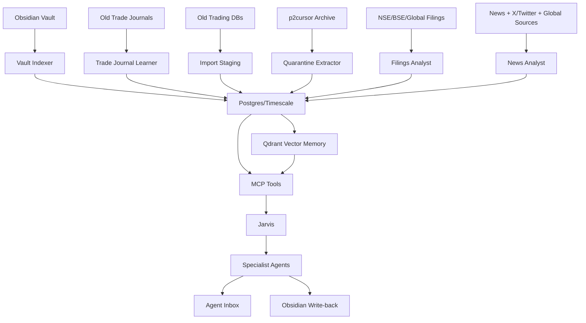

# Foundation Stack - DB Memory MCP

## Decision

The foundation is now:

- Postgres + TimescaleDB for structured state and time-series data.
- Qdrant for vector retrieval over notes, filings, journals, reports, and documents.
- Redis for future queues/scheduled jobs.
- Obsidian for durable research, decisions, graphs, and write-back.
- MCP tools as the controlled access layer.
- Charlie Munger as main orchestrator and model router.
- Jarvis as runtime/tool layer.

Runtime path:

```text
/Volumes/Devarsh SSD/Obsidian memory /_ai_os_runtime
```

## External SSD Rule

All project data should stay on the external SSD.

Docker-managed named volumes:

```text
ai-os-runtime_ai_os_pgdata
ai-os-runtime_ai_os_qdrant_data
ai-os-runtime_ai_os_redis_data
```

Docker Desktop image layers must stay on the external SSD:

```text
/Volumes/Devarsh SSD/Docker/DockerDesktop/Docker.raw
```

Reason: Qdrant warned on macOS/FUSE bind mounts. Since Docker Desktop's disk image is external, named volumes keep the live database files on the SSD while using Docker's Linux filesystem semantics.

Runbook:

```text
_ai_os_runtime/docs/docker_external_ssd_storage.md
```

## Schemas Added

Core:

- `core.source_systems`
- `core.import_runs`
- `core.raw_artifacts`

Knowledge:

- `knowledge.obsidian_notes`
- `knowledge.note_links`
- `knowledge.vector_documents`

Portfolio:

- `portfolio.clients`
- `portfolio.accounts`
- `portfolio.positions`
- `portfolio.holding_theses`
- `portfolio.trades`
- `portfolio.snapshots`

Research:

- `research.corporate_filings`
- `research.filing_events`
- `research.ideas`

Market:

- `market.news_items`
- `market.social_items`

Trading:

- `trading.symbols`
- `trading.ohlcv`
- `trading.signals`
- `trading.trade_journals`

Strategy:

- `strategy.strategy_candidates`
- `strategy.backtest_runs`

Agent and Ops:

- `agent.tasks`
- `agent.profiles`
- `agent.inbox_items`
- `agent.approvals`
- `agent.tool_registry`
- `agent.model_routes`
- `agent.run_log`
- `ops.browser_runs`

Client data:

- `client_data.safe_dataset_registry`
- `client_data.source_files`
- `client_data.p2cursor_csv_rows`

Risk:

- `risk.limits`
- `risk.events`

Intraday/strategy alerting:

- `trading.ticks`
- `strategy.strategy_versions`
- `strategy.strategy_instances`
- `strategy.alert_rules`
- `strategy.alert_events`
- `strategy.performance_snapshots`

## MCP Tool Layer

Initial read-only MCP tools:

- Portfolio snapshot
- Client folio summary
- Active trading signals
- Trade journal search
- Corporate filings search
- News/social search
- Obsidian note search
- Strategy candidate search
- Agent inbox list
- Approval queue list

Write tools come later and require approval logging.

Preferred read views for MCP/UI:

- `agent.v_active_agents`
- `agent.v_open_tasks`
- `client_data.v_p2cursor_source_summary`
- `knowledge.v_obsidian_note_index`
- `portfolio.v_latest_positions`
- `trading.v_recent_signals`
- `strategy.v_open_alerts`
- `market.v_recent_news`

## Obsidian Graph Index

Indexer:

```text
_ai_os_runtime/scripts/index_obsidian_vault.py
```

Current warehouse state:

- `knowledge.obsidian_notes`: 29 notes indexed.
- `knowledge.note_links`: 3 wikilinks indexed.

Indexed fields:

- vault path
- note path
- title
- note type
- tags
- frontmatter
- content hash
- body summary
- last modified time
- wikilinks

Next step:

- Add embeddings for indexed notes into Qdrant once the local embedding runtime is selected.
- Expose a read-only MCP note search tool over `knowledge.obsidian_notes` and Qdrant.

## Data Flow



## p2cursor Ingestion State

Policy:

- Do not fully extract the archive into the vault.
- Skip generated folders, dependency folders, symlinks, Mac resource forks, and credential-like paths.
- Extract only data-shaped candidates into `_ai_os_runtime/imports/quarantine/p2cursor_selected`.
- Register metadata first, then stage raw rows for Data Steward mapping.

Generated artifacts:

```text
_ai_os_runtime/imports/p2cursor_extract_manifest.json
_ai_os_runtime/imports/p2cursor_profile.json
_ai_os_runtime/imports/quarantine/p2cursor_selected
```

Warehouse state:

- `client_data.source_files`: 6 p2cursor candidate files registered.
- `client_data.p2cursor_csv_rows`: 139 CSV rows staged as raw JSONB.
- Profiled file types: 4 CSV, 1 SQLite, 1 JSON.
- SQLite p2 database currently has portfolio/trade schema tables but zero rows.

Next Data Steward task:

- Map p2cursor staged rows into safe staging views for clients, accounts, positions, and trades.
- Review client identifiers before exposing any data to general agents.
- Only after mapping approval should rows move into `portfolio.clients`, `portfolio.accounts`, `portfolio.positions`, and `portfolio.trades`.

## Active Agent Profiles

Warehouse table:

```text
agent.profiles
```

Active roster count:

- 14 active profiles.
- Departments: orchestration, executive, data, portfolio, research, trading, quant.

Active model routes:

- `charlie_munger_orchestration`
- `jarvis_runtime`
- `jarvis_intake`
- `daily_brief`
- `obsidian_retrieval_summary`
- `news_curation`
- `filing_analysis`
- `trade_journal_learning`
- `strategy_generation`
- `coding_escalation`

Rule:

- Charlie Munger routes work and applies judgment; Jarvis executes runtime/tool calls; role-scoped agents own execution and evidence.
- Write-capable agents still require approval for vault write-back, client record changes, live strategy enablement, or trading actions.
