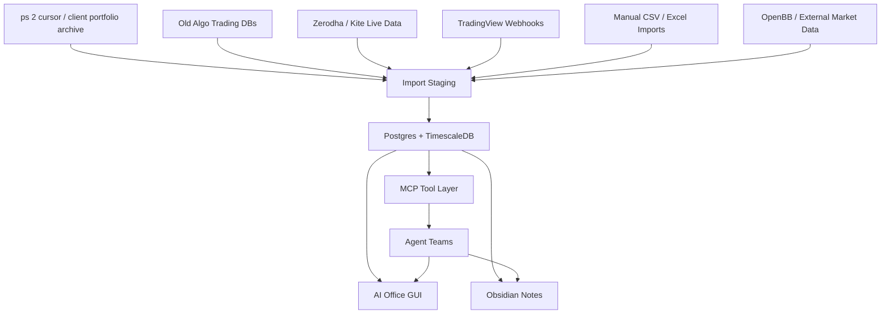
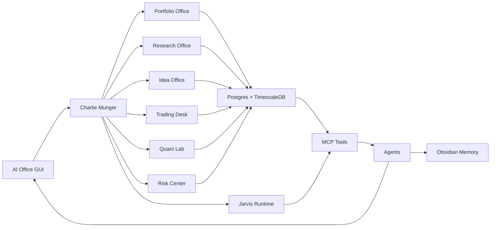

# Full Portfolio Intelligence OS Product Plan

## Product Vision

Build a personal Bloomberg-style AI office for client portfolios, long-term investing, active trading, research, ideas, monitoring, and action generation.

This is not just a trading terminal. It is a unified investment operating system.

The system should answer:

- What do I own across all clients and accounts?
- Why do I own it?
- What changed today?
- What risks are building?
- Which ideas deserve research?
- Which holdings need action?
- Which trades or strategies are active?
- What is the evidence?
- What should I do next?

## One-Place Interface

The main GUI should be the daily operating surface.

Top-level navigation:

- Command Center
- Portfolio Office
- Client Folios
- Holdings Research
- Idea Pipeline
- Trading Desk
- Quant Lab
- Strategy Monitor
- Risk Center
- Reports and Inbox
- Knowledge Vault
- System Health

Obsidian remains the long-term knowledge graph and archive. The GUI is the live workbench.

## Core Data Spine

All old systems feed into one clean warehouse.

Primary tables:

- Clients
- Accounts
- Holdings
- Transactions
- Cash
- Instruments
- Prices and OHLCV
- Portfolio snapshots
- Signals
- Strategies
- Trades
- Research notes
- Ideas
- Risks
- Tasks
- Reports
- Agent run logs

## Dashboard Surfaces

### Command Center

Purpose: daily home.

Widgets:

- Today brief
- Market status
- Client portfolio alerts
- Open risks
- Pending actions
- Active signals
- Agent inbox
- System/data health
- One-click "What changed?" report

### Portfolio Office

Purpose: full cross-client portfolio control.

Widgets:

- Total AUM
- Client/account allocation
- Holdings by sector, market cap, geography, factor
- Concentration
- Cash levels
- P&L and performance
- Drift from target
- Risk flags
- Upcoming events
- Rebalance ideas

### Client Folios

Purpose: client-specific view.

For each client:

- Holdings
- Transactions
- Cash
- Performance
- Allocation
- Risk exposure
- Watchlist
- Notes
- Suggested actions
- Client-ready report

### Holdings Research

Purpose: long-term investment research.

For each holding:

- Thesis
- Valuation range
- Business quality
- Management
- Moat
- Financials
- Filings/transcripts
- Catalysts
- Risks
- What would change our mind
- Last review date
- Next action

### Idea Pipeline

Purpose: generate and manage new investment ideas.

Stages:

- Captured
- Needs screen
- Needs research
- Under research
- Approved watchlist
- Candidate buy
- Rejected
- Archived

Sources:

- Screens
- News
- Sector themes
- Client needs
- Portfolio gaps
- Quant signals
- Trading strategy discoveries
- Manual ideas

### Trading Desk

Purpose: active signal/trade management.

Widgets:

- Live strategy signals
- TradingView alerts
- Open trades
- Trade journal
- Setup classification
- ATR extension state
- Regime state
- Risk checks
- Approval queue

### Quant Lab

Purpose: strategy research and validation.

Widgets:

- Backtest library
- Strategy health
- Walk-forward tests
- Markov/HMM regime models
- ATR extension scanners
- Factor analysis
- Alpha zoo
- Shadow account comparisons
- Model validation reports

### Strategy Monitor

Purpose: keep live and research strategies alive.

Widgets:

- Running strategy services
- Last signal time
- Last data refresh
- Error state
- Live vs backtest drift
- Current regime compatibility
- Strategy drawdown
- Pause/enable recommendation

### Risk Center

Purpose: capital protection.

Widgets:

- Concentration risks
- Drawdown risks
- Liquidity risks
- Correlation clusters
- Event calendar
- Stop/exit risk
- Client suitability flags
- Rule violations
- Exposure by factor/sector/theme

### Reports and Inbox

Purpose: agent output destination.

Items:

- Daily brief
- Weekly portfolio review
- Monthly client reports
- Holding review reports
- Trade performance reports
- Risk alerts
- Research memos
- Agent questions needing human decision

### Knowledge Vault

Purpose: bridge GUI to Obsidian.

Functions:

- Search notes
- Open research folder
- Show linked thesis notes
- Create new note from agent output
- Show Maps of Content
- Show "what changed since last review"

### System Health

Purpose: operational reliability.

Widgets:

- Database status
- MCP status
- Model runtime status
- Feed freshness
- Strategy service uptime
- Import jobs
- Agent jobs
- Error queue

## Agent Departments

### Executive Layer

- Charlie Munger Orchestrator
- Jarvis Runtime
- Chief of Staff
- Task Router
- Decision Log Agent

### Portfolio Management Department

- Client Portfolio Manager
- Long-Term Portfolio Manager
- Rebalancing Agent
- Allocation Agent
- Cash and Liquidity Agent
- Client Report Agent

### Research Department

- Equity Research Agent
- Sector Research Agent
- Valuation Agent
- Filings and Transcript Agent
- Thesis Monitor
- News/Catalyst Agent

### Idea Generation Department

- Screener Agent
- Theme Agent
- Mispricing Agent
- Momentum/Breakout Idea Agent
- Quality/Value Idea Agent
- Portfolio Gap Agent

### Trading Department

- Trading Desk Agent
- Signal Monitor
- Setup Classifier
- Trade Journal Agent
- Execution Safety Agent

### Quant Department

- Backtest Agent
- Regime Agent
- Indicator Agent
- Factor Agent
- Strategy Research Agent
- Model Validation Agent
- Shadow Account Agent

### Risk Department

- Portfolio Risk Agent
- Trade Risk Agent
- Client Suitability Agent
- Concentration Agent
- Drawdown Agent
- Rule Violation Agent

### Data and Platform Department

- Data Steward
- Market Data Agent
- Client Data Agent
- MCP Toolsmith
- ETL Agent
- System Health Agent

## Workflows

### Daily Start

1. Pull overnight market changes.
2. Refresh portfolio snapshots.
3. Check client-level risk and holding-level news.
4. Check strategy and TradingView signals.
5. Generate action queue.
6. Save brief to Obsidian.
7. Show in Command Center.

### Holding Review

1. Load holding data, thesis, position size, and last review.
2. Pull new filings, news, price, and valuation changes.
3. Ask Research Agent, Valuation Agent, and Risk Agent.
4. Update thesis status.
5. Recommend hold/add/reduce/research more.
6. Save research memo.

### Client Portfolio Review

1. Load client holdings, transactions, cash, and performance.
2. Compare to model allocation and risk constraints.
3. Identify drift, concentration, weak holdings, and opportunities.
4. Generate client-ready summary and internal action list.

### Idea Lifecycle

1. Capture idea from screen/news/signal/manual note.
2. Score initial attractiveness.
3. Attach source/evidence.
4. Assign to research.
5. Move through pipeline.
6. Convert to watchlist/holding/rejected note.

### Trade Lifecycle

1. Signal arrives from strategy or TradingView.
2. Setup Classifier labels it.
3. Quant Agent checks historical expectancy.
4. Risk Agent checks sizing and exposure.
5. Portfolio Manager checks fit.
6. Human approves only if needed.
7. Trade journal updates automatically.

## Vibe-Trading Decision

Use `HKUDS/Vibe-Trading` as an important reference and possible component.

Adopt:

- Research workspace idea
- MCP tools
- Web UI patterns
- Multi-agent trading teams
- Shadow Account concept
- Broker journal analysis
- Backtest run cards
- Research Autopilot
- Alpha library / alpha zoo idea
- Local data bridge from CSV, Parquet, DuckDB
- IM channel delivery concept

Do not make it the whole OS because:

- Our scope is broader than trading.
- We need client folio management and long-term research as first-class objects.
- We need Zerodha/Kite and existing local data as core sources.
- We need one office GUI tailored to our workflow, not a generic trading-agent product.

Use `VibeTradingLabs/vibetrading` only as inspiration for natural-language strategy generation and validation. It is crypto-first and smaller.

## Final Product Architecture

## Build Sequence

### Build 1: Data Spine

- Start Postgres/TimescaleDB.
- Quarantine extract `ps 2 cursor.zip`.
- Import client/account/holding/transaction metadata.
- Import old algo trading DBs and historical live account data.
- Create source registry and schema registry.

### Build 2: Portfolio Office MVP

- Client list.
- Account list.
- Holdings table.
- Allocation charts.
- P&L summary.
- Risk flags.
- Holding detail page.

### Build 3: Agent Tools

- `portfolio.get_clients`
- `portfolio.get_client_snapshot`
- `portfolio.get_holdings`
- `portfolio.get_position_history`
- `research.get_holding_thesis`
- `ideas.create_idea`
- `risk.get_portfolio_risks`
- `trading.list_signals`

### Build 4: Research and Idea Pipeline

- Holding research folders.
- Thesis monitor.
- Idea pipeline board.
- Watchlist dashboard.
- Research memo generator.

### Build 5: Trading and Quant Desk

- Live strategy signal dashboard.
- TradingView signal intake.
- Trade journal.
- Strategy monitor.
- Quant Lab backtest library.
- Shadow Account behavior analysis.

### Build 6: Full AI Office

- Charlie Munger command center.
- Jarvis runtime layer.
- Agent inbox.
- Scheduled briefs.
- Client reports.
- Portfolio action queue.
- Risk review workflow.
- Local model daily driver.

## Non-Negotiables

- One clean live database.
- Read-only imports first.
- No live execution without human approval.
- Every recommendation must cite data or source notes.
- Every holding must have a thesis and review state.
- Every client must have a current portfolio snapshot.
- Every strategy must have health status.
- Every important agent output must save to Obsidian.
