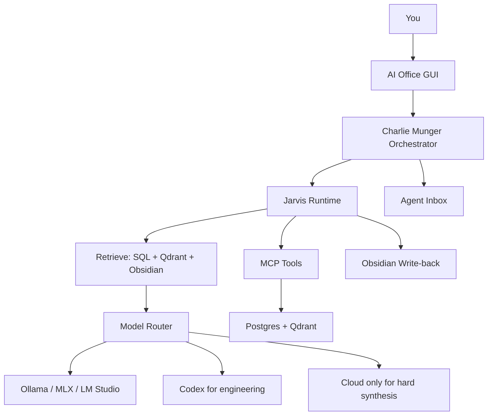

# Charlie Munger and Jarvis Model Connection

## Principle

Charlie Munger is the main orchestrator, and Jarvis is the runtime/tool layer. Neither is one model.

Charlie Munger:

1. Receives the command.
2. Decides what matters and what specialist work is needed.
3. Applies evidence checks and mental models.
4. Chooses whether local models are enough or escalation is needed.

Jarvis runtime:

1. Retrieves context from Obsidian, SQL, and Qdrant.
2. Calls MCP tools.
3. Maintains run state.
4. Writes approved results to Agent Inbox, SQL, and Obsidian.

## Model Routing Config

Runtime config:

```text
_ai_os_runtime/config/model_routes.yml
```

Default routing:

- Routine routing: Ollama `qwen3:8b`
- Routine summaries: Ollama `qwen3:8b`
- Filings analysis: Ollama or MLX/LM Studio stronger model
- Strategy generation: stronger local model first, Codex/cloud only when needed
- Coding/system changes: Codex

## Runtime Shape



## The Stack Becomes Useful When

Charlie and Jarvis have access to:

- Obsidian notes and graph.
- Trade history and old journals.
- Current positions and client folios.
- TradingView and strategy signals.
- Filings/news/social source tables.
- Vector retrieval over all of the above.

The first useful version should answer:

- What changed?
- What matters?
- What evidence supports it?
- Which agent owns the next step?
- What should be researched, ignored, watched, or approved?
