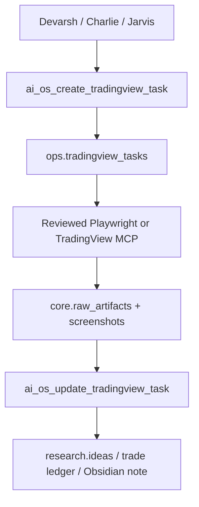

# MCP Connectors TradingView Trade Research Hub Report

## What Was Added

This build added the next useful foundation layer for the AI OS:

- External MCP candidate registry.
- TradingView task queue.
- Manual and paper trade ledger.
- Research hub refresh for Codex, Claude, cowork, and dashboard/report outputs.
- Public source connectivity checks for SEC, NSE, and BSE.

## New Warehouse Objects

```text
core.mcp_integration_registry
ops.tradingview_tasks
trading.trade_activity_ledger
core.data_source_checks
core.v_mcp_integration_registry
ops.v_tradingview_tasks
trading.v_trade_activity_ledger
trading.v_paper_trade_summary
research.v_research_hub_summary
core.v_recent_data_source_checks
```

## New MCP Tools

```text
ai_os_mcp_candidate_shortlist
ai_os_create_tradingview_task
ai_os_update_tradingview_task
ai_os_tradingview_tasks
ai_os_record_manual_trade
ai_os_record_paper_trade
ai_os_trade_activity
ai_os_refresh_research_hub
ai_os_research_hub_summary
ai_os_run_public_data_source_check
ai_os_data_source_checks
```

Total callable AI OS MCP tools after this build:

```text
47
```

## External MCP Shortlist

Approved candidates:

- Microsoft Playwright MCP: browser and TradingView/NSE/BSE automation layer.
- Official MCP Fetch: public page fetch and conversion.
- Official MCP Filesystem: scoped external SSD/vault access only.
- Official MCP Git: source repo inspection.
- SEC EDGAR direct API adapter: official no-key data source.
- NSE/BSE browser adapter: official page capture through Playwright.

Candidate review required:

- Firecrawl MCP: useful for scraping/search, but requires API key and external service.
- Tavily MCP: useful for search/extract/map/crawl, but requires API key.
- `atilaahmettaner/tradingview-mcp`: TradingView market data/screener/technical-analysis candidate.
- `tradesdontlie/tradingview-mcp`: TradingView desktop automation candidate; license review required.
- PineScript MCP candidate: strategy/Pine helper only.

Fincept remains a local sidecar/component source. It should contribute analytics, options, data-adapter ideas, and UI/component patterns. It should not replace the AI OS warehouse.

## TradingView Flow

Use this path for chart work:



Example tasks this supports:

- Open four charts.
- Build options straddle chart context.
- Inspect intraday setups.
- Capture fundamental ratio charts.
- Attach chart evidence to research or paper trades.

No broker execution is connected.

## Trade Ledger Flow

Manual trades and paper trades are stored in:

```text
trading.trade_activity_ledger
```

Use cases:

- Manual actual trade record.
- Paper trade from strategy alert.
- Shadow trade from system signal.
- Backtest/live alert follow-through.
- Journal learning and strategy diagnostics.

Tools:

- `ai_os_record_manual_trade`
- `ai_os_record_paper_trade`
- `ai_os_trade_activity`

## Research Hub

The research inventory now scans additional local output roots:

- Cowork research folders.
- Claude/cowork output folders.
- Codex output folders.
- Desktop Codex output folder.
- Standalone downloads already registered earlier.

Supported artifact types now include:

- PDF
- HTML dashboard
- Markdown
- Text
- CSV
- DOCX
- XLSX/XLSM
- JSON

Latest refresh result:

```text
records_seen: 91
records_upserted: 91
dashboard: 25
research_report: 36
financial_model: 11
data_pack: 6
executive_summary: 3
source_audit: 3
research_note: 3
research_artifact: 4
```

## Public Source Check

Latest connectivity result:

```text
checks: 4
ok: 4
SEC submissions API: HTTP 200, 1000 recent rows
SEC company facts API: HTTP 200, 505 concept groups
NSE corporate announcements page: HTTP 200
BSE corporate announcements page: HTTP 200
```

These checks are not full collectors. They prove the first public-source access layer is alive and records evidence into the warehouse.

## Verification

Commands run:

```bash
python3 -m py_compile _ai_os_runtime/mcp_server/ai_os_mcp_server.py _ai_os_runtime/scripts/check_public_data_sources.py _ai_os_runtime/scripts/inventory_ai_research_outputs.py
python3 _ai_os_runtime/scripts/check_public_data_sources.py
python3 _ai_os_runtime/scripts/inventory_ai_research_outputs.py
python3 _ai_os_runtime/scripts/smoke_mcp_connectors_trade_research_tools.py
python3 _ai_os_runtime/scripts/smoke_mcp_tools.py
python3 _ai_os_runtime/scripts/smoke_mcp_write_browser_tools.py
python3 _ai_os_runtime/scripts/smoke_manual_portfolio_tools.py
```

Smoke results:

```text
connector smoke: passed
tool_count: 47
capability_mcp_tools: 47
tradingview_task_status: done
manual/paper trade readback: 2 rows
research_summary_rows: 23
data_check_rows: 4
all temporary smoke rows cleaned up
```

## Next Steps

1. Add an AI Office UI/API adapter so these MCP-backed queues appear in the dashboard.
2. Review and install Microsoft Playwright MCP as the first browser execution layer.
3. Build the NSE/BSE filings collector into `research.corporate_filings`.
4. Review one TradingView data MCP candidate before installing it.
5. Connect old algo TradingView webhook signals to the new trade activity and TradingView task workflows.
6. Define final agent personalities and permissions after the data/action spine is visible in the UI.
