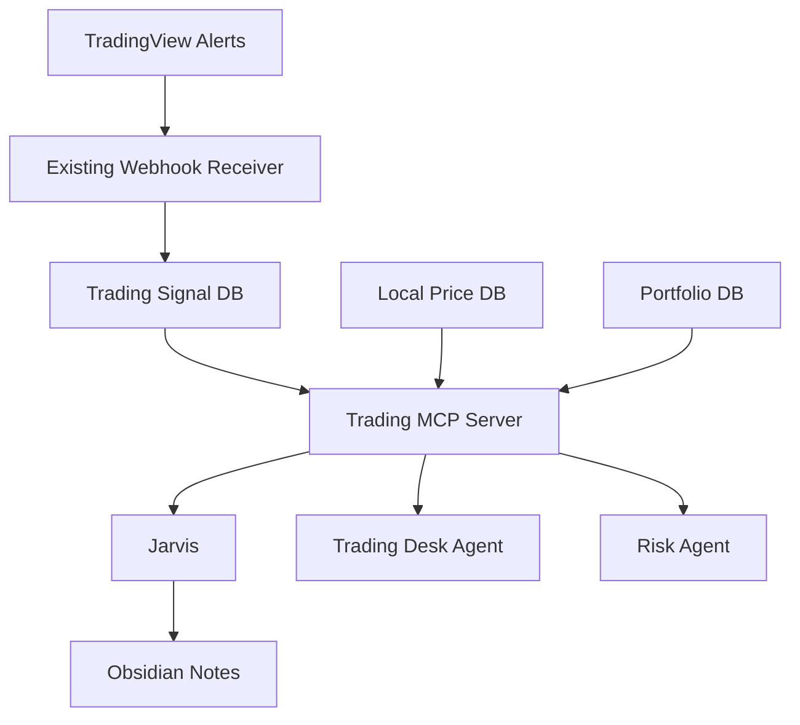

# MCP and TradingView Integration Plan

## Current State

The algo trading repo already has:

- TradingView webhook receiver at `integrations/tradingview.py`
- Signal persistence table: `tradingview_signals`
- Health route: `/tv/health`
- Webhook route: `/tv/webhook`
- Dashboard chart modules
- Portfolio and market-data modules

This means the first TradingView integration should not be a full rewrite. Start by wrapping the existing code.

## 2026-07-02 Update

TradingView is now represented in the warehouse as auditable work requests:

- `ops.tradingview_tasks`
- `ops.v_tradingview_tasks`
- `ai_os_create_tradingview_task`
- `ai_os_update_tradingview_task`
- `ai_os_tradingview_tasks`

External TradingView MCP candidates are registered, not blindly installed:

- `atilaahmettaner/tradingview-mcp`: candidate for market data, technical analysis, screeners, and backtesting. GitHub API showed MIT license.
- `tradesdontlie/tradingview-mcp`: candidate for TradingView desktop automation. GitHub API showed no asserted license, so treat as reference only until reviewed.
- `cklose2000/pinescript-mcp-server`: Pine Script helper candidate for strategy drafting/checking.

The correct next implementation path is:

1. Use `ai_os_create_tradingview_task` whenever Jarvis/Trading Desk needs a chart job.
2. Execute the task through reviewed Playwright/TradingView automation.
3. Store browser run, screenshot, source text, or chart notes as `core.raw_artifacts`.
4. Complete the task with `ai_os_update_tradingview_task`.
5. Convert useful findings into `research.ideas`, `trading.trade_activity_ledger`, strategy candidates, or Obsidian notes.

No live broker execution is connected.

## Recommended Architecture

## MCP Tools To Build First

- Done now: `ai_os_recent_trading_signals`
- Done now: `ai_os_create_tradingview_task`
- Done now: `ai_os_update_tradingview_task`
- Done now: `ai_os_tradingview_tasks`
- Done now: `ai_os_record_manual_trade`
- Done now: `ai_os_record_paper_trade`
- Done now: `ai_os_trade_activity`
- Next: `trading.get_signal_detail`
- Next: `trading.get_watchlist`
- Next: `trading.get_symbol_prices`
- Next: `trading.get_strategy_status`

## Chart Strategy

Use two chart paths:

1. Local chart rendering from stored OHLCV data for internal dashboards.
2. TradingView alerts/webhooks for external chart-triggered signals.

If an actual TradingView visual is needed in a web UI, use a TradingView widget or TradingView Lightweight Charts with local data. Do not make agents depend on screenshots of charts as the primary data source.

## Safety Rules

- Agents can read signals.
- Agents can summarize setups.
- Agents can draft trade plans.
- Agents can alert the user.
- Agents cannot place live orders without explicit approval.
- Any future order tool must require risk check plus human confirmation.

## First Deliverable

Initial deliverable is complete at the AI OS layer: TradingView tasks and trade activity are now durable/auditable through MCP.

Next deliverable: choose one reviewed TradingView automation route and connect it to `ops.tradingview_tasks`:

- Preferred: Microsoft Playwright MCP for browser/UI operations, because it is vendor-backed and broadly useful for NSE/BSE/browser workflows too.
- Candidate data route: `atilaahmettaner/tradingview-mcp`, after code/security review.
- Reference-only route: `tradesdontlie/tradingview-mcp`, until license and safety are reviewed.
