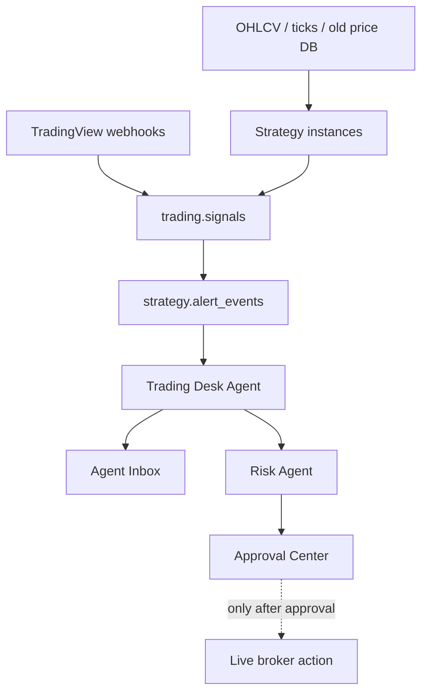

# Strategy Alert and Intraday Foundation

## Goal

Support many trading strategies, intraday technical signals, live alerts, backtests, paper/shadow runs, and AI review without uncontrolled live execution.

## Principle

Strategies can run, backtest, alert, and create recommendations.

They cannot place live trades without:

- Execution Safety Agent review
- Risk limit check
- Approval Center approval
- Audit log

## Database Objects

Trading:

- `trading.ohlcv`
- `trading.ticks`
- `trading.signals`
- `trading.trade_journals`

Strategy:

- `strategy.strategy_candidates`
- `strategy.strategy_versions`
- `strategy.strategy_instances`
- `strategy.backtest_runs`
- `strategy.alert_rules`
- `strategy.alert_events`
- `strategy.performance_snapshots`

Risk:

- `risk.limits`
- `risk.events`

## Flow

## First Import Priority

1. `prices.db.daily_bars` to `trading.ohlcv`.
2. `app.db.ticks` to `trading.ticks`.
3. `app.db.tradingview_signals` and `prices.db.live_signals` to `trading.signals`.
4. `trades.db.trades` and `app.db.trades` to `portfolio.trades`.
5. `app.db.journal` to `trading.trade_journals`.
6. `app.db.saved_strategies` and `prices.db.backtest_runs` to `strategy.*`.

## Safety Defaults

- All imported strategies start as `shadow` or `paper`.
- All intraday signals default to `observed`.
- All trade actions require approval.
- The first live dashboard should show alerts, health, and evidence, not order buttons.

