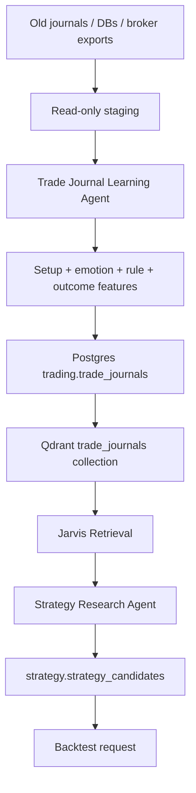

# Trade History Learning Pipeline

## Goal

Give Jarvis and the trading/quant agents old trade history and journals so they can learn recurring setups, mistakes, strengths, and strategy candidates.

## Sources

- Old trade journals
- Old trading DBs
- Broker exports
- TradingView signals
- Screenshots and notes
- Obsidian trade notes

## Database Tables

- `portfolio.trades`
- `trading.trade_journals`
- `trading.signals`
- `strategy.strategy_candidates`
- `strategy.backtest_runs`
- `knowledge.vector_documents`

## Pipeline

## Extracted Fields

- Symbol
- Strategy
- Setup type
- Timeframe
- Market condition
- Entry reason
- Exit reason
- Rule violations
- Emotional state
- Execution quality
- R multiple
- P&L
- Screenshot/note links

## First Useful Questions

Jarvis should answer:

- Which setups made money historically?
- Which setups lost money repeatedly?
- Which market regimes were bad for me?
- What mistakes repeat?
- Which strategies deserve backtesting?
- Which live signals match my best historical trades?
- Which current signals resemble my worst historical mistakes?

