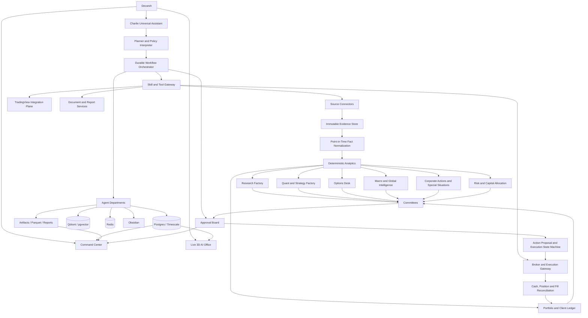
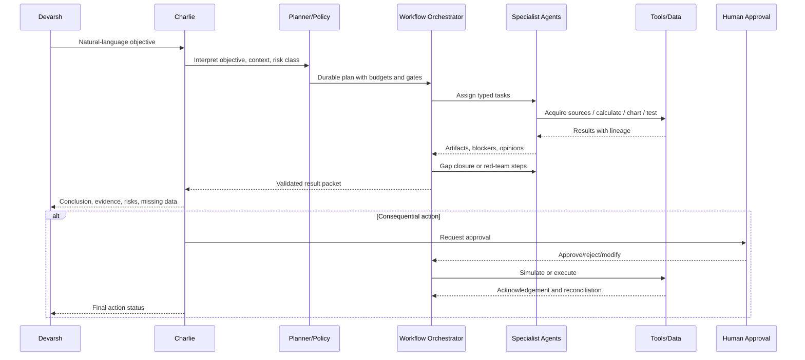

# AI Investment OS — Institutional Master Blueprint v11.0

**Date:** 24 August 2026  
**Owner:** Devarsh  
**Status:** Canonical target architecture and delivery blueprint  
**Supersedes:** Institutional Master Blueprint v10.0 and fragmented desk-specific plans  
**Primary goal:** Build a local-first, evidence-driven, AI-enabled Bloomberg-class investment operating system that acts as Devarsh's live assistant, research factory, quant and options platform, portfolio and client-folio operating system, and—only after explicit safety gates—a policy-controlled autonomous action system.

---

## 0. Executive mandate

The product is not a finance chatbot, a collection of dashboards, or a decorative multi-agent demo. It is one integrated investment office with five non-negotiable properties:

1. **Every claim is evidence-bound.** A conclusion must point to the documents, observations, calculations, assumptions, versions, and timestamps that produced it.
2. **Every number is deterministic.** LLMs explain and critique; Python, SQL, pricing engines, ledgers, and risk services calculate.
3. **Every agent is real.** The 3D office visualizes actual tasks, tool calls, messages, artifacts, approvals, failures, costs, and progress. No fake employees, fake activity, or seed trades may appear in a production view.
4. **Charlie is the universal operating interface.** Devarsh can ask Charlie to research, scan, chart, test, optimize, review portfolios, coordinate agents, create reports, prepare actions, operate connected applications, and manage the office. Charlie may use any registered capability that policy permits, but cannot bypass data-quality, client, risk, compliance, approval, or execution gates.
5. **Autonomy is earned.** The system advances from read-only assistance to drafting, simulation, paper execution, human-approved live execution, and finally narrow policy-bounded autonomy only after measurable reliability and reconciliation evidence.

The north-star user experience is:

> Devarsh asks Charlie one natural-language question. Charlie understands the objective and affected book or client, creates a durable plan, delegates work to visible specialist agents, gathers real data, closes evidence gaps, runs deterministic analysis, shows progress live in the 3D office, returns a cited conclusion and bear case, updates the relevant dashboards and memory, and requests approval only for genuinely consequential actions.

---

## 1. Product definition

### 1.1 What the system becomes

The finished system combines the functions of:

- a market terminal and charting cockpit;
- an institutional fundamental-research platform;
- a filings, earnings, news, and alternative-data intelligence engine;
- a macro and geopolitical observatory;
- a quantitative research and strategy factory;
- an options analytics, strategy, and risk desk;
- a corporate-action and special-situations desk;
- a portfolio accounting, risk, attribution, and capital-allocation system;
- a client-folio operating platform;
- a paper and supervised live execution gateway;
- a persistent AI office with specialists, committees, inboxes, tasks, and approvals;
- a personal chief-of-staff assistant through Charlie;
- an auditable memory and evidence graph.

### 1.2 What the system is not

It is not:

- a replacement for licensed market-data contracts where those are required;
- an LLM calculating cash, Greeks, performance, risk, or valuation from prose;
- an autonomous broker bot with unrestricted credentials;
- a place where social posts are treated as verified facts;
- a TradingView scraper used as the accounting or point-in-time source of truth;
- a 3D scene whose animation is disconnected from actual work;
- a collection of unreviewed third-party skills with shell access;
- a public repository containing client data, broker credentials, licensed data, or internal operating state.

### 1.3 Core operating books

Every position, idea, strategy, research case, and action belongs to an explicit book:

| Book | Purpose | Typical horizon | Default action mode |
|---|---|---:|---|
| Long-Term Core | High-quality compounders and durable value | 3–10+ years | Human-approved |
| Long-Term Opportunistic | Mispricing with medium-term normalization | 1–5 years | Human-approved |
| Tactical | Event, trend, or catalyst-driven exposure | Days–months | Paper or human-approved |
| Special Situations | Buybacks, open offers, mergers, demergers, delistings, rights, insolvency | Event horizon | Human-approved |
| Quant Equity | Systematic factor, cross-sectional, event, and timing strategies | Intraday–months | Paper, then policy-bounded |
| Options | Volatility, carry, directional, hedging, and event structures | Intraday–months | Paper, then human-approved |
| Macro / Cross-Asset | Rates, FX, commodities, indices, crypto, hedges | Days–years | Human-approved |
| Treasury / Cash | Cash management and low-risk yield | Days–years | Policy-bounded later |
| Client Mandates | Client-specific portfolios and restrictions | Mandate-specific | Human-approved |
| Experimental | New data, models, or strategies | Research only | No live execution |

Opposing positions in the same instrument are allowed only when their books, owners, purposes, horizons, risks, and exit rules are explicit.

---

## 2. Design principles

### 2.1 Evidence before eloquence

A report may be polished only after the evidence packet is complete enough for its stated purpose. Missing facts must produce tasks, not merely disclaimers.

### 2.2 Point-in-time truth

Every source and fact records at least:

- when the underlying event occurred;
- when the issuer or authority published it;
- when the system retrieved it;
- when the market could reasonably have known it;
- which version superseded it;
- which parser and normalizer produced it.

This prevents look-ahead bias, stale conclusions, and accidental restatement mixing.

### 2.3 Deterministic system of record

- **Postgres/TimescaleDB:** accounting, facts, tasks, approvals, state, lineage, risk, and operational records.
- **Object store / external SSD:** raw documents, PDFs, screenshots, model artifacts, Parquet, logs, backtests, reports, and immutable evidence.
- **DuckDB + Parquet:** local analytical and quant workloads.
- **Qdrant/pgvector:** semantic retrieval, never accounting.
- **Redis:** queue acceleration, cache, locks, and transient events; never the sole durable record.
- **Obsidian:** human-readable decisions, research notes, runbooks, committee minutes, and links to evidence.

### 2.4 Agents operate through capabilities

Agents do not receive unrestricted filesystem, shell, browser, database, or broker access. They receive versioned tools with:

- typed input and output schemas;
- read/write/execute risk class;
- allowed roles and books;
- required evidence;
- time and monetary budget;
- idempotency behavior;
- audit and replay metadata;
- explicit failure semantics.

### 2.5 Local first, cloud by exception

Routine intake, classification, summarization, delegation, retrieval, monitoring, and drafting run locally. Premium cloud models are escalation routes for high-value synthesis, difficult reasoning, vision, or coding after privacy and cost policy checks.

### 2.6 One real vertical slice before breadth

Wipro remains the first golden company case. One portfolio, one paper broker, one complete research-to-action flow, and one fully reconciled outcome must work before broad autonomous execution.

---

## 3. Top-level system map



---

# Part I — Human operating surfaces

## 4. Primary navigation and workspaces

The application should expose the following top-level surfaces. Every page must show data freshness, source health, active filters, affected book/client, and whether the view is calculated, estimated, simulated, or model-generated.

### 4.1 Today / Mission Control

A personalized operating page containing:

- overnight and pre-market brief;
- portfolio and client exceptions;
- earnings, filings, and corporate-action calendar;
- open approvals;
- agent and research blockers;
- strategy and scanner alerts;
- options risk and expiry alerts;
- macro regime changes;
- data-source degradation;
- scheduled reports;
- model and infrastructure health;
- Charlie command bar.

### 4.2 Charlie

Charlie is available as:

- a persistent global command bar;
- a full-screen conversational workspace;
- a floating panel inside every page;
- a voice-capable interface later;
- a presence inside the 3D executive office;
- an API and MCP entry point.

Charlie carries context across surfaces: selected company, portfolio, client, strategy, date range, chart, evidence packet, and current conversation.

### 4.3 Live 3D AI Office

A real-time, explorable office showing all live agents, departments, tasks, handoffs, committees, and approvals. Detailed specification is in Part II.

### 4.4 Research Factory

- Research inbox
- Company workspace
- Research cases
- Filings and updates
- Evidence library
- Financial model
- Industry and TAM
- Moat and competition
- Management and governance
- Forensic accounting
- Valuation
- Thesis, variant view, and red team
- Committee room
- Monitoring and thesis drift
- Reports and exports

### 4.5 Market and TradingView Lab

- Multi-asset market tape
- Symbol intelligence
- Internal charts
- TradingView chart bridge
- Watchlists and alerts
- Technical analysis
- Multi-timeframe views
- Screeners
- Ratio and synthetic-index builder
- Pine workspace
- Strategy Tester import and comparison
- Chart screenshot and annotation library

### 4.6 Quant Lab

- Idea inbox
- Data catalog
- Feature store
- Strategy DSL
- Research notebooks
- Backtests
- Walk-forward and cross-validation
- Optimizer
- Portfolio construction
- Paper strategies
- Live monitors
- Model and strategy scorecards
- Retirement review

### 4.7 Options Desk

- Chain and expiry explorer
- Greeks
- IV surface, skew, and term structure
- OI, volume, and flow
- Gamma, vanna, and charm exposure
- Strategy builder
- Payoff and scenario lab
- Event-volatility desk
- Options scanner
- Historical options backtest
- Portfolio options risk
- Hedge designer
- Paper and supervised order proposals

### 4.8 Macro and Global Intelligence

- India macro
- Global macro
- Rates and yield curves
- Inflation and growth
- Liquidity and credit
- FX and commodities
- Flows and positioning
- Geopolitical and physical-world event map
- Regime model
- Forecast ledger and calibration
- What-if scenario room
- Economic calendar
- Portfolio impact map

### 4.9 Corporate Actions and Special Situations

- Live event tape
- Event calendar and timelines
- Buybacks, open offers, rights, mergers, demergers, delistings, splits, bonuses, dividends
- Spread and annualized-return calculator
- Completion probability and condition tracker
- Corporate-action idea generator
- Portfolio impact and entitlement engine
- Legal and document evidence room
- Special Situations Committee

### 4.10 Portfolio, Clients, Risk, and Capital

- House portfolios and books
- Client households and mandates
- Accounts and custodians
- Holdings and tax lots
- Cash and transactions
- Performance and attribution
- Benchmarks
- Exposure and factor risk
- Liquidity and concentration
- Scenario and stress tests
- Capital-allocation proposals
- Client reports
- Restrictions and suitability
- Review cadence and action board

### 4.11 Trading and Execution

- Order-intent queue
- Pre-trade checks
- Paper execution
- Human approvals
- Broker acknowledgements
- Fills and partial fills
- Reconciliation
- Kill switch
- Incident log
- Execution analytics

### 4.12 System

- Agents and departments
- Tasks and inboxes
- Models and routes
- Skills and tools
- Data providers
- Source freshness
- Knowledge and memory
- Costs and budgets
- Audit log
- Security
- Backups and recovery
- Service health

---

# Part II — Live 3D office and universal assistant

## 5. Live 3D AI Office: product contract

The 3D office is an operating surface, not decoration. It must answer, at a glance:

- Which agents are active?
- What is each agent doing?
- Which model and tools are being used?
- What evidence is being read?
- How far has the task progressed?
- What is blocked?
- Who is waiting for whom?
- Which committee is deliberating?
- Which approvals require Devarsh?
- What did each agent produce?
- What did the work cost?
- Can Devarsh talk to, pause, redirect, or inspect the agent?

### 5.1 Floor plan

Recommended rooms:

| Room | Live occupants and functions |
|---|---|
| Executive Office | Charlie, Jarvis, CIO, Chief of Staff; command intake and orchestration |
| Research Intake | Case triage, source planning, research backlog |
| Filings and Evidence Library | Filing collector, document parser, citation auditor, data-quality agent |
| Fundamental Research | Company analyst, industry analyst, TAM analyst, moat analyst |
| Financial Modelling | Financial normalizer, model builder, accounting-quality analyst |
| Governance and Forensics | Governance, related-party, auditor, promoter, capital-allocation specialists |
| Valuation Lab | DCF, multiples, SOTP, scenario and Monte Carlo agents |
| Macro Situation Room | Economist, rates, FX, commodities, geopolitical and Pythia agents |
| Quant Lab | Alpha researchers, feature engineer, backtester, optimizer, validator |
| Options Pit | Volatility, surface, flow, strategy, hedge and options-risk agents |
| Trading Desk | Market monitor, execution planner, broker gateway, reconciliation agent |
| Risk Wall | Market, factor, liquidity, drawdown, concentration and operational risk |
| Capital Allocation | Portfolio construction, sizing, cross-book netting, cash allocation |
| Portfolio and Client Office | PM agents, performance, tax lots, mandate, reporting agents |
| Corporate Actions Room | Event parser, spread analyst, legal-condition tracker, idea generator |
| Committee Rooms | Research, Strategy, Options, Risk, Capital, Special Situations, Client |
| Approval Desk | Human and policy approvals; action signing |
| Engineering and Data Center | SRE, data pipelines, model operations, security, backups |
| Archive / Memory | Obsidian, evidence graph, reports, decisions, replay |

### 5.2 Real agent states

Every avatar state is derived from a durable runtime state:

```text
OFFLINE
IDLE
PLANNING
WAITING_FOR_INPUT
ACQUIRING_SOURCE
READING
PARSING
EXTRACTING
CALCULATING
ANALYZING
WRITING
CALLING_TOOL
WAITING_FOR_TOOL
HANDING_OFF
IN_COMMITTEE
WAITING_FOR_APPROVAL
APPROVED
SIMULATING
EXECUTING
RECONCILING
BLOCKED
RETRYING
FAILED
PAUSED
COMPLETED
```

No avatar may be shown as “working” unless the associated task lease or run is active. No movement or handoff animation may occur without a corresponding event.

### 5.3 What the user sees on each agent

Hover card:

- name, role, department;
- current status;
- active task and affected entity/book/client;
- elapsed time and estimated remaining stage;
- current model route;
- current tool;
- input source count;
- confidence or blocker;
- cost and token budget;
- last completed output.

Click panel:

- full task plan;
- step history;
- live messages;
- sources and evidence;
- calculations and artifacts;
- tool calls and responses;
- model calls;
- approvals;
- errors and retries;
- related agents;
- ability to chat, assign, redirect, pause, resume, or stop, subject to policy.

### 5.4 Talk to any agent

Every agent has a persistent, case-aware chat thread. Devarsh can:

- ask what the agent is doing;
- request a plain-language explanation;
- provide new evidence or assumptions;
- ask for a sensitivity or alternative view;
- challenge a conclusion;
- ask the agent to hand work to another specialist;
- invite the agent into a committee;
- ask Charlie to summarize or arbitrate.

Agent conversations are not ephemeral. Each message is linked to the relevant task, case, book, client, sources, and artifacts.

### 5.5 Charlie inside the office

Charlie is visible in the Executive Office and can be summoned from anywhere. Charlie can:

- accept a new objective;
- inspect the entire office;
- create and reprioritize tasks;
- call any allowed skill;
- ask specialists for opinions;
- convene committees;
- open the relevant page or chart;
- generate and export reports;
- prepare an action proposal;
- explain why the system is blocked;
- ask Devarsh for approval;
- monitor completion.

Charlie does not “pretend” to act. Every claimed action must resolve to a recorded tool call, task, artifact, database change, application action, or explicit statement that the action could not be completed.

### 5.6 Task handoffs and visual semantics

- A moving document or line between desks represents a real `handoff_event`.
- A committee-room light turns on only while a committee run is active.
- An approval-desk badge reflects unresolved approval records.
- A red pulse means a failed or risk-blocked task.
- An amber pulse means missing evidence, stale data, or budget pressure.
- A green completion pulse appears only after output validation.
- Screens show sanitized live summaries, not private raw credentials or client PII.
- Agent speech bubbles display actual messages, truncated and expandable.

### 5.7 2D and accessibility fallback

The office must remain fully usable without WebGL:

- 2D floor map;
- department grid;
- agent table;
- keyboard navigation;
- screen-reader labels;
- reduced-motion mode;
- mobile “office feed” view.

Decision-critical charts remain DOM/SVG/canvas components, not text rendered inside the 3D scene.

### 5.8 Technical architecture

Recommended frontend:

- React + TypeScript + Vite
- React Router for addressable workspaces
- Zustand only for local selection and view state
- React Three Fiber + Three.js + Drei for 3D
- DOM-based charting for analytics
- SSE or WebSocket for live event stream
- IndexedDB for short-lived UI cache
- Tailscale/local authentication for private deployment

Core APIs:

```text
GET  /v1/office/floor
GET  /v1/agents
GET  /v1/agents/{agent_id}
GET  /v1/agents/{agent_id}/messages
POST /v1/agents/{agent_id}/message
POST /v1/agents/{agent_id}/pause
POST /v1/agents/{agent_id}/resume
POST /v1/agents/{agent_id}/redirect
GET  /v1/tasks
GET  /v1/tasks/{task_id}
GET  /v1/committees/active
GET  /v1/approvals/open
GET  /v1/office/events/stream
```

The scene has no independent authority. All actions use the same audited API and policy gateway as the 2D application.

---

## 6. Charlie: universal live assistant

### 6.1 Charlie's mandate

Charlie is the single primary assistant through which Devarsh can operate the entire investment office. “Can do anything” means:

> Charlie can understand, plan, delegate, and invoke every registered system capability for which the current user, book, client, environment, data quality, and risk policy grant permission.

It does not mean unrestricted shell access, unrestricted broker access, bypassed approvals, or silent use of private data.

### 6.2 Charlie capability domains

Charlie must be able to:

- answer investment, market, portfolio, and operational questions;
- start and manage full company research cases;
- find and acquire missing evidence;
- inspect filings, presentations, transcripts, and reports;
- calculate and explain valuation through deterministic services;
- scan markets and watchlists;
- open TradingView charts and request indicators;
- generate Pine indicators or strategies in a sandbox;
- run and compare strategy tests;
- create ratio and synthetic-index charts;
- generate, test, and optimize quant ideas;
- design and simulate options structures;
- review portfolio and client-folio changes;
- identify risk, concentration, liquidity, and mandate issues;
- track macro events and map them to holdings;
- monitor corporate actions and create special-situation dossiers;
- produce morning, pre-market, post-market, weekly, monthly, research, and client reports;
- manage tasks, agents, committees, schedules, and approvals;
- search the knowledge base and prior decisions;
- prepare—never silently send—client communications unless a sending permission is explicitly enabled;
- prepare order proposals and route approved orders through the execution gateway;
- explain system, model, data, and provider health.

### 6.3 Command lifecycle



### 6.4 Charlie response contract

For significant requests, Charlie returns:

```yaml
understood_objective:
affected_entities:
affected_books_or_clients:
plan:
agents_assigned:
tools_and_sources:
source_freshness:
calculations_run:
conclusion:
confidence:
bear_case:
contradictions:
missing_data:
risk_flags:
approvals_needed:
artifacts_created:
dashboards_updated:
memory_written:
next_recommended_action:
```

### 6.5 Planning rules

- Prefer one planner and focused specialists over uncontrolled agent debate.
- Reuse existing evidence and calculations before acquiring more.
- Convert missing critical information into acquisition tasks.
- Stop when the expected value of another step is below its cost.
- Escalate to a premium model only when local routes fail an explicit quality threshold.
- Ask Devarsh only for decisions the system cannot resolve from policy or connected data.
- Never claim success from a queued action; distinguish queued, running, completed, validated, and reconciled.

---

# Part III — Agent organization and skill system

## 7. Department and agent design

The existing agent registry remains the source of truth. The blueprint does not require a fixed hardcoded count; it requires every active agent to have a durable identity, role, capabilities, budget, model route, and visible state.

### 7.1 Recommended core departments

#### Executive and orchestration

- Charlie — Chairman and universal assistant
- Jarvis — runtime operator
- Chief Investment Officer
- Chief Risk Officer
- Chief Data Officer
- Chief Operating Officer
- Chief Compliance and Policy Officer
- Chief of Staff / task coordinator

#### Data and evidence

- Source Planner
- Filing Collector
- Company IR Collector
- Market Data Steward
- Corporate Actions Collector
- News and Social Feed Collector
- Macro Data Collector
- Alternative Data Collector
- Document Parser
- Table Extractor
- Entity Resolver
- Point-in-Time Normalizer
- Citation Auditor
- Data Quality and Reconciliation Agent

#### Fundamental research

- Research Director
- Company Analyst
- Industry Analyst
- TAM and Value-Chain Analyst
- Competition and Moat Analyst
- Customer and Supplier Analyst
- Management and Capital-Allocation Analyst
- Governance Analyst
- Forensic Accounting Analyst
- Transcript and Guidance Analyst
- Financial Model Builder
- Valuation Analyst
- Scenario and Monte Carlo Analyst
- Catalyst and Monitoring Analyst
- Bear-Case / Red-Team Analyst
- Research Editor

#### Macro and global intelligence

- Chief Economist
- India Macro Analyst
- Global Growth and Inflation Analyst
- Rates and Yield-Curve Analyst
- FX Analyst
- Commodities Analyst
- Liquidity and Credit Analyst
- Flows and Positioning Analyst
- Geopolitical / Pythia Analyst
- Macro Scenario Analyst
- Macro-to-Portfolio Impact Analyst

#### Quant

- Head of Quant Research
- Alpha Idea Generator
- Feature Engineer
- Factor Researcher
- Cross-Sectional Researcher
- Time-Series Researcher
- Statistical Arbitrage Researcher
- Event Strategy Researcher
- Intraday Researcher
- Backtest Engineer
- Cost and Slippage Modeler
- Strategy Optimizer
- Walk-Forward Validator
- Data-Snooping and Overfit Auditor
- Portfolio Construction Researcher
- Quant Risk Analyst
- Paper Strategy Monitor
- Strategy Retirement Reviewer

#### Options

- Head of Volatility
- Options Data and Chain Analyst
- Greeks and Surface Analyst
- Skew and Term-Structure Analyst
- OI and Flow Analyst
- Gamma/Vanna/Charm Analyst
- Event Volatility Analyst
- Options Strategy Designer
- Payoff and Scenario Analyst
- Options Backtest Engineer
- Options Portfolio Risk Analyst
- Hedge Designer
- Options Execution Planner

#### Trading and execution

- Market Monitor
- Technical and Multi-Timeframe Analyst
- TradingView Operator
- Order Intent Builder
- Pre-Trade Risk Agent
- Broker Gateway Agent
- Fill and Reconciliation Agent
- Execution Quality Analyst
- Trade Surveillance Agent

#### Corporate actions and special situations

- Event Classifier
- Document and Legal-Condition Analyst
- Entitlement Calculator
- Spread and IRR Analyst
- Completion Probability Analyst
- Special-Situation Idea Generator
- Special Situations Risk Analyst
- Event Monitor

#### Portfolio and clients

- Portfolio Manager
- Client Mandate Analyst
- Holdings and Cash Reconciler
- Tax-Lot Analyst
- Performance Analyst
- Attribution Analyst
- Exposure and Concentration Analyst
- Liquidity Analyst
- Capital Allocation Analyst
- Client Reporting Analyst
- Review and Rebalancing Planner

#### Engineering, security, and model operations

- Platform SRE
- Database and Migration Agent
- Pipeline Reliability Agent
- Security and Secret Scanner
- Model Router
- Model Evaluation Agent
- Cost Controller
- Backup and Restore Agent
- Incident Manager

### 7.2 Agent registry schema

```yaml
agent_id: research.forensics.01
display_name: Forensic Accounting Analyst
department: research
room_id: governance_forensics
role_version: 3
status: idle
model_route: local_research_mid
allowed_skills:
  - evidence.read
  - facts.financial.read
  - filings.search
  - forensics.calculate
  - artifact.write
denied_skills:
  - broker.*
  - client.pii.export
risk_class: analytical
max_parallel_tasks: 1
max_steps_per_task: 12
token_budget: 18000
monetary_budget_usd: 0.20
requires_citations: true
requires_deterministic_calculations: true
escalation_policy: research_director
```

### 7.3 Agent truthfulness

An agent output is valid only when it includes:

- task and run identifiers;
- source packet identifiers;
- model and prompt version;
- tool-call records;
- calculations and assumptions;
- uncertainty;
- missing data;
- citations;
- validation state.

Agent personality may affect tone, not facts, permissions, or investment policy.

---

## 8. Skills and tool gateway

### 8.1 Finance-skills integration

The `finance-skills` repository is used as:

- a reference catalog of analyst workflows;
- a starting library for valuation, earnings, options-payoff, market analysis, social readers, and TradingView access;
- an example of portable `SKILL.md` packaging.

It is not installed wholesale into production. Selected skills must be:

1. pinned to a reviewed commit;
2. copied or wrapped into the AI OS skill registry;
3. assigned typed schemas;
4. checked for shell, browser, credential, and network behavior;
5. covered by finance-specific tests;
6. classified as read, write, or execute;
7. mapped to approved data providers;
8. given deterministic calculation dependencies;
9. licensed and attributed.

### 8.2 Skill package contract

```text
skills/{domain}/{skill_name}/
  SKILL.md
  manifest.yaml
  input.schema.json
  output.schema.json
  policy.yaml
  tests/
  fixtures/
  references/
  implementation/
  LICENSES.md
```

`manifest.yaml`:

```yaml
name: company_valuation
version: 2.1.0
domain: research
risk_class: analytical
allowed_agents:
  - research.valuation.*
requires:
  facts:
    - price
    - shares_outstanding
    - net_debt
    - revenue_history
    - cash_flow_history
  tools:
    - valuation.dcf
    - valuation.relative
    - valuation.sotp
outputs:
  - valuation_case
  - sensitivity_matrix
  - scenario_set
execution_permission: none
citations_required: true
deterministic_core: true
```

### 8.3 Tool risk classes

| Class | Examples | Default approval |
|---|---|---|
| R0: Read | Query facts, search evidence, read charts | Automatic |
| R1: Compute | DCF, backtest, Greeks, risk, scanner | Automatic with audit |
| R2: Internal write | Create task, report, note, watchlist candidate | Automatic or policy |
| R3: External non-financial action | Change TradingView layout, create alert, draft email | User/policy dependent |
| R4: Financial proposal | Create order intent, rebalance proposal | Approval required |
| R5: Financial execution | Place, modify, cancel live order | Strong approval and policy |
| R6: Administrative | Credentials, permissions, deploy, delete | Explicit administrator approval |

### 8.4 No arbitrary production shell

Third-party skills that execute arbitrary shell snippets are acceptable only in a development sandbox. Production uses reviewed service calls and allowlisted commands.

---

# Part IV — Data, evidence, and research factory

## 9. Data architecture

### 9.1 Storage layers

| Layer | Technology | Purpose |
|---|---|---|
| Raw evidence | External SSD object directories or S3-compatible store | Immutable documents, API payloads, screenshots |
| Operational truth | Postgres | Entities, tasks, facts, ledgers, approvals, policy |
| Time series | TimescaleDB / Parquet | Prices, macro series, options snapshots, signals |
| Analytical lake | Parquet + DuckDB | Backtests, feature matrices, historical universes |
| Semantic retrieval | Qdrant or pgvector | Search over evidence and notes |
| Cache and leases | Redis | Cache, queues, locks, pub/sub |
| Human memory | Obsidian | Research notes, decisions, runbooks |
| Frontend cache | Browser cache / IndexedDB | Non-authoritative responsive state |

### 9.2 Core schemas

```text
core.*
  entity
  security
  listing
  identifier
  person
  organization_relationship
  calendar

evidence.*
  source
  document
  document_version
  retrieval_event
  parser_run
  page
  table
  citation_anchor
  content_hash

facts.*
  financial_fact
  operating_metric
  estimate
  guidance
  market_quote
  corporate_action
  ownership
  macro_observation
  alternative_observation

research.*
  case
  question
  evidence_requirement
  claim
  contradiction
  thesis
  scenario
  valuation_case
  monitoring_trigger
  committee_run
  decision

agent.*
  agent
  task
  task_step
  message
  handoff
  tool_call
  model_call
  artifact
  approval
  event
  cost

market.*
  quote
  bar
  corporate_action_adjustment
  symbol_map
  trading_calendar
  scanner_definition
  scanner_run
  alert

quant.*
  data_set
  feature
  universe
  strategy
  strategy_version
  experiment
  backtest
  trade
  parameter_set
  optimization_run
  validation_run
  paper_run
  live_run

options.*
  chain_snapshot
  contract
  quote
  greek
  surface
  exposure
  strategy
  strategy_leg
  scenario
  backtest
  risk_snapshot

portfolio.*
  client
  household
  mandate
  account
  transaction
  cash_movement
  tax_lot
  position
  valuation_mark
  benchmark
  performance
  attribution
  exposure
  restriction
  review

execution.*
  order_intent
  pretrade_check
  approval
  broker_order
  acknowledgement
  fill
  allocation
  reconciliation
  incident
```

### 9.3 Point-in-time financial fact

```yaml
entity_id: wipro
metric: revenue
value: 897603000000
unit: INR
scale: 1
fiscal_period: FY2025
period_start: 2024-04-01
period_end: 2025-03-31
period_type: annual
reported_at: 2025-04-16T12:30:00+05:30
known_at: 2025-04-16T12:30:00+05:30
retrieved_at: 2025-04-16T12:33:18+05:30
source_document_id: doc_...
source_anchor: page_123/table_4/row_2
extraction_method: table_parser_v4
normalization_version: financials_v7
confidence: 0.99
is_restated: false
supersedes_fact_id: null
```

### 9.4 Data-quality dimensions

- completeness;
- freshness;
- accuracy;
- reconciliation;
- consistency;
- point-in-time validity;
- source authority;
- unit and currency correctness;
- corporate-action adjustment;
- licensing and access class.

A green “validation passed” badge may never hide low completeness. Validation and readiness are separate measures.

---

## 10. Full research desk

### 10.1 Research state machine

```text
DISCOVER
→ DEFINE_QUESTIONS
→ PLAN_EVIDENCE
→ INVENTORY_EXISTING_EVIDENCE
→ ACQUIRE_MISSING_SOURCES
→ VERIFY_SOURCE
→ PARSE
→ EXTRACT
→ NORMALIZE
→ RECONCILE
→ CALCULATE
→ ANALYZE
→ CONTRADICTION_CHECK
→ RED_TEAM
→ COMMITTEE
→ HUMAN_REVIEW
→ DECISION_READY
→ MONITOR
→ REOPEN_ON_CHANGE
```

Separate statuses:

```yaml
orchestration_status:
  - queued
  - running
  - finished
  - failed

research_readiness:
  - missing_data
  - partial
  - blocked
  - ready_for_review
  - decision_ready
  - stale

investment_status:
  - no_view
  - watch
  - avoid
  - hold
  - buy_candidate
  - sell_candidate
  - approved
  - rejected
```

A finished agent run does not imply a complete research case.

### 10.2 Research workspace tabs

#### Overview

- company identity and listings;
- current market price and timestamp;
- thesis status;
- research readiness;
- data completeness;
- key numbers;
- fair-value range;
- upside/downside;
- top risks;
- active monitoring alerts;
- next required actions.

#### Sources and evidence

- source inventory;
- official versus secondary sources;
- latest filings;
- missing source requests;
- document viewer;
- page/table anchors;
- extraction quality;
- contradiction list;
- source freshness timeline.

#### Financial history

- ten or more years of statements;
- quarter and trailing-twelve-month views;
- standalone and consolidated views;
- reported versus normalized values;
- cash-flow reconciliation;
- share-count and corporate-action reconciliation;
- segment and geographic data;
- per-share and per-employee economics.

#### Business and industry

- business model;
- value chain;
- products and services;
- customers and suppliers;
- capacity and utilization;
- segment economics;
- industry structure;
- TAM/SAM/SOM;
- market-share evidence;
- competitive intensity;
- regulation;
- disruption and substitution;
- cyclicality and operating leverage.

#### Moat and quality

- switching costs;
- network effects;
- cost advantage;
- brand and distribution;
- intellectual property;
- scale economies;
- regulatory positioning;
- customer concentration;
- supplier concentration;
- pricing power;
- retention and churn;
- reinvestment runway;
- return on incremental capital.

Each moat claim must have quantitative evidence or be marked qualitative.

#### Management, governance, and forensics

- promoter and management history;
- capital-allocation record;
- acquisitions and divestitures;
- related-party transactions;
- auditor changes and qualifications;
- remuneration;
- pledging;
- dilution;
- contingent liabilities;
- tax and subsidiary complexity;
- cash-versus-profit conversion;
- receivable and inventory anomalies;
- exceptional items;
- governance controversies;
- regulatory cases.

#### Valuation

- DCF;
- reverse DCF;
- relative valuation;
- SOTP;
- asset or replacement value where appropriate;
- normalized earnings;
- historical bands;
- scenario values;
- Monte Carlo;
- expected return;
- probability-weighted downside;
- implied assumptions at current price.

All methods consume normalized deterministic facts.

#### Thesis and red team

- base thesis;
- variant perception;
- consensus or market-implied view;
- catalysts;
- disconfirming evidence;
- bear case;
- failure modes;
- thesis break conditions;
- monitoring triggers;
- sell discipline;
- position-sizing constraints.

#### Committee and decision

- specialist opinions;
- evidence quality;
- contradictions;
- risk opinion;
- capital-allocation opinion;
- vote and dissent;
- human comments;
- final decision;
- approval and review date.

### 10.3 Evidence-gap closure

Example:

```yaml
case: WIPRO
decision_question: Is Wipro attractive at the current market price?
required_evidence:
  - latest_price
  - diluted_shares
  - FY2025_revenue
  - FY2025_OCF
  - FY2025_capex
  - FY2025_net_cash
  - FY2026_guidance
  - peer_multiples
missing:
  - FY2025_OCF
  - FY2025_capex
  - current_price
actions_created:
  - collect_annual_report
  - parse_cash_flow_table
  - reconcile_capex_note
  - fetch_exchange_quote
readiness: missing_data
```

The system loops until requirements are satisfied, explicitly waived, or genuinely unobtainable.

### 10.4 Research outputs

Every complete case creates:

- executive memo;
- full institutional report;
- financial model workbook or machine-readable model;
- evidence appendix;
- source manifest;
- valuation sensitivity;
- red-team memo;
- committee minutes;
- monitoring checklist;
- client-safe summary where permitted;
- HTML and PDF export;
- version diff versus prior thesis.

### 10.5 Company monitoring

On each new filing, earnings release, guidance change, price move, corporate action, management event, or material news item:

1. map event to companies and portfolios;
2. compare with prior facts and thesis assumptions;
3. calculate materiality;
4. update evidence and facts;
5. run focused specialists;
6. create a thesis-drift report;
7. alert only when thresholds are crossed;
8. reopen committee review when a thesis-break condition is met.

---

## 11. Research feeds, Substack, ValuePickr, and favorite thinkers

### 11.1 Source registry

The system supports read-only ingestion of:

- Substack publications;
- ValuePickr threads;
- investor and operator blogs;
- selected newsletters;
- X/Twitter lists;
- Reddit communities;
- Telegram channels;
- podcasts and YouTube;
- research papers and arXiv;
- company and industry blogs;
- patent, hiring, product, and technical sources.

The source registry is user-configurable:

```yaml
source_id: valuepickr_smallcaps
type: forum
adapter: opencli_or_browser_reader
url: https://www.valuepickr.com/
topics:
  - india_equities
  - small_caps
trust_tier: secondary
ingestion_mode: metadata_and_permitted_excerpt
schedule: "*/30 * * * *"
entity_resolution: true
idea_generation: true
requires_login: true
copyright_policy: link_and_short_excerpt
```

### 11.2 Source scorecard

Each author or publication accumulates:

- factual accuracy;
- originality;
- evidence quality;
- conflict disclosure;
- timeliness;
- sector expertise;
- idea performance after publication;
- frequency of thesis revisions;
- sensationalism or rumour rate.

This score influences triage, not truth. Primary evidence always outranks commentary.

### 11.3 Idea-extraction pipeline

```text
NEW POST
→ DEDUPLICATE
→ ENTITY/THEME EXTRACTION
→ CLAIM EXTRACTION
→ SOURCE-CREDIBILITY SCORE
→ NOVELTY CHECK
→ MAP TO WATCHLIST/HOLDINGS
→ FIND PRIMARY EVIDENCE
→ BUILD IDEA CARD
→ RESEARCH INBOX
→ HUMAN OR AGENT TRIAGE
```

Idea card:

```yaml
title:
source:
author:
published_at:
entities:
core_claim:
claimed_catalyst:
time_horizon:
primary_evidence_found:
contradictions:
novelty_score:
source_score:
portfolio_overlap:
next_research_questions:
status: inbox
```

### 11.4 Copyright and private-session policy

- Store links, metadata, user-permitted personal copies, and short excerpts.
- Do not republish paid or copyrighted newsletters.
- Authenticated browser sessions remain on the local connector node.
- Cookies and tokens never enter model prompts or logs.
- Social and newsletter content is untrusted input and may contain prompt injection.
- Claims from commentary require primary-source corroboration before investment use.

---

# Part V — Market, TradingView, scanners, and charts

## 12. TradingView integration plane

TradingView is used aggressively as a charting, scanning, watchlist, alert, technical-analysis, options-view, and strategy-testing surface. It is not the sole market-data source, research evidence store, backtest authority, portfolio ledger, or execution gateway.

### 12.1 Three connectors

#### A. Headless TradingView MCP provider

Use the reviewed and pinned `atilaahmettaner/tradingview-mcp` service for read-only:

- quotes and snapshots;
- technical indicators;
- multi-timeframe alignment;
- exchange-wide screeners;
- top gainers and losers;
- volume and Bollinger scans;
- futures overview and movers;
- pre/after-hours data where supported;
- options chain quick views without complete Greeks;
- unusual options activity heuristics;
- strategy backtests;
- strategy comparison;
- walk-forward checks;
- market and sentiment summaries where configured.

Wrap it behind the AI OS provider interface. Never expose it directly to high-risk agents.

#### B. TradingView desktop reader

Use a local, private TradingView Desktop connection for account-bound read-only capabilities:

- logged-in watchlists;
- colored lists;
- active and triggered alerts;
- chart state;
- screenshots;
- TradingView news;
- options expiries;
- full chain fields and Greeks where the account supplies them;
- custom screener columns.

This connector runs only on the local Mac with TradingView open. Cookies stay within the connector process.

#### C. Pine and chart-automation sandbox

Build a separate opt-in local automation adapter for user-approved actions:

- open symbol and layout;
- set interval;
- add or remove an indicator;
- load a saved chart template;
- paste or update Pine code;
- run Strategy Tester;
- capture result tables and screenshots;
- use Bar Replay for a specified test;
- create or modify an alert;
- save a versioned script or layout.

This write-capable adapter is disabled by default and requires R3 approval. It must not place trades.

### 12.2 Provider abstraction

```python
class MarketChartProvider:
    def quote(self, symbol, as_of=None): ...
    def bars(self, symbol, interval, start, end): ...
    def technical_snapshot(self, symbol, interval): ...
    def scan(self, scanner_definition): ...
    def open_chart(self, chart_request): ...
    def screenshot(self, chart_request): ...
    def strategy_test(self, strategy_version, symbol, settings): ...
```

Every response carries:

- source/provider;
- symbol mapping;
- exchange;
- currency;
- session;
- timeframe;
- timestamp;
- delay status;
- request and provider version;
- completeness and warnings.

### 12.3 TradingView command examples

Charlie should support:

```text
Open WIPRO on daily, weekly, and monthly charts with 20/50/200 EMA.
Show my red-flag TradingView watchlist and rank it by RSI and relative strength.
Scan NSE for volume breakouts with price above the 200-day moving average.
Create a Pine indicator for revenue-growth acceleration versus valuation compression.
Run the strategy on NIFTY and BANKNIFTY, export the trade log, and compare it with our internal backtest.
Plot NIFTY BANK divided by NIFTY 50 with a 100-day z-score.
Build an equal-weight index of our portfolio companies and compare it with NIFTY 500.
Show the full options chain and IV skew for the selected expiry.
Capture the chart and attach it to the research case.
```

### 12.4 Ratio and synthetic-index builder

The system needs a native formula engine:

```yaml
synthetic_id: bank_vs_market
name: NIFTY Bank / NIFTY 50
expression: NSE:NIFTYBANK / NSE:NIFTY
base_value: 100
currency_policy: same_currency
calendar_policy: intersection
missing_data_policy: no_forward_fill_beyond_1_session
rebalance_rule: none
corporate_action_policy: provider_adjusted
output_intervals:
  - 1D
  - 1W
```

Supported constructions:

- ratio charts;
- spreads;
- weighted baskets;
- equal-weight or market-cap indices;
- factor and sector composites;
- long/short synthetic portfolios;
- earnings yield minus bond yield;
- commodity input versus producer basket;
- portfolio versus benchmark;
- breadth indices;
- custom diffusion and regime indicators.

The canonical series is calculated internally from approved market data. The system then:

- renders it internally;
- generates Pine code where feasible;
- opens the related TradingView chart;
- stores screenshots and formula versions;
- links charts to research or strategy cases.

### 12.5 Scanner factory

Scanner types:

| Family | Examples |
|---|---|
| Technical | Breakouts, squeezes, trend template, relative strength, momentum, mean reversion |
| Fundamental | Growth, quality, cash conversion, ROIC, leverage, valuation |
| Event | Earnings, guidance, filings, insider activity, management change |
| Corporate action | Buyback, open offer, rights, split, merger, demerger, delisting |
| Ownership/flow | Bulk/block, institutional change, promoter change, short interest where available |
| Options | IV percentile, skew, term anomaly, volume/OI, gamma concentration |
| Portfolio | Thesis alert, risk change, position drift, stale research |
| Cross-asset | Yield, FX, commodity and equity relationships |
| Social/research | New high-scoring idea linked to primary evidence |
| Custom | User-authored formula and filters |

Each scanner definition is versioned, replayable, testable, and tied to a point-in-time universe.

### 12.6 TradingView and internal-backtest reconciliation

TradingView Strategy Tester is a useful independent implementation, not final proof. For every promoted strategy:

1. hash Pine code and settings;
2. export results and trades;
3. run the same logic in the internal engine;
4. compare signals, fills, costs, timestamps, and corporate-action treatment;
5. explain differences;
6. block promotion when unexplained differences exceed tolerance.

### 12.7 Data and terms safeguards

- Pin and audit third-party connectors.
- Respect provider terms, rate limits, and user subscription entitlements.
- Label delayed and third-party data.
- Do not imply official TradingView affiliation.
- Use licensed sources for production requirements.
- Never use TradingView-derived values as the portfolio accounting ledger without reconciliation.

---

# Part VI — Quant desk and strategy factory

## 13. Quant desk scope

The Quant Desk is a complete idea-to-retirement factory, not a page with a few backtests.

### 13.1 Quant lifecycle


### 13.2 Idea generator

Ideas may originate from:

- economic mechanisms;
- company and event research;
- corporate actions;
- trade journals;
- research papers;
- anomaly libraries;
- macro regimes;
- options surfaces;
- social and newsletter observations;
- Pythia world events;
- user prompts;
- failed or retired strategies;
- cross-market relationships.

Every idea becomes a structured hypothesis:

```yaml
strategy_id:
name:
economic_mechanism:
universe:
signal_definition:
entry_rule:
exit_rule:
holding_period:
position_sizing:
risk_controls:
required_data:
expected_failure_modes:
benchmark:
capacity_assumption:
cost_model:
lookahead_risks:
status: hypothesis
```

LLMs may propose the hypothesis and code skeleton. They may not certify profitability.

### 13.3 Data catalog and feature store

The Quant Desk must know:

- available symbols and history;
- survivorship-free universes;
- corporate actions;
- delistings;
- calendars;
- data gaps;
- vendor;
- adjustment method;
- timestamp granularity;
- point-in-time fundamentals;
- licensing;
- revision and quality.

Features are immutable by version:

```yaml
feature_id: price_momentum_12_1
version: 4
formula: return_252d_excluding_recent_21d
inputs:
  - adjusted_close
lookback: 252
lag: 1
neutralization:
  - sector
winsorization: 0.01
created_by:
tests:
```

### 13.4 Strategy DSL

A constrained DSL lets Charlie and agents create strategies without arbitrary execution:

```yaml
universe:
  exchange: NSE
  min_market_cap: 1000_crore
  min_adv: 2_crore
  exclude:
    - suspended
    - surveillance_restricted
signal:
  score:
    - weight: 0.4
      feature: momentum_12_1
    - weight: 0.3
      feature: earnings_revision_3m
    - weight: 0.3
      feature: quality_composite
portfolio:
  rebalance: monthly
  long_count: 20
  weighting: inverse_volatility
  max_position: 0.08
risk:
  max_sector: 0.25
  max_turnover: 0.40
costs:
  brokerage_bps: 5
  slippage_model: adv_participation
```

The DSL compiles to tested code and produces a manifest.

### 13.5 Backtest engine requirements

- point-in-time universe;
- no survivorship bias;
- corporate-action handling;
- delisting and suspended-security behavior;
- realistic market calendars;
- signal lag;
- order timing;
- bid/ask and spread;
- fees, taxes, impact, and slippage;
- borrow and locate for shorting where relevant;
- capacity;
- partial fills;
- cash and leverage;
- benchmark;
- trade log;
- equity curve;
- exposure and attribution;
- deterministic seed and environment;
- full run manifest.

### 13.6 Optimizer

Support:

- grid and random search;
- Bayesian optimization;
- evolutionary search only where justified;
- nested walk-forward;
- time-series cross-validation;
- parameter stability;
- multiple-market and multiple-regime validation;
- constraint-aware optimization;
- multi-objective targets: return, Sharpe, drawdown, turnover, capacity, tail risk.

Do not optimize on a single headline metric.

### 13.7 Robustness and overfit audit

Required checks:

- in-sample versus out-of-sample;
- walk-forward;
- parameter sensitivity;
- subperiod and regime stability;
- universe perturbation;
- cost and slippage stress;
- delay and execution stress;
- bootstrap;
- Monte Carlo trade-order reshuffling;
- multiple-testing correction;
- probability of backtest overfitting;
- deflated Sharpe;
- data-mining and leakage checklist;
- economic rationale review.

### 13.8 Quant strategy desk

Each strategy has a live page:

- thesis and mechanism;
- owner;
- version;
- status;
- current parameters;
- latest signals;
- portfolio and exposure;
- paper/live performance;
- benchmark;
- drift;
- turnover and costs;
- capacity;
- recent trades;
- monitoring alerts;
- model/data changes;
- retirement conditions;
- committee history.

### 13.9 Scanners and live signal board

- pre-market and end-of-day scans;
- intraday scans where data permits;
- signal de-duplication;
- signal persistence;
- regime conditioning;
- portfolio overlap;
- liquidity and tradability;
- risk-adjusted ranking;
- alert throttling;
- explanation and evidence.

### 13.10 Strategy Committee

Promotion states:

```text
IDEA
HYPOTHESIS
DATA_READY
BACKTESTED
VALIDATED
PAPER_APPROVED
PAPER_RUNNING
LIVE_CANDIDATE
HUMAN_APPROVED
LIMITED_LIVE
SCALED_LIVE
PAUSED
RETIRED
REJECTED
```

No model can skip states.

---

# Part VII — Options desk

## 14. Options data and analytics

### 14.1 Required market data

For each underlying, expiry, strike, and timestamp:

- bid, ask, last, volume, open interest;
- underlying spot/future;
- implied volatility;
- delta, gamma, theta, vega, rho;
- contract multiplier;
- lot size;
- settlement type;
- exercise style;
- expiry and trading calendar;
- rates, dividends, and borrow assumptions;
- source and timestamp.

Historical options research requires stored chain snapshots or a licensed historical source. Current-chain APIs cannot create a trustworthy historical backtest retrospectively.

### 14.2 Desk surfaces

- chain ladder;
- expiry summary;
- ATM and forward;
- volatility cone;
- IV rank and percentile;
- skew by delta and strike;
- term structure;
- surface visualization;
- OI and volume map;
- gamma exposure;
- vanna and charm exposure;
- event-volatility comparison;
- expected move;
- realized versus implied;
- liquidity and spread quality;
- strategy builder;
- portfolio risk.

### 14.3 Strategy builder

Supported structures:

- long/short call or put;
- verticals;
- covered call and protective put;
- straddle and strangle;
- iron condor and iron butterfly;
- calendar and diagonal;
- ratio spread;
- butterfly;
- collar;
- synthetic stock/future;
- risk reversal;
- backspread;
- dispersion and relative-value structures later.

Every strategy produces:

- leg table;
- net premium;
- max profit and loss;
- break-evens;
- Greeks;
- payoff at expiry;
- theoretical P&L before expiry;
- IV, time, rate, dividend, and spot scenarios;
- liquidity and execution estimate;
- margin where available;
- portfolio impact.

### 14.4 Options scanners

- high or low IV percentile;
- realized versus implied divergence;
- skew anomaly;
- term-structure inversion;
- unusual volume/OI;
- OI concentration;
- gamma walls;
- event premium;
- liquid covered-call candidates;
- defined-risk income structures;
- hedge candidates;
- dispersion candidates;
- expiry and assignment risk;
- portfolio concentration by Greek.

### 14.5 Options backtest

The engine must model:

- historical chain or reconstructed surface limitations;
- entry at realistic bid/ask;
- slippage and fees;
- contract changes and lot sizes;
- expiry, exercise, assignment, and settlement;
- corporate actions;
- margin and collateral;
- path-dependent adjustment rules;
- liquidity and capacity;
- rolling;
- early exits;
- event calendars.

### 14.6 TradingView use in options

TradingView Desktop may supply:

- visible options chains and Greeks;
- expiry lists;
- IV/skew observations;
- chart state;
- alerts;
- screenshots.

The headless TradingView MCP provides a quick chain and unusual-activity screen without complete Greeks. Final pricing and risk use the internal options engine and reconciled data.

### 14.7 Options action gate

An options order proposal requires:

- current and timestamped chain;
- liquidity threshold;
- max spread threshold;
- complete worst-case loss;
- Greek and scenario risk;
- portfolio and margin impact;
- event/expiry warnings;
- position and daily risk limits;
- approval;
- broker acknowledgement and reconciliation.

---

# Part VIII — Macro and global intelligence

## 15. Macro page

### 15.1 Data domains

#### India

- RBI policy rate and liquidity;
- yield curve and government securities;
- CPI, WPI, IIP, GDP and sector growth;
- PMI and business activity;
- credit, deposits, money supply;
- fiscal balance and government borrowing;
- trade, current account, FX reserves;
- INR;
- commodity inputs;
- FPI/DII and market flows where licensed or public;
- corporate credit and banking stress;
- monsoon, crop, power, freight, and selected physical indicators.

#### Global

- policy rates and yield curves;
- inflation and growth;
- labor;
- liquidity and financial conditions;
- credit spreads;
- dollar and FX;
- oil, gas, metals, grains;
- freight and shipping;
- positioning;
- fiscal and trade policy;
- conflict, sanctions, cyber, disasters, climate, health, and infrastructure events.

### 15.2 Data sources

Preferred sources are official and versioned: RBI, government statistics, exchanges, central banks, FRED, BIS, IMF, World Bank, OECD, statistical agencies, regulatory filings, and properly licensed vendors.

Each macro series stores vintages and revisions. A backtest uses what was known at the time, not the latest revised history.

### 15.3 Pythia integration

Use `jangles-byte/Pythia` as a component and design reference for the **Global Intelligence Service**, particularly:

- parallel feed acquisition;
- fused machine-readable world state;
- event map;
- multiple forecast horizons;
- local MCP bridge;
- signal rules;
- morning brief;
- watchlist impact mapping;
- forecast ledger;
- Brier score and calibration;
- visible consensus and dissent;
- what-if scenarios.

Do not make Pythia's prose forecast the investment system of record. Integrate it as:

```text
services/global-intelligence-pythia/
  adapter/
  source-audit/
  event-normalizer/
  forecast-import/
  scorecard-import/
  portfolio-impact/
```

Every upstream feed must be independently reviewed for reliability, licensing, timestamps, and failure behavior. The AI OS stores imported events and forecasts with Pythia version and source lineage.

### 15.4 Macro regime engine

Inputs are deterministic. Outputs may include:

- growth accelerating/decelerating;
- inflation rising/falling;
- liquidity easing/tightening;
- risk-on/risk-off;
- credit expansion/contraction;
- commodity shock;
- fiscal impulse;
- currency stress.

The regime engine presents probabilities and history, not a single unqualified label.

### 15.5 Event-to-portfolio graph

A geopolitical, macro, or physical-world event maps through:

```text
EVENT
→ COUNTRIES / COMMODITIES / RATES / FX
→ INDUSTRIES AND VALUE CHAINS
→ COMPANIES AND SECURITIES
→ PORTFOLIO POSITIONS
→ REVENUE / COST / VALUATION / RISK CHANNELS
→ MONITORING OR ACTION PROPOSALS
```

### 15.6 Forecast scorecard

Every probabilistic forecast records:

- question;
- outcome definition;
- horizon;
- probability;
- evidence;
- model and agent votes;
- resolution source;
- Brier score;
- calibration bin;
- post-mortem.

Forecasting agents gain or lose weight based on a minimum sample and bounded calibration policy. No agent dominates solely from a small sample.

### 15.7 What-if room

Charlie can ask:

- What happens to our portfolios if oil rises 25%?
- What if INR weakens to a defined level?
- What if a shipping chokepoint closes?
- What if RBI cuts 100 bps?
- What if US yields rise 150 bps?
- What if a major customer reduces IT spending?

The system builds scenario shocks, maps exposures, reruns valuation and portfolio risk, and clearly separates modeled assumptions from observed data.

---

# Part IX — Daily intelligence and newsletters

## 16. Daily personalized newsletter

The newsletter is generated from the user's holdings, watchlists, research cases, books, client mandates, favorite sources, and calendar.

### 16.1 Editions

| Edition | Indicative time | Purpose |
|---|---:|---|
| Overnight / Morning | 06:45 IST | Global developments, macro, commodities, portfolio impact |
| Pre-market | 08:30 IST | India events, gaps, filings, watchlist and scanner setup |
| Intraday exception | Event-driven | Only material alerts |
| Post-market | 16:15 IST | Portfolio moves, filings, results, flows, scanner outcomes |
| Weekly | Weekend | Thesis changes, performance, strategy scorecard, next week |
| Monthly | Month-end | Portfolio, clients, risk, attribution, model and system review |

### 16.2 Morning newsletter sections

1. What changed overnight
2. Global and India macro
3. Key market moves and cross-asset relationships
4. Portfolio and client exposure impact
5. Company filings, results, and thesis changes
6. Corporate actions and special situations
7. Quant scanner highlights
8. Options and volatility setup
9. Research ideas from favorite sources
10. Calendar and approvals
11. Data, model, and system health
12. Charlie's prioritized action list

### 16.3 Quality rules

- Every factual item has a source and timestamp.
- Duplicate stories collapse into one event.
- Primary sources are shown before commentary.
- The newsletter states why an item matters to holdings or watchlists.
- Low-confidence stories are labeled.
- No raw LLM market forecast is presented as fact.
- The system records which alerts were useful or ignored to improve ranking.

### 16.4 Delivery

- in-app;
- PDF/HTML;
- email draft or approved send;
- optional Telegram/private webhook;
- 3D office briefing screen;
- archive and search.

---

# Part X — Corporate actions and special situations

## 17. Corporate-action event model

Tracked event types include:

- dividend;
- split and consolidation;
- bonus;
- rights issue;
- buyback;
- tender;
- open offer;
- OFS;
- preferential allotment;
- QIP;
- warrants;
- merger and scheme of arrangement;
- demerger;
- spin-off;
- delisting;
- takeover;
- insolvency and restructuring;
- conversion;
- REIT/InvIT distribution and events;
- index inclusion or exclusion where relevant.

### 17.1 Event record

```yaml
event_id:
entity_id:
event_type:
announcement_at:
known_at:
record_date:
ex_date:
entitlement:
consideration:
conditions:
regulatory_steps:
shareholder_vote:
court_or_tribunal_steps:
expected_completion:
source_documents:
status:
confidence:
portfolio_impact:
```

### 17.2 Idea generator

For each event:

1. parse official terms;
2. calculate entitlement and adjusted economics;
3. create timeline and dependency graph;
4. calculate gross and annualized spread;
5. model tax, funding, liquidity, and failure cost;
6. estimate completion probability from explicit evidence and base rates;
7. identify hedges and borrow requirements;
8. check portfolio overlap;
9. build bull/base/bear outcomes;
10. send qualified opportunities to the Special Situations Committee.

### 17.3 Corporate-action portfolio engine

The ledger automatically models:

- adjusted cost and quantity;
- entitlements;
- receivables;
- fractional treatment;
- cash consideration;
- tax-lot changes;
- pending securities;
- ex-date and record-date impact;
- reconciliation against broker/custodian statements.

---

# Part XI — Portfolio, client folios, risk, and capital allocation

## 18. Deterministic portfolio ledger

The portfolio ledger is event-sourced or append-only in economic effect. It records:

- trades;
- cash transfers;
- fees and taxes;
- dividends and interest;
- corporate actions;
- FX;
- valuations;
- allocations;
- corrections with explicit reversals;
- broker/custodian reconciliation.

LLMs never alter positions directly.

### 18.1 Client model

```text
HOUSEHOLD
  → CLIENT / LEGAL ENTITY
    → MANDATE
      → ACCOUNT
        → TRANSACTIONS / CASH / TAX LOTS / POSITIONS
```

Each mandate includes:

- objective;
- horizon;
- benchmark;
- risk tolerance;
- liquidity needs;
- tax considerations;
- allowed instruments;
- prohibited instruments;
- concentration limits;
- sector and issuer limits;
- turnover limits;
- income requirements;
- review cadence;
- authority and approval rules.

### 18.2 Portfolio pages

- current value and cash;
- positions and lots;
- cost and P&L;
- performance and XIRR/TWR;
- benchmark;
- allocation;
- sector, factor, geography, currency, duration, and Greek exposure;
- drawdown;
- liquidity;
- concentration;
- thesis status;
- upcoming events;
- realized and unrealized attribution;
- action recommendations;
- reconciliation status.

### 18.3 Portfolio company tracker

Every held or watched company shows:

- latest research readiness;
- thesis and fair value;
- price versus value;
- filings and earnings;
- material news;
- corporate actions;
- management changes;
- key KPI changes;
- risk and thesis-break alerts;
- position size and portfolio contribution;
- next review date.

### 18.4 Capital allocation

The Capital Allocation Desk compares:

- expected return;
- downside;
- uncertainty;
- liquidity;
- correlation;
- factor exposure;
- concentration;
- tax;
- opportunity cost;
- mandate constraints;
- available cash;
- scenario behavior.

Recommendations are generated as ranges and trade-offs, not spurious single-point precision.

### 18.5 Client reporting

Client reports must be:

- simple and non-jargon-heavy;
- separated from internal research;
- mandate-specific;
- source and calculation audited;
- versioned;
- approved before sending;
- free of other clients' data;
- able to explain holdings, changes, performance, risks, and next actions.

---

# Part XII — Action and execution

## 19. Research-to-action state machine


### 19.1 Order-intent requirements

```yaml
intent_id:
created_by:
book:
client_or_account:
instrument:
side:
quantity_or_notional:
order_type:
limit_or_trigger:
validity:
investment_reason:
research_case:
strategy_version:
price_timestamp:
risk_snapshot:
policy_checks:
approval_id:
idempotency_key:
status:
```

### 19.2 Safety controls

- global kill switch;
- broker-specific kill switch;
- no order when source data is stale;
- no order when reconciliation is broken;
- duplicate-intent prevention;
- maximum order and daily notional;
- price collars;
- liquidity and spread gates;
- participation limits;
- market-hours rules;
- mandate restrictions;
- leverage and margin gates;
- position and loss limits;
- options worst-case loss;
- daily independent reconciliation;
- incident and rollback process.

### 19.3 Autonomy ladder

| Level | Capability | Live money |
|---|---|---|
| A0 | Read, analyze, explain | No |
| A1 | Draft reports and action proposals | No |
| A2 | Paper execution and reconciliation | Paper only |
| A3 | Human-approved live orders | Yes, every order approved |
| A4 | Narrow policy-approved automation | Limited instruments and limits |
| A5 | Broader bounded autonomy | Only after extensive audited evidence |

Client money remains at A3 until legal, regulatory, operational, and technical reviews support a higher level.

### 19.4 Model separation

The model that generates an idea cannot be the sole approver. Execution checks are deterministic. An abliterated or refusal-suppressed model is never permitted on action, compliance, approval, client-advice, or broker routes.

---

# Part XIII — Model architecture and M4 deployment

## 20. Model router

### 20.1 Route classes

```yaml
routes:
  local_fast:
    purpose:
      - classification
      - extraction_cleanup
      - simple_chat
      - monitoring
  local_assistant:
    purpose:
      - charlie_conversation
      - task_intake
      - tool_selection
      - delegation
      - evidence_summary
  local_research:
    purpose:
      - filing_analysis
      - structured_extraction
      - research_drafts
      - red_team_drafts
  local_vision:
    purpose:
      - page_and_chart_understanding
      - screenshot_triage
  local_embedding:
    purpose:
      - semantic_search
  local_reranker:
    purpose:
      - passage_reranking
  deep_offline:
    purpose:
      - overnight_synthesis
      - difficult_comparison
  cloud_reasoning:
    purpose:
      - high_value_final_synthesis
      - unresolved_contradictions
  cloud_coding:
    purpose:
      - difficult_repository_and_strategy_code
  cloud_vision:
    purpose:
      - hard_scans_and_complex_figures
```

### 20.2 Qwen3.8-9B recommendation

The linked `PocketAiHub/Qwen3.8-9B-Abliterated-MLX` is:

- an unofficial community derivative;
- based on a third-party distillation whose declared base is Qwen3.5-9B;
- intentionally modified to suppress refusals;
- available in 4-bit, 8-bit, and BF16 variants;
- small enough in 4-bit form to be tested on a 16 GB Apple Silicon system.

**Policy:** do not use the abliterated model as Charlie's production brain, a client-facing adviser, an approver, or any execution agent. It may be evaluated in an isolated **Idea Lab** with:

- read-only public data;
- no client PII;
- no broker or write tools;
- strict output schemas;
- prompt-injection tests;
- truthfulness and citation tests;
- visible “experimental” labeling.

Prefer the non-abliterated `PocketAiHub/Qwen3.8-9B-MLX` or the currently qualified local 9B route for production evaluation.

### 20.3 Qwen3.8-27B Ridge recommendation

The linked `empero-ai/Qwen3.8-27B-Ridge-GGUF` is a mixed-precision GGUF of roughly 11.73 GiB at about 3.69 bits per weight. It preserves sensitive Gated-DeltaNet state at higher precision and supports a large native-context architecture, but context memory is additional.

**Policy for a 16 GB M4 MacBook:**

- not the always-on Charlie model;
- not loaded alongside the full database, browser, 3D UI, and worker fleet;
- use only as a short-context, single-job, offline specialist if local measurements pass;
- otherwise run on a separate higher-memory Mac or remote GPU;
- default context should be 4K–8K, not 256K;
- use retrieval and evidence packets instead of huge prompts;
- stop other large model services before testing;
- measure peak memory, swap, latency, power, and output quality;
- require finance-specific evaluation before promotion.

### 20.4 M4 16 GB operating profile

Recommended resident setup:

| Component | Recommendation |
|---|---|
| Charlie local model | 8B–9B 4-bit MLX, one loaded instance |
| Context | 8K default; 16K only when measured safe |
| Parallel model calls | 1; queue other agent calls |
| Small classifier | Optional 2B–4B only if memory permits |
| Embedding model | Small local embedding model, batch jobs |
| Database | Prefer service node/external SSD; tune shared buffers |
| 3D office | Quality presets and reduced-motion/GPU mode |
| Quant jobs | DuckDB/Polars batch; do not overlap heavy LLM inference |
| 27B | On-demand only or separate node |
| Vision | Short image tasks; unload when not required |
| Model cache | External SSD with pinned revisions |

The linked non-abliterated 9B MLX model reports a 4-bit packaged size of about 5.57 GiB and a measured peak around 6.97 GB for a short 4K test on a much larger M5 Max machine; a 64K test reached about 13.05 GB. These are not M4 guarantees, so local benchmarking remains mandatory.

### 20.5 Task-to-model mapping

| Task | Default route | Notes |
|---|---|---|
| Intent and task intake | local_assistant | Strict JSON |
| Simple company/portfolio Q&A | local_assistant + tools | Retrieved facts only |
| Filing classification | local_fast/local_research | Deterministic schema |
| Table extraction | parser first, local vision fallback | Validate totals |
| Research draft | local_research | Evidence packet |
| Final high-value memo | local first, cloud_reasoning on failure | Human review |
| Red team | Different model/provider from primary | Reduce correlated error |
| Code generation | local or cloud_coding | Tests required |
| Valuation | deterministic service | Model only explains |
| Backtest and optimization | deterministic service | Model proposes hypotheses |
| Options pricing/Greeks | deterministic service | Model explains |
| Client report wording | local_assistant, approved template | PII remains local |
| Action approval | deterministic + human/policy | No LLM approval authority |

### 20.6 Model evaluation

A model is qualified separately for each route. Required suites include:

- financial-table extraction;
- fiscal-period and unit preservation;
- restatement detection;
- citation precision and recall;
- unsupported-claim rate;
- missing-data honesty;
- tool-selection accuracy;
- prompt injection in documents;
- social-rumour hierarchy;
- portfolio-policy compliance;
- order-intent schema;
- refusal and unsafe-action behavior;
- latency, memory, cost, and reproducibility.

### 20.7 Cost control

- cache by source hash, prompt version, model revision, and tool output;
- process only changed evidence;
- retrieve focused passages instead of entire archives;
- use batched embedding;
- impose per-case step and token budgets;
- run deep jobs overnight;
- route routine work locally;
- store cost and latency for every model call;
- stop multi-agent debate unless it changes a decision;
- use deterministic templates for recurring reports.

---

# Part XIV — APIs, events, and durable workflow

## 21. Durable task model

```yaml
task_id:
parent_task_id:
objective:
task_type:
entity_id:
book_id:
client_id:
assigned_agent_id:
status:
priority:
input_packet:
required_outputs:
required_evidence:
allowed_tools:
risk_class:
step_budget:
token_budget:
cost_budget:
lease_owner:
lease_expires_at:
created_at:
started_at:
completed_at:
validation_status:
blocker:
```

### 21.1 Event envelope

```yaml
event_id:
event_type:
occurred_at:
actor_type:
actor_id:
task_id:
case_id:
entity_id:
book_id:
client_id:
payload:
source_event_id:
correlation_id:
causation_id:
visibility:
```

All UI, 3D office, alerts, and audit views consume the same event stream.

### 21.2 API domains

```text
/v1/charlie/*
/v1/office/*
/v1/agents/*
/v1/tasks/*
/v1/evidence/*
/v1/facts/*
/v1/research/*
/v1/market/*
/v1/tradingview/*
/v1/scanners/*
/v1/quant/*
/v1/options/*
/v1/macro/*
/v1/corporate-actions/*
/v1/portfolios/*
/v1/clients/*
/v1/risk/*
/v1/capital/*
/v1/approvals/*
/v1/execution/*
/v1/reports/*
/v1/models/*
/v1/providers/*
/v1/system/*
```

### 21.3 Idempotency and replay

Every write and execution route accepts an idempotency key. Every workflow can be replayed from:

- source versions;
- task plan;
- tool versions;
- model revisions;
- prompts;
- deterministic calculation versions;
- configuration;
- approvals.

---

# Part XV — Operating workflows

## 22. Full company research workflow

Example command:

> Charlie, refresh Shivalik Bimetals with every new filing, update the TAM and verticals, calculate current valuation and forecasts, red-team it, and show what changed from our old thesis.

Workflow:

1. resolve company and prior case;
2. inventory existing evidence;
3. discover new exchange/company sources;
4. download, hash, and register;
5. parse and extract;
6. normalize financials and operating KPIs;
7. reconcile with prior values;
8. update industry, TAM, competition, and verticals;
9. update valuation and scenarios;
10. run forensic, governance, and red-team specialists;
11. calculate thesis drift;
12. convene research committee;
13. create full and executive reports;
14. update portfolio/watchlist monitoring;
15. ask Devarsh only for a decision or unresolved assumption.

## 23. Quant idea workflow

> Charlie, mine my trade journals and recent research feeds for robust NSE swing strategies, test them, and show only ideas that survive costs and walk-forward validation.

1. retrieve journals and source ideas;
2. extract mechanisms;
3. deduplicate against existing strategy library;
4. create hypotheses and data contracts;
5. compile DSL;
6. backtest point-in-time;
7. stress costs;
8. optimize under nested walk-forward;
9. run overfit audit;
10. rank by robustness and capacity;
11. create strategy dossiers;
12. send selected candidates to Strategy Committee;
13. paper-test approved candidates.

## 24. TradingView workflow

> Charlie, open WIPRO weekly and daily charts, add relative strength versus NIFTY IT, run our trend strategy, and attach the results to the thesis.

1. verify TradingView connector health;
2. resolve symbols and exchanges;
3. compute canonical relative-strength series internally;
4. open chart and apply approved layout;
5. create or load Pine indicator;
6. run Strategy Tester;
7. capture settings, trades, metrics, and screenshot;
8. run the internal equivalent;
9. reconcile differences;
10. attach artifacts and chart observations to the research case.

## 25. Options workflow

> Charlie, find the best defined-risk hedge for our NIFTY exposure through the next event, compare three structures, and paper-test the selected one.

1. calculate current portfolio beta and downside;
2. load current chain and surfaces;
3. identify expiry and liquidity;
4. generate eligible structures;
5. price and scenario-test;
6. calculate Greeks, worst-case loss, and cost;
7. compare event and decay behavior;
8. run historical analog or options backtest where data exists;
9. obtain Options and Risk Committee approval;
10. create paper order and monitor.

## 26. Macro-event workflow

> Charlie, assess the portfolio impact if crude rises 20% and INR weakens 8%.

1. create scenario shocks;
2. map sectors, companies, and cost/revenue channels;
3. revalue affected companies;
4. stress portfolio returns and factors;
5. evaluate options and hedge candidates;
6. ask macro, company, risk, and capital agents;
7. report direct, second-order, and uncertainty;
8. propose monitoring or action, not automatic execution.

## 27. Corporate-action workflow

> Charlie, scan all NSE/BSE announcements for buybacks, open offers, demergers, and delistings, then rank actionable opportunities.

1. collect official announcements;
2. classify event;
3. parse terms and dates;
4. calculate economics and annualized spread;
5. assess conditions and base rates;
6. check liquidity and legal/document completeness;
7. map portfolio and watchlists;
8. rank by risk-adjusted expected value;
9. create dossiers;
10. send to Special Situations Committee.

## 28. Client review workflow

> Charlie, review all client folios, identify what changed, and prepare simple hold/buy/sell-review reports without sending them.

1. reconcile every account;
2. update prices, cash, and corporate actions;
3. calculate performance and attribution;
4. check mandates and concentration;
5. update company thesis status;
6. identify action candidates;
7. run risk and capital allocation;
8. create plain-language reports;
9. flag missing data;
10. queue for human approval; do not send.

---

# Part XVI — Observability, governance, and security

## 29. Observability

### 29.1 Required traces

Every request gets a correlation ID spanning:

- Charlie message;
- plan;
- tasks;
- handoffs;
- source calls;
- tool calls;
- model calls;
- calculations;
- artifacts;
- approvals;
- order intents;
- broker events;
- reconciliation.

### 29.2 System dashboards

- source freshness and failures;
- data completeness;
- task throughput and blockers;
- agent utilization;
- model latency, quality, and cost;
- retrieval quality;
- research readiness;
- strategy runs;
- paper/live performance;
- portfolio reconciliation;
- broker state;
- 3D office event lag;
- backup and recovery.

### 29.3 Quality scorecards

#### Research

- citation accuracy;
- unsupported claims;
- data completeness;
- forecast and estimate error;
- thesis-change timeliness;
- committee dissent;
- realized outcome review.

#### Agents

- task success;
- validation failure;
- cost;
- latency;
- escalation rate;
- rework;
- user usefulness.

#### Strategies

- in/out-of-sample;
- paper/live decay;
- costs;
- capacity;
- drawdown;
- monitoring breaches;
- retirement criteria.

#### Forecasts

- Brier score;
- calibration;
- hit rate;
- horizon and domain;
- persona/model contribution.

### 29.4 Incident management

Incident classes:

- stale or corrupt data;
- wrong symbol/entity;
- parser error;
- calculation error;
- prompt injection;
- client-data leak;
- model hallucination;
- duplicate order;
- broker mismatch;
- reconciliation failure;
- backup failure;
- unauthorized action.

Each incident creates a durable post-mortem and preventive test.

---

## 30. Security and privacy

### 30.1 Repository separation

- Public repository: sanitized source, schemas, docs, tests, synthetic fixtures.
- Private runtime repository or configuration: deployment and internal operations.
- External SSD/private storage: client data, broker data, raw authenticated sources, artifacts, logs.
- Never commit `.env`, cookies, tokens, client names, account identifiers, holdings, or licensed payloads.

### 30.2 Access control

Use role and attribute-based controls:

- user;
- environment;
- client;
- book;
- tool risk class;
- action type;
- data classification;
- approval scope;
- time window.

### 30.3 Secrets

- OS keychain or dedicated secret manager;
- scoped credentials;
- no secret in model context;
- rotation;
- Git secret scanning and push protection;
- audit access;
- separate paper and live credentials.

### 30.4 Prompt injection and untrusted data

All filings, web pages, posts, emails, documents, and MCP outputs are untrusted. The tool gateway:

- strips executable instructions;
- separates content from system policy;
- blocks source-driven tool escalation;
- validates URLs and file types;
- scans for hidden instructions;
- requires citations;
- limits browser and filesystem scope.

### 30.5 Client isolation

- row-level security or separate schemas/databases;
- encryption at rest;
- redacted model packets;
- no cross-client retrieval;
- client-specific report templates;
- approval before external delivery;
- complete audit.

---

# Part XVII — Repository architecture and third-party components

## 31. Target monorepo

```text
apps/
  investment-office-web/
  live-3d-office/
  charlie-desktop/
  report-viewer/

services/
  api-gateway/
  charlie-orchestrator/
  agent-runtime/
  workflow-engine/
  source-acquisition/
  evidence-store/
  document-processing/
  fact-normalization/
  research-factory/
  valuation-engine/
  market-data/
  tradingview-headless/
  tradingview-desktop/
  tradingview-automation-sandbox/
  scanner-engine/
  quant-engine/
  options-engine/
  macro-intelligence/
  global-intelligence-pythia/
  corporate-actions/
  portfolio-ledger/
  performance-attribution/
  risk-engine/
  capital-allocation/
  policy-engine/
  execution-gateway/
  broker-connectors/
  reconciliation/
  report-delivery/
  notification-service/
  model-router/
  evaluation-service/
  system-health/

packages/
  domain-models/
  event-schemas/
  source-contracts/
  calculation-library/
  strategy-dsl/
  options-pricing/
  chart-formulas/
  skill-sdk/
  tool-policy/
  auth/
  observability/
  ui-components/
  office-3d-components/

skills/
  research/
  market/
  tradingview/
  quant/
  options/
  macro/
  corporate-actions/
  portfolio/
  reporting/
  system/

evals/
  model/
  retrieval/
  research/
  quant/
  options/
  policy/
  execution/
  office-3d/

fixtures/
  wipro-golden-case/
  paper-portfolio/
  options-chain/
  corporate-action-events/
  macro-vintages/

docs/
  STATUS.md
  ARCHITECTURE.md
  DATA_CONTRACTS.md
  MODEL_POLICY.md
  RESEARCH_STANDARD.md
  QUANT_STANDARD.md
  OPTIONS_STANDARD.md
  TRADINGVIEW_POLICY.md
  EXECUTION_SAFETY.md
  SECURITY.md
  RUNBOOK.md
```

### 31.1 Current API refactor

The existing very large API server should become a thin composition and compatibility layer. Move domain behavior behind explicit service modules, transactions, schemas, and tests.

### 31.2 Third-party integration decisions

| Component | Use | Do not do |
|---|---|---|
| `jangles-byte/Pythia` | Global-intelligence feed fusion, MCP, forecasts, scorecard, signal and briefing patterns | Treat its world brief as verified fact or copy feeds without audit |
| `himself65/finance-skills` | Seed skill catalog and portable workflow format | Install every skill unreviewed or allow arbitrary shell in production |
| `atilaahmettaner/tradingview-mcp` | Headless read-only TA, scans, futures, quick options, backtest | Treat as broker, official TradingView API, or sole data source |
| Finance-skills TradingView reader | Local account-bound read-only watchlists, alerts, charts, news, Greeks | Expose cookies or assume write support |
| Qwen3.8 9B Abliterated MLX | Isolated idea-generation evaluation only | Charlie, client, approval, or execution |
| Qwen3.8 9B non-abliterated MLX | Candidate local assistant/research route after eval | Promote without finance and safety tests |
| Qwen3.8 27B Ridge GGUF | On-demand deep specialist on suitable hardware | Keep resident on 16 GB M4 or use huge context |
| Existing AI OS modules | Preserve domain knowledge, migrations, tools, and UI work | Continue expanding a monolithic server and unreviewable branch |

### 31.3 Pinning and supply-chain policy

For every external repository or model:

- exact commit or revision;
- checksum;
- license;
- source URL;
- dependency lock;
- security review;
- network behavior;
- update process;
- rollback version;
- evaluation results;
- production status.

---

# Part XVIII — Testing and acceptance

## 32. Test pyramid

### 32.1 Unit and contract tests

- parsers;
- unit/currency conversion;
- accounting reconciliation;
- valuation;
- Greeks;
- corporate-action entitlements;
- performance;
- policy rules;
- symbol mapping;
- task state machine;
- idempotency.

### 32.2 Golden cases

#### Wipro research

- complete evidence inventory;
- current price;
- ten-year financial history;
- cash-flow reconciliation;
- share-count reconciliation;
- valuation and scenarios;
- citations;
- missing-data behavior;
- report reproducibility.

#### Portfolio

- broker statement import;
- cash and transaction reconciliation;
- corporate actions;
- tax lots;
- performance and attribution;
- no unexplained difference.

#### Quant

- synthetic known-result strategy;
- no look-ahead;
- costs;
- delisting;
- walk-forward;
- reproducible trades.

#### Options

- known Black-Scholes/Black-76 values;
- surface interpolation;
- payoff;
- assignment/expiry;
- Greeks aggregation;
- historical chain backtest.

#### Execution

- duplicate request;
- stale price;
- partial fill;
- rejection;
- network loss;
- retry;
- cancel;
- broker mismatch;
- kill switch;
- reconciliation.

#### 3D office

- every avatar state maps to a runtime row;
- handoffs map to events;
- pause/redirect actions use audited APIs;
- office shows failure and blocked states correctly;
- replay reconstructs the scene;
- 2D fallback parity.

### 32.3 Model tests

- extraction exactness;
- citations;
- tool calls;
- prompt injection;
- missing-data honesty;
- PII;
- unsafe action;
- client-policy questions;
- financial and temporal ambiguity.

### 32.4 Failure injection

Regularly inject:

- source timeout;
- corrupted PDF;
- incorrect ticker;
- restated filing;
- data gap;
- model endpoint down;
- Redis down;
- database failover;
- TradingView app closed;
- broker disconnected;
- external SSD unavailable;
- duplicate webhook;
- stale quote;
- invalid approval.

---

## 33. Definition of done

### 33.1 Charlie

- A command creates a durable plan and tasks.
- Charlie can call every permitted domain capability.
- Charlie reports real action state.
- Charlie preserves company/book/client/chart context.
- Consequential actions trigger approvals.
- Every significant answer is evidence-bound.

### 33.2 3D office

- Every active registered agent appears in the correct room.
- Status, model, tool, task, progress, and blocker are live.
- Devarsh can inspect and talk to every agent.
- Agent-to-agent handoffs and committees are visible.
- No fake activity exists.
- 2D fallback provides full functionality.
- Performance is acceptable on the M4 device.

### 33.3 Research desk

- Missing evidence creates tasks.
- Financials reconcile.
- Market price and valuation are current.
- Every material claim has a source.
- Red team and committee are recorded.
- Monitoring reopens stale cases.
- Reports reproduce from source manifests.

### 33.4 TradingView

- Headless and desktop connectors are health-checked.
- Symbol and timeframe are explicit.
- Charts and screenshots link to cases.
- Ratio and index formulas are versioned.
- Pine and Strategy Tester runs are captured.
- Internal and TradingView results are reconciled.
- No trading authority is granted.

### 33.5 Quant

- Point-in-time data and costs are enforced.
- Strategy versions are immutable.
- Walk-forward and overfit audits are mandatory.
- Paper/live separation is clear.
- Strategy monitoring and retirement work.

### 33.6 Options

- Current chain, Greeks, surface, payoff, and portfolio risk work.
- Historical-data limitations are visible.
- Defined-risk and worst-case checks are mandatory.
- Paper execution reconciles.

### 33.7 Macro and newsletter

- Real official macro data has timestamps and vintages.
- Pythia events/forecasts are imported with lineage.
- Portfolio impact is calculated.
- Forecasts have scorecards.
- Daily newsletter is personalized and cited.

### 33.8 Portfolio and clients

- Ledger reconciles to broker/custodian.
- Client restrictions are enforced.
- Performance and attribution are deterministic.
- Reports are client-isolated and approved.
- No LLM can mutate positions directly.

### 33.9 Execution

- Order intents are idempotent.
- Risk, policy, approval, broker, and reconciliation states are separate.
- Kill switches work.
- No unresolved reconciliation permits new autonomous orders.

---

# Part XIX — Delivery roadmap

## 34. Phase 0 — Security and reproducibility

**Goal:** establish one safe source of truth.

- protect `main`;
- identify and tag the live commit;
- scan full Git history for secrets and client data;
- rotate potentially exposed credentials;
- separate public code from private runtime data;
- add top-level README and `STATUS.md`;
- add first-party CI;
- back up and restore-test the database, vault, and artifacts.

**Exit gate:** another developer can reproduce the application from a tagged commit without private data.

## 35. Phase 1 — Control plane, Charlie, and truthful 3D office

- split task and event models from the monolithic API;
- implement durable task lifecycle;
- implement Charlie planner and response contract;
- expose live agent, task, message, approval, cost, and artifact APIs;
- connect the 3D office to those rows;
- add agent chat, pause, resume, redirect, and committee views;
- add 2D fallback;
- remove all fake activity.

**Exit gate:** one Charlie command visibly flows through real agents and produces a validated artifact.

## 36. Phase 2 — Wipro golden research path

- complete source acquisition;
- point-in-time financial facts;
- cash-flow and share reconciliation;
- price and valuation;
- industry/TAM/moat;
- governance/forensics;
- scenario and red team;
- committee and report;
- continuous monitoring.

**Exit gate:** fully reproducible decision-ready Wipro case with no critical missing data.

## 37. Phase 3 — Market, TradingView, and scanner factory

- integrate pinned headless MCP;
- integrate local Desktop reader;
- add chart/screenshot requests;
- build ratio and synthetic-index service;
- implement scanner definitions and runs;
- build Pine/automation sandbox;
- reconcile TradingView tests with internal calculations.

**Exit gate:** Charlie can execute the complete TradingView workflow without untracked actions.

## 38. Phase 4 — Quant strategy factory

- data catalog and point-in-time universes;
- strategy DSL;
- backtest;
- costs and capacity;
- optimization;
- walk-forward;
- overfit audit;
- paper strategy monitor;
- Strategy Committee.

**Exit gate:** one strategy progresses from hypothesis to reconciled paper portfolio.

## 39. Phase 5 — Options desk

- chain and surface store;
- Greeks and exposure;
- strategy builder;
- scanners;
- historical backtest;
- portfolio options risk;
- paper execution and reconciliation.

**Exit gate:** one defined-risk structure is researched, approved, paper-routed, and monitored end to end.

## 40. Phase 6 — Macro, Pythia, feeds, and newsletter

- macro series and vintages;
- global-intelligence adapter;
- event-to-portfolio graph;
- forecast ledger;
- what-if room;
- favorite-source registry;
- daily newsletter and alert ranking.

**Exit gate:** morning newsletter explains material overnight changes and portfolio effects with citations.

## 41. Phase 7 — Corporate actions and special situations

- event normalization;
- timelines and entitlements;
- spread/IRR engine;
- probability and condition tracking;
- idea generator;
- portfolio corporate-action accounting;
- committee.

**Exit gate:** one real event is tracked from announcement through portfolio reconciliation.

## 42. Phase 8 — Portfolio and client operating system

- deterministic ledger;
- mandates and restrictions;
- performance and attribution;
- risk and capital;
- company tracker;
- client reports;
- approval workflow.

**Exit gate:** every client account reconciles and produces an approved, isolated report.

## 43. Phase 9 — Paper and supervised live execution

- broker abstraction;
- paper venue;
- pre-trade rules;
- order intents;
- fills;
- reconciliation;
- failure injection;
- supervised live small-notional pilot.

**Exit gate:** repeated paper and limited live runs show no unresolved duplicate, policy, cash, or position errors.

## 44. Phase 10 — Narrow policy-bounded autonomy

- only approved liquid instruments;
- small limits;
- explicit time windows;
- strong kill switch;
- independent reconciliation;
- incident-free operating evidence;
- legal and compliance review.

---

# Part XX — Immediate priorities

## 45. Next implementation order

The next work should be ordered as follows:

1. **Truthful control plane:** durable tasks, events, approvals, artifacts, costs.
2. **Charlie universal command contract:** one entry point across the system.
3. **Live 3D office:** show actual agents and let Devarsh talk to them.
4. **Wipro full research desk golden path:** close all evidence gaps.
5. **TradingView read-only integrations and chart workflow.**
6. **Ratio/index builder and scanner factory.**
7. **Quant strategy lifecycle and paper monitor.**
8. **Options chain, strategy, risk, and paper flow.**
9. **Macro/Pythia and personalized newsletter.**
10. **Corporate actions and special situations.**
11. **Portfolio/client ledger and reports.**
12. **Execution only after reconciliation and safety gates.**

Pause low-value expansion of agent personalities, decorative screens, unqualified models, and duplicate dashboards until these vertical paths work.

---

## 46. Product north star

For every conclusion and action, the system must answer:

1. Where did the information come from?
2. When was it known?
3. How was it transformed or calculated?
4. What is uncertain or missing?
5. What would change the conclusion?
6. Which agent, model, tool, and version produced it?
7. Which book or client is affected?
8. What risk and policy checks were run?
9. Who or what approved the action?
10. Was the outcome reconciled?

The defensible advantage is not the number of agents, the 3D graphics, or one new model. It is the integration of:

- point-in-time data;
- evidence lineage;
- deterministic analytics;
- complete research;
- real agent operations;
- TradingView and market workflows;
- quant and options lifecycle;
- macro and event intelligence;
- portfolio and client truth;
- policy and risk;
- safe, auditable action.

---

# Appendix A — Recommended configuration files

## A.1 `source_registry.yaml`

```yaml
sources:
  - id: nse_announcements
    type: exchange
    authority: primary
    mode: public
    schedule: "*/5 * * * *"
    domains: [filings, corporate_actions]
  - id: company_ir
    type: company
    authority: primary
    mode: public
    schedule: daily
  - id: valuepickr
    type: forum
    authority: secondary
    mode: authenticated_read_only
    schedule: "*/30 * * * *"
    idea_generation: true
  - id: favorite_substacks
    type: newsletter
    authority: commentary
    mode: authenticated_read_only
    schedule: hourly
    idea_generation: true
```

## A.2 `model_routes.yaml`

```yaml
routes:
  charlie_default:
    provider: local_openai
    model: non_abliterated_9b_4bit
    context: 8192
    max_output: 1400
    max_parallel: 1
    fallback: cloud_reasoning
  experimental_idea_lab:
    provider: mlx
    model: PocketAiHub/Qwen3.8-9B-Abliterated-MLX/4bit
    context: 8192
    tools: [public_read, internal_compute]
    deny: [client_pii, internal_write, external_write, broker]
  deep_offline:
    provider: llama_cpp
    model: empero-ai/Qwen3.8-27B-Ridge-GGUF
    context: 4096
    keep_alive: 0
    max_parallel: 1
```

## A.3 `office_rooms.yaml`

```yaml
rooms:
  - id: executive
    name: Executive Office
    departments: [executive]
  - id: evidence
    name: Filings and Evidence Library
    departments: [data, evidence]
  - id: research
    name: Fundamental Research
    departments: [research]
  - id: quant
    name: Quant Lab
    departments: [quant]
  - id: options
    name: Options Pit
    departments: [options]
  - id: trading
    name: Trading Desk
    departments: [trading, execution]
  - id: risk
    name: Risk Wall
    departments: [risk, capital]
  - id: clients
    name: Portfolio and Client Office
    departments: [portfolio, clients]
  - id: macro
    name: Macro Situation Room
    departments: [macro, global_intelligence]
```

## A.4 `scanner_definition.yaml`

```yaml
name: nse_quality_breakout
universe:
  exchange: NSE
  min_market_cap_inr: 10000000000
  min_adv_inr: 20000000
filters:
  - close > sma_200
  - sma_50 > sma_200
  - relative_strength_6m > 0.7
  - volume > 1.5 * volume_sma_20
  - roic_5y_median > 0.15
  - net_debt_to_ebitda < 1.0
rank:
  - relative_strength_6m: desc
  - earnings_revision_3m: desc
schedule: "0 16 * * 1-5"
output:
  max_rows: 30
  create_idea_cards: true
```

---

# Appendix B — Source components reviewed

1. **Pythia** — <https://github.com/jangles-byte/Pythia>  
   Useful patterns: parallel live-feed fusion, local API/MCP, world state, signal rules, morning brief, forecast horizons, visible council, Brier scorecard, what-if scenarios, watchlist mapping, and 3D/global visualization. Validate each upstream feed and its license before production.

2. **Finance Skills** — <https://github.com/himself65/finance-skills>  
   Useful patterns: portable financial skills; valuation; earnings; options payoff; yfinance and provider workflows; social readers; TradingView headless and Desktop readers. Import only reviewed and pinned skills.

3. **TradingView MCP** — <https://github.com/atilaahmettaner/tradingview-mcp>  
   Useful patterns: read-only market data, technical analysis, screeners, futures, options quick views, backtests, comparison, and walk-forward testing. It is independent of and not officially affiliated with TradingView.

4. **Qwen3.8-9B Abliterated MLX** — <https://huggingface.co/PocketAiHub/Qwen3.8-9B-Abliterated-MLX>  
   Experimental refusal-suppressed community derivative. Restrict to an isolated idea sandbox; do not use for production Charlie, client advice, approvals, or execution.

5. **Qwen3.8-9B non-abliterated MLX** — <https://huggingface.co/PocketAiHub/Qwen3.8-9B-MLX>  
   Candidate local model after finance, safety, tool-calling, latency, and memory evaluation.

6. **Qwen3.8-27B Ridge GGUF** — <https://huggingface.co/empero-ai/Qwen3.8-27B-Ridge-GGUF>  
   On-demand deep specialist for suitable hardware; not an always-on model on a 16 GB M4 MacBook.

---

# Appendix C — Final governance statement

This blueprint deliberately includes the full scope requested: a live 3D AI office, direct conversation with every real agent, Charlie as the universal assistant, a complete research desk, a full quant and strategy factory, an options desk, TradingView integration, scanners and custom charts, macro and global intelligence, favorite-source monitoring, daily newsletters, corporate-action idea generation, portfolio-company monitoring, client-folio management, risk, capital allocation, and staged action.

The scope is broad, but implementation remains disciplined: data and evidence first, deterministic calculations second, truthful agent operations third, and autonomous financial action last.
