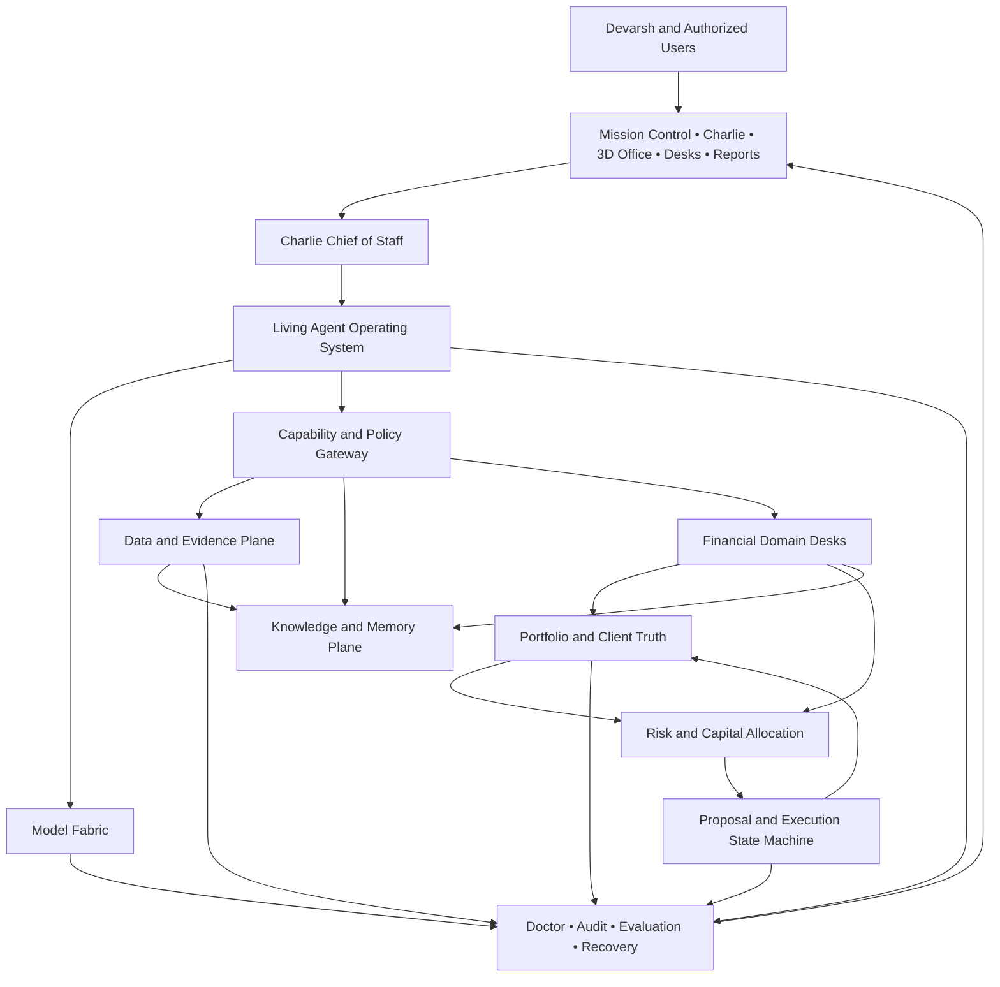

# AI Investment OS — Living Investment Office Master Blueprint v13.0

**Date:** 4 September 2026  
**Owner:** Devarsh  
**Status:** Canonical final product and delivery blueprint  
**Supersedes as target architecture:** Institutional Master Blueprint v11.0 and Agent-Native Goal Stack v12.0  
**Current accepted foundation:** Research Desk release branch `codex/research-desk-knowledge-scanners-v1`  
**Next implementation phase:** Living Agent Operating System, Charlie, Model Fabric, Doctor, and truthful 2D/3D office

---

## 0. Executive status and decision

The AI Investment OS has crossed the first major threshold: the Research Desk software and live iMac runtime are operational and ready for operator testing. The platform can create durable company-research cases, ingest and extract governed sources, coordinate specialists, produce reports, use the existing read-only Zerodha market-data path, expose company status through Charlie, and survive live restarts.

That does not mean every company is already investable or every Research Desk feature has passed every content and operator gate. Wipro and Shivalik remain evidence-debt packs, production scanner publication and public Following approval remain open, and paid-model promotion remains human-gated. The correct statement is:

> **The Research Desk platform is operational. Individual research cases remain evidence- and decision-gated.**

The next priority is no longer another shallow desk page. It is the shared operating layer that makes the whole investment office alive:

> **Build durable agents, heartbeats, leases, messages, handoffs, model bindings, routines, health checks, and a truthful live office. Then attach every financial desk to that operating system.**

The final product is:

> **A private, local-first, evidence-bound investment institution in software: Charlie is the universal chief of staff; durable specialist agents operate real desks; every claim traces to evidence and calculations; every portfolio belongs to a deterministic ledger; every model and tool is governed; every action is simulated, approved, routed, and reconciled; and the 3D office shows only real work.**

---

## 1. Product mandate

The system combines:

- an institutional long-term fundamental-research platform;
- a filings, earnings, news, and evidence engine;
- an investor/publication following and idea-discovery network;
- a versioned fundamental and market scanner factory;
- a live market and TradingView workstation;
- a quantitative strategy research, test, optimization, and monitoring factory;
- an options and volatility desk;
- a macro and geopolitical intelligence room;
- a corporate-actions and special-situations desk;
- a deterministic house and client-portfolio operating system;
- a risk, liquidity, and capital-allocation function;
- a paper and supervised execution gateway;
- a report, newsletter, and client-communication factory;
- a durable AI-agent organization;
- a live 2D and 3D office;
- a persistent Obsidian and evidence graph;
- an optional voice interface through Charlie.

It is not:

- a generic finance chatbot;
- a collection of disconnected dashboards;
- a social signal copier;
- an LLM used as an accounting or valuation calculator;
- an unrestricted autonomous broker;
- a system that treats commentary as verified fact;
- a 3D game with fake agent activity;
- a public repository containing client information or credentials;
- a replacement for licensed data where licenses are required.

---

## 2. Current state

### 2.1 Operational foundation

The current live stack includes:

- React/TypeScript application;
- Research Desk and company workstreams;
- Charlie chat and current-stack status;
- Postgres operational store;
- Redis;
- Qdrant;
- external SSD artifact storage;
- Obsidian vault and indexing;
- source collection and PDF extraction;
- specialist research workflows;
- HTML/PDF report delivery;
- graph and committee primitives;
- agent registry, tasks, messages, model routes, approvals, and MCP tools;
- existing 3D office;
- read-only Zerodha account, price, instrument, candle, and supported options data;
- safety locks with broker writes disabled.

### 2.2 Research Desk status

The Research Desk is accepted as a live operational vertical slice.

Platform-complete capabilities include:

- durable Research Cases;
- natural-language company intake;
- official-source acquisition;
- governed extraction;
- specialist workstreams;
- deterministic valuation boundaries;
- report repair and delivery;
- company monitoring primitives;
- Obsidian/graph integration;
- fundamental-scanner definitions and approval controls;
- existing model-preflight/canary controls;
- live Chrome acceptance;
- read-only Zerodha preservation.

Remaining content and operator gates include:

- Wipro independent-review evidence debt;
- Shivalik cost/evidence debt;
- first approved scanner publication and live universe runs;
- first approved public Following sources;
- approved paid-model canary and named review;
- fresh market-hours quote acceptance;
- Safari user acceptance.

These are operating backlog items, not reasons to rebuild the Research Desk.

---

## 3. North-star user experience

Devarsh says:

> “Charlie, scan India for durable businesses with improving return on capital, accelerating free cash flow, clean governance, and reasonable valuation. Give extra attention to ideas from the investors I follow, but verify everything from primary sources. Start full research on the best three, show me every analyst working, compare their models and costs, open the charts in TradingView, test a quality strategy, map the names to all house and client portfolios, ask Risk and Capital Allocation for independent views, and prepare—but do not execute—proposals.”

The system then:

1. resolves the objective, universe, time horizon, books, portfolios, clients, and approval class;
2. runs a deterministic, versioned scanner;
3. merges investor/publication ideas as untrusted leads;
4. creates durable research cases;
5. assigns visible specialists;
6. acquires and verifies primary sources;
7. normalizes point-in-time facts;
8. reconciles financials, shares, prices, and corporate actions;
9. calculates metrics and valuations deterministically;
10. opens and captures TradingView charts;
11. runs quant and risk analysis;
12. maps conclusions to each portfolio and mandate;
13. convenes Research, Risk, and Capital Allocation committees;
14. writes reports and Obsidian memory;
15. produces action proposals;
16. stops at approval;
17. records everything for replay, monitoring, and future routines.

---

## 4. Non-negotiable principles

### 4.1 Evidence before narrative

Every material claim must trace to:

- a source document and locator;
- a deterministic calculation and inputs;
- a stored assumption;
- or a clearly labelled analyst opinion.

Missing critical evidence creates tasks and blocks readiness.

### 4.2 Deterministic numbers

LLMs may plan, classify, extract into schemas, synthesize, explain, critique, and challenge.

LLMs do not authoritatively calculate:

- prices;
- returns;
- financial statements;
- ratios;
- valuation;
- Greeks;
- performance;
- tax lots;
- risk;
- backtests;
- order sizing;
- reconciliation.

### 4.3 Point-in-time truth

Every source and fact records:

- economic/event time;
- publication time;
- retrieval time;
- market-known time;
- version;
- hash;
- parser/extractor version;
- restatement/supersession;
- unit, scale, currency, period, and scope;
- confidence and verification state.

### 4.4 Real agents only

A live agent is a durable identity with tasks, messages, model bindings, permissions, memory, routines, state, and audit.

An avatar, persona prompt, or animation alone is not an agent.

### 4.5 Local first

Routine work runs locally where quality permits. Cloud use is deliberate, bounded, privacy-classified, costed, and approval-gated.

### 4.6 Autonomy is earned

Progression:

```text
READ-ONLY ASSISTANCE
→ INTERNAL DRAFT
→ DETERMINISTIC SIMULATION
→ PAPER ACTION
→ HUMAN-APPROVED LIVE ACTION
→ NARROW POLICY-BOUND AUTONOMY
```

No shortcut is permitted.

---

## 5. Whole-system architecture



---

# Part I — Human operating experience

## 6. Mission Control / Today

The default page answers:

- What changed overnight?
- Which holdings or clients need attention?
- Which agents are working?
- What is blocked?
- Which approvals need Devarsh?
- Which filings, earnings, actions, and macro events occur today?
- Which scanners fired?
- Which strategies or options books breached thresholds?
- Which data providers are stale?
- Is Zerodha authenticated and fresh?
- Are any model routes degraded?
- What reports are due?
- What is the highest-value next action?

Modules:

- Charlie command bar;
- overnight brief;
- portfolio exceptions;
- research updates;
- corporate-action calendar;
- earnings and macro calendar;
- scanner alerts;
- quant strategy health;
- options expiry and Greek risk;
- agent activity;
- approvals;
- system Doctor;
- cost and model usage.

Every widget shows source time, calculation time, state, and whether it is observed, calculated, estimated, model-generated, or simulated.

## 7. Charlie

Charlie is available as:

- global command bar;
- full-screen workspace;
- floating panel inside every desk;
- presence in the 3D Executive Office;
- API/MCP entry point;
- optional voice interface.

Charlie preserves selected:

- company;
- research case;
- chart;
- strategy;
- options expiry;
- macro scenario;
- portfolio;
- client;
- book;
- date range;
- evidence packet;
- conversation.

Charlie may use every registered capability allowed by policy. Charlie cannot bypass stale-data, privacy, mandate, risk, approval, or execution gates.

## 8. Live 3D and 2D office

The office shows actual departments, agents, tasks, messages, handoffs, committees, costs, blockers, approvals, and artifacts.

Recommended rooms:

| Room | Functions |
|---|---|
| Executive Office | Charlie, Jarvis, CIO, CRO, Chief of Staff |
| Research Intake | case triage and evidence planning |
| Evidence Library | collectors, parsers, source and citation agents |
| Fundamental Research | company, industry, TAM, moat |
| Financial Modelling | normalizer, model builder, accounting quality |
| Governance and Forensics | governance, promoter, auditor, related-party |
| Valuation Lab | DCF, multiples, SOTP, scenarios |
| Portfolio and Client Office | PM, mandates, tax lots, reports |
| Risk Wall | exposure, liquidity, concentration, scenario |
| Capital Allocation | sizing and opportunity cost |
| TradingView and Market Lab | charts, technicals, alerts, scanners |
| Quant Lab | ideas, features, backtests, optimization |
| Options Pit | chains, volatility, strategies, hedges |
| Macro Situation Room | India/global macro and Pythia |
| Corporate Actions Room | events, conditions, spreads, entitlements |
| Trading Desk | proposals, paper routing, fills, reconciliation |
| Committee Rooms | Research, Risk, Capital, Strategy, Options, Client |
| Approval Desk | human and policy approvals |
| Engineering and Data Center | SRE, pipelines, models, security |
| Archive and Memory | Obsidian, evidence graph, reports, replay |

Every avatar state comes from durable runtime state.

---

# Part II — Living Agent Operating System

## 9. Durable agent identity

Every agent has:

- stable ID and key;
- display name;
- title;
- department and room;
- role version;
- owner and escalation chain;
- capability grants;
- denied capabilities;
- allowed books and clients;
- data-class permissions;
- primary/fallback model binding;
- worker eligibility;
- budgets;
- workspace;
- threads;
- tasks;
- routines;
- performance scorecards;
- incident history;
- audit history.

Logical agents persist even when inactive.

## 10. Workers, heartbeat, leases, and recovery

A bounded worker pool executes tasks.

Workers heartbeat every 15 seconds while active and every 60 seconds when idle. A task lease expires after missed heartbeats. Work resumes from a safe checkpoint or blocks for review.

Recovery prevents:

- duplicate model calls;
- duplicate source acquisition;
- duplicate artifacts;
- duplicate external writes;
- duplicate paper orders;
- duplicate notifications.

An append-only event log reconstructs the office and task state.

## 11. Messages and collaboration

Conversation types:

- Devarsh ↔ Charlie;
- Devarsh ↔ specialist;
- agent ↔ agent;
- department room;
- case room;
- strategy room;
- portfolio/client room;
- committee;
- incident;
- approval.

Messages support:

- context links;
- attachments;
- evidence packets;
- artifacts;
- mentions;
- read receipts;
- acknowledgements;
- sensitivity class;
- retention policy.

## 12. Handoffs

A handoff records:

- sender;
- recipient;
- question;
- expected output;
- evidence;
- due time;
- child task;
- acknowledgement;
- acceptance/rejection;
- result;
- validation;
- return to parent.

Visual movement in the office occurs only for an actual handoff event.

## 13. Skills and routines

A successful workflow can be promoted to a versioned skill after testing.

A routine binds a skill to:

- owner agent;
- schedule/event;
- input policy;
- idempotency;
- timeout;
- retry;
- cost;
- stale-data behavior;
- approval policy;
- outputs;
- alerts.

Examples:

- daily health;
- filing monitor;
- investor-feed digest;
- weekly scanner;
- research staleness review;
- portfolio exception review;
- options expiry review;
- corporate-action monitor;
- strategy drift review;
- client report schedule.

---

# Part III — Model Fabric

## 14. Purpose

The Model Fabric assigns the right qualified model to each agent and task without pretending every avatar has a separate resident model.

## 15. Route pool

| Route | Purpose |
|---|---|
| `local_fast` | classification, extraction triage, short summaries |
| `local_assistant` | Charlie routine interaction and delegation |
| `local_research` | evidence-bound research and filing analysis |
| `local_code` | bounded code generation and transformations |
| `embedding` | semantic indexing |
| `reranker` | retrieval reranking |
| `cloud_deep_research` | difficult synthesis and contradiction resolution |
| `cloud_red_team` | independent second-provider challenge |
| `cloud_code` | difficult engineering |
| `vision_document` | scanned tables/charts |
| `deep_offline_27b` | occasional on-demand deep task on suitable hardware |

## 16. Per-agent bindings

Bindings select:

- task classes;
- primary route;
- fallback;
- reasoning profile;
- context;
- output;
- temperature;
- privacy eligibility;
- cost ceiling;
- required evaluations;
- fallback policy.

Credentials are not stored in bindings.

## 17. Provider adapters and secret shims

Provider adapters translate the canonical request into the provider’s actual supported request.

No control is declared working merely because it returns 200.

Secret shims:

- bind on loopback;
- inject authorization;
- never log secrets;
- expose safe local health;
- have one credential domain;
- support negative auth tests.

## 18. Qualification and operator control

Qualification is per task class.

The operator console supports:

- test;
- compare;
- cost and latency;
- memory;
- scorecard;
- promote;
- rollback;
- disable;
- view active calls and failures.

No paid model auto-promotes without named review.

---

# Part IV — Data, evidence, and knowledge

## 19. Storage contract

| Layer | Authority |
|---|---|
| Postgres/TimescaleDB | operational truth, facts, tasks, policy, ledgers |
| External SSD/object store | immutable raw documents, payloads, charts, reports, logs |
| DuckDB/Parquet | batch analytics, universes, features, backtests |
| Qdrant/pgvector | semantic retrieval |
| Obsidian | human-readable research, decisions, runbooks, committee notes |
| Redis | cache, leases, queues, pub/sub acceleration |

## 20. Evidence graph

Required lineage:

```text
SOURCE
→ DOCUMENT VERSION
→ PAGE/TABLE/EXCERPT
→ EXTRACTION
→ FACT OR CLAIM
→ CALCULATION
→ ANALYST OPINION
→ THESIS/STRATEGY
→ COMMITTEE
→ DECISION
→ PORTFOLIO PROPOSAL
→ APPROVAL
→ OUTCOME
```

## 21. Obsidian

Recommended structure:

```text
ai memory/
  00 AI OS/
    Architecture/
    Implementation/
    Runbooks/
    Incidents/
    Agents/
    Committees/
  01 Research/
    Companies/
    Industries/
    People/
    Sources/
    Themes/
    Research Cases/
  02 Portfolio/
    House/
    Clients/
    Holdings/
    Reviews/
    Reports/
  03 Strategies/
    Ideas/
    Backtests/
    Paper/
    Live/
  04 Macro/
  05 Filings and Transcripts/
  06 Corporate Actions/
  07 Options/
  08 Trading Journal/
  Templates/
```

Generated content uses managed blocks and preserves human notes.

---

# Part V — Long-term Research Desk

## 22. Research lifecycle

```text
DISCOVER
→ DEFINE QUESTIONS
→ PLAN EVIDENCE
→ INVENTORY EXISTING EVIDENCE
→ ACQUIRE MISSING SOURCES
→ VERIFY
→ PARSE
→ EXTRACT
→ NORMALIZE
→ RECONCILE
→ CALCULATE
→ ANALYZE
→ CONTRADICTION CHECK
→ RED TEAM
→ COMMITTEE
→ HUMAN REVIEW
→ DECISION READY
→ MONITOR
→ REOPEN ON CHANGE
```

## 23. Research workspaces

- overview;
- source inventory;
- document viewer;
- financial history;
- business and segments;
- industry, value chain, TAM;
- moat and quality;
- management and capital allocation;
- governance and forensic accounting;
- valuation;
- thesis and red team;
- committee;
- monitoring;
- reports and version diffs.

## 24. Research standard

A complete case includes:

- primary-source manifest;
- ten-year history where available;
- quarterly and TTM view;
- cash-flow reconciliation;
- share/corporate-action reconciliation;
- operating KPIs;
- industry and market-share evidence;
- quantitative moat analysis;
- management record;
- governance/forensics;
- DCF, reverse DCF, multiples, SOTP as applicable;
- scenarios and Monte Carlo;
- implied expectations;
- catalysts;
- thesis-break conditions;
- monitoring;
- red-team memo;
- committee minutes;
- report and client-safe summary.

Decision readiness remains case-specific.

---

# Part VI — Investor Watch and Scanner Factory

## 25. Investor and publication following

Read-only sources include:

- ValuePickr;
- Substack;
- blogs;
- newsletters;
- X lists;
- Telegram;
- Reddit;
- podcasts;
- YouTube;
- papers;
- industry publications.

Flow:

```text
NEW ITEM
→ DEDUPLICATE
→ QUARANTINE UNTRUSTED CONTENT
→ ENTITY/THEME EXTRACTION
→ CLAIM EXTRACTION
→ SOURCE SCORE
→ NOVELTY
→ HOLDING/WATCHLIST OVERLAP
→ PRIMARY-EVIDENCE SEARCH
→ IDEA CARD
→ RESEARCH INBOX
```

Source score influences triage, never truth.

## 26. Fundamental scanner factory

Scanner families:

- quality compounders;
- improving ROIC;
- reinvestment runway;
- earnings and margin acceleration;
- cash conversion;
- deleveraging;
- operating leverage;
- capex/capital-cycle inflection;
- GARP;
- deep value;
- shareholder yield;
- ownership changes;
- governance red flags;
- working-capital anomalies;
- special situations;
- portfolio thesis drift.

Every definition is:

- safe DSL;
- versioned;
- immutable after publication;
- point-in-time;
- replayable;
- deterministic;
- coverage-aware;
- approval-gated before publication/scheduling.

Results can open research or watchlist actions, never broker orders.

---

# Part VII — Portfolio and Client Folio Operating System

## 27. Purpose

Every recommendation must be evaluated against the actual house or client portfolio.

## 28. Canonical ledger

Entities:

```text
client
household
mandate
account
custodian
transaction
cash_movement
tax_lot
position
corporate_action
valuation_mark
fee
benchmark
performance
attribution
exposure
restriction
review
proposal
```

The ledger is deterministic and reconciles to broker/custodian statements.

## 29. Client constraints

Each mandate records:

- objective;
- horizon;
- risk tolerance;
- liquidity;
- income need;
- tax context;
- prohibited instruments;
- concentration limits;
- sector limits;
- cash minimum;
- drawdown tolerance;
- benchmark;
- review cadence;
- communication permissions.

No agent may infer missing client policy.

## 30. Portfolio views

- consolidated household;
- account;
- book;
- client;
- security;
- sector/theme;
- tax lots;
- cash;
- performance;
- attribution;
- factor;
- liquidity;
- concentration;
- scenario;
- opportunity cost;
- thesis freshness;
- corporate actions;
- pending proposals.

## 31. Company tracker

For every portfolio company:

- current thesis;
- fair value and assumptions;
- research readiness;
- last reviewed;
- next trigger;
- price/valuation;
- news/filing drift;
- portfolio role;
- position sizing;
- client exposure;
- tax and liquidity implications.

---

# Part VIII — Market and TradingView Desk

## 32. Zerodha

Zerodha remains the canonical private Indian market/account connector when healthy and authenticated.

Capabilities:

- live quotes;
- market depth fields where available;
- instrument master;
- holdings;
- positions;
- orders/trades readback;
- funds;
- historical candles;
- supported index option snapshots.

Daily human login remains.

Broker writes remain disabled until execution acceptance.

## 33. TradingView integration

Three connectors:

1. Headless read-only MCP for TA, screens, futures, quick options, and independent tests.
2. Local Desktop reader for watchlists, alerts, chart state, screenshots, news, and available Greeks.
3. Opt-in R3 chart/Pine automation sandbox for layouts, indicators, scripts, alerts, and Strategy Tester.

TradingView is not the accounting ledger or sole data authority.

## 34. Chart and synthetic engine

Build internally:

- ratios;
- spreads;
- equal-weight indices;
- market-cap indices;
- factor baskets;
- long/short baskets;
- portfolio versus benchmark;
- commodity input versus producer;
- earnings yield minus bond yield;
- breadth;
- diffusion;
- regime indicators.

Version formulas and link charts to cases and strategies.

---

# Part IX — Quant Strategy Factory

## 35. Lifecycle

```text
IDEA
→ ECONOMIC HYPOTHESIS
→ DATA CONTRACT
→ UNIVERSE
→ FEATURE
→ SIGNAL
→ BACKTEST
→ COSTS/SLIPPAGE
→ WALK-FORWARD
→ OPTIMIZATION
→ OVERFIT AUDIT
→ PORTFOLIO CONSTRUCTION
→ PAPER
→ MONITOR
→ APPROVAL
→ LIMITED LIVE
→ REVIEW/RETIRE
```

## 36. Requirements

- point-in-time fundamentals;
- survivorship-free universes;
- delistings;
- corporate actions;
- realistic calendars;
- signal lag;
- fees and taxes;
- bid/ask;
- impact;
- capacity;
- partial fills;
- borrow;
- deterministic seeds;
- full trade log;
- run manifest.

## 37. Robustness

- time-series cross-validation;
- walk-forward;
- parameter stability;
- bootstrap;
- Monte Carlo;
- regime tests;
- universe perturbation;
- delay perturbation;
- cost perturbation;
- multiple-testing adjustment;
- deflated Sharpe;
- overfit probability;
- independent implementation reconciliation.

Agents propose and critique. Deterministic engines certify the numbers.

---

# Part X — Options and Volatility Desk

## 38. Core capabilities

- chain and expiry explorer;
- bid/ask and liquidity;
- IV;
- Greeks;
- volatility cones;
- skew;
- term structure;
- surfaces;
- OI and volume;
- gamma/vanna/charm;
- event volatility;
- strategy builder;
- payoff;
- scenario lab;
- options scanner;
- historical backtest;
- portfolio Greek aggregation;
- hedge design;
- expiry and assignment;
- paper proposals.

## 39. Safety

- defined-risk preference;
- worst-case loss;
- margin;
- liquidity;
- settlement;
- exercise/assignment;
- gap risk;
- vol crush;
- data-quality gate;
- no unavailable historical chain silently approximated.

---

# Part XI — Macro and Global Intelligence

## 40. India macro

- RBI policy;
- liquidity;
- CPI/WPI;
- IIP;
- GDP;
- fiscal;
- GST;
- credit;
- FX reserves;
- INR;
- yield curve;
- FII/DII;
- commodities;
- monsoon;
- sector indicators.

## 41. Global macro

- inflation;
- growth;
- central banks;
- rates;
- curves;
- liquidity;
- credit;
- FX;
- energy;
- metals;
- agriculture;
- trade;
- positioning;
- geopolitical events.

Store vintages and revisions.

## 42. Pythia/global intelligence

Use Pythia as a separate input service for:

- live world events;
- forecasts;
- signal rules;
- what-if scenarios;
- scorecards;
- event-to-market mapping.

Every feed is independently reviewed for authority, timestamp, terms, reliability, and failure mode.

## 43. Macro-to-portfolio graph

Map:

```text
MACRO OBSERVATION
→ REGIME
→ TRANSMISSION CHANNEL
→ INDUSTRY
→ COMPANY
→ PORTFOLIO/CLIENT
→ SCENARIO IMPACT
```

---

# Part XII — Corporate Actions and Special Situations

## 44. Events

- dividends;
- splits;
- bonuses;
- rights;
- buybacks;
- open offers;
- mergers;
- demergers;
- delistings;
- tender offers;
- restructuring;
- insolvency;
- promoter transactions;
- capital raising.

## 45. Workflow

```text
ANNOUNCEMENT
→ CLASSIFY
→ COLLECT DOCUMENTS
→ EXTRACT TERMS
→ BUILD TIMELINE
→ CALCULATE ENTITLEMENT
→ CALCULATE SPREAD/IRR
→ TRACK CONDITIONS
→ ESTIMATE COMPLETION
→ PORTFOLIO IMPACT
→ COMMITTEE
→ MONITOR
→ RECONCILE
```

---

# Part XIII — Risk and Capital Allocation

## 46. Risk

- market;
- factor;
- sector;
- concentration;
- liquidity;
- drawdown;
- gap;
- FX;
- rates;
- commodity;
- options Greeks;
- counterparty;
- model;
- data;
- operational;
- client mandate.

## 47. Capital allocation

Every proposal compares:

- expected return;
- downside;
- uncertainty;
- liquidity;
- correlation;
- portfolio role;
- opportunity cost;
- tax;
- client suitability;
- thesis quality;
- data readiness;
- position-size limits.

Position sizing is deterministic and policy-bounded.

---

# Part XIV — Trading and Execution

## 48. State machine

```text
NO_ACTION
PROPOSED
SIMULATED
RISK_CHECKED
POLICY_CHECKED
AWAITING_APPROVAL
APPROVED
ORDER_INTENT_CREATED
ROUTED
ACKNOWLEDGED
PARTIALLY_FILLED
FILLED
RECONCILING
RECONCILED
REJECTED
CANCELLED
INCIDENT
```

## 49. Controls

- paper-first;
- idempotency;
- stale-price rejection;
- maximum order;
- maximum daily notional;
- price collars;
- market-hours rules;
- duplicate prevention;
- liquidity;
- mandate;
- kill switch;
- broker reconciliation;
- cash/position reconciliation;
- no unresolved mismatch before further autonomy.

The execution enclave is separated from general agents.

---

# Part XV — Reports and communication

## 50. Internal reports

- morning brief;
- pre-market;
- post-market;
- weekly portfolio review;
- monthly performance;
- research memo;
- committee pack;
- macro dashboard;
- strategy report;
- options report;
- corporate-action report;
- incident report.

## 51. Client reports

- mandate summary;
- holdings;
- performance;
- attribution;
- changes;
- risk;
- commentary;
- fees;
- tax-lot considerations;
- approved actions;
- disclosures.

Client reports are isolated, approved, and source-backed.

## 52. Newsletter

The daily newsletter prioritizes:

- portfolio impact;
- watchlist impact;
- thesis changes;
- filings;
- earnings;
- corporate actions;
- macro regime;
- scanner hits;
- strategy/option alerts;
- approvals;
- system degradation.

It avoids generic news noise.

---

# Part XVI — Agent Idea Exchange and Evaluation Arena

## 53. Internal idea exchange

Agents may publish structured internal:

- observations;
- ideas;
- claims;
- contradictions;
- strategies;
- backtest results;
- options structures;
- macro scenarios;
- risk objections;
- portfolio proposals;
- post-trade reviews.

Every item has evidence, freshness, scope, and state.

Following another agent creates an inbox filter, not copy trading.

## 54. Challenge arena

Use isolated challenges for:

- valuation;
- earnings;
- stock selection;
- portfolio construction;
- strategy;
- options;
- macro;
- corporate actions;
- agent/model comparisons;
- solo-versus-team tests.

Use fixed point-in-time packets, isolated paper ledgers, reproducible scoring, and no connection to real accounts.

## 55. Scorecards

Score by task:

- citation accuracy;
- unsupported claims;
- numerical accuracy;
- reconciliation;
- calibration;
- out-of-sample performance;
- drawdown;
- policy violations;
- tool success;
- reliability;
- correction speed;
- cost;
- latency;
- reproducibility;
- human revision rate.

Popularity is not truth.

---

# Part XVII — Security, privacy, and compliance

## 56. Capability security

No unrestricted tools.

Every tool has:

- risk class;
- typed schema;
- allowed agents;
- allowed clients/books;
- time/cost limits;
- evidence requirements;
- idempotency;
- approval;
- audit;
- failure semantics.

## 57. Client isolation

- row-level security or equivalent;
- encrypted storage;
- client-scoped threads/artifacts;
- no cross-client retrieval;
- redacted model packets;
- approved external delivery;
- complete audit.

## 58. Human-only actions

- passwords;
- OTP/2FA;
- CAPTCHAs;
- legal acceptance;
- payment;
- subscription;
- broker login;
- high-risk approvals.

## 59. Prompt injection

External content cannot:

- change policy;
- grant tools;
- request credentials;
- trigger shell/browser writes;
- bypass source hierarchy;
- create financial actions.

---

# Part XVIII — Technical architecture

## 60. Target monorepo

```text
apps/
  investment-office-web/
  live-3d-office/
  charlie-desktop/
  report-viewer/

services/
  api-gateway/
  agent-os/
  charlie-orchestrator/
  workflow-engine/
  model-fabric/
  doctor/
  source-acquisition/
  evidence-store/
  document-processing/
  fact-normalization/
  research-factory/
  scanner-engine/
  market-data/
  tradingview-headless/
  tradingview-desktop/
  tradingview-automation-sandbox/
  portfolio-ledger/
  performance-attribution/
  risk-engine/
  capital-allocation/
  quant-engine/
  options-engine/
  macro-intelligence/
  global-intelligence-pythia/
  corporate-actions/
  execution-gateway/
  broker-connectors/
  reconciliation/
  report-delivery/
  notification-service/
  evaluation-service/

packages/
  domain-models/
  event-schemas/
  source-contracts/
  calculation-library/
  strategy-dsl/
  options-pricing/
  chart-formulas/
  skill-sdk/
  tool-policy/
  auth/
  observability/
  ui-components/
  office-3d-components/

skills/
  research/
  market/
  tradingview/
  portfolio/
  quant/
  options/
  macro/
  corporate-actions/
  reporting/
  system/

evals/
  agent-os/
  model/
  retrieval/
  research/
  portfolio/
  quant/
  options/
  policy/
  execution/
  office-3d/

fixtures/
  wipro-golden-case/
  shivalik-case/
  paper-portfolio/
  options-chain/
  macro-vintages/
  corporate-actions/
```

This is a target boundary. Refactor incrementally. Do not halt the live app for a full rewrite.

## 61. Event standard

Every event includes:

```yaml
event_id:
event_type:
occurred_at:
recorded_at:
actor:
agent_id:
worker_id:
task_id:
step_id:
thread_id:
case_id:
entity_ids:
book_id:
client_id:
model_route:
tool_call_id:
artifact_ids:
approval_id:
risk_class:
status:
metadata:
```

## 62. Observability

- trace ID;
- task ID;
- model call ID;
- tool call ID;
- source packet;
- cost;
- latency;
- retries;
- errors;
- result hash;
- state transitions;
- approval;
- reconciliation.

---

# Part XIX — Model policy for the M4 16 GB Mac

## 63. Runtime policy

- one resident 8–9B local route;
- optional small fast model;
- bounded concurrency;
- 8K default context;
- retrieval-first prompts;
- KV-cache limits;
- external SSD for weights/caches;
- no 27B resident default;
- 27B only on-demand and only when memory permits;
- cloud escalation for high-value tasks;
- cache by evidence hash and prompt/model version.

## 64. Task allocation

| Task | Preferred execution |
|---|---|
| intake/routing | local fast |
| Charlie routine conversation | local 8–9B |
| evidence summary | local 8–9B |
| structured filing extraction | local plus deterministic validation |
| calculations | Python/SQL |
| valuation | deterministic engine |
| portfolio accounting | ledger |
| deep synthesis | premium cloud |
| red team | independent provider |
| difficult vision | qualified VLM |
| embeddings | small local model |

---

# Part XX — Delivery roadmap from the current state

## 65. Phase 2 — Living Agent Operating System

Build:

- durable IDs;
- workers;
- heartbeat;
- leases;
- event log;
- messages;
- handoffs;
- Charlie control;
- Model Fabric;
- Doctor;
- skills/routines;
- truthful 2D/3D office.

**Exit:** one Research Desk command visibly flows through real agents, survives worker failure, supports redirect and handoff, uses a recorded model route, and produces a validated artifact.

## 66. Phase 3 — Portfolio and Client Folio foundation

Build:

- transaction/cash/tax-lot ledger;
- statement imports;
- reconciliation;
- mandates;
- restrictions;
- holdings;
- performance;
- attribution;
- risk;
- client isolation;
- client reports.

**Exit:** every current account reconciles with no unexplained cash or position difference.

## 67. Phase 4 — Market, TradingView, and scanner production

Build:

- approved scanner publication;
- live real-universe schedules;
- TradingView headless and desktop health;
- chart/Pine sandbox;
- ratio/index engine;
- scanner alerts;
- chart-case linking.

**Exit:** Charlie executes a complete chart/scanner workflow with no untracked action.

## 68. Phase 5 — Quant factory

Build full lifecycle through paper portfolio.

**Exit:** one strategy passes walk-forward and overfit audit and runs in a reconciled paper book.

## 69. Phase 6 — Options desk

Build chain, surface, Greeks, strategy, scanner, backtest, risk, and paper workflow.

**Exit:** one defined-risk structure is researched, approved, paper-routed, and monitored.

## 70. Phase 7 — Macro, Pythia, and newsletter

Build macro vintages, event graph, regime model, scorecards, what-if, and personalized brief.

**Exit:** the morning report explains material portfolio effects with citations.

## 71. Phase 8 — Corporate actions

Build event normalization, conditions, spread/IRR, entitlements, committee, and accounting.

**Exit:** one real event is tracked from announcement through reconciliation.

## 72. Phase 9 — Paper execution

Build order intents, risk/policy, paper broker, fills, reconciliation, and incidents.

**Exit:** repeated paper runs show no unresolved duplicate, policy, cash, or position errors.

## 73. Phase 10 — Supervised live

- one account;
- small notional;
- liquid instruments;
- every order approved;
- kill switch;
- independent reconciliation;
- legal/compliance review.

## 74. Phase 11 — Narrow policy-bounded autonomy

Only after substantial incident-free evidence.

---

# Part XXI — Final definition of done

## 75. Living agents

- every active agent has durable identity;
- heartbeat and lease are real;
- user can talk, pause, resume, redirect, and inspect;
- handoffs and committees work;
- office replay works;
- no fake activity.

## 76. Research

- any company can enter the same workflow;
- missing evidence creates tasks;
- facts reconcile;
- valuation is current and deterministic;
- claims are cited;
- red team and committee exist;
- monitoring reopens stale cases.

## 77. Portfolio and clients

- every account reconciles;
- mandates are enforced;
- performance and attribution reproduce;
- client data is isolated;
- recommendations map to actual portfolios.

## 78. Market and TradingView

- Zerodha health and freshness are explicit;
- TradingView connectors are tracked;
- charts link to cases;
- formulas are versioned;
- tests reconcile internally;
- no trading authority is implied.

## 79. Quant and options

- point-in-time data;
- realistic costs;
- walk-forward;
- overfit controls;
- paper/live separation;
- current options surfaces and risk;
- reproducible runs.

## 80. Macro and corporate actions

- official vintages;
- event lineage;
- portfolio mapping;
- forecast scorecards;
- complete event timelines;
- entitlements reconcile.

## 81. Execution

- idempotent order intent;
- separate approval, routing, fill, and reconciliation;
- kill switch;
- no unresolved reconciliation;
- no social/model shortcut.

## 82. System

For every material conclusion or action, answer:

1. Where did the information come from?
2. When was it known?
3. How was it calculated?
4. What is missing or uncertain?
5. What would change the conclusion?
6. Which agent produced it?
7. Which model route and tool were used?
8. Which book or client is affected?
9. What policy and risk checks ran?
10. Who approved it?
11. Was it reconciled?
12. Can the result be replayed?

---

# Appendix A — Core configuration examples

## A.1 Agent profile

```yaml
agent_key: research.forensics.01
display_name: Forensic Accounting Analyst
department: research
room: governance_forensics
owner: research.director.01
primary_model_binding: research_forensics_default
allowed_books:
  - long_term_core
allowed_data_classes:
  - public
  - house_confidential
skills:
  - evidence.read
  - filings.read
  - facts.financial.read
  - forensics.calculate
  - artifact.write
deny:
  - broker.*
  - credential.*
  - client.pii.export
max_parallel_tasks: 1
```

## A.2 Model binding

```yaml
binding_id: research_forensics_default
agent_selector: research.forensics.*
task_classes:
  - filing_analysis
  - accounting_quality
primary_route: local_research
fallback:
  - cloud_deep_research
reasoning_profile: high
context_tokens: 8192
max_output_tokens: 1800
required_evals:
  - citation_v2
  - numeric_v2
  - prompt_injection_v2
fallback_policy: explicit_degraded
```

## A.3 Routine

```yaml
routine_id: monitor_portfolio_company_filings
owner_agent: research.monitoring.01
skill: monitor_company_change@3
trigger:
  type: event
  source: verified_filing_ingested
idempotency_key: entity+document_hash+skill_version
stale_data_policy: stop_and_report
approval:
  research_update: automatic
  paid_model: preflight
  financial_action: human
```

## A.4 Scanner

```yaml
scanner_key: quality_cash_compounders
version: 1
universe:
  exchanges: [NSE, BSE]
  min_market_cap_crore: 1000
  min_adv_crore: 1
filters:
  - metric: roic_5y_median
    op: gte
    value: 18
  - metric: cfo_pat_5y
    op: gte
    value: 0.9
  - metric: net_debt_ebitda
    op: lte
    value: 1
rank:
  - metric: roic_trend
    weight: 0.35
  - metric: fcf_growth
    weight: 0.35
  - metric: valuation_score
    weight: 0.30
publication_requires_approval: true
broker_action: denied
```

## A.5 Action boundary

```yaml
source_or_agent_item:
  may_create:
    - idea
    - research_task
    - watchlist_candidate
    - paper_proposal
  may_not_create:
    - live_order
    - broker_modification
```

---

## Final mandate

The final defensible advantage is not the newest model, the number of avatars, or the visual office.

It is the integration of:

- point-in-time evidence;
- deterministic analytics;
- complete research;
- portfolio and client truth;
- living agent operations;
- model and tool governance;
- TradingView and market workflows;
- quant and options discipline;
- macro and corporate-action intelligence;
- risk and capital allocation;
- safe, auditable, reconciled action.

The build order begins now with the Living Agent Operating System.
