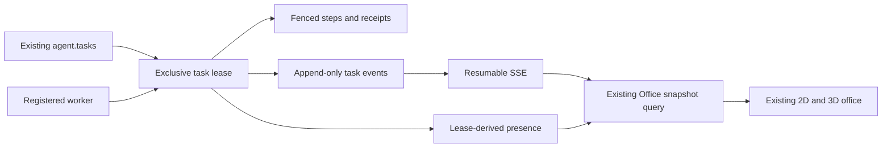

# Runtime data contracts — first increment

Authority remains PostgreSQL. A UI connection, profile, model binding or historical task is not proof of a running worker. All objects below are implemented by migration `256_agent_runtime_leases_v1.sql`; production installation is pending.

| Surface | Implemented contract |
|---|---|
| `agent.profiles` | Existing ID retained; immutable `agent_key`, positive role version, concurrency 1–4. These fields do not grant tools or model permissions. |
| `agent.tasks` | Existing queue and status remain; opt-in protocol, owner/profile ID, runtime state, task class, control request, recovery policy/limit and scope. Legacy rows are not automatically enrolled. |
| `agent.workers` | Process UUID, node/PID/version identity, supported task classes, concurrency, health timestamps and shutdown flag. Node/PID never exposed by the new shared API. |
| `agent.task_leases` | One ACTIVE lease per task, unique attempt, hashed random secret, owner, timestamps and recovery reason. ACTIVE may be expired; callers must also check `expires_at`. |
| `agent.task_steps` | Unique task/lease/step key. A side-effect step starts before its adapter/output; missing receipt forbids automatic replay. |
| `agent.task_dependencies` | Claim waits for existing parents' completed state. Self-dependency rejected. General cycle detection remains pending; no public dependency-write endpoint is added. |
| `agent.agent_presence` / `v_runtime_presence` | Current projection, not a second scheduler. Live truth requires unexpired ACTIVE lease and RUNNING worker. |
| `agent.task_events` | Append-only operational IDs, states, reason codes and timestamps; no arbitrary narrative, client content or hidden reasoning. IDs allocated under an advisory transaction lock to support ordered replay. |
| `agent.worker_heartbeats` | Worker/request UUID receipt; duplicate requests return their original result and do not extend ownership twice. |

## API compatibility

Existing `/api/office/snapshot` remains. New `/api/v1/office/snapshot` delegates to the same projection. New endpoints expose agents/workers/tasks, per-agent presence, bounded task steps, heartbeat, pause/resume/cancel and event replay. They use the current API authorization and database adapters, not a separate HTTP daemon.

Shared runtime responses omit task titles/objectives, client names, inputs, paths, hostnames and secrets. Task inspection/control is restricted to managed internal-scope records. Full multi-client permission/scope mapping must pass before production enablement.

Limits: 500 agents, 64 recent workers, 100 tasks, 30 recent events, 100 steps/task; replay at most 200 events before snapshot reset; 16 concurrent finite streams, 25 seconds/connection, 3-second socket-write timeout; 5-second SQL and 1-second lock timeout with a bounded adapter call. HTTP bodies are limited to 16 KiB.

Credentials belong in authorization headers, never URLs. Heartbeat additionally requires the matching lease token and explicit worker authentication even on loopback. Control takes an empty JSON object and cannot approve decisions or force side-effect replay.

The initial SQL fence prevents accidental legacy updates to managed task state/evidence. It is **not** a security boundary against the trusted database owner setting session variables or bypassing triggers. Dedicated least-privilege database roles and exhaustive client isolation are pending.
