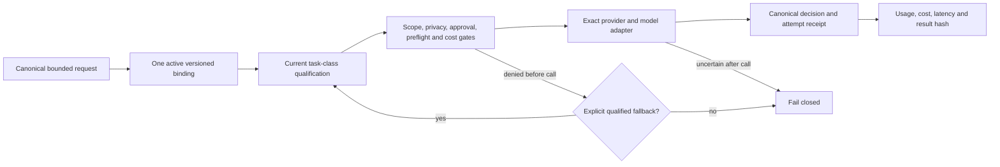

# M5 Model Fabric — implementation evidence

Date: 2026-09-05

Scope: additive local implementation; shared HTTP/UI wiring and live-host acceptance remain separate gates.

## Outcome

The Model Fabric now provides a governed, versioned execution layer over the existing AI OS model routes, endpoints, agent assignments, privacy policy, approval, preflight, cost-cap and usage ledgers. It changes none of those existing defaults. A route or binding is never enabled by migration, a paid call is never made automatically, and returned tools are never executed by this module.

An uncertain post-call failure is terminal and is not retried. A pre-call failure can move only through the binding's explicitly listed, currently qualified fallback routes; it never uses a global default.

## Reused authorities

| Existing authority | Model Fabric behavior |
|---|---|
| `agent.model_routes` | Retains route/task/provider/model and enabled state as canonical. |
| `agent.model_endpoints` | Retains endpoint, secret reference, health and capability metadata as canonical. |
| `agent.agent_model_assignments` | Adds only a task-class-to-version overlay in `fabric_bindings`; existing primary/default routes are untouched. |
| `agent.model_privacy_policies` | Request privacy classification remains validated; private/restricted calls cannot use cloud routes. |
| `agent.approvals` | Paid binding promotion/rollback requires an approved, version-specific `model_binding_change` decision by a named reviewer. A caller boolean is ignored as authority. |
| `research.model_run_preflights` | Every paid execution requires an unexpired, approved, public-only preflight with no private-data, external-write or broker-write permission. |
| `agent.model_cost_caps` and `agent.model_cost_rates` | Reserves estimated cost under a transaction lock and denies a call that would exceed the request, preflight or daily hard ceiling. |
| `agent.model_call_decisions` and `agent.model_usage_events` | Records the exact resolved route/provider/model, qualification, bounded prompt hash, usage, cost, latency and terminal state without storing raw prompt or provider output. |

## New immutable records

Migration `259_agent_model_fabric_v1.sql` adds:

- immutable binding versions, route qualifications and binding audit history;
- one mutable head per binding, guarded to reference a version of the same binding;
- fenced call attempts whose identity and cost reservation cannot change;
- one canonical request ID across model-call decisions for collision-safe idempotency;
- additive task-class binding pointers on current agent assignments.

The migration is idempotent and performs no data backfill, route promotion, provider call, credential mutation or broker action.

## Provider adapter contract

`agent_model_fabric.py` implements the canonical request and provider adapters for:

- OpenAI-compatible local servers and MLX-compatible endpoints;
- Ollama `/api/tags` and `/api/chat`;
- the existing OpenRouter endpoint at exactly `https://openrouter.ai/api/v1`.

Local endpoints must be literal loopback addresses. Redirects, proxy use, URL credentials, ambiguous model identity and revision drift are denied. OpenRouter requests force zero-data-retention routing, deny provider data collection, require requested parameters and disable provider-side fallback. Credentials are resolved from an approved secret reference at call time and are excluded from requests, database records and object representation.

Reasoning effort must have an explicit per-route mapping. Unsupported effort fails before a provider call. Tool schemas and structured-output schemas use a bounded, closed subset and returned arguments/output are validated. Reasoning fields/tags are discarded or denied; tools are returned as data with `tool_execution_allowed=false`.

## Service methods for shared API integration

Authentication and authorization remain the containing API's responsibility; the actor name must come from authenticated context.

| Method | Intended operation | Provider call? |
|---|---|---|
| `snapshot()` / `ready()` | Bounded bindings, prior versions, qualifications, recent attempts and audit history | No |
| `propose(payload, actor)` | Add immutable disabled binding version | No |
| `qualify(route, task_class, actor)` | Fixed public synthetic test for a local route | Local only |
| `adopt_reviewed_canary(canary_id, task_class, actor)` | Adopt an already reviewed public Research canary | No |
| `compare(ids)` | Compare stored qualifications | No |
| `promote(version_id, actor, approval_id)` | Atomically update one binding head and assignment overlay | No |
| `disable(binding_key, actor)` | Stop one binding without changing its route globally | No |
| `rollback(binding_key, version_id, actor, approval_id)` | Restore an earlier version of the same binding | No |
| `execute(request)` | Enforce all gates, call one exact adapter and record receipts | Yes, only after authority passes |

Suggested shared HTTP surface: one bounded GET snapshot endpoint and explicit POST actions for propose, qualify, adopt-canary, compare, promote, disable, rollback and execute. Paid promotion or rollback must include the real approval ID; the UI must never synthesize approval or auto-promote.

## Verified behavior

The isolated suite layers the original runtime test DDL with migration 259, applies the migration twice, and uses a loopback HTTP provider plus isolated PostgreSQL. No production database, credential or paid provider is used.

| Verification | Result |
|---|---|
| Model Fabric behavior suite | 6 passed |
| Existing agent-runtime PostgreSQL regression | 18 passed |
| Python compilation | passed |

The Model Fabric suite proves:

- exact model A execution, idempotent replay without a second provider call, switch to model B, disable/fail-closed, and rollback to the prior version;
- fallback only to one explicitly configured, currently qualified route;
- route identity, structured output, local tool declaration, Ollama mapping and OpenRouter privacy body behavior;
- unsupported effort and non-loopback private endpoint denial;
- paid promotion denial without exact named approval;
- client-private cloud denial and public cloud denial without an approved preflight;
- zero OpenRouter calls in all tests;
- immutable binding and qualification history;
- stream completion fencing and reasoning-field discard.

## Residual acceptance gates

This commit completes the bounded M5 data/service slice, not the whole live milestone. The following remain deliberately unclaimed:

1. Shared API registration and authenticated endpoint tests.
2. Shared 2D/3D office UI wiring and real browser acceptance.
3. Qualification of an actual iMac MLX/Ollama model and proof of its reported revision.
4. Adoption of a real, selected, human-reviewed Research canary.
5. Any paid-provider execution or promotion; these require separate named approval and cost preflight.
6. Production migration, deployment and Obsidian implementation-ledger writeback.

Until those gates pass, the live Model Fabric should be shown as unavailable/readiness-pending rather than silently using legacy or global defaults.

## Provider references

- [OpenRouter provider routing controls](https://openrouter.ai/docs/guides/routing/provider-selection)
- [OpenRouter reasoning controls](https://openrouter.ai/docs/guides/best-practices/reasoning-tokens)
- [Ollama chat API](https://docs.ollama.com/api/chat)
- [Ollama model identity API](https://docs.ollama.com/api/tags)
