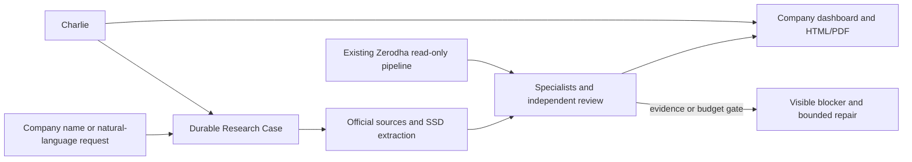

# Research Desk Live Acceptance Report — 2 September 2026

## Executive outcome

The Research Desk software and live iMac runtime are **operational and ready for operator testing**. The canonical `a02ee0f-live` release is serving the UI and API over Tailscale, Postgres/Redis are healthy, Qdrant is running, the external SSD is mounted, report delivery works, Charlie can report named company status, and the Research Case repair state remains consistent after filing refreshes and restarts.

This is not evidence that every company is investment-decision-ready. Wipro and Shivalik Bimetal are deliberately published as **evidence-debt research packs** because their independent-review/evidence gates did not pass. No agent or paid model is currently running for either case, and no additional cost will be incurred until a new bounded plan is approved.

## Live environment accepted

| Gate | Live result on 2 September 2026 |
|---|---|
| Runtime | `a02ee0f-live` started and `IMAC_BACKEND_VERIFIED` at 18:28 IST |
| UI | `https://devarshs-imac.tail8dd383.ts.net` — tailnet only |
| API | `https://devarshs-imac.tail8dd383.ts.net:8443` — tailnet proxy to loopback; `/api/health` returned `ok: true` and DB `ok` |
| Data services | Postgres healthy, Redis healthy, Qdrant running; services bind to loopback |
| Database invariants | 3 clients, 72 positions, 1,346 agent tasks, `execution_locked=true` |
| Storage | `/Volumes/Devarsh SSD` mounted; 931 GiB total, 145 GiB used, 786 GiB available |
| Recovery | Critical backup exists; disposable restore receipt: `/Volumes/Devarsh SSD/AI OS Data/artifacts/restore-drills/restore-drill-20260902T075736Z-17414.json` |
| Trading safety | `broker_write_allowed=false`; TradingView broker execution false; Research Desk adds no order path |
| Private-data boundary | Research cases expose `private_data_egress_allowed=false` and `external_write_allowed=false` |

The API is intentionally not exposed on a public interface. Tokenless access is restricted to loopback behind the Tailscale proxy.

## Repairs deployed in this live pass

| Commit | Repair |
|---|---|
| `6c6bb16` | Align scanner migration with the live schema |
| `63f731a` | Preserve the live tool registry schema |
| `9498e2d` | Deterministic private iMac restarts and orphan-process cleanup |
| `535181d` | Bound valuation quote hydration so the thesis dashboard does not hang |
| `46873a0` | Reconcile cost-ceiling workstreams into a truthful terminal state |
| `96a7a77` | Prevent late source/monitor refreshes from reopening terminal blocked cases |
| `2798589` | Repair historical independent-review terminal state, including Wipro |
| `e24a1cf` | Make Charlie prioritize and explain specifically named research cases |

Live migrations 250–255 are present and the targeted live reconciliation migrations were applied. They preserve evidence and history; they do not erase failed attempts or relaunch paid work.

## Automated verification

| Verification | Result |
|---|---|
| Full Python/backend suite | **PASS** — 654 passed, 1 skipped, 178 subtests passed in 4.08 s |
| Production TypeScript/Vite build | **PASS** — 755 modules transformed; build completed in 445 ms |
| Production dependency audit | **PASS** — `npm audit --omit=dev` found 0 vulnerabilities |
| Git whitespace check | **PASS** |
| Protected Zerodha diff | **PASS** — no protected acquisition/auth/stream file changed from the accepted baseline |
| Protected Zerodha hashes | **PASS** — all seven hashes still match the 1 September release record |
| Live asset equality | **PASS** — local and iMac `dist/index.html` SHA-256 `27c8e4be...dbb45b34`; ResearchCases JS SHA-256 `94af2855...347874b1` |
| Live browser console | **PASS** — 0 errors, 0 warnings in the final Research Desk/Charlie session |
| Live API/browser requests | **PASS** — observed Research Desk, Charlie, Zerodha and report requests returned 200/201 |

The Vite build still emits a non-failing large-vendor-chunk advisory. It is a later performance optimization, not a functional or security failure.

## Browser acceptance

The deployed UI was exercised in a real Chrome/Playwright browser against live Postgres and SSD artifacts:

- Desktop Research Workstreams: Wipro and Shivalik status, progress, blockers, costs, events and report links render from live rows.
- Charlie sidebar: the prompt “What is the current stack health and exact Wipro and Shivalik research status?” returns both named cases, their exact blockers, report versions, specialist progress, current monitoring and Zerodha state.
- Natural-language intake: a Shivalik/latest-filings request resolves the existing company/case instead of creating a fake or duplicate company; a distinct mandate remains available when explicitly requested.
- Company Thesis Dashboard: the selected company is stable and report-backed.
- Mobile contract: the Research Desk was checked at 390 × 844 without losing the core actions.
- Zerodha safety modal: authentication/account binding, stream status, delay state and the broker lock are visible; there is no place/modify/cancel action.
- Final browser session: zero console errors and no observed 4xx/5xx application request.

Safari still requires the user’s final visual/interaction acceptance on the iMac; the automated live run used Chrome.

## Wipro truth state

| Field | Live value |
|---|---|
| Case | 12 — Wipro (`NSE:WIPRO`) |
| State | `blocked` / `independent_review_blocked` |
| Decision readiness | `needs_research` |
| Specialists | 7 of 7 complete; 0 running |
| Blockers | 1 open high-severity independent-review blocker |
| Report | Generated evidence-debt report v3, as of 25 August 2026 |
| Latest reconciliation | Late source updates preserved without reopening the blocked iteration; no model call running |

Live delivery proof:

- HTML report ID 6: HTTP 200, 82,243 bytes.
- PDF report ID 6: HTTP 200, `application/pdf`, 821,261 bytes.
- SSD paths: `/Volumes/Devarsh SSD/AI OS Data/reports/company-research/wipro/research-case-12-v3-2026-08-25.html` and `.pdf`.

Wipro is visible and its generated report is downloadable. It is not a passed independent-review pack. The next honest action is to review the evidence debt and approve a fresh bounded plan only if more research is worth the cost.

## Shivalik Bimetal truth state

| Field | Live value |
|---|---|
| Case | 15 — Shivalik Bimetal (`NSE:SBCL`) |
| State | `blocked` / `cost_ceiling_blocked` |
| Decision readiness | `needs_research` |
| Specialists | 1 of 7 complete; 0 running |
| Evidence | 31 official sources and 284 validated financial facts shown in the live UI |
| Blockers | 2 open high-severity review/cost blockers |
| Report | Generated evidence-debt report v5, as of 2 September 2026 |
| Latest reconciliation | Late source updates preserved without reopening the stopped iteration; no agent/model call running |

Live delivery proof:

- HTML report ID 8: HTTP 200, 230,728 bytes.
- PDF report ID 8: HTTP 200, `application/pdf`, 2,064,971 bytes.
- SSD paths: `/Volumes/Devarsh SSD/AI OS Data/reports/company-research/sbcl/research-case-15-v5-2026-09-02.html` and `.pdf`.

The prior `pypdf` failure is no longer repeating: the source artifacts were extracted with the governed `pypdf` runtime. Shivalik is visible with data and reports, but paid correction calls stopped at the approved ceiling.

## Zerodha guardrail acceptance

The existing Zerodha integration remains the canonical private market-data path. No replacement or second quote pipeline was created, and the seven protected scripts/services remain unchanged.

At 18:25 IST the live status showed:

- account binding and profile validated;
- daily token current until 3 September 2026 at 06:00 IST;
- manual daily login still required;
- websocket process running and connected, with a fresh 29-second heartbeat;
- 274 instruments subscribed, 203 ticks/rows captured in the current run;
- `delay_status=delayed_quotes` and `health_status=connected_no_recent_ticks`, with the latest quote about seven minutes old;
- `broker_write_allowed=false` at auth, stream, warehouse and Research Case layers.

Because this check was outside market hours, no-recent-ticks is expected. The key acceptance behavior is that the UI labels the delay and valuation does not silently promote the old quote to a fresh price.

## Charlie, monitoring and autonomous behavior

- Charlie fast status is now warehouse-backed and company-aware. Named Wipro/Shivalik questions do not disappear behind a generic recent-case limit.
- Research cases remain durable across restart and are visible in Workstreams, dashboard/report surfaces and Charlie.
- Six followed companies are under company monitoring; the latest Charlie snapshot reported five filing changes and two news changes in the preceding seven days.
- New filing/source refreshes preserve terminal review/cost states instead of relaunching stopped agents.
- The stack can extract, classify, persist and surface official filing updates autonomously. Paid model work and final investment decisions remain governed rather than silently automatic.

## Candid remaining gates

The Research Desk runtime defects addressed in this milestone are closed. The following are real product/data/approval gates and should not be relabelled “perfect”:

1. Wipro and Shivalik are evidence-debt packs, not decision-ready investment recommendations.
2. Shivalik needs a new operator-approved cost plan before any further paid specialist/review work. Wipro needs the same only if the operator wants another correction iteration.
3. DCF, multiples, SOTP or Monte Carlo output must remain unavailable when validated price/share/forecast inputs do not meet the gate. Missing inputs are not zero-filled or inferred.
4. GLM 5.3 Flash remains a disabled public-only canary until a fixed-packet run and named human review pass; it has not been silently promoted to daily driver.
5. The live snapshot has 13 scanner definitions but zero published/validated scanners. Scanner production scheduling is therefore not accepted yet.
6. Company monitoring covers six followed companies, but the separate public Following source registry has zero operator-approved sources. Publication/investor-feed following is not accepted yet.
7. Legacy Mphasis, HCL Technologies and Usha Martin cases retain historical blockers/data gaps; the UI exposes their repair path, but they are not completed research packs.
8. User acceptance in Safari and any approved paid-model canary remain human gates.

## Operator test script

1. Open `https://devarshs-imac.tail8dd383.ts.net` on a Tailscale-connected device.
2. Open Research → Research Workstreams. Select Wipro Case 12 and Shivalik Case 15; verify the terminal blocked state, zero running agents and visible next action.
3. Download each HTML/PDF report from the case page.
4. Open Charlie and ask: `What is the current stack health and exact Wipro and Shivalik research status?`
5. Try: `Research Shivalik Bimetal using the latest filings and news.` The expected behavior is to resolve the existing entity/case and offer the existing workstream or a distinct mandate, not create a duplicate company.
6. Open Zerodha status. Outside market hours, expect the delay/no-recent-ticks label; `broker_write_allowed` must remain false.
7. Review the dashboard at desktop width and at a narrow/mobile width.

## Git and durable artifacts

- Git remote: `https://github.com/dev2495/ai-investment-os-recovery.git`
- Release branch: `codex/research-desk-knowledge-scanners-v1`
- Accepted code commit before this report: `e24a1cfe165c84fab6ad05daceebe6043177e9a2`
- Blueprint: `docs/AI_Investment_OS_Institutional_Master_Blueprint_v11.md`
- Master build prompt: `docs/research-desk/MASTER_BUILD_PROMPT.md`
- Master acceptance ledger: `docs/research-desk/ACCEPTANCE_CHECKLIST.md`
- Dated live checklist: `docs/research-desk/RESEARCH_DESK_LIVE_ACCEPTANCE_CHECKLIST_2026-09-02.md`

The final Git publication commit is the commit containing this report. The live `DEPLOYED_COMMIT` marker, live checkout and remote branch are reconciled after publication and recorded in the operator handoff.
