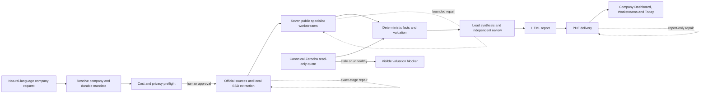

# Research Desk Release Report — 1 September 2026

## Executive outcome

The Research Desk defect/reliability milestone is **implemented and verified as a release candidate** in `codex/research-desk-knowledge-scanners-v1`.

This release closes the code gaps behind the reported Wipro/Shivalik visibility, PDF repair, stale valuation price, scanner execution and model-routing failures. It also adds an audited, human-gated path for GLM 5.3 Flash to become the economical public-research specialist model while DeepSeek V4 Pro remains the lead/review escalation.

It is **not honestly production-accepted yet**. A read-only Tailscale status check reported the canonical iMac peer `Online=false` (last seen `2026-08-30T05:55:45.1Z`), and SSH timed out on 1 September 2026, so migrations, the governed SSD PDF runtime, live Postgres/Zerodha data, authenticated Chrome/Safari and deployed asset equality could not be verified. No production mutation was attempted and no live/model credential was requested.

## User-visible flow

## Delivered work

| Area | Delivered behavior |
|---|---|
| Company intake | Exact company name/ticker/exchange navigation is preferred; URL-led article commands no longer become fake company names. Existing natural-language case intake remains durable and approval-gated. |
| Completed research visibility | The Company Thesis Dashboard can select the exact requested exchange/symbol and expose the latest completed Research Case pack/report, addressing “Wipro is complete but not shown.” |
| Source autonomy | Approved cases queue bounded official filing work automatically. The source worker uses the governed external-SSD PDF interpreter and produces actionable/redacted retry blockers. |
| Shivalik parser failure | Runtime contracts now fail closed on a missing `pypdf` environment and tell the operator what the stack will repair. Live installation/replay remains an iMac gate. |
| Report delivery | A dedicated repair endpoint verifies SSD artifacts, reuses HTML, retries/rebuilds only report delivery and creates no source/model rerun. Broken/missing files return actionable status instead of dead links. |
| Zerodha valuation | The canonical quote view now exposes heartbeat/quote ages and delay state. Valuation rejects a superficially fresh quote when the primary Zerodha websocket heartbeat is unhealthy during the live session. |
| Valuation UI | Provider, exchange, mapping, timestamp, freshness, delay, fallback and broker lock are visible. No silent old-price acceptance was added. |
| Fundamental scanners | Four executable public templates use only implemented deterministic point-in-time metrics. Copying is idempotent; scoring direction is correct; publication approval is durable; running requires explicit confirmation. |
| GLM 5.3 Flash | Added as a disabled public-only canary and daily-driver candidate with conservative standard price ceilings. Cost, spend, packet, structured output and named human review are separate gates. |
| Model governance | Promotion is bound to the exact canary response hash and requires citation >=90, numeric >=95 and zero unsupported claims. DeepSeek V4 Pro remains lead/review escalation; every paid run remains preflighted. |
| Charlie stack awareness | Existing warehouse-backed fast stack status reports Research Cases, monitoring, Following, scanners, graph counts and Zerodha health without inventing state or calling a cloud model. |
| UI repair semantics | Technical exception blobs are hidden by default; the user sees exact stage, impact, stack action and next action. Desktop and 390 px interaction contracts are tested. |
| Dependency hygiene | Only the vulnerable `nanoid` and `postcss` lockfile resolutions were updated. Both production and full npm audits report zero vulnerabilities. |
| Documentation | The supplied blueprint and master prompt are stored byte-for-byte; checklist, implementation ledger, runbook and this report are updated. |

## GLM 5.3 Flash policy

The registered model ID is `z-ai/glm-5.3-flash`. The migration uses the non-promotional ceiling of USD 0.15 input and USD 0.50 output per one million tokens rather than relying on a temporary discount. Source: [OpenRouter GLM 5.3 Flash model page](https://openrouter.ai/z-ai/glm-5.3-flash).

Every OpenRouter Research Desk request sets provider ZDR and denies data collection. Source: [OpenRouter Zero Data Retention](https://openrouter.ai/docs/guides/features/zdr).

Promotion cannot happen automatically. The operator must review the exact canary output and citations. Promotion changes only the public specialist daily-driver route and invokes no model itself.

## Zerodha preservation evidence

The requested protected integration files have no diff and retain these SHA-256 values:

| Protected file | SHA-256 |
|---|---|
| `sync_zerodha_read_only.py` | `ccab444bb26a7f9329758c5ae1692ca11ce307f4863f9a5b432eb96848bb9de7` |
| `sync_zerodha_market_data.py` | `49e01999371588d9d590386b22df4f555e77ca44b49a32977109992bf0fec673` |
| `stream_zerodha_live.py` | `f9157bab42e7c5ccd17efca988c1480d3efabc2573a9494530fa75d11f739735` |
| `configure_zerodha_imac.sh` | `5ceda5267d721ac946fb14d99a65d61e91f8bc83763642657705ff92c9ad06ee` |
| `renew_zerodha_session_imac.sh` | `7cad960924642908be783abcf27c77c75766b3caba4e2bb852be941a510c5a34` |
| `install_zerodha_stream_imac.sh` | `fa7c969279cb5d2a4a9dbc6b6f44fc910eb4524ca75092becab24f0ec36c518d` |
| `aios-zerodha-stream-service.sh` | `181ca0c46466bde3a3a088593d60ed51c5bc0781ab65d4bf897b430e627ab2a2` |

Research Desk adds health/valuation reads only. It does not alter Keychain handling, daily login, LaunchAgent supervision, reconnect subscriptions, holdings/watchlist subscription drivers or GET-only broker behavior.

## Verification evidence

| Gate | Result |
|---|---|
| Full Python/backend suite | **PASS** — 645 passed, 1 skipped, 178 subtests passed |
| Production UI build | **PASS** — TypeScript and Vite production build |
| Real installed-Chrome interaction suite | **PASS** — 7/7 |
| Desktop + 390 px layout contract | **PASS** |
| Migration SQL parse (250-252) | **PASS** |
| `git diff --check` | **PASS** |
| Protected Zerodha diff/hash check | **PASS** |
| Changed-line credential-pattern scan | **PASS** — no private key/common token pattern found |
| `npm audit` | **PASS** — 0 vulnerabilities |
| `npm audit --omit=dev` | **PASS** — 0 vulnerabilities |
| Canonical iMac connectivity | **BLOCKED** — Tailscale peer `Online=false`; SSH port 22 timed out |
| Live migration/SSD/PDF runtime replay | **NOT RUN** — requires iMac |
| Authenticated live Chrome/Safari Wipro + Shivalik | **NOT RUN** — requires iMac |
| Paid GLM canary and named human review | **NOT RUN** — deliberately requires operator approval |
| Live Zerodha freshness/reconnect | **NOT RUN** — requires authenticated iMac session |

The Vite build emits a non-security chunk-size advisory. It does not fail the build, but bundle splitting remains a later performance task. A pre-existing Three.js peer-dependency warning also remains; no risky unrelated Three.js upgrade was included.

## Database changes

1. `250_executable_fundamental_scanner_templates_v1.sql`
   - adds four copy-only executable templates;
   - starts no scanner run, schedule, alert or publication;
   - permits no external or broker write.
2. `251_glm53_flash_research_canary_v1.sql`
   - registers conservative model cost/routing metadata;
   - leaves normal routing disabled;
   - requires explicit canary and human promotion.
3. `252_zerodha_research_quote_health_v1.sql`
   - extends the existing canonical stream-health view;
   - changes no auth, connection or execution behavior;
   - keeps `broker_write_allowed=false`.

## Durable artifacts

- `docs/AI_Investment_OS_Institutional_Master_Blueprint_v11.md`
- `docs/research-desk/MASTER_BUILD_PROMPT.md`
- `docs/research-desk/ACCEPTANCE_CHECKLIST.md`
- `docs/research-desk/IMPLEMENTATION_STATUS.md`
- `docs/research-desk/RUNBOOK.md`
- `docs/research-desk/RESEARCH_DESK_RELEASE_REPORT_2026-09-01.md`

## Remaining release gate

When the iMac is reachable:

1. identify the actual source checkout and `a02ee0f-live` commit/dirty state;
2. verify recovery points and disposable migration replay;
3. apply migrations 250-252;
4. verify the governed SSD PDF interpreter imports `pypdf`;
5. deploy the tested commit and compare asset hashes;
6. replay Shivalik extraction/report repair;
7. run authenticated Wipro and Shivalik golden paths in Chrome and Safari;
8. verify live Zerodha quote health and valuation fail-closed behavior;
9. only then consider a public GLM canary and named human promotion.

Until those gates pass, the correct label is **tested release candidate**, not “fully closed” or “live perfect.”
